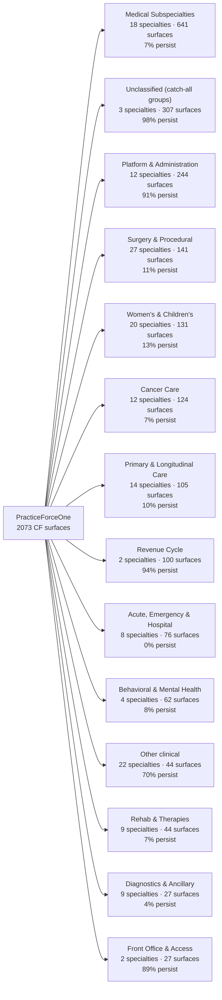

# PracticeForceOneCFTracking — CF Form Build Tracker

**Owner:** AgentCF · **Created:** 2026-07-25 · **Measured against live build 1954 (`78ec57f6`, staging) — every number on this page was read from the running system, not from the repo.**

Companion lanes: **AgentDB** owns the DB-surface column · **AgentUI** owns usability/portal surfaces · **AgentAesthetics** owns the aesthetics domain inventory ([PracticeForceOneAesthetics](PracticeForceOneAesthetics.html)).

## What this page tracks

A CF form is only "built" when **three** surfaces exist. This page reports each independently, because they fail independently:

| Surface | Meaning | Where it lives |
|---|---|---|
| **Definition** | a `pfo-cf-v1` config row exists, `status=active`, nav-stamped | `DYNAMIC_FORMS_CONFIGURATION` (Definition Repository) |
| **UI surface** | the definition has pages/sections/fields, so `cf.html` renders a real screen | rendered generically by `cf-runtime.js` — no per-screen code |
| **DB surface** | the endpoints the definition binds to actually exist, backed by a table | `util/*Routes.script` + generated CRUD in `data/` |

### Legend

| Mark | UI surface | | Mark | DB surface |
|---|---|---|---|---|
| ✅ LIVE | pages + fields present; renders a working screen | | ✅ BUILT | every declared endpoint resolves |
| ⚠️ STUB | published + nav-visible but no fields yet | | 🟡 PARTIAL | some endpoints resolve, some 404 |
| | | | ❌ MISSING | every declared endpoint 404s |
| | | | ⬜ UNBOUND | the definition declares no endpoint at all — renders but cannot persist |

**Legacy column:** 🔁 = a legacy hand-coded screen still exists for this form, so this row is a *conversion* (retire the legacy page), not a new build. Blank = CF-native, nothing to retire.

## Summary

| Metric | Count |
|---|---|
| **Published CF forms (live, active, nav-visible)** | **2073** |
| Total fields across all definitions | 23,913 |
| UI surface ✅ LIVE | 2058 |
| UI surface ⚠️ STUB (no fields yet) | 15 |
| DB surface ✅ BUILT | 736 |
| DB surface 🟡 PARTIAL | 44 |
| DB surface ❌ MISSING | 19 |
| DB surface ⬜ UNBOUND (no binding declared) | 1274 |
| Definitions with a seed file in git | 183 |
| Definitions existing ONLY in the database (not in source control) | 1890 |
| Rows that are legacy conversions 🔁 | 36 |
| Distinct endpoints referenced by definitions | 632 |
| …of those, genuinely broken (no backend / missing sub-route) | 61 |
| Distinct DB tables reached | 73 |
| Nav domains | 162 |

**Platform substrate (live definitions — no deploy required to change):**

| Capability | Live | Definition |
|---|---|---|
| Field catalog | 731 entries · 593 adoptable · **1,461 references live in 140 definitions** | `engine_config field_catalog/default` |
| …withheld pending clinical review | 138 conflicted ids | `docs/platform/field-catalog-conflicts.md` |
| Field validation (formats + plausibility ranges) | 50 fields | `docs/platform/field-validation-overlay.json` |
| Module library (note spine) | 31 modules, v2.5 | `engine_config cf_modules/default` |
| CDIE rules | 32 rules, one namespace | `engine_config cdie_rule/<id>` |
| CDIE evidence vocabulary | 37 facts with aliases | `docs/clinical-documentation/evidence-schema.json` |
| Definition inheritance | `extends` — 13/13 merge tests | runtime capability |

## ⚠️ Active directive — Specialty Form Wiring (founder, 2026-07-25)

**Specialty-form persistence is now the priority. Catalog expansion is STOPPED** except where a new definition is required to complete an active clinical workflow. This supersedes depth-target work in the sizing section below — those numbers describe what coverage *would* cost, not what we are doing now.

| Lane | Owns | State |
|---|---|---|
| **AgentDB** | the canonical shared clinical-document persistence model + published contract | leads; everything else is gated on it |
| **AgentCF** | ONE scripted, repeatable binding pattern over that contract | pre-staged, waiting on the contract |
| **AgentUI** | encounter-workflow integration + template recommendation | encounter context, draft/sign/amend, chart view |

**Non-negotiables in the directive:** one canonical model with generated CRUD — *no table per form*, and no binding the catalog to convenient non-canonical specialty tables. No form-specific tables or endpoints without an explicit structured-data requirement and founder approval. Prove it end to end on three materially different forms before scaling.

**Definition of done (all nine):** correct form offered from the encounter · answers save · answers survive reload · completed form appears in the chart · signing locks the original · amendment creates a traceable new version · two-organization tenant isolation proven · several different forms on the same model · **no form-specific table was needed**.

CF-side artefacts already in place: `docs/contracts/clinical-document-REQUIREMENTS-from-CF.md` (what the contract must satisfy for scripted binding to work) and `bin/bind-cf-definitions.mjs` (the single binding pattern; refuses to write without an approved contract). Proposed proof set: `new_patient_visit_cf`, `annual_wellness_visit_cf`, `preventive_geriatric_cf` — narrative intake, preventive checklist, instrument-heavy assessment.

### The three findings that matter

1. **1274 forms are UNBOUND** — they render a full field set but declare no endpoint, so nothing a user types can be saved. This is the single largest gap and it is **AgentDB's queue**; the field lists in the companion pages are the write contract to build against.
2. **1890 of 2073 definitions exist only in the database.** They are live but not in source control, so they cannot be code-reviewed, diffed, or restored after a bad restage. Fix = export each live config to `ui/public/form-configs/` (AgentCF).
3. **61 endpoints a definition binds to are genuinely broken** (no backend, or the module exists but that action is unimplemented). Listed in full below, with the 90 probe artifacts excluded.

> **Measured vs estimated.** Everything above this line is measured from the live system. The two
> sections that follow contain the only estimates on this page, and each names its basis.

## Effort sizing — what "100% coverage" actually costs

### The count race is nearly won, and it is the cheapest axis

**The UI surface is already 99.8% built** — 1731 of 1734 clinical surfaces render today, with only 3 stub(s) left. That is not a backlog that was worked down; it is a property of the architecture. `cf-runtime.js` renders **any** definition, so a new clinical screen costs a JSON definition and **zero UI code**. Building a screen and building a form are the same act.

Coverage is therefore not "how many screens can we build" but "how deep is each specialty". Today: **151 clinical specialties**, median **4** forms each, 60 specialties with 2 or fewer, 14 with 25 or more.

| Depth target per specialty | Specialties below target | New definitions to reach 100% |
|---|---|---|
| 10 forms | 117 | **780** |
| 15 forms | 124 | **1387** |
| 20 forms | 133 | **2041** |

A working ambulatory specialty needs roughly: intake/history, visit note, follow-up note, 3–8 condition-specific management notes, 3–6 assessment instruments, 1–3 procedure notes, consent, and orders/results review — i.e. **10–20**. That is the basis for the table; it is a clinical-content judgement, not a measurement.

### Measured authoring throughput (one agent)

From this repo's own git history of CF definition additions:

| Mode | Observed rate | Evidence |
|---|---|---|
| Generated batches | **10.9 definitions/hour** | 2026-07-24: 128 definitions over an 11.8 h span |
| Mixed authoring | 2.6–6.0 /hour | 2026-07-15, 07-18, 07-25 sessions |
| Careful hand-authoring | 0.3–0.5 /hour | 2026-07-11/12 (deep, reviewed forms) |

At a sustained **4–9 definitions/hour** for one agent running continuously (generated batches with verification and publish, which is how the last wave actually ran):

| Depth target | New definitions | One agent 24/7 @9/h | @4/h |
|---|---|---|---|
| 10/specialty | 780 | **3.6 days** | 8.1 days |
| 15/specialty | 1387 | **6.4 days** | 14.4 days |
| 20/specialty | 2041 | **9.4 days** | 21.3 days |

**So the UI answer is days-to-weeks, not months** — 1–3 weeks of one agent for full clinical depth. That is precisely why it is the wrong thing to optimise.

### Where the real cost is

| Axis | Remaining | Cost driver | Order of magnitude |
|---|---|---|---|
| **UI surface** | 1387 defs to depth-15 | JSON authoring; runtime renders it free | **1–3 weeks**, one agent |
| **DB binding** | 1260 unbound clinical surfaces | route + entity + CRUD per *domain*, not per form | **2–4 months** (see below) |
| **Coded data** | 23,913 fields, **0 coded** | concept dictionary + terminology binding + clinician review | **4–8 months**, needs clinicians |

The binding number is the one that looks impossible and is not. 1260 unbound forms do **not** need 1,249 tables. Most clinical notes and assessments can share **one generic response store** behind the Unified Persistence Contract (`form_responses(patient_id, encounter_id, form_type, definition_version, payload, coded_values)`), with a first-class table only where a domain needs query, reporting, or registry submission. That is roughly **40–60 domain entities plus one generic store**, not 1,249 — the difference between a quarter and a decade. **This is the single most important architectural decision left in the CF program**, and it belongs to AgentDB with the platform steward.

## Backend persistence metric

**The single number that matters most on this page.** A surface "persists" when its definition binds to an endpoint that resolves — i.e. a clinician pressing Save writes a row. A surface that renders but does not persist is a demo, not a product.

| Scope | Surfaces | Persist | Persistence rate |
|---|---|---|---|
| **Clinical documentation** | 1734 | 469 | **27.0%** |
| Whole catalog | 2073 | 780 | 37.6% |
| Non-clinical (admin/billing/ops) | 339 | 311 | 91.7% |

**1260 clinical surfaces (73%) declare no binding at all.** They render a complete, clinically credible field set and cannot save a keystroke. Every hour spent adding definitions without binding widens this gap.

### Persistence by specialty — AgentDB work queue

Ordered by how many unbound surfaces each specialty carries. `Fields` is the total field count at risk: that is the size of the write contract the backend must accept.

| Specialty | Surfaces | Persist | Unbound | % persisting | Fields unbound | Board |
|---|---|---|---|---|---|---|
| Cardiology | 94 | 4 | **90** | 4% | 529 | `cardiology_board_cf` |
| Oncology | 74 | 4 | **70** | 5% | 364 | `oncology_board_cf` |
| Gastroenterology | 75 | 6 | **69** | 8% | 477 | `gastroenterology_board_cf` |
| Neurology | 71 | 8 | **63** | 11% | 406 | `neurology_board_cf` |
| Endocrinology | 62 | 6 | **56** | 10% | 344 | `endocrinology_board_cf` |
| Infectious Disease | 57 | 1 | **56** | 2% | 408 | `infectious_disease_board_cf` |
| Hematology | 56 | 4 | **52** | 7% | 366 | `hematology_board_cf` |
| Rheumatology | 52 | 6 | **46** | 12% | 312 | `rheumatology_board_cf` |
| Pediatrics | 50 | 4 | **46** | 8% | 518 | `pediatrics_board_cf` |
| Psychiatry | 41 | 0 | **41** | 0% | 313 | `psychiatry_board_cf` |
| Pulmonology | 42 | 3 | **39** | 7% | 234 | `pulmonology_board_cf` |
| Nephrology | 38 | 1 | **37** | 3% | 281 | `nephrology_board_cf` |
| Dermatology | 34 | 7 | **27** | 21% | 154 | `dermatology_board_cf` |
| Allergy and Immunology | 23 | 1 | **22** | 4% | 233 | `allergy_and_immunology_board_cf` |
| Geriatrics | 21 | 1 | **20** | 5% | 190 | `geriatrics_board_cf` |
| Sports Medicine | 20 | 0 | **20** | 0% | 316 | `sports_medicine_board_cf` |
| Urology | 23 | 5 | **18** | 22% | 171 | `urology_board_cf` |
| Critical Care | 16 | 0 | **16** | 0% | 128 | `critical_care_board_cf` |
| Emergency Medicine | 16 | 0 | **16** | 0% | 106 | `emergency_medicine_board_cf` |
| Internal Medicine | 16 | 0 | **16** | 0% | 88 | `internal_medicine_board_cf` |
| Primary Care | 16 | 0 | **16** | 0% | 281 | `primary_care_board_cf` |
| Hospital Medicine | 15 | 0 | **15** | 0% | 113 | `hospital_medicine_board_cf` |
| Ophthalmology | 15 | 2 | **13** | 13% | 103 | `ophthalmology_board_cf` |
| Neonatology | 14 | 1 | **13** | 7% | 117 | `neonatology_board_cf` |
| Hepatology | 13 | 0 | **13** | 0% | 81 | `hepatology_board_cf` |
| Palliative Care | 13 | 0 | **13** | 0% | 141 | `palliative_care_board_cf` |
| Behavioral Health | 16 | 5 | **11** | 31% | 136 | `behavioral_health_board_cf` |
| Hematology/Oncology | 12 | 1 | **11** | 8% | 48 | `hematology_oncology_board_cf` |
| Orthopedics | 11 | 1 | **10** | 9% | 91 | `orthopedics_board_cf` |
| Transplant Medicine | 10 | 0 | **10** | 0% | 130 | `transplant_medicine_board_cf` |
| Vascular Surgery | 10 | 0 | **10** | 0% | 53 | `vascular_surgery_board_cf` |
| Reproductive Medicine | 9 | 0 | **9** | 0% | 148 | `reproductive_medicine_board_cf` |
| Sleep Medicine | 9 | 0 | **9** | 0% | 125 | `sleep_medicine_board_cf` |
| Care Coordination | 9 | 1 | **8** | 11% | 113 | `care_coordination_board_cf` |
| Colorectal Surgery | 8 | 0 | **8** | 0% | 43 | `colorectal_surgery_board_cf` |
| Gynecology | 8 | 0 | **8** | 0% | 22 | `gynecology_board_cf` |
| Occupational Medicine | 8 | 0 | **8** | 0% | 104 | `occupational_medicine_board_cf` |
| Orthopedic Surgery | 8 | 0 | **8** | 0% | 77 | `orthopedic_surgery_board_cf` |
| Urgent Care | 8 | 0 | **8** | 0% | 162 | `urgent_care_board_cf` |
| ENT | 7 | 0 | **7** | 0% | 97 | `ent_board_cf` |
| Obstetrics | 7 | 0 | **7** | 0% | 77 | `obstetrics_board_cf` |
| Pediatric Subspecialties | 7 | 0 | **7** | 0% | 56 | `pediatric_subspecialties_board_cf` |
| Plastic Surgery | 7 | 0 | **7** | 0% | 53 | `plastic_surgery_board_cf` |
| Preventive Medicine | 7 | 0 | **7** | 0% | 169 | `preventive_medicine_board_cf` |
| Urology Oncology | 7 | 0 | **7** | 0% | 19 | `urology_oncology_board_cf` |
| Women's Health | 7 | 1 | **6** | 14% | 71 | `women_s_health_board_cf` |
| Clinical Nutrition | 6 | 0 | **6** | 0% | 80 | `clinical_nutrition_board_cf` |
| Family Medicine | 6 | 0 | **6** | 0% | 27 | `family_medicine_board_cf` |
| Gynecologic Oncology | 6 | 0 | **6** | 0% | 27 | `gynecologic_oncology_board_cf` |
| Interventional Cardiology | 6 | 0 | **6** | 0% | 43 | `interventional_cardiology_board_cf` |
| Maternal-Fetal Medicine | 6 | 0 | **6** | 0% | 57 | `maternal_fetal_medicine_board_cf` |
| Pain Management | 6 | 0 | **6** | 0% | 83 | `pain_management_board_cf` |
| Pain Medicine | 6 | 0 | **6** | 0% | 57 | `pain_medicine_board_cf` |
| Radiation Oncology | 6 | 0 | **6** | 0% | 39 | `radiation_oncology_board_cf` |
| Thoracic Surgery | 6 | 0 | **6** | 0% | 34 | `thoracic_surgery_board_cf` |
| Toxicology | 6 | 0 | **6** | 0% | 47 | `toxicology_board_cf` |
| Clinical Genetics | 5 | 0 | **5** | 0% | 23 | `clinical_genetics_board_cf` |
| Interventional Radiology | 5 | 0 | **5** | 0% | 67 | `interventional_radiology_board_cf` |
| Medical Genetics | 5 | 0 | **5** | 0% | 52 | `medical_genetics_board_cf` |
| Medical Oncology | 5 | 0 | **5** | 0% | 26 | `medical_oncology_board_cf` |

_(top 60 of 151 clinical specialties, by unbound count)_

### What persistence costs

Per **domain entity** (not per form): a JAC-generated table + CRUD, a route module, tenant scoping, and the write-reply check the honesty rule requires — call it 4–8 hours each with tests. Binding an already authored definition to an existing endpoint is minutes and scriptable.

| Approach | Units of work | Estimate | Verdict |
|---|---|---|---|
| One table per form | 1260 | years | never do this |
| **Generic response store + first-class tables where a domain needs query/reporting** | ~40–60 entities + 1 store | **2–4 months** | recommended |
| Generic store only | 1 | ~2 weeks | fastest, but nothing is reportable or registry-ready |

The middle row is the recommendation. It also directly enables the community-data work below: a generic store with a `coded_values` column is where terminology-bound answers land.

## What must be explicitly done to make this valuable community data

The forms are currently a **UI achievement, not a data asset.** Pooling clinical data across practices requires the same question to mean the same thing everywhere, and today it does not. Measured baseline:

| Property | Today | Why it blocks pooling |
|---|---|---|
| Coded fields | **0 of 23,913 (0.00%)** | no LOINC/SNOMED/RxNorm binding, so an answer is a string in a box, not an observation |
| Distinct field ids | **17,242** for 23,913 instances | reuse ratio 1.39 — nearly every form invented its own names |
| Single-use field ids | **14,899 (86%)** | the same concept (e.g. LVEF) has a different id in every form that asks it |
| Choice fields | 6,959 select + 2,555 checkbox | ad-hoc option lists, no bound value sets — answers are not comparable |
| Numeric fields | 3,233 | no UCUM units or ranges, so mg/dL vs mmol/L cannot be reconciled |
| Duplicate forms | 200 clusters / 269 redundant | six Epilepsy forms = six incompatible schemas for one concept |

### Progress against this list (AgentCF, 2026-07-27)

Items 2 and 5 now have a shipped mechanism rather than a plan. Both are **live definitions**, so they took effect without a deploy.

| # | Item | State | What exists |
|---|---|---|---|
| 2 | Canonical concept dictionary | 🟢 **shipped + adopted** | **Field catalog** — `engine_config field_catalog/default`, 419 shared fields live. Definitions reference a field as `{"$field":"id"}` (or a bare string) instead of re-declaring it; `type`, `options`, `lookup` and `unit` always come from the catalog, so a screen cannot redefine what a field collects while keeping its name. Presentation (label, help, required, span) stays local. |
| 5 | Units and valid ranges | 🟡 **46 fields covered** | **Validation overlay** — authored plausibility bounds and formats for vitals, scored instruments (PHQ-9 0–27, GAD-7 0–21, MMSE 0–30), common labs, plus NPI/phone/email/ZIP/state/SSN patterns. Covers 242 declarations. |
| — | Inheritance | ✅ **shipped** | `extends: "<formType>"` — a specialty variant states only its differences instead of copying a base note. Merge is by id, so a child inherits the base's later improvements. 13/13 merge tests. |

**The measurement that motivated it.** Across the 165 seed definitions: 6,252 field declarations for 4,385 distinct ids — 2,538 instances (41%) re-declare an id that already exists. Worse, **301 ids disagree with themselves**: `status` is declared 29 different ways, `visitType` 18, `providerName` 15, `notes` 7. Two clinics asking the same question differently is precisely what makes a pooled column meaningless.

### Corpus-wide, 2026-07-27 (supersedes the seed-only figures below)

Every earlier number on this page was measured on the **165 definitions that had a seed file in git**. 1,902 of the 2,083 live definitions existed only in the database — no diff, no review, no rollback, and invisible to every offline tool. They are now all exported into source control, so these are the first figures measured on the whole platform:

| | Seed-only view | Whole corpus |
|---|---|---|
| Definitions | 165 | **2,083** |
| Field declarations | 6,252 | **24,819** |
| Distinct field ids | 4,385 | 17,533 |
| Re-declaration rate | 41% | **29.4%** |
| Catalog entries | 731 | **2,475** (1,600 adoptable) |
| Live catalog references | 1,461 | **4,275 across 994 definitions** |
| Conflicted ids awaiting a decision | 134 | **968** |
| FHIR Questionnaires | 180 | **2,063** (24,813 questions) |

Two export traps worth knowing, both of which produce a complete-*looking* result that is quietly missing definitions: 59 formTypes exist both with and without the `_cf` suffix and collapsed onto one filename; and 23 differ only by CASE (`APPEAL_TEMPLATES` / `appeal_templates`), which on a case-insensitive filesystem is the same file. The exporter now aborts rather than overwrite.

Also worth a look from whoever owns the legacy scrub: **58 twin pairs DIFFER**, consistent with legacy and CF versions of the same screen both still being live.

**LIVE as of 2026-07-27, build 1984.** 132 definitions were republished carrying catalog references and verified against the deployed system, not just the repo: `bin/verify-live-definitions.mjs` pulls each definition and the catalog from the API and resolves them the way the *deployed* `cf-runtime.js` does — **1,379 references across 135 definitions, 0 unresolvable, 0 that would render without a control**. A single definition went first as a canary; changing 140 live clinical definitions in one shot leaves no way to tell a systemic fault from one bad row until every screen has already changed.

Two known cosmetic gaps, self-clearing on the next runtime deploy: `patients_cf.zipCode` and `providers_cf.npi` show the catalog's validation *message* rather than their own wording. The regex is identical, so validation behaves the same.

**7 definitions were rejected by the live validator and are NOT adoption damage** — every erroring field is byte-identical to its pre-adoption version and none was turned into a reference. They carry pre-existing seed drift (collections missing `binding.read.url`, a field missing a label), which means those 7 seed files could not have been published from source before this change either. Their live rows keep their older valid content and keep working: `care_plan`, `ccm_enrollment`, `eligibility_benefit_browser`, `immunization_schedule`, `patient_chart`, `visit_summary`, `wound_care`.

**Also live:** the 12 aesthetics documentation templates, composed **by reference** — they store `modules:[...]` and zero sections, and the runtime assembles the note from the shared library at load.

**Adoption.** The catalog is not just published — 1,461 inline declarations across 140 definitions now *reference* it, so meaning lives in one place and a fix to a shared field reaches every screen that uses it. The rewrite was proven null three ways: a field is replaced only when the catalog entry means the same thing; the adopter re-resolves each rewritten field and compares it to the original; and `bin/verify-catalog-adoption.mjs` re-checks the result independently against the pre-adoption tree in git — **6,755 fields across 203 definitions, PASS**.

That third check earned its place. Written to share none of the adopter's assumptions, it caught `notes` silently degrading from `textarea` to `text`, because adoption had been running while the catalog was still being re-derived between passes. A published declaration is now immutable across rebuilds: definitions have adopted it, so changing what a field means has to be a deliberate act, not a side effect of re-running a script.

Three other faults surfaced and were fixed in the same pass: the builder renamed `choices` to `options` (which would have emptied every dropdown that adopted an entry); it sampled `placeholder` from the dominant variant, leaking an aesthetics placeholder onto a cardiac EP field; and identical fields on different pages all matched the *first* occurrence's text span, so the second edit overwrote the first.

**Also found: 38 of 203 seed files were unparseable JSON** at HEAD — a UTF-8 BOM — meaning they could never have been published from source control. BOM stripped; all 203 now parse.

**What is deliberately NOT done.** 252 of the 671 shared fields are withheld from the live catalog as `needs-review` — those are ids whose dominant declaration has under 70% consensus. Publishing them would spread the ambiguity to every screen that adopted them. Each is either drift (adopt the majority) or two different questions wearing one name (split them); the list with every competing declaration is in `docs/platform/field-catalog-conflicts.md`. **This needs a clinical decision, not an agent's guess.**

**Validation was the other surprise.** The runtime has had a declarative validation engine for a while (required, requiredIf, pattern, min/max, length, page-level compare rules). The corpus barely used it: of 6,252 declarations, **zero** carried a format pattern and only 13 carried a numeric range. Fixing that per-declaration is 6,252 edits; fixing it in the catalog was 46. Bounds are deliberately *plausibility* bounds, not clinical normals — systolic tops out at 300, because the job is catching a transposed digit, never telling a clinician a real value is disallowed.

### The explicit work, in dependency order

1. **Deduplicate the corpus first.** 269 redundant forms must collapse to one per concept. Pooling from six Epilepsy schemas produces six incompatible columns, not six times the data. Prerequisite to everything below.
2. **Build a canonical concept dictionary.** Collapse 17,242 field ids to the few thousand real clinical concepts behind them. One id per concept, reused across every form that asks it. This is the highest-leverage item on the page.
3. **Add terminology binding to the contract.** The runtime has **no** `code`/`codeSystem`/`valueSet` attribute on a field today (only three coded field *types* exist and zero fields use them). Definitions must be able to say: this field is LOINC 8867-4, this answer set is SNOMED, this drug is RxNorm, this diagnosis is ICD-10-CM, this procedure is CPT. Runtime change — deploy-gated.
4. **Bind value sets to every choice field** so "moderate" means the same coded concept in every form.
5. **Attach UCUM units and valid ranges** to numeric fields; store normalized values alongside raw entry.
6. **Stamp provenance on every response**: definition version, practice, capture timestamp, author role. Without it a pooled dataset cannot be re-analysed when a form changes underneath it.
7. **Export as FHIR** — `Questionnaire` + `QuestionnaireResponse`, and `Observation` for coded values, with bulk NDJSON export. This is what makes the corpus portable to a registry or research partner.
8. **Consent, de-identification and governance**: per-practice opt-in, HIPAA Safe Harbor or Expert Determination de-identification, data-use agreements, and an IRB pathway before any research use. Non-negotiable and not an engineering afterthought.
9. **Data-quality gates**: completeness on required fields, range checks, and duplicate-response suppression — measured per practice, or the pool silently fills with junk.
10. **Longitudinal linkage**: stable patient identity across encounters and practices, so a cohort is people over time rather than disconnected form submissions.

**The honest summary:** steps 1–2 are ours to do now and are mostly mechanical. Step 3 is a small runtime change with a large payoff. Steps 4–5 are the long grind and need clinical review — an agent can propose bindings for 17,242 ids, but a clinician must sign off before the data is trustworthy. Steps 8–10 are governance and must start early, because retrofitting consent onto collected data is not possible.

> A caution the data supports: the 200 duplicate clusters and the keyword-stuffed form names were both produced by fast unreviewed generation. Throughput of 10 definitions/hour is real, but volume without review is what created the cleanup now in front of us. Depth targets should be met with review, not raced.

### How to reproduce every number here

```
node bin/publish-cf-definitions.mjs --dry     # what is / is not published
curl "$BASE/api/form-configurations?catalog=1" # the live inventory (this page's row set)
curl "$BASE/api/form-configurations?formType=X" # one definition, with its full field set
```

## Field-level detail

23,913 fields across 2073 forms does not render as one page, so field detail is split by domain into these companion pages (same data, same measurement pass):

| Part | Domains | Fields |
|---|---|---|
| [PracticeForceOneCFTrackingFields1](PracticeForceOneCFTrackingFields1.html) | Clinical | 586 |
| [PracticeForceOneCFTrackingFields2](PracticeForceOneCFTrackingFields2.html) | Clinical | 581 |
| [PracticeForceOneCFTrackingFields3](PracticeForceOneCFTrackingFields3.html) | Clinical | 584 |
| [PracticeForceOneCFTrackingFields4](PracticeForceOneCFTrackingFields4.html) | Clinical | 547 |
| [PracticeForceOneCFTrackingFields5](PracticeForceOneCFTrackingFields5.html) | Clinical | 593 |
| [PracticeForceOneCFTrackingFields6](PracticeForceOneCFTrackingFields6.html) | Clinical | 598 |
| [PracticeForceOneCFTrackingFields7](PracticeForceOneCFTrackingFields7.html) | Clinical | 571 |
| [PracticeForceOneCFTrackingFields8](PracticeForceOneCFTrackingFields8.html) | Clinical | 577 |
| [PracticeForceOneCFTrackingFields9](PracticeForceOneCFTrackingFields9.html) | Clinical | 560 |
| [PracticeForceOneCFTrackingFields10](PracticeForceOneCFTrackingFields10.html) | Clinical | 546 |
| [PracticeForceOneCFTrackingFields11](PracticeForceOneCFTrackingFields11.html) | Clinical | 595 |
| [PracticeForceOneCFTrackingFields12](PracticeForceOneCFTrackingFields12.html) | Clinical | 594 |
| [PracticeForceOneCFTrackingFields13](PracticeForceOneCFTrackingFields13.html) | Clinical | 585 |
| [PracticeForceOneCFTrackingFields14](PracticeForceOneCFTrackingFields14.html) | Clinical, Admin | 580 |
| [PracticeForceOneCFTrackingFields15](PracticeForceOneCFTrackingFields15.html) | Admin | 580 |
| [PracticeForceOneCFTrackingFields16](PracticeForceOneCFTrackingFields16.html) | Admin, Cardiology | 576 |
| [PracticeForceOneCFTrackingFields17](PracticeForceOneCFTrackingFields17.html) | Cardiology, Specialty Boards | 599 |
| [PracticeForceOneCFTrackingFields18](PracticeForceOneCFTrackingFields18.html) | Specialty Boards, Gastroenterology | 593 |
| [PracticeForceOneCFTrackingFields19](PracticeForceOneCFTrackingFields19.html) | Gastroenterology, Oncology, Neurology | 595 |
| [PracticeForceOneCFTrackingFields20](PracticeForceOneCFTrackingFields20.html) | Neurology, Billing | 598 |
| [PracticeForceOneCFTrackingFields21](PracticeForceOneCFTrackingFields21.html) | Billing | 593 |
| [PracticeForceOneCFTrackingFields22](PracticeForceOneCFTrackingFields22.html) | Billing, Endocrinology, Infectious Disease | 596 |
| [PracticeForceOneCFTrackingFields23](PracticeForceOneCFTrackingFields23.html) | Infectious Disease, Hematology | 596 |
| [PracticeForceOneCFTrackingFields24](PracticeForceOneCFTrackingFields24.html) | Hematology, Rheumatology, Pediatrics | 589 |
| [PracticeForceOneCFTrackingFields25](PracticeForceOneCFTrackingFields25.html) | Pediatrics, Pulmonology | 600 |
| [PracticeForceOneCFTrackingFields26](PracticeForceOneCFTrackingFields26.html) | Pulmonology, Psychiatry, Nephrology | 575 |
| [PracticeForceOneCFTrackingFields27](PracticeForceOneCFTrackingFields27.html) | Nephrology, Dermatology, RCM | 590 |
| [PracticeForceOneCFTrackingFields28](PracticeForceOneCFTrackingFields28.html) | RCM, Allergy and Immunology, Urology | 599 |
| [PracticeForceOneCFTrackingFields29](PracticeForceOneCFTrackingFields29.html) | Urology, Geriatrics, Sports Medicine | 595 |
| [PracticeForceOneCFTrackingFields30](PracticeForceOneCFTrackingFields30.html) | Sports Medicine, Specialty, Reference, Behavioral Health | 593 |
| [PracticeForceOneCFTrackingFields31](PracticeForceOneCFTrackingFields31.html) | Behavioral Health, Critical Care, Emergency Medicine, Internal Medicine, Primary Care | 593 |
| [PracticeForceOneCFTrackingFields32](PracticeForceOneCFTrackingFields32.html) | Primary Care, Front Office, Hospital Medicine, Ophthalmology, Neonatology | 595 |
| [PracticeForceOneCFTrackingFields33](PracticeForceOneCFTrackingFields33.html) | Neonatology, Hepatology, Palliative Care, Hematology/Oncology, Scheduling, Orthopedics | 596 |
| [PracticeForceOneCFTrackingFields34](PracticeForceOneCFTrackingFields34.html) | Orthopedics, Transplant Medicine, Vascular Surgery, Care Coordination, Reproductive Medicine, Sleep Medicine | 577 |
| [PracticeForceOneCFTrackingFields35](PracticeForceOneCFTrackingFields35.html) | Sleep Medicine, Colorectal Surgery, Gynecology, Occupational Medicine, Orthopedic Surgery, Urgent Care, ENT, Obstetrics | 593 |
| [PracticeForceOneCFTrackingFields36](PracticeForceOneCFTrackingFields36.html) | Obstetrics, Operations, Pediatric Subspecialties, Plastic Surgery, Preventive Medicine, Urology Oncology, Women's Health, Clinical Nutrition, Documents | 595 |
| [PracticeForceOneCFTrackingFields37](PracticeForceOneCFTrackingFields37.html) | Documents, Family Medicine, Gynecologic Oncology, Interventional Cardiology, Maternal-Fetal Medicine, Pain Management, Pain Medicine, Pediatric, Quality, Radiation Oncology, Thoracic Surgery | 598 |
| [PracticeForceOneCFTrackingFields38](PracticeForceOneCFTrackingFields38.html) | Toxicology, Clinical Genetics, Interventional Radiology, Medical Genetics, Medical Oncology, OB/GYN, Preventive, Radiology, Surgery, Vascular, Wound Care, Addiction Medicine | 594 |
| [PracticeForceOneCFTrackingFields39](PracticeForceOneCFTrackingFields39.html) | Communication, Hospitalist, Perioperative, Pulmonary, Rehabilitation Medicine, Telehealth, Aesthetics, Care Management, ENT / Otolaryngology, GI Oncology, Gynecology Oncology, Neurosurgery, OB/GYN / Endocrinology, Orders, Orthopedic Oncology, Pediatric Neurology, Platform | 600 |
| [PracticeForceOneCFTrackingFields40](PracticeForceOneCFTrackingFields40.html) | Therapy, Workflow, Administration, Anesthesia, Cardiology / Internal Medicine, GYN Oncology, Genetics, Hospice / Palliative Care, Kanban, Occupational Health, Patient, Pediatric Hematology, Pediatric Oncology, Pediatrics / Developmental, Pharmacy, Providers, Rehabilitation, Remote Patient Monitoring, Reports, Reproductive Endocrinology, Research, Settings, Spine Surgery, Surgery/Emergency | 598 |
| [PracticeForceOneCFTrackingFields41](PracticeForceOneCFTrackingFields41.html) | User Settings, AI, Administrative, Analytics, Bariatric Surgery, Clinical Pharmacology, Clinical Pharmacology / Toxicology, Communications, Dashboard, Diagnostics, ENT / Allergy, ENT / Audiology, ENT / Head and Neck, General, General Surgery, Home, Integrative Medicine, Nuclear Medicine, OB/GYN / Internal Medicine, OB/GYN / Oncology, OB/GYN / Reproductive Medicine, OB/Psychiatry, Obstetric, Otolaryngology, Outreach, PM&R, Patient Engagement, Pediatric Emergency, Pediatric Pulmonology, Pediatric Surgery, Perioperative Medicine, Physical Medicine, Physical Medicine and Rehab, Physical Medicine and Rehabilitation, Podiatry, Population Health, Preventive Care, Security, Utilization Management, Wound Care / Surgery, Wound Management | 410 |

> This document is the canonical, continuously-evolving record of the CF program: scope **and** how
> the work is done. It is regenerated from the live system — **never hand-edit it**; edit
> `gen-tracking.py` and re-run, or the next regeneration silently drops your change.

# Part II — The Documentation Intelligence architecture

Three governing directives landed on 2026-07-25/26 and changed what this programme is:

| Directive | What it changed |
|---|---|
| **Clinical Documentation System** (07-25) | success is a provider completing a whole encounter, not a form count; specialty forms are TEMPLATES, not applications |
| **Specialty Form Wiring** (07-25) | catalog expansion STOPPED; persistence is the priority; **binding is AgentDB’s**, definitions are AgentCF’s |
| **CDIE / North Star** (07-26) | not an EHR — an Intelligent Clinical Platform. Evidence → knowledge → documentation → workflow → outcomes. AgentCF owns the intelligence layer |

### The seven-question architectural test (North Star)

Applied before implementing anything: 1. metadata not code? 2. reusable across specialties? 3. can evidence infer it? 4. part of the canonical clinical model? 5. can the RUNTIME assemble it? 6. fewer clinician clicks? 7. moves us toward an intelligent platform? **Any "no" ⇒ redesign.**

### Module library — documentation is composed, not duplicated

**31 reusable clinical modules** live as a definition (`engine-config type=cf_modules`, contract `pfo-section-v2`, v2.4). 8 were authored here (HPI, ROS, Vitals, Physical Exam, Medication Review, Assessment & Plan, Orders, Patient Education); **16 were adopted from AgentAesthetics** on their explicit handover — clinical photography, injection-site mapping, product lot, device parameters, consent, screening, body-region mapping, quote — none of which are aesthetics-only concepts; plus `signatures`, added because the sign/lock/amend lifecycle needs attestation captured with the document. An `aliases` map lives in the library so `education`/`follow_up` resolve to their canonical ids as metadata rather than tribal knowledge. Field ids are **canonical**, taken from the most-shared ids measured across the catalog, so the same concept carries the same id everywhere. That is what makes answers comparable across specialties and collapses terminology coding from ~17,000 field ids to a few hundred.

**The runtime assembles them.** `cf-runtime.js` resolves `modules:[...]` references at config load (`loadModuleLibrary` + `expandModules`), so a template stores only its specialty section and references the shared spine. Annual Wellness stores **1 section / 7 fields** and renders a full 9-section note. Edit a module once and every composing template changes on next load — no re-publish, no deploy. Publish-time inlining was the first implementation and it FAILED test #5; this is the corrected form.

### CDIE — the Clinical Documentation Intelligence Engine

Rules are metadata (`engine-config type=cdie_rule`, one definition per rule); the evaluator (`bin/cdie-evaluate.mjs`) contains **no clinical knowledge at all** — it evaluates conditions and collects outputs. Adding a specialty means adding rules, never editing the engine.

| Piece | Where it lives |
|---|---|
| Evidence schema | 30+ keys: complaint, dx, meds, vitals, questionnaires, procedures, labs, photos, demographics, history, risk |
| Conditions | all/any/not + exists · missing · equals · matches · includesMatch · countAtLeast · gt/lt/gte/lte · between |
| Outputs | requireDocument/Section/Consent/Signature/Photograph/BodyMap/Inventory/CodingReview · triggerEducation/FollowUp/Scheduling/QualityReporting/FhirMapping · launchWorkflow |
| Editor | `cdie_rules_cf` — a configurable form that edits the rules deciding which configurable forms you get |

Every recommendation carries **`becauseOf` provenance** (which rules produced it), satisfying the North Star requirement that inference always be transparent.

**Acceptance (founder’s own examples, `--selftest`):** "I want Botox for forehead wrinkles" → 16/16 expected items from 3 rules. Diabetes + HTN + foot numbness → 8/8 from 4 rules. Nobody selected those documents; the evidence selected them.

**Honest gap:** the evaluator runs as a CLI. Until it runs in the request path, nothing infers during a live encounter — that is the difference between a working engine and one clinicians experience.

### Legacy retirement

`bin/audit-legacy-vs-cf.mjs` classifies each legacy page against its CF replacement on evidence (field count, bound-ness, capability parity): **22 RETIRE · 4 REVIEW · 9 BLOCKED · 21 KEEP**. 17 menu items in Bay Area Cardiology **prod** now point at CF surfaces, each keeping `legacyHref` so the change is one command to revert. Legacy FILES are deliberately still in place: `claims.html` is referenced by 18 other files, `practice-ehr-encounter.html` by 15, `patient-chart.html` by 11 — deleting them would create dead links and break the UAT suite.

# Part IIb — How a CF surface actually gets built

### The pipeline, end to end

| # | Step | Command / mechanism | Deploy? |
|---|---|---|---|
| 1 | Author the definition (`pfo-cf-v1` JSON) | seed in `ui/public/form-configs/<name>-default.json`, or generated | — |
| 2 | **Publish to the Definition Repository** | `node bin/publish-cf-definitions.mjs` (PUT `/api/form-configurations`) | **none** |
| 3 | Verify it renders | GET the row back; headless screenshot (see Verification) | — |
| 4 | Make it reachable | specialty board (auto) + menu definition (AgentUI) | **none** |
| 5 | Bind persistence | route + entity (AgentDB) | deploy |
| 6 | Hand off to AgentUI | `node bin/export-clinical-handoff.mjs` + AGENTS.md note | — |

**Step 2 is the one people skip and it is fatal.** The runtime renders ONLY from `/api/form-configurations` rows. A committed seed file that was never PUT is a **dark definition**: 404 as a static asset until the next deploy AND zero DB rows, so the screen exists for nobody. 69 definitions were found dark on 2026-07-25.

### What needs a deploy and what does not

This is the highest-leverage thing to know in this program — the shared tree is frequently too dirty to deploy, and most CF work does not need one.

| Change | Deploy? | Why |
|---|---|---|
| New/edited form definition | **No** | DB row, read at page load |
| New specialty board | **No** | it is just a definition |
| Menu / nav restructure | **No** | `engine_configs` row (`type=menu`) |
| Kanban lanes, terminology, workflow defs | **No** | `engine_configs` rows |
| Field-type whitelist entry | **Yes** | validated server-side in `FormConfigurationsRoutes.script` |
| New field type rendering | **Yes** | `cf-runtime.js` is a static asset |
| New endpoint / table | **Yes** | JAC route + generated CRUD |
| Anything under `ui/public/` | **Yes** | baked into the container image |

`bin/cloud-deploy.ps1` uploads the **working tree** and hard-refuses a dirty one (exit 1). So one lane's uncommitted files block every lane's deploys — commit before asking for one.

### The `pfo-cf-v1` contract

```
{ contract:"pfo-cf-v1", entity, idField, entityTitle?, description?,
  nav:{ label, group, icon, perm, show },        // launcher/menu metadata
  list:{ method, url, itemsKey },                // where rows come from
  search:{ columns, filters[], quickFilters[], rowActions[], rowHref, bulkActions[],
           columnFilters, defaultSort, pageSize, noNew, savedSearches, serverSearch },
  lookups:{...},                                  // shared option sources
  pages:[ { id, title, binding:{read,create,update},
            sections:[ { id, title, columns:<int>, fields:[ {id,label,type,required,showIf,computed} ] } ] } ] }
```

Traps in the shape itself: `sections[].columns` is a layout column **count** (a number), not an array of columns — code that iterates it throws. `nav.show` controls catalog membership, not just menu visibility. `idField` defaults matter for row identity in lists.

### Runtime capability catalogue — 381 field types

The runtime is the product; these are the capabilities every future screen inherits for free:

| Capability | Declared as | Notes |
|---|---|---|
| **381 field types** | `field.type` | text/select/number/date through clinical instruments (PHQ-9, GAD-7, NIHSS, ROS grids, injection maps, signatures) |
| Conditional display | `showIf` | field/section visibility driven by other answers |
| Computed fields | `computed` | derived values (scores, BMI, totals) |
| Collections | collection fields | repeating rows with add/edit/remove + bulk actions |
| Tabs & wizards | `tabs`, wizard pages | multi-step capture |
| Archetypes | `archetype:"register"\|"workqueue"` | a whole list+detail screen in ~10 lines |
| Terminology engine | `type=terminology` definition | rename Patient→Client globally, no code change |
| Work queues | `lifecycle.transitions` | status model + per-row action buttons |
| Saved searches, quick filters, column filters, CSV export | `search.*` | list ergonomics, free |
| Auto-save, signatures, print view | page/field flags | |

### Conventions (violating these breaks tooling)

| Thing | Rule |
|---|---|
| formType | `<name>-default.json` -> `<name>_cf` (hyphens to underscores) |
| Create vs update | CREATE = `PUT /api/form-configurations` (id in body); UPDATE = `PUT /api/form-configurations/{id}` with the full row |
| List read | `GET /api/form-configurations?formType=X` — a bare list is rejected; `?catalog=1` returns the launcher catalog |
| Launch URL | `/ui/cf.html?formType=X&label=<clean label>` — **always** pass `label` |
| nav metadata | every definition stamps `{label, group, icon, perm, show}` |
| Generated artefacts | stamp `generatedBy`/`boardKind`; **never** identify by formType suffix |
| Provenance | definitions belong in git as well as the DB (see Governance) |

### Tooling

| Script | Purpose |
|---|---|
| `bin/publish-cf-definitions.mjs` | publish seed definitions to the repository; `--dry/--force/--only`; skips formTypes that already have rows |
| `bin/build-specialty-board.mjs` | generate content-based specialty launch boards; `--all` |
| `bin/normalize-nav-groups.mjs` | merge duplicate `nav.group` spellings; `--dry` first, always |
| `bin/export-clinical-handoff.mjs` | the AgentUI handoff manifest (`docs/handoff/`) |
| `bin/patch-nav-catalog.mjs` | merge nav metadata from seeds into live rows |
| `tests/ui/capture-screens.mjs` | manifest-driven headless screenshots |
| `gen-tracking.py` + `harvest-cf.mjs` + `probe-endpoints.mjs` + `classify-404.mjs` | regenerate THIS document |

### Verification — what counts as proof

A surface is not "done" on a green PUT. Proof is: (1) the row reads back `status=active` with the expected page/field counts, (2) it appears in `?catalog=1`, (3) a headless screenshot shows rendered rows/fields — **wait on the tbody, not the page load**, because the catalog fetch (600 KB) lands well after `Page.loadEventFired` and an early capture shows a false "Loading…", and (4) for a bound surface, a write actually persists.

### Known traps (each cost real time)

| Symptom | Cause | Fix |
|---|---|---|
| Screen "exists" but nobody can open it | dark definition — seed committed, never PUT | `publish-cf-definitions.mjs` |
| Menu edit has no effect | sidebar reads **per-practice x stage** menu BEFORE the org row | write `?practice=<id>&stage=prod` **and** `preprod` |
| Probe says endpoint missing | 404 on `/{id}` often means "no such row", not "no such route" | re-probe the collection root before believing it |
| Field counter returns 0 | `sections[].columns` is a number | only iterate arrays |
| Route grep finds nothing | paths are `createContext(contextPath + "/patients")` | match the optional `contextPath +` prefix |
| Real screens vanish from the menu | cleanup matched the `_board_cf` name suffix | match `generatedBy`, never the name |
| Heading is a 3-line keyword blob | `formName` used as title when no `?label=` | pass `label` on every launch URL |
| Specialty split across two boards | duplicate `nav.group` spellings | `normalize-nav-groups.mjs` |

### Governance

**1890 of 2073 definitions exist only in the database.** They are live but not in source control: they cannot be diffed, code-reviewed, or restored after a bad restage, and no PR ever showed them. Definitions are application behaviour and belong under version control like code. Open item, owned by AgentCF.

Also: definition edits are immediate and global to a practice — there is no staging gate on a form definition beyond the `prod`/`preprod` menu stage. Back up any `engine_configs` row before editing it (`GET` it to a file first); a bad menu write is invisible until a user complains.

### Lane ownership

| Lane | Owns |
|---|---|
| **AgentCF** | the CF runtime, the `pfo-cf-v1` contract, definitions, specialty boards, this document |
| **AgentDB** | persistence: routes, entities, generated CRUD — the 1,250 unbound surfaces |
| **AgentUI** | navigation and usability: where a surface lives in the menu, how it reads |
| **AgentAesthetics** | the aesthetics domain catalogue feeding new definitions |
| Platform steward | the Unified Persistence Contract and the generic-response-store decision |

**Handoff rule (founder, 2026-07-25):** finished clinical-documentation surfaces are handed to AgentUI to embed in the clinical documentation menu — as a machine-readable manifest, not prose. A surface nobody wired into the menu is invisible work.

# Part III — Hierarchical view of the surfaces

Every published surface, from top-level care domain down to the individual form. Domains are a product taxonomy layered over the 161 nav groups — the groups themselves are what the definitions declare; the domain grouping is editable in `gen-tracking.py` and meant to be argued with.



| Domain | Specialties | Surfaces | Persist | Fields | Deepest specialty |
|---|---|---|---|---|---|
| **Medical Subspecialties** | 18 | 641 | 47 (7%) | 4,639 | Cardiology (94) |
| **Unclassified (catch-all groups)** | 3 | 307 | 302 (98%) | 7,995 | Clinical (282) |
| **Platform & Administration** | 12 | 244 | 222 (91%) | 2,216 | Admin (119) |
| **Surgery & Procedural** | 27 | 141 | 15 (11%) | 1,280 | Urology (23) |
| **Women's & Children's** | 20 | 131 | 17 (13%) | 1,288 | Pediatrics (50) |
| **Cancer Care** | 12 | 124 | 9 (7%) | 650 | Oncology (74) |
| **Primary & Longitudinal Care** | 14 | 105 | 10 (10%) | 1,344 | Geriatrics (21) |
| **Revenue Cycle** | 2 | 100 | 94 (94%) | 1,321 | Billing (66) |
| **Acute, Emergency & Hospital** | 8 | 76 | 0 (0%) | 713 | Critical Care (16) |
| **Behavioral & Mental Health** | 4 | 62 | 5 (8%) | 575 | Psychiatry (41) |
| **Other clinical** | 22 | 44 | 31 (70%) | 561 | Communication (4) |
| **Rehab & Therapies** | 9 | 44 | 3 (7%) | 584 | Sports Medicine (20) |
| **Diagnostics & Ancillary** | 9 | 27 | 1 (4%) | 306 | Clinical Genetics (5) |
| **Front Office & Access** | 2 | 27 | 24 (89%) | 441 | Front Office (15) |

### Domain -> specialty -> board

`UI` = surfaces that render · `DB` = surfaces that persist · board = the generated launch board (specialties with fewer than 5 forms do not get one and should be menu leaves instead).

#### Medical Subspecialties — 18 specialties, 641 surfaces, 7% persist

| Specialty | Surfaces | UI | DB | Fields | Board |
|---|---|---|---|---|---|
| Cardiology | 94 | 94 | 4 (4%) | 578 | `cardiology_board_cf` |
| Gastroenterology | 75 | 75 | 6 (8%) | 541 | `gastroenterology_board_cf` |
| Neurology | 71 | 71 | 8 (11%) | 500 | `neurology_board_cf` |
| Endocrinology | 62 | 62 | 6 (10%) | 422 | `endocrinology_board_cf` |
| Infectious Disease | 57 | 57 | 1 (2%) | 421 | `infectious_disease_board_cf` |
| Hematology | 56 | 56 | 4 (7%) | 420 | `hematology_board_cf` |
| Rheumatology | 52 | 52 | 6 (12%) | 378 | `rheumatology_board_cf` |
| Pulmonology | 42 | 42 | 3 (7%) | 269 | `pulmonology_board_cf` |
| Nephrology | 38 | 38 | 1 (3%) | 298 | `nephrology_board_cf` |
| Dermatology | 34 | 34 | 7 (21%) | 223 | `dermatology_board_cf` |
| Allergy and Immunology | 23 | 23 | 1 (4%) | 240 | `allergy_and_immunology_board_cf` |
| Hepatology | 13 | 13 | 0 (0%) | 81 | `hepatology_board_cf` |
| Sleep Medicine | 9 | 9 | 0 (0%) | 125 | `sleep_medicine_board_cf` |
| Interventional Cardiology | 6 | 6 | 0 (0%) | 43 | `interventional_cardiology_board_cf` |
| Toxicology | 6 | 6 | 0 (0%) | 47 | `toxicology_board_cf` |
| Integrative Medicine | 1 | 1 | 0 (0%) | 22 | _leaf_ |
| Nuclear Medicine | 1 | 1 | 0 (0%) | 3 | _leaf_ |
| Physical Medicine | 1 | 1 | 0 (0%) | 28 | _leaf_ |

#### Unclassified (catch-all groups) — 3 specialties, 307 surfaces, 98% persist

| Specialty | Surfaces | UI | DB | Fields | Board |
|---|---|---|---|---|---|
| Clinical | 282 | 280 | 277 (98%) | 7,617 | `clinical_board_cf` |
| Specialty | 19 | 19 | 19 (100%) | 250 | `specialty_board_cf` |
| Pediatric | 6 | 6 | 6 (100%) | 128 | `pediatric_board_cf` |

#### Platform & Administration — 12 specialties, 244 surfaces, 91% persist

| Specialty | Surfaces | UI | DB | Fields | Board |
|---|---|---|---|---|---|
| Admin | 119 | 114 | 101 (85%) | 1,453 | `admin_board_cf` |
| Specialty Boards | 79 | 79 | 79 (100%) | 316 | `specialty_boards_board_cf` |
| Reference | 17 | 17 | 17 (100%) | 105 | `reference_board_cf` |
| Operations | 7 | 6 | 6 (86%) | 76 | `operations_board_cf` |
| Documents | 6 | 5 | 6 (100%) | 59 | `documents_board_cf` |
| Quality | 6 | 6 | 3 (50%) | 68 | `quality_board_cf` |
| Platform | 3 | 3 | 3 (100%) | 23 | _leaf_ |
| Administration | 2 | 2 | 2 (100%) | 34 | _leaf_ |
| Reports | 2 | 2 | 2 (100%) | 33 | _leaf_ |
| Administrative | 1 | 1 | 1 (100%) | 22 | _leaf_ |
| Analytics | 1 | 1 | 1 (100%) | 9 | _leaf_ |
| Security | 1 | 1 | 1 (100%) | 18 | _leaf_ |

#### Surgery & Procedural — 27 specialties, 141 surfaces, 11% persist

| Specialty | Surfaces | UI | DB | Fields | Board |
|---|---|---|---|---|---|
| Urology | 23 | 23 | 5 (22%) | 226 | `urology_board_cf` |
| Ophthalmology | 15 | 15 | 2 (13%) | 127 | `ophthalmology_board_cf` |
| Orthopedics | 11 | 11 | 1 (9%) | 102 | `orthopedics_board_cf` |
| Transplant Medicine | 10 | 10 | 0 (0%) | 130 | `transplant_medicine_board_cf` |
| Vascular Surgery | 10 | 10 | 0 (0%) | 53 | `vascular_surgery_board_cf` |
| Colorectal Surgery | 8 | 8 | 0 (0%) | 43 | `colorectal_surgery_board_cf` |
| Orthopedic Surgery | 8 | 8 | 0 (0%) | 77 | `orthopedic_surgery_board_cf` |
| ENT | 7 | 7 | 0 (0%) | 97 | `ent_board_cf` |
| Plastic Surgery | 7 | 7 | 0 (0%) | 53 | `plastic_surgery_board_cf` |
| Thoracic Surgery | 6 | 6 | 0 (0%) | 34 | `thoracic_surgery_board_cf` |
| Surgery | 5 | 5 | 0 (0%) | 37 | `surgery_board_cf` |
| Vascular | 5 | 5 | 1 (20%) | 18 | `vascular_board_cf` |
| Wound Care | 5 | 5 | 0 (0%) | 79 | `wound_care_board_cf` |
| Perioperative | 4 | 4 | 3 (75%) | 61 | _leaf_ |
| ENT / Otolaryngology | 3 | 3 | 0 (0%) | 32 | _leaf_ |
| Anesthesia | 2 | 2 | 0 (0%) | 32 | _leaf_ |
| Spine Surgery | 2 | 2 | 0 (0%) | 9 | _leaf_ |
| Bariatric Surgery | 1 | 1 | 0 (0%) | 4 | _leaf_ |
| ENT / Allergy | 1 | 1 | 1 (100%) | 9 | _leaf_ |
| ENT / Audiology | 1 | 1 | 1 (100%) | 10 | _leaf_ |
| ENT / Head and Neck | 1 | 1 | 0 (0%) | 3 | _leaf_ |
| General Surgery | 1 | 1 | 0 (0%) | 4 | _leaf_ |
| Otolaryngology | 1 | 1 | 0 (0%) | 4 | _leaf_ |
| Perioperative Medicine | 1 | 1 | 0 (0%) | 6 | _leaf_ |
| Podiatry | 1 | 1 | 0 (0%) | 3 | _leaf_ |
| Wound Care / Surgery | 1 | 1 | 1 (100%) | 9 | _leaf_ |
| Wound Management | 1 | 1 | 0 (0%) | 18 | _leaf_ |

#### Women's & Children's — 20 specialties, 131 surfaces, 13% persist

| Specialty | Surfaces | UI | DB | Fields | Board |
|---|---|---|---|---|---|
| Pediatrics | 50 | 50 | 4 (8%) | 564 | `pediatrics_board_cf` |
| Neonatology | 14 | 14 | 1 (7%) | 128 | `neonatology_board_cf` |
| Reproductive Medicine | 9 | 9 | 0 (0%) | 148 | `reproductive_medicine_board_cf` |
| Gynecology | 8 | 8 | 0 (0%) | 22 | `gynecology_board_cf` |
| Obstetrics | 7 | 7 | 0 (0%) | 77 | `obstetrics_board_cf` |
| Pediatric Subspecialties | 7 | 7 | 0 (0%) | 56 | `pediatric_subspecialties_board_cf` |
| Women's Health | 7 | 7 | 1 (14%) | 84 | `women_s_health_board_cf` |
| Maternal-Fetal Medicine | 6 | 6 | 0 (0%) | 57 | `maternal_fetal_medicine_board_cf` |
| OB/GYN | 5 | 5 | 1 (20%) | 20 | `ob_gyn_board_cf` |
| OB/GYN / Endocrinology | 3 | 3 | 3 (100%) | 30 | _leaf_ |
| Pediatric Neurology | 3 | 3 | 1 (33%) | 17 | _leaf_ |
| Pediatric Hematology | 2 | 2 | 1 (50%) | 12 | _leaf_ |
| Pediatrics / Developmental | 2 | 2 | 2 (100%) | 20 | _leaf_ |
| Reproductive Endocrinology | 2 | 2 | 0 (0%) | 10 | _leaf_ |
| OB/GYN / Internal Medicine | 1 | 1 | 1 (100%) | 10 | _leaf_ |
| OB/GYN / Reproductive Medicine | 1 | 1 | 1 (100%) | 9 | _leaf_ |
| Obstetric | 1 | 1 | 1 (100%) | 14 | _leaf_ |
| Pediatric Emergency | 1 | 1 | 0 (0%) | 3 | _leaf_ |
| Pediatric Pulmonology | 1 | 1 | 0 (0%) | 4 | _leaf_ |
| Pediatric Surgery | 1 | 1 | 0 (0%) | 3 | _leaf_ |

#### Cancer Care — 12 specialties, 124 surfaces, 7% persist

| Specialty | Surfaces | UI | DB | Fields | Board |
|---|---|---|---|---|---|
| Oncology | 74 | 74 | 4 (5%) | 413 | `oncology_board_cf` |
| Hematology/Oncology | 12 | 12 | 1 (8%) | 58 | `hematology_oncology_board_cf` |
| Urology Oncology | 7 | 7 | 0 (0%) | 19 | `urology_oncology_board_cf` |
| Gynecologic Oncology | 6 | 6 | 0 (0%) | 27 | `gynecologic_oncology_board_cf` |
| Radiation Oncology | 6 | 6 | 0 (0%) | 39 | `radiation_oncology_board_cf` |
| Medical Oncology | 5 | 5 | 0 (0%) | 26 | `medical_oncology_board_cf` |
| GI Oncology | 3 | 3 | 0 (0%) | 6 | _leaf_ |
| Gynecology Oncology | 3 | 3 | 0 (0%) | 6 | _leaf_ |
| Orthopedic Oncology | 3 | 3 | 0 (0%) | 12 | _leaf_ |
| GYN Oncology | 2 | 2 | 2 (100%) | 19 | _leaf_ |
| Pediatric Oncology | 2 | 2 | 1 (50%) | 15 | _leaf_ |
| OB/GYN / Oncology | 1 | 1 | 1 (100%) | 10 | _leaf_ |

#### Primary & Longitudinal Care — 14 specialties, 105 surfaces, 10% persist

| Specialty | Surfaces | UI | DB | Fields | Board |
|---|---|---|---|---|---|
| Geriatrics | 21 | 21 | 1 (5%) | 203 | `geriatrics_board_cf` |
| Internal Medicine | 16 | 16 | 0 (0%) | 88 | `internal_medicine_board_cf` |
| Primary Care | 16 | 16 | 0 (0%) | 281 | `primary_care_board_cf` |
| Care Coordination | 9 | 9 | 1 (11%) | 124 | `care_coordination_board_cf` |
| Occupational Medicine | 8 | 8 | 0 (0%) | 104 | `occupational_medicine_board_cf` |
| Preventive Medicine | 7 | 7 | 0 (0%) | 169 | `preventive_medicine_board_cf` |
| Clinical Nutrition | 6 | 6 | 0 (0%) | 80 | `clinical_nutrition_board_cf` |
| Family Medicine | 6 | 6 | 0 (0%) | 27 | `family_medicine_board_cf` |
| Preventive | 5 | 5 | 5 (100%) | 103 | `preventive_board_cf` |
| Telehealth | 4 | 4 | 0 (0%) | 88 | _leaf_ |
| Care Management | 3 | 3 | 1 (33%) | 45 | _leaf_ |
| Cardiology / Internal Medicine | 2 | 2 | 2 (100%) | 21 | _leaf_ |
| Population Health | 1 | 1 | 0 (0%) | 9 | _leaf_ |
| Preventive Care | 1 | 1 | 0 (0%) | 2 | _leaf_ |

#### Revenue Cycle — 2 specialties, 100 surfaces, 94% persist

| Specialty | Surfaces | UI | DB | Fields | Board |
|---|---|---|---|---|---|
| Billing | 66 | 61 | 64 (97%) | 912 | `billing_board_cf` |
| RCM | 34 | 34 | 30 (88%) | 409 | `rcm_board_cf` |

#### Acute, Emergency & Hospital — 8 specialties, 76 surfaces, 0% persist

| Specialty | Surfaces | UI | DB | Fields | Board |
|---|---|---|---|---|---|
| Critical Care | 16 | 16 | 0 (0%) | 128 | `critical_care_board_cf` |
| Emergency Medicine | 16 | 16 | 0 (0%) | 106 | `emergency_medicine_board_cf` |
| Hospital Medicine | 15 | 15 | 0 (0%) | 113 | `hospital_medicine_board_cf` |
| Palliative Care | 13 | 13 | 0 (0%) | 141 | `palliative_care_board_cf` |
| Urgent Care | 8 | 8 | 0 (0%) | 162 | `urgent_care_board_cf` |
| Hospitalist | 4 | 4 | 0 (0%) | 51 | _leaf_ |
| Hospice / Palliative Care | 2 | 2 | 0 (0%) | 8 | _leaf_ |
| Surgery/Emergency | 2 | 2 | 0 (0%) | 4 | _leaf_ |

#### Behavioral & Mental Health — 4 specialties, 62 surfaces, 8% persist

| Specialty | Surfaces | UI | DB | Fields | Board |
|---|---|---|---|---|---|
| Psychiatry | 41 | 41 | 0 (0%) | 313 | `psychiatry_board_cf` |
| Behavioral Health | 16 | 16 | 5 (31%) | 209 | `behavioral_health_board_cf` |
| Addiction Medicine | 4 | 4 | 0 (0%) | 51 | _leaf_ |
| OB/Psychiatry | 1 | 1 | 0 (0%) | 2 | _leaf_ |

#### Other clinical — 22 specialties, 44 surfaces, 70% persist

| Specialty | Surfaces | UI | DB | Fields | Board |
|---|---|---|---|---|---|
| Communication | 4 | 4 | 4 (100%) | 49 | _leaf_ |
| Pulmonary | 4 | 4 | 0 (0%) | 13 | _leaf_ |
| Aesthetics | 3 | 3 | 3 (100%) | 59 | _leaf_ |
| Neurosurgery | 3 | 3 | 0 (0%) | 17 | _leaf_ |
| Orders | 3 | 3 | 3 (100%) | 48 | _leaf_ |
| Workflow | 3 | 3 | 3 (100%) | 57 | `workflow_board_cf` |
| Kanban | 2 | 2 | 2 (100%) | 32 | _leaf_ |
| Occupational Health | 2 | 2 | 1 (50%) | 27 | _leaf_ |
| Patient | 2 | 2 | 1 (50%) | 23 | _leaf_ |
| Providers | 2 | 2 | 2 (100%) | 19 | _leaf_ |
| Remote Patient Monitoring | 2 | 2 | 0 (0%) | 47 | _leaf_ |
| Research | 2 | 2 | 1 (50%) | 28 | _leaf_ |
| Settings | 2 | 2 | 2 (100%) | 15 | _leaf_ |
| User Settings | 2 | 2 | 1 (50%) | 12 | _leaf_ |
| AI | 1 | 1 | 1 (100%) | 9 | _leaf_ |
| Communications | 1 | 1 | 1 (100%) | 8 | _leaf_ |
| Dashboard | 1 | 1 | 1 (100%) | 14 | _leaf_ |
| General | 1 | 1 | 1 (100%) | 31 | _leaf_ |
| Home | 1 | 1 | 1 (100%) | 10 | _leaf_ |
| Outreach | 1 | 1 | 1 (100%) | 9 | _leaf_ |
| Patient Engagement | 1 | 1 | 1 (100%) | 22 | _leaf_ |
| Utilization Management | 1 | 1 | 1 (100%) | 12 | _leaf_ |

#### Rehab & Therapies — 9 specialties, 44 surfaces, 7% persist

| Specialty | Surfaces | UI | DB | Fields | Board |
|---|---|---|---|---|---|
| Sports Medicine | 20 | 20 | 0 (0%) | 316 | `sports_medicine_board_cf` |
| Pain Management | 6 | 6 | 0 (0%) | 83 | `pain_management_board_cf` |
| Pain Medicine | 6 | 6 | 0 (0%) | 57 | `pain_medicine_board_cf` |
| Rehabilitation Medicine | 4 | 4 | 0 (0%) | 43 | _leaf_ |
| Therapy | 3 | 3 | 3 (100%) | 46 | _leaf_ |
| Rehabilitation | 2 | 2 | 0 (0%) | 19 | _leaf_ |
| Physical Medicine and Rehab | 1 | 1 | 0 (0%) | 11 | _leaf_ |
| Physical Medicine and Rehabilitation | 1 | 1 | 0 (0%) | 4 | _leaf_ |
| PM&R | 1 | 1 | 0 (0%) | 5 | _leaf_ |

#### Diagnostics & Ancillary — 9 specialties, 27 surfaces, 4% persist

| Specialty | Surfaces | UI | DB | Fields | Board |
|---|---|---|---|---|---|
| Clinical Genetics | 5 | 5 | 0 (0%) | 23 | `clinical_genetics_board_cf` |
| Interventional Radiology | 5 | 5 | 0 (0%) | 67 | `interventional_radiology_board_cf` |
| Medical Genetics | 5 | 5 | 0 (0%) | 52 | `medical_genetics_board_cf` |
| Radiology | 5 | 5 | 0 (0%) | 71 | `radiology_board_cf` |
| Genetics | 2 | 2 | 0 (0%) | 31 | _leaf_ |
| Pharmacy | 2 | 2 | 0 (0%) | 37 | _leaf_ |
| Clinical Pharmacology | 1 | 1 | 0 (0%) | 3 | _leaf_ |
| Clinical Pharmacology / Toxicology | 1 | 1 | 0 (0%) | 2 | _leaf_ |
| Diagnostics | 1 | 1 | 1 (100%) | 20 | _leaf_ |

#### Front Office & Access — 2 specialties, 27 surfaces, 89% persist

| Specialty | Surfaces | UI | DB | Fields | Board |
|---|---|---|---|---|---|
| Front Office | 15 | 14 | 14 (93%) | 232 | `front_office_board_cf` |
| Scheduling | 12 | 12 | 10 (83%) | 209 | `scheduling_board_cf` |

**Full expansion to every individual form** — domain -> specialty -> form, with per-form UI/DB marks and launch URLs — is in [PracticeForceOneCFTrackingHierarchy](PracticeForceOneCFTrackingHierarchy.html) (kept separate so both pages render).

# Part IV — Inventories

## Screen-level inventory

Every published CF form, by nav domain. `Flds` = fields in the definition. Endpoints are what the definition binds to; ❌/🟡 rows name the failing path.

> **Precision note on `DB tables`:** attribution is **module-level, not endpoint-level** — it lists the generated-CRUD tables referenced anywhere in the route module that owns the bound path. A form binding `/api/patients` therefore shows every table `PatientRoutes.script` touches, not just `PATIENTS`. Treat the column as "which tables the backend module behind this screen reaches", and read the ✅/⬜ DB mark as the authoritative build signal.

### Clinical (282 forms — UI 280/282 live · DB 240 built, 37 partial, 3 missing, 2 unbound)

| Form | formType | Pg | Sec | Flds | UI | DB | DB tables | Legacy | In git | Notes |
|---|---|---|---|---|---|---|---|---|---|---|
| AI Assist | `ai_assist_cf` | 3 | 3 | 17 | ✅ | ✅ | `AUDIT_LOG`, `CLINICAL_TASKS`, `ENCOUNTER_VITALS`, `PATIENTS`, `PATIENT_ALLERGIES`, `PATIENT_INSURANCES`, `PATIENT_MEDICATIONS`, `PATIENT_PROBLEMS`, `PAYERS_MASTER`, `PRACTICES` |  | DB-only |  |
| ALS Clinic | `als_clinic_cf` | 2 | 13 | 133 | ✅ | 🟡 | `AUDIT_LOG`, `CLINICAL_TASKS`, `ENCOUNTER_VITALS`, `PATIENTS`, `PATIENT_ALLERGIES`, `PATIENT_INSURANCES`, `PATIENT_MEDICATIONS`, `PATIENT_PROBLEMS`, `PAYERS_MASTER`, `PRACTICES` |  | ✅ | 404: `/api/als-clinic/evals/{id}/sign` |
| AOE Templates | `order_aoe_cf` | 1 | 1 | 3 | ✅ | ✅ |  |  | DB-only |  |
| Acupuncture | `acupuncture_cf` | 2 | 5 | 65 | ✅ | ✅ | `AUDIT_LOG`, `CLINICAL_TASKS`, `ENCOUNTER_VITALS`, `PATIENTS`, `PATIENT_ALLERGIES`, `PATIENT_INSURANCES`, `PATIENT_MEDICATIONS`, `PATIENT_PROBLEMS`, `PAYERS_MASTER`, `PRACTICES` |  | ✅ |  |
| Acute/Sick Visit | `acute_sick_visit_cf` | 1 | 5 | 23 | ✅ | ✅ | `AUDIT_LOG`, `CLINICAL_TASKS`, `ENCOUNTER_VITALS`, `PATIENTS`, `PATIENT_ALLERGIES`, `PATIENT_INSURANCES`, `PATIENT_MEDICATIONS`, `PATIENT_PROBLEMS`, `PAYERS_MASTER`, `PRACTICES` |  | DB-only |  |
| Adult Preventive Visit | `preventive_visit_adult_cf` | 1 | 3 | 14 | ✅ | ✅ | `AUDIT_LOG`, `CLINICAL_TASKS`, `ENCOUNTER_VITALS`, `PATIENTS`, `PATIENT_ALLERGIES`, `PATIENT_INSURANCES`, `PATIENT_MEDICATIONS`, `PATIENT_PROBLEMS`, `PAYERS_MASTER`, `PRACTICES`, `PROVIDERS` |  | DB-only |  |
| After Visit Summary | `after_visit_summary_cf` | 1 | 5 | 19 | ✅ | ✅ | `AUDIT_LOG`, `CLINICAL_TASKS`, `ENCOUNTER_VITALS`, `PATIENTS`, `PATIENT_ALLERGIES`, `PATIENT_INSURANCES`, `PATIENT_MEDICATIONS`, `PATIENT_PROBLEMS`, `PAYERS_MASTER`, `PRACTICES`, `PROVIDERS` |  | DB-only |  |
| After-Visit Summary | `visit_summary_cf` | 2 | 4 | 11 | ✅ | ✅ | `APPOINTMENTS`, `ENCOUNTERS`, `ENCOUNTER_DIAGNOSES`, `ENCOUNTER_VITALS`, `PATIENTS`, `PATIENT_ALLERGIES`, `PRACTICES`, `USERS` |  | ✅ |  |
| Allergies | `allergies_cf` | 1 | 1 | 8 | ✅ | ❌ |  |  | DB-only | 404: `/api/allergies/{id}`, `/api/allergies/search`, `/api/allergies` +1 |
| Allergy / Immunology | `allergy_immunology_cf` | 3 | 8 | 55 | ✅ | ✅ | `AUDIT_LOG`, `CLINICAL_TASKS`, `ENCOUNTER_VITALS`, `PATIENTS`, `PATIENT_ALLERGIES`, `PATIENT_INSURANCES`, `PATIENT_MEDICATIONS`, `PATIENT_PROBLEMS`, `PAYERS_MASTER`, `PRACTICES` |  | ✅ |  |
| Annual Physical | `annual_physical_cf` | 3 | 6 | 41 | ✅ | ✅ | `AUDIT_LOG`, `CLINICAL_TASKS`, `ENCOUNTER_VITALS`, `PATIENTS`, `PATIENT_ALLERGIES`, `PATIENT_INSURANCES`, `PATIENT_MEDICATIONS`, `PATIENT_PROBLEMS`, `PAYERS_MASTER`, `PRACTICES` |  | DB-only |  |
| Annual Wellness Visit | `awv_visit_cf` | 2 | 9 | 31 | ✅ | ✅ | `AUDIT_LOG`, `CLINICAL_TASKS`, `ENCOUNTER_VITALS`, `PATIENTS`, `PATIENT_ALLERGIES`, `PATIENT_INSURANCES`, `PATIENT_MEDICATIONS`, `PATIENT_PROBLEMS`, `PAYERS_MASTER`, `PRACTICES`, `PROVIDERS` |  | DB-only |  |
| Anticoagulation Clinic | `anticoagulation_clinic_cf` | 1 | 4 | 21 | ✅ | ✅ | `AUDIT_LOG`, `CLINICAL_TASKS`, `ENCOUNTER_VITALS`, `PATIENTS`, `PATIENT_ALLERGIES`, `PATIENT_INSURANCES`, `PATIENT_MEDICATIONS`, `PATIENT_PROBLEMS`, `PAYERS_MASTER`, `PRACTICES` |  | ✅ |  |
| Assessment | `encounter_assessment_cf` | 1 | 3 | 15 | ✅ | ✅ | `AUDIT_LOG`, `CLAIMS`, `CLINICAL_TASKS`, `ENCOUNTER_VITALS`, `PATIENTS`, `PATIENT_ALLERGIES`, `PATIENT_INSURANCES`, `PATIENT_MEDICATIONS`, `PATIENT_PROBLEMS`, `PAYERS_MASTER`, `PRACTICES` |  | DB-only |  |
| Asthma/COPD Visit | `asthma_copd_visit_cf` | 1 | 4 | 22 | ✅ | ✅ | `AUDIT_LOG`, `CLINICAL_TASKS`, `ENCOUNTER_VITALS`, `PATIENTS`, `PATIENT_ALLERGIES`, `PATIENT_INSURANCES`, `PATIENT_MEDICATIONS`, `PATIENT_PROBLEMS`, `PAYERS_MASTER`, `PRACTICES` |  | DB-only |  |
| BH Screening | `behavioral_health_screening_cf` | 1 | 5 | 35 | ✅ | ✅ | `AUDIT_LOG`, `CLINICAL_TASKS`, `ENCOUNTER_VITALS`, `PATIENTS`, `PATIENT_ALLERGIES`, `PATIENT_INSURANCES`, `PATIENT_MEDICATIONS`, `PATIENT_PROBLEMS`, `PAYERS_MASTER`, `PRACTICES`, `PROVIDERS` |  | DB-only |  |
| Bariatric Medicine | `bariatric_medicine_cf` | 2 | 5 | 73 | ✅ | 🟡 | `AUDIT_LOG`, `CLINICAL_TASKS`, `ENCOUNTER_VITALS`, `PATIENTS`, `PATIENT_ALLERGIES`, `PATIENT_INSURANCES`, `PATIENT_MEDICATIONS`, `PATIENT_PROBLEMS`, `PAYERS_MASTER`, `PRACTICES` |  | ✅ | 404: `/api/bariatric-medicine/evals/{id}/sign`, `/api/bariatric-medicine/evals/{id}/approve` |
| Behavioral Health | `behavioral_health_cf` | 1 | 3 | 20 | ✅ | ✅ | `AUDIT_LOG`, `CLINICAL_TASKS`, `ENCOUNTER_VITALS`, `PATIENTS`, `PATIENT_ALLERGIES`, `PATIENT_INSURANCES`, `PATIENT_MEDICATIONS`, `PATIENT_PROBLEMS`, `PAYERS_MASTER`, `PRACTICES` |  | ✅ |  |
| Breast Oncology | `breast_oncology_cf` | 2 | 8 | 67 | ✅ | 🟡 | `AUDIT_LOG`, `CLINICAL_TASKS`, `ENCOUNTER_VITALS`, `PATIENTS`, `PATIENT_ALLERGIES`, `PATIENT_INSURANCES`, `PATIENT_MEDICATIONS`, `PATIENT_PROBLEMS`, `PAYERS_MASTER`, `PRACTICES` |  | ✅ | 404: `/api/breast-onc/evals/{id}/sign` |
| CCM Enrollments | `ccm_enrollment_cf` | 1 | 1 | 11 | ✅ | ✅ |  |  | ✅ |  |
| CCM Management | `ccm_monthly_note_cf` | 1 | 1 | 12 | ✅ | ✅ |  |  | ✅ |  |
| CDM Programs | `chronic_disease_management_cf` | 2 | 4 | 24 | ✅ | ✅ | `AUDIT_LOG`, `CLINICAL_TASKS`, `ENCOUNTER_VITALS`, `PATIENTS`, `PATIENT_ALLERGIES`, `PATIENT_INSURANCES`, `PATIENT_MEDICATIONS`, `PATIENT_PROBLEMS`, `PAYERS_MASTER`, `PRACTICES` |  | ✅ |  |
| CDS Alert | `cds_alert_cf` | 1 | 2 | 11 | ✅ | ✅ | `AUDIT_LOG`, `CLINICAL_TASKS`, `ENCOUNTER_VITALS`, `PATIENTS`, `PATIENT_ALLERGIES`, `PATIENT_INSURANCES`, `PATIENT_MEDICATIONS`, `PATIENT_PROBLEMS`, `PAYERS_MASTER`, `PRACTICES`, `PROVIDERS` |  | DB-only |  |
| COPD Exacerbation | `copd_exacerbation_cf` | 1 | 4 | 21 | ✅ | ✅ | `AUDIT_LOG`, `CLINICAL_TASKS`, `ENCOUNTER_VITALS`, `PATIENTS`, `PATIENT_ALLERGIES`, `PATIENT_INSURANCES`, `PATIENT_MEDICATIONS`, `PATIENT_PROBLEMS`, `PAYERS_MASTER`, `PRACTICES`, `PROVIDERS` |  | DB-only |  |
| CS Agreement | `controlled_substance_agreement_cf` | 1 | 3 | 18 | ✅ | ✅ | `AUDIT_LOG`, `CLINICAL_TASKS`, `ENCOUNTER_VITALS`, `PATIENTS`, `PATIENT_ALLERGIES`, `PATIENT_INSURANCES`, `PATIENT_MEDICATIONS`, `PATIENT_PROBLEMS`, `PAYERS_MASTER`, `PRACTICES`, `PROVIDERS` |  | DB-only |  |
| Cardiac EP | `cardiac_ep_cf` | 3 | 6 | 79 | ✅ | 🟡 | `AUDIT_LOG`, `CLINICAL_TASKS`, `ENCOUNTER_VITALS`, `PATIENTS`, `PATIENT_ALLERGIES`, `PATIENT_INSURANCES`, `PATIENT_MEDICATIONS`, `PATIENT_PROBLEMS`, `PAYERS_MASTER`, `PRACTICES` |  | ✅ | 404: `/api/cardiac-ep/studies/{id}/sign` |
| Cardiac Rehab | `cardiac_rehab_cf` | 2 | 3 | 51 | ✅ | 🟡 | `AUDIT_LOG`, `CLINICAL_TASKS`, `ENCOUNTER_VITALS`, `PATIENTS`, `PATIENT_ALLERGIES`, `PATIENT_INSURANCES`, `PATIENT_MEDICATIONS`, `PATIENT_PROBLEMS`, `PAYERS_MASTER`, `PRACTICES` |  | ✅ | 404: `/api/cardiac-rehab/enrollments/{id}/sign`, `/api/cardiac-rehab/enrollments/{id}/discharge` |
| Care Coordination | `care_coordination_cf` | 1 | 3 | 13 | ✅ | ✅ | `AUDIT_LOG`, `CLINICAL_TASKS`, `ENCOUNTER_VITALS`, `PATIENTS`, `PATIENT_ALLERGIES`, `PATIENT_INSURANCES`, `PATIENT_MEDICATIONS`, `PATIENT_PROBLEMS`, `PAYERS_MASTER`, `PRACTICES` |  | DB-only |  |
| Care Gaps | `care_gaps_cf` | 1 | 1 | 2 | ✅ | ✅ | `APPOINTMENTS`, `ENCOUNTERS`, `PATIENTS`, `PROVIDERS`, `USERS` |  | DB-only |  |
| Care Management | `care_management_cf` | 1 | 3 | 18 | ✅ | ✅ | `AUDIT_LOG`, `CLINICAL_TASKS`, `ENCOUNTER_VITALS`, `PATIENTS`, `PATIENT_ALLERGIES`, `PATIENT_INSURANCES`, `PATIENT_MEDICATIONS`, `PATIENT_PROBLEMS`, `PAYERS_MASTER`, `PRACTICES`, `PROVIDERS` |  | DB-only |  |
| Care Plan | `care_plan_cf` | 1 | 4 | 14 | ✅ | ✅ | `AUDIT_LOG`, `CLINICAL_TASKS`, `ENCOUNTER_VITALS`, `PATIENTS`, `PATIENT_ALLERGIES`, `PATIENT_INSURANCES`, `PATIENT_MEDICATIONS`, `PATIENT_PROBLEMS`, `PAYERS_MASTER`, `PRACTICES`, `PROVIDERS` |  | ✅ |  |
| Care Summary | `care_summary_cf` | 1 | 4 | 22 | ✅ | ✅ | `AUDIT_LOG`, `CLINICAL_TASKS`, `ENCOUNTER_VITALS`, `PATIENTS`, `PATIENT_ALLERGIES`, `PATIENT_INSURANCES`, `PATIENT_MEDICATIONS`, `PATIENT_PROBLEMS`, `PAYERS_MASTER`, `PRACTICES`, `PROVIDERS` |  | DB-only |  |
| Care Transition | `transition_of_care_cf` | 1 | 4 | 21 | ✅ | ✅ | `AUDIT_LOG`, `CLINICAL_TASKS`, `ENCOUNTER_VITALS`, `PATIENTS`, `PATIENT_ALLERGIES`, `PATIENT_INSURANCES`, `PATIENT_MEDICATIONS`, `PATIENT_PROBLEMS`, `PAYERS_MASTER`, `PRACTICES` |  | DB-only |  |
| Caregiver Assessment | `caregiver_assessment_cf` | 1 | 4 | 16 | ✅ | ✅ | `AUDIT_LOG`, `CLINICAL_TASKS`, `ENCOUNTER_VITALS`, `PATIENTS`, `PATIENT_ALLERGIES`, `PATIENT_INSURANCES`, `PATIENT_MEDICATIONS`, `PATIENT_PROBLEMS`, `PAYERS_MASTER`, `PRACTICES`, `PROVIDERS` |  | DB-only |  |
| Chart Notes | `secure_notes_cf` | 2 | 2 | 10 | ✅ | ✅ | `PATIENTS`, `PATIENT_ALLERGIES`, `PATIENT_MEDICATIONS`, `PATIENT_PROBLEMS` |  | DB-only |  |
| Chart Prep | `chart_prep_cf` | 1 | 4 | 23 | ✅ | ✅ | `AUDIT_LOG`, `CLINICAL_TASKS`, `ENCOUNTER_VITALS`, `PATIENTS`, `PATIENT_ALLERGIES`, `PATIENT_INSURANCES`, `PATIENT_MEDICATIONS`, `PATIENT_PROBLEMS`, `PAYERS_MASTER`, `PRACTICES`, `PROVIDERS` |  | ✅ |  |
| Check-In Code | `portal_check_in_code_cf` | 1 | 2 | 4 | ✅ | ✅ | `APPOINTMENTS`, `APPOINTMENT_WAITLIST`, `AUDIT_LOG`, `CALENDAR_RESOURCE_BLOCKS`, `ENCOUNTERS`, `PATIENTS`, `PORTAL_CHECK_IN_QUESTIONNAIRES`, `PORTAL_KIOSK_CHECK_IN_CODES`, `PORTAL_PATIENT_RELATIONSHIPS`, `PORTAL_USERS`, `PRACTICES`, `PROVIDER_AVAILABILITY_TEMPLATES` |  | DB-only |  |
| Check-In Status | `portal_check_in_status_cf` | 1 | 1 | 4 | ✅ | ✅ | `PORTAL_CHECK_IN_QUESTIONNAIRES`, `PRACTICES` |  | DB-only |  |
| Chiropractic | `chiropractic_cf` | 2 | 10 | 74 | ✅ | ✅ | `AUDIT_LOG`, `CLINICAL_TASKS`, `ENCOUNTER_VITALS`, `PATIENTS`, `PATIENT_ALLERGIES`, `PATIENT_INSURANCES`, `PATIENT_MEDICATIONS`, `PATIENT_PROBLEMS`, `PAYERS_MASTER`, `PRACTICES` |  | ✅ |  |
| Chronic Disease Mgmt | `chronic_disease_cf` | 1 | 3 | 20 | ✅ | ✅ | `AUDIT_LOG`, `CLINICAL_TASKS`, `ENCOUNTER_VITALS`, `PATIENTS`, `PATIENT_ALLERGIES`, `PATIENT_INSURANCES`, `PATIENT_MEDICATIONS`, `PATIENT_PROBLEMS`, `PAYERS_MASTER`, `PRACTICES` |  | DB-only |  |
| Chronic Disease Mgmt | `chronic_disease_mgmt_cf` | 1 | 5 | 26 | ✅ | ✅ | `AUDIT_LOG`, `CLINICAL_TASKS`, `ENCOUNTER_VITALS`, `PATIENTS`, `PATIENT_ALLERGIES`, `PATIENT_INSURANCES`, `PATIENT_MEDICATIONS`, `PATIENT_PROBLEMS`, `PAYERS_MASTER`, `PRACTICES` |  | DB-only |  |
| Chronic Pain Assessment | `chronic_pain_assessment_cf` | 1 | 4 | 24 | ✅ | ✅ | `AUDIT_LOG`, `CLINICAL_TASKS`, `ENCOUNTER_VITALS`, `PATIENTS`, `PATIENT_ALLERGIES`, `PATIENT_INSURANCES`, `PATIENT_MEDICATIONS`, `PATIENT_PROBLEMS`, `PAYERS_MASTER`, `PRACTICES`, `PROVIDERS` |  | DB-only |  |
| Clinical Notes | `clinical_notes_cf` | 1 | 3 | 16 | ✅ | ✅ | `AUDIT_LOG`, `CLINICAL_TASKS`, `ENCOUNTER_VITALS`, `PATIENTS`, `PATIENT_ALLERGIES`, `PATIENT_INSURANCES`, `PATIENT_MEDICATIONS`, `PATIENT_PROBLEMS`, `PAYERS_MASTER`, `PRACTICES`, `PROVIDERS` |  | DB-only |  |
| Clinical Notes | `clinical_notes_ext_cf` | 3 | 4 | 11 | ✅ | ✅ | `PRACTICES`, `PROVIDERS` |  | DB-only |  |
| Clinical Tasks | `CLINICAL_TASKS` | 1 | 1 | 11 | ✅ | ✅ | `CLINICAL_TASKS`, `PRACTICES` |  | DB-only |  |
| Clinical Tasks | `clinical_tasks_cf` | 1 | 1 | 9 | ✅ | ✅ | `CLINICAL_TASKS`, `PRACTICES`, `PROVIDERS` |  | ✅ |  |
| Clinical Visit Notes | `clinical_visit_notes_cf` | 1 | 2 | 9 | ✅ | ✅ | `AUDIT_LOG`, `CLINICAL_TASKS`, `ENCOUNTER_VITALS`, `PATIENTS`, `PATIENT_ALLERGIES`, `PATIENT_INSURANCES`, `PATIENT_MEDICATIONS`, `PATIENT_PROBLEMS`, `PAYERS_MASTER`, `PRACTICES` |  | ✅ |  |
| Clinical Workflow | `clinical_workflow_cf` | 1 | 2 | 9 | ✅ | ✅ | `AUDIT_LOG`, `CLINICAL_TASKS`, `ENCOUNTER_VITALS`, `PATIENTS`, `PATIENT_ALLERGIES`, `PATIENT_INSURANCES`, `PATIENT_MEDICATIONS`, `PATIENT_PROBLEMS`, `PAYERS_MASTER`, `PRACTICES`, `PROVIDERS` |  | DB-only |  |
| Co-Sign Queue | `supervision_cf` | 1 | 1 | 7 | ✅ | ✅ | `APPOINTMENTS`, `AUDIT_LOG`, `CHARGE_REVIEW_QUEUE`, `ENCOUNTERS`, `ENCOUNTER_DIAGNOSES`, `ENCOUNTER_NOTES`, `ENCOUNTER_NOTE_AMENDMENTS`, `ENCOUNTER_NOTE_VERSIONS`, `ENCOUNTER_VITALS` |  | DB-only |  |
| Cognitive Assessment | `cognitive_assessment_cf` | 1 | 4 | 18 | ✅ | ✅ | `AUDIT_LOG`, `CLINICAL_TASKS`, `ENCOUNTER_VITALS`, `PATIENTS`, `PATIENT_ALLERGIES`, `PATIENT_INSURANCES`, `PATIENT_MEDICATIONS`, `PATIENT_PROBLEMS`, `PAYERS_MASTER`, `PRACTICES`, `PROVIDERS` |  | ✅ |  |
| Colorectal Oncology | `colorectal_oncology_cf` | 2 | 6 | 54 | ✅ | 🟡 | `AUDIT_LOG`, `CLINICAL_TASKS`, `ENCOUNTER_VITALS`, `PATIENTS`, `PATIENT_ALLERGIES`, `PATIENT_INSURANCES`, `PATIENT_MEDICATIONS`, `PATIENT_PROBLEMS`, `PAYERS_MASTER`, `PRACTICES` |  | ✅ | 404: `/api/colorectal-onc/evals/{id}/sign` |
| Communication Preferences | `patient_comm_prefs_cf` | 1 | 2 | 7 | ✅ | ✅ | `AUDIT_LOG`, `CLINICAL_TASKS`, `ENCOUNTER_VITALS`, `PATIENTS`, `PATIENT_ALLERGIES`, `PATIENT_INSURANCES`, `PATIENT_MEDICATIONS`, `PATIENT_PROBLEMS`, `PAYERS_MASTER`, `PRACTICES` |  | DB-only |  |
| Concussion Rehab | `concussion_rehab_cf` | 2 | 8 | 86 | ✅ | 🟡 | `AUDIT_LOG`, `CLINICAL_TASKS`, `ENCOUNTER_VITALS`, `PATIENTS`, `PATIENT_ALLERGIES`, `PATIENT_INSURANCES`, `PATIENT_MEDICATIONS`, `PATIENT_PROBLEMS`, `PAYERS_MASTER`, `PRACTICES` |  | ✅ | 404: `/api/concussion/evaluations/{id}/sign` |
| Controlled Rx Policy | `controlled_rx_policy_cf` | 1 | 1 | 7 | ✅ | ✅ |  |  | DB-only |  |
| DME Order | `dme_order_cf` | 1 | 4 | 14 | ✅ | ✅ | `AUDIT_LOG`, `CLINICAL_TASKS`, `ENCOUNTER_VITALS`, `PATIENTS`, `PATIENT_ALLERGIES`, `PATIENT_INSURANCES`, `PATIENT_MEDICATIONS`, `PATIENT_PROBLEMS`, `PAYERS_MASTER`, `PRACTICES`, `PROVIDERS` |  | ✅ |  |
| DSME / Diabetes Education | `dsme_cf` | 2 | 10 | 81 | ✅ | 🟡 | `AUDIT_LOG`, `CLINICAL_TASKS`, `ENCOUNTER_VITALS`, `PATIENTS`, `PATIENT_ALLERGIES`, `PATIENT_INSURANCES`, `PATIENT_MEDICATIONS`, `PATIENT_PROBLEMS`, `PAYERS_MASTER`, `PRACTICES` |  | ✅ | 404: `/api/dsme/programs/{id}/sign` |
| Dermatology | `dermatology_cf` | 4 | 5 | 64 | ✅ | 🟡 | `AUDIT_LOG`, `CLINICAL_TASKS`, `ENCOUNTER_VITALS`, `PATIENTS`, `PATIENT_ALLERGIES`, `PATIENT_INSURANCES`, `PATIENT_MEDICATIONS`, `PATIENT_PROBLEMS`, `PAYERS_MASTER`, `PRACTICES` |  | ✅ | 404: `/api/dermatology/wound-assessments` |
| Dermatology Visit | `dermatology_visit_cf` | 1 | 3 | 22 | ✅ | ✅ | `AUDIT_LOG`, `CLAIMS`, `CLINICAL_TASKS`, `ENCOUNTER_VITALS`, `PATIENTS`, `PATIENT_ALLERGIES`, `PATIENT_INSURANCES`, `PATIENT_MEDICATIONS`, `PATIENT_PROBLEMS`, `PAYERS_MASTER`, `PRACTICES` |  | DB-only |  |
| Diabetes Mgmt | `diabetes_management_cf` | 1 | 4 | 25 | ✅ | ✅ | `AUDIT_LOG`, `CLINICAL_TASKS`, `ENCOUNTER_VITALS`, `PATIENTS`, `PATIENT_ALLERGIES`, `PATIENT_INSURANCES`, `PATIENT_MEDICATIONS`, `PATIENT_PROBLEMS`, `PAYERS_MASTER`, `PRACTICES` |  | DB-only |  |
| Diabetes Visit | `diabetes_visit_cf` | 1 | 5 | 33 | ✅ | ✅ | `AUDIT_LOG`, `CLINICAL_TASKS`, `ENCOUNTER_VITALS`, `PATIENTS`, `PATIENT_ALLERGIES`, `PATIENT_INSURANCES`, `PATIENT_MEDICATIONS`, `PATIENT_PROBLEMS`, `PAYERS_MASTER`, `PRACTICES` |  | DB-only |  |
| Diabetic Foot Care | `diabetic_foot_care_cf` | 1 | 5 | 24 | ✅ | ✅ | `AUDIT_LOG`, `CLINICAL_TASKS`, `ENCOUNTER_VITALS`, `PATIENTS`, `PATIENT_ALLERGIES`, `PATIENT_INSURANCES`, `PATIENT_MEDICATIONS`, `PATIENT_PROBLEMS`, `PAYERS_MASTER`, `PRACTICES`, `PROVIDERS` |  | DB-only |  |
| Diabetic Foot Exam | `diabetes_foot_exam_cf` | 1 | 5 | 26 | ✅ | ✅ | `AUDIT_LOG`, `CLINICAL_TASKS`, `ENCOUNTER_VITALS`, `PATIENTS`, `PATIENT_ALLERGIES`, `PATIENT_INSURANCES`, `PATIENT_MEDICATIONS`, `PATIENT_PROBLEMS`, `PAYERS_MASTER`, `PRACTICES` |  | DB-only |  |
| Diagnostic Orders | `diagnostic_orders_cf` | 1 | 1 | 8 | ✅ | ✅ | `PRACTICES` |  | DB-only |  |
| Discharge Instructions | `discharge_instructions_cf` | 1 | 4 | 19 | ✅ | ✅ | `AUDIT_LOG`, `CLINICAL_TASKS`, `ENCOUNTER_VITALS`, `PATIENTS`, `PATIENT_ALLERGIES`, `PATIENT_INSURANCES`, `PATIENT_MEDICATIONS`, `PATIENT_PROBLEMS`, `PAYERS_MASTER`, `PRACTICES`, `PROVIDERS` |  | ✅ |  |
| Documents | `documents_cf` | 1 | 5 | 27 | ✅ | ✅ | `APPEALS`, `AUTHORIZATIONS`, `CLAIMS`, `DENIALS`, `DOCUMENTS`, `DOCUMENT_ACCESS_LOG`, `DOCUMENT_FOLDERS`, `PATIENTS`, `PRACTICES`, `PROVIDERS` | 🔁 `documents.html` | ✅ |  |
| Drug Interaction Overrides | `drug_interactions_cf` | 1 | 1 | 7 | ✅ | ✅ | `PRACTICES` |  | DB-only |  |
| E-Prescribing | `eprescribing_cf` | 1 | 3 | 20 | ✅ | ✅ | `AUDIT_LOG`, `CLAIMS`, `CLINICAL_TASKS`, `ENCOUNTER_VITALS`, `PATIENTS`, `PATIENT_ALLERGIES`, `PATIENT_INSURANCES`, `PATIENT_MEDICATIONS`, `PATIENT_PROBLEMS`, `PAYERS_MASTER`, `PRACTICES` |  | DB-only |  |
| ECG Interpretation | `ecg_interpretation_cf` | 1 | 4 | 25 | ✅ | ✅ | `AUDIT_LOG`, `CLINICAL_TASKS`, `ENCOUNTER_VITALS`, `PATIENTS`, `PATIENT_ALLERGIES`, `PATIENT_INSURANCES`, `PATIENT_MEDICATIONS`, `PATIENT_PROBLEMS`, `PAYERS_MASTER`, `PRACTICES`, `PROVIDERS` |  | DB-only |  |
| ED Visit Note | `emergency_department_cf` | 1 | 3 | 13 | ✅ | ✅ | `AUDIT_LOG`, `CLINICAL_TASKS`, `ENCOUNTER_VITALS`, `PATIENTS`, `PATIENT_ALLERGIES`, `PATIENT_INSURANCES`, `PATIENT_MEDICATIONS`, `PATIENT_PROBLEMS`, `PAYERS_MASTER`, `PRACTICES`, `PROVIDERS` |  | DB-only |  |
| Encounter Checkout | `encounter_checkout_cf` | 1 | 4 | 14 | ✅ | ✅ | `AUDIT_LOG`, `CLINICAL_TASKS`, `ENCOUNTER_VITALS`, `PATIENTS`, `PATIENT_ALLERGIES`, `PATIENT_INSURANCES`, `PATIENT_MEDICATIONS`, `PATIENT_PROBLEMS`, `PAYERS_MASTER`, `PRACTICES` |  | DB-only |  |
| Encounter Cohort | `ENCOUNTER_COHORT` | 1 | 1 | 6 | ✅ | ✅ | `ENCOUNTERS`, `PATIENTS`, `PATIENT_PROBLEMS`, `PRACTICES`, `PROVIDERS` |  | DB-only |  |
| Encounters | `encounters_register_cf` | 0 | 0 | 0 | ⚠️ STUB | ✅ | `APPOINTMENTS`, `AUDIT_LOG`, `CHARGE_REVIEW_QUEUE`, `ENCOUNTERS`, `ENCOUNTER_DIAGNOSES`, `ENCOUNTER_NOTES`, `ENCOUNTER_NOTE_AMENDMENTS`, `ENCOUNTER_NOTE_VERSIONS`, `ENCOUNTER_VITALS` |  | DB-only |  |
| Encounters | `ENCOUNTERS` | 1 | 1 | 9 | ✅ | ✅ | `APPOINTMENTS`, `AUDIT_LOG`, `CHARGE_REVIEW_QUEUE`, `ENCOUNTERS`, `ENCOUNTER_DIAGNOSES`, `ENCOUNTER_NOTES`, `ENCOUNTER_NOTE_AMENDMENTS`, `ENCOUNTER_NOTE_VERSIONS`, `ENCOUNTER_VITALS` |  | DB-only |  |
| Endocrinology | `endocrinology_cf` | 2 | 7 | 40 | ✅ | ✅ | `AUDIT_LOG`, `CLINICAL_TASKS`, `ENCOUNTER_VITALS`, `PATIENTS`, `PATIENT_ALLERGIES`, `PATIENT_INSURANCES`, `PATIENT_MEDICATIONS`, `PATIENT_PROBLEMS`, `PAYERS_MASTER`, `PRACTICES` |  | ✅ |  |
| Epilepsy Clinic | `epilepsy_clinic_cf` | 2 | 7 | 63 | ✅ | 🟡 | `AUDIT_LOG`, `CLINICAL_TASKS`, `ENCOUNTER_VITALS`, `PATIENTS`, `PATIENT_ALLERGIES`, `PATIENT_INSURANCES`, `PATIENT_MEDICATIONS`, `PATIENT_PROBLEMS`, `PAYERS_MASTER`, `PRACTICES` |  | ✅ | 404: `/api/epilepsy-clinic/evals/{id}/sign` |
| Extended Demographics | `patient_demographics_ext_cf` | 3 | 8 | 30 | ✅ | ✅ | `PRACTICES` |  | DB-only |  |
| Fall Risk Assessment | `fall_risk_assessment_cf` | 1 | 4 | 18 | ✅ | ✅ | `AUDIT_LOG`, `CLINICAL_TASKS`, `ENCOUNTER_VITALS`, `PATIENTS`, `PATIENT_ALLERGIES`, `PATIENT_INSURANCES`, `PATIENT_MEDICATIONS`, `PATIENT_PROBLEMS`, `PAYERS_MASTER`, `PRACTICES`, `PROVIDERS` |  | ✅ |  |
| Family & Contacts | `patient_family_links_cf` | 1 | 2 | 10 | ✅ | ✅ | `PRACTICES` |  | DB-only |  |
| Fertility | `fertility_cf` | 2 | 6 | 63 | ✅ | 🟡 | `AUDIT_LOG`, `CLINICAL_TASKS`, `ENCOUNTER_VITALS`, `PATIENTS`, `PATIENT_ALLERGIES`, `PATIENT_INSURANCES`, `PATIENT_MEDICATIONS`, `PATIENT_PROBLEMS`, `PAYERS_MASTER`, `PRACTICES` |  | ✅ | 404: `/api/fertility/consultations/{id}/sign` |
| Follow-Up Instructions | `follow_up_instructions_cf` | 1 | 3 | 14 | ✅ | ✅ | `AUDIT_LOG`, `CLINICAL_TASKS`, `ENCOUNTER_VITALS`, `PATIENTS`, `PATIENT_ALLERGIES`, `PATIENT_INSURANCES`, `PATIENT_MEDICATIONS`, `PATIENT_PROBLEMS`, `PAYERS_MASTER`, `PRACTICES` |  | DB-only |  |
| GYN Annual Exam | `gynecology_annual_cf` | 1 | 5 | 22 | ✅ | ✅ | `AUDIT_LOG`, `CLINICAL_TASKS`, `ENCOUNTER_VITALS`, `PATIENTS`, `PATIENT_ALLERGIES`, `PATIENT_INSURANCES`, `PATIENT_MEDICATIONS`, `PATIENT_PROBLEMS`, `PAYERS_MASTER`, `PRACTICES` |  | DB-only |  |
| Gastroenterology | `gastroenterology_cf` | 3 | 9 | 59 | ✅ | ✅ | `AUDIT_LOG`, `CLINICAL_TASKS`, `ENCOUNTER_VITALS`, `PATIENTS`, `PATIENT_ALLERGIES`, `PATIENT_INSURANCES`, `PATIENT_MEDICATIONS`, `PATIENT_PROBLEMS`, `PAYERS_MASTER`, `PRACTICES` |  | ✅ |  |
| Gender-Affirming Care | `gender_affirming_care_cf` | 4 | 14 | 94 | ✅ | 🟡 | `AUDIT_LOG`, `CLINICAL_TASKS`, `ENCOUNTER_VITALS`, `PATIENTS`, `PATIENT_ALLERGIES`, `PATIENT_INSURANCES`, `PATIENT_MEDICATIONS`, `PATIENT_PROBLEMS`, `PAYERS_MASTER`, `PRACTICES` |  | ✅ | 404: `/api/gender-affirming-care/assessments/{id}/sign` |
| Gender-Affirming Care | `transgender_care_cf` | 1 | 3 | 13 | ✅ | ✅ | `AUDIT_LOG`, `CLINICAL_TASKS`, `ENCOUNTER_VITALS`, `PATIENTS`, `PATIENT_ALLERGIES`, `PATIENT_INSURANCES`, `PATIENT_MEDICATIONS`, `PATIENT_PROBLEMS`, `PAYERS_MASTER`, `PRACTICES`, `PROVIDERS` |  | DB-only |  |
| Geriatric Psychiatry | `geriatric_psychiatry_cf` | 2 | 9 | 106 | ✅ | 🟡 | `AUDIT_LOG`, `CLINICAL_TASKS`, `ENCOUNTER_VITALS`, `PATIENTS`, `PATIENT_ALLERGIES`, `PATIENT_INSURANCES`, `PATIENT_MEDICATIONS`, `PATIENT_PROBLEMS`, `PAYERS_MASTER`, `PRACTICES` |  | ✅ | 404: `/api/geriatric-psychiatry/evals/{id}/sign` |
| Goals of Care | `patient_goals_care_cf` | 1 | 4 | 16 | ✅ | ✅ | `AUDIT_LOG`, `CLINICAL_TASKS`, `ENCOUNTER_VITALS`, `PATIENTS`, `PATIENT_ALLERGIES`, `PATIENT_INSURANCES`, `PATIENT_MEDICATIONS`, `PATIENT_PROBLEMS`, `PAYERS_MASTER`, `PRACTICES` |  | DB-only |  |
| Grief Counseling | `grief_bereavement_cf` | 1 | 3 | 15 | ✅ | ✅ | `AUDIT_LOG`, `CLINICAL_TASKS`, `ENCOUNTER_VITALS`, `PATIENTS`, `PATIENT_ALLERGIES`, `PATIENT_INSURANCES`, `PATIENT_MEDICATIONS`, `PATIENT_PROBLEMS`, `PAYERS_MASTER`, `PRACTICES`, `PROVIDERS` |  | DB-only |  |
| Gynecology | `gynecology_cf` | 2 | 8 | 68 | ✅ | ✅ | `AUDIT_LOG`, `CLINICAL_TASKS`, `ENCOUNTER_VITALS`, `PATIENTS`, `PATIENT_ALLERGIES`, `PATIENT_INSURANCES`, `PATIENT_MEDICATIONS`, `PATIENT_PROBLEMS`, `PAYERS_MASTER`, `PRACTICES` |  | ✅ |  |
| HPI | `encounter_hpi_cf` | 1 | 3 | 17 | ✅ | ✅ | `AUDIT_LOG`, `CLINICAL_TASKS`, `ENCOUNTER_VITALS`, `PATIENTS`, `PATIENT_ALLERGIES`, `PATIENT_INSURANCES`, `PATIENT_MEDICATIONS`, `PATIENT_PROBLEMS`, `PAYERS_MASTER`, `PRACTICES` |  | DB-only |  |
| HTN Visit | `hypertension_visit_cf` | 1 | 4 | 21 | ✅ | ✅ | `AUDIT_LOG`, `CLINICAL_TASKS`, `ENCOUNTER_VITALS`, `PATIENTS`, `PATIENT_ALLERGIES`, `PATIENT_INSURANCES`, `PATIENT_MEDICATIONS`, `PATIENT_PROBLEMS`, `PAYERS_MASTER`, `PRACTICES` |  | DB-only |  |
| Head & Neck Oncology | `head_neck_oncology_cf` | 2 | 5 | 86 | ✅ | 🟡 | `AUDIT_LOG`, `CLINICAL_TASKS`, `ENCOUNTER_VITALS`, `PATIENTS`, `PATIENT_ALLERGIES`, `PATIENT_INSURANCES`, `PATIENT_MEDICATIONS`, `PATIENT_PROBLEMS`, `PAYERS_MASTER`, `PRACTICES` |  | ✅ | 404: `/api/head-neck-onc/evals/{id}/sign` |
| Headache Clinic | `headache_clinic_cf` | 2 | 5 | 50 | ✅ | 🟡 | `AUDIT_LOG`, `CLINICAL_TASKS`, `ENCOUNTER_VITALS`, `PATIENTS`, `PATIENT_ALLERGIES`, `PATIENT_INSURANCES`, `PATIENT_MEDICATIONS`, `PATIENT_PROBLEMS`, `PAYERS_MASTER`, `PRACTICES` |  | ✅ | 404: `/api/headache-clinic/evals/{id}/sign` |
| Health Maintenance | `health_maintenance_cf` | 1 | 4 | 29 | ✅ | ✅ | `AUDIT_LOG`, `CLINICAL_TASKS`, `ENCOUNTER_VITALS`, `PATIENTS`, `PATIENT_ALLERGIES`, `PATIENT_INSURANCES`, `PATIENT_MEDICATIONS`, `PATIENT_PROBLEMS`, `PAYERS_MASTER`, `PRACTICES` |  | DB-only |  |
| Health Risk Appraisal | `health_risk_appraisal_cf` | 1 | 4 | 17 | ✅ | ✅ | `AUDIT_LOG`, `CLINICAL_TASKS`, `ENCOUNTER_VITALS`, `PATIENTS`, `PATIENT_ALLERGIES`, `PATIENT_INSURANCES`, `PATIENT_MEDICATIONS`, `PATIENT_PROBLEMS`, `PAYERS_MASTER`, `PRACTICES`, `PROVIDERS` |  | DB-only |  |
| Hearing Screening | `hearing_screening_cf` | 1 | 3 | 19 | ✅ | ✅ | `AUDIT_LOG`, `CLINICAL_TASKS`, `ENCOUNTER_VITALS`, `PATIENTS`, `PATIENT_ALLERGIES`, `PATIENT_INSURANCES`, `PATIENT_MEDICATIONS`, `PATIENT_PROBLEMS`, `PAYERS_MASTER`, `PRACTICES`, `PROVIDERS` |  | DB-only |  |
| Hematology | `hematology_cf` | 2 | 7 | 66 | ✅ | ✅ | `AUDIT_LOG`, `CLINICAL_TASKS`, `ENCOUNTER_VITALS`, `PATIENTS`, `PATIENT_ALLERGIES`, `PATIENT_INSURANCES`, `PATIENT_MEDICATIONS`, `PATIENT_PROBLEMS`, `PAYERS_MASTER`, `PRACTICES` |  | ✅ |  |
| Home Health Order | `home_health_order_cf` | 1 | 4 | 21 | ✅ | ✅ | `AUDIT_LOG`, `CLINICAL_TASKS`, `ENCOUNTER_VITALS`, `PATIENTS`, `PATIENT_ALLERGIES`, `PATIENT_INSURANCES`, `PATIENT_MEDICATIONS`, `PATIENT_PROBLEMS`, `PAYERS_MASTER`, `PRACTICES`, `PROVIDERS` |  | DB-only |  |
| Home Health Visit | `home_health_note_cf` | 1 | 3 | 15 | ✅ | ✅ | `AUDIT_LOG`, `CLINICAL_TASKS`, `ENCOUNTER_VITALS`, `PATIENTS`, `PATIENT_ALLERGIES`, `PATIENT_INSURANCES`, `PATIENT_MEDICATIONS`, `PATIENT_PROBLEMS`, `PAYERS_MASTER`, `PRACTICES`, `PROVIDERS` |  | DB-only |  |
| Hospice / Palliative | `hospice_palliative_cf` | 1 | 4 | 25 | ✅ | ✅ | `AUDIT_LOG`, `CLAIMS`, `CLINICAL_TASKS`, `ENCOUNTER_VITALS`, `PATIENTS`, `PATIENT_ALLERGIES`, `PATIENT_INSURANCES`, `PATIENT_MEDICATIONS`, `PATIENT_PROBLEMS`, `PAYERS_MASTER`, `PRACTICES` |  | DB-only |  |
| Hospital Rounding Note | `hospital_rounding_note_cf` | 1 | 4 | 12 | ✅ | ✅ | `AUDIT_LOG`, `CLINICAL_TASKS`, `ENCOUNTER_VITALS`, `PATIENTS`, `PATIENT_ALLERGIES`, `PATIENT_INSURANCES`, `PATIENT_MEDICATIONS`, `PATIENT_PROBLEMS`, `PAYERS_MASTER`, `PRACTICES`, `PROVIDERS` |  | DB-only |  |
| ICD�?'CPT Rules | `ICD_CPT_RULES` | 1 | 1 | 10 | ✅ | ✅ |  |  | DB-only |  |
| Imaging Orders | `imaging_orders_cf` | 1 | 3 | 16 | ✅ | ✅ | `AUDIT_LOG`, `CLAIMS`, `CLINICAL_TASKS`, `ENCOUNTER_VITALS`, `PATIENTS`, `PATIENT_ALLERGIES`, `PATIENT_INSURANCES`, `PATIENT_MEDICATIONS`, `PATIENT_PROBLEMS`, `PAYERS_MASTER`, `PRACTICES`, `PROVIDERS` |  | DB-only |  |
| Imaging Orders | `imaging_orders_wq_cf` | 1 | 1 | 11 | ✅ | ✅ | `AUDIT_LOG`, `CLINICAL_ORDERS`, `CLINICAL_TASKS`, `ENCOUNTER_VITALS`, `NOTIFICATION_DELIVERIES`, `PATIENTS`, `PATIENT_ALLERGIES`, `PATIENT_INSURANCES`, `PATIENT_MEDICATIONS`, `PATIENT_PROBLEMS`, `PAYERS_MASTER`, `PAYER_RULES`, `PRACTICES`, `SOURCE_RECORD_EVENTS`, `USERS` |  | DB-only |  |
| Immunization Record | `immunization_schedule_cf` | 2 | 3 | 27 | ✅ | ✅ | `AUDIT_LOG`, `CLINICAL_TASKS`, `ENCOUNTER_VITALS`, `PATIENTS`, `PATIENT_ALLERGIES`, `PATIENT_INSURANCES`, `PATIENT_MEDICATIONS`, `PATIENT_PROBLEMS`, `PAYERS_MASTER`, `PRACTICES` |  | ✅ |  |
| Immunizations | `immunizations_cf` | 1 | 1 | 11 | ✅ | ✅ | `PRACTICES` |  | ✅ |  |
| Immunizations | `immunization_admin_cf` | 1 | 4 | 24 | ✅ | ✅ | `AUDIT_LOG`, `CLAIMS`, `CLINICAL_TASKS`, `ENCOUNTER_VITALS`, `PATIENTS`, `PATIENT_ALLERGIES`, `PATIENT_INSURANCES`, `PATIENT_MEDICATIONS`, `PATIENT_PROBLEMS`, `PAYERS_MASTER`, `PRACTICES`, `PROVIDERS` |  | DB-only |  |
| Implantable Devices | `patient_implants_cf` | 1 | 3 | 19 | ✅ | ✅ | `AUDIT_LOG`, `CLINICAL_TASKS`, `ENCOUNTER_VITALS`, `PATIENTS`, `PATIENT_ALLERGIES`, `PATIENT_INSURANCES`, `PATIENT_MEDICATIONS`, `PATIENT_PROBLEMS`, `PAYERS_MASTER`, `PRACTICES` |  | DB-only |  |
| In-Office Procedures | `in_office_procedures_cf` | 1 | 3 | 17 | ✅ | ✅ | `AUDIT_LOG`, `CLAIMS`, `CLINICAL_TASKS`, `ENCOUNTER_VITALS`, `PATIENTS`, `PATIENT_ALLERGIES`, `PATIENT_INSURANCES`, `PATIENT_MEDICATIONS`, `PATIENT_PROBLEMS`, `PAYERS_MASTER`, `PRACTICES`, `PROVIDERS` |  | DB-only |  |
| Infusion Therapy | `infusion_therapy_cf` | 1 | 3 | 22 | ✅ | ✅ | `AUDIT_LOG`, `CLINICAL_TASKS`, `ENCOUNTER_VITALS`, `PATIENTS`, `PATIENT_ALLERGIES`, `PATIENT_INSURANCES`, `PATIENT_MEDICATIONS`, `PATIENT_PROBLEMS`, `PAYERS_MASTER`, `PRACTICES`, `PROVIDERS` |  | ✅ |  |
| Infusion Therapy Visit | `infusion_therapy_visit_cf` | 1 | 3 | 12 | ✅ | ✅ | `AUDIT_LOG`, `CLINICAL_TASKS`, `ENCOUNTER_VITALS`, `PATIENTS`, `PATIENT_ALLERGIES`, `PATIENT_INSURANCES`, `PATIENT_MEDICATIONS`, `PATIENT_PROBLEMS`, `PAYERS_MASTER`, `PRACTICES`, `PROVIDERS` |  | DB-only |  |
| Injection / Vaccine Admin | `injection_admin_cf` | 1 | 4 | 31 | ✅ | ✅ | `AUDIT_LOG`, `CLINICAL_TASKS`, `ENCOUNTER_VITALS`, `PATIENTS`, `PATIENT_ALLERGIES`, `PATIENT_INSURANCES`, `PATIENT_MEDICATIONS`, `PATIENT_PROBLEMS`, `PAYERS_MASTER`, `PRACTICES` |  | ✅ |  |
| Injection Log | `injection_administration_cf` | 1 | 3 | 19 | ✅ | ✅ | `AUDIT_LOG`, `CLAIMS`, `CLINICAL_TASKS`, `ENCOUNTER_VITALS`, `PATIENTS`, `PATIENT_ALLERGIES`, `PATIENT_INSURANCES`, `PATIENT_MEDICATIONS`, `PATIENT_PROBLEMS`, `PAYERS_MASTER`, `PRACTICES`, `PROVIDERS` |  | DB-only |  |
| Inpatient Consult Note | `inpatient_consult_note_cf` | 1 | 2 | 11 | ✅ | ✅ | `AUDIT_LOG`, `CLINICAL_TASKS`, `ENCOUNTER_VITALS`, `PATIENTS`, `PATIENT_ALLERGIES`, `PATIENT_INSURANCES`, `PATIENT_MEDICATIONS`, `PATIENT_PROBLEMS`, `PAYERS_MASTER`, `PRACTICES`, `PROVIDERS` |  | DB-only |  |
| Integrative Medicine | `integrative_medicine_cf` | 1 | 3 | 13 | ✅ | ✅ | `AUDIT_LOG`, `CLINICAL_TASKS`, `ENCOUNTER_VITALS`, `PATIENTS`, `PATIENT_ALLERGIES`, `PATIENT_INSURANCES`, `PATIENT_MEDICATIONS`, `PATIENT_PROBLEMS`, `PAYERS_MASTER`, `PRACTICES`, `PROVIDERS` |  | DB-only |  |
| Interventional Cardiology | `interventional_cardiology_cf` | 3 | 5 | 60 | ✅ | 🟡 | `AUDIT_LOG`, `CLINICAL_TASKS`, `ENCOUNTER_VITALS`, `PATIENTS`, `PATIENT_ALLERGIES`, `PATIENT_INSURANCES`, `PATIENT_MEDICATIONS`, `PATIENT_PROBLEMS`, `PAYERS_MASTER`, `PRACTICES` |  | ✅ | 404: `/api/interventional-cardiology/cath/{id}/sign` |
| Interventional Radiology | `interventional_radiology_cf` | 2 | 4 | 54 | ✅ | 🟡 | `AUDIT_LOG`, `CLINICAL_TASKS`, `ENCOUNTER_VITALS`, `PATIENTS`, `PATIENT_ALLERGIES`, `PATIENT_INSURANCES`, `PATIENT_MEDICATIONS`, `PATIENT_PROBLEMS`, `PAYERS_MASTER`, `PRACTICES` |  | ✅ | 404: `/api/interventional-radiology/consultations/{id}/sign` |
| Keywords Library | `KEYWORDS` | 1 | 1 | 5 | ✅ | ✅ |  |  | DB-only |  |
| Lab Orders | `lab_orders_wq_cf` | 1 | 1 | 10 | ✅ | ✅ | `AUDIT_LOG`, `CLINICAL_ORDERS`, `CLINICAL_TASKS`, `ENCOUNTER_VITALS`, `NOTIFICATION_DELIVERIES`, `PATIENTS`, `PATIENT_ALLERGIES`, `PATIENT_INSURANCES`, `PATIENT_MEDICATIONS`, `PATIENT_PROBLEMS`, `PAYERS_MASTER`, `PAYER_RULES`, `PRACTICES`, `SOURCE_RECORD_EVENTS`, `USERS` |  | DB-only |  |
| Lab Orders & Results | `lab_results_cf` | 1 | 3 | 21 | ✅ | ✅ | `AUDIT_LOG`, `CLAIMS`, `CLINICAL_TASKS`, `ENCOUNTER_VITALS`, `PATIENTS`, `PATIENT_ALLERGIES`, `PATIENT_INSURANCES`, `PATIENT_MEDICATIONS`, `PATIENT_PROBLEMS`, `PAYERS_MASTER`, `PRACTICES`, `PROVIDERS` |  | DB-only |  |
| Lab Result Review | `lab_result_notification_cf` | 1 | 4 | 20 | ✅ | ✅ | `AUDIT_LOG`, `CLINICAL_TASKS`, `ENCOUNTER_VITALS`, `PATIENTS`, `PATIENT_ALLERGIES`, `PATIENT_INSURANCES`, `PATIENT_MEDICATIONS`, `PATIENT_PROBLEMS`, `PAYERS_MASTER`, `PRACTICES`, `PROVIDERS` |  | DB-only |  |
| Lab Results Review | `lab_results_review_cf` | 1 | 3 | 13 | ✅ | ✅ | `AUDIT_LOG`, `CLINICAL_TASKS`, `ENCOUNTER_VITALS`, `PATIENTS`, `PATIENT_ALLERGIES`, `PATIENT_INSURANCES`, `PATIENT_MEDICATIONS`, `PATIENT_PROBLEMS`, `PAYERS_MASTER`, `PRACTICES`, `PROVIDERS` |  | DB-only |  |
| Lab Review | `lab_result_review_cf` | 1 | 3 | 17 | ✅ | ✅ | `AUDIT_LOG`, `CLINICAL_TASKS`, `ENCOUNTER_VITALS`, `PATIENTS`, `PATIENT_ALLERGIES`, `PATIENT_INSURANCES`, `PATIENT_MEDICATIONS`, `PATIENT_PROBLEMS`, `PAYERS_MASTER`, `PRACTICES`, `PROVIDERS` |  | DB-only |  |
| Labs & Results | `labs_inbox_cf` | 2 | 5 | 35 | ✅ | ✅ | `CLINICAL_ORDERS`, `CLINICAL_ORDER_RESULTS`, `NOTIFICATION_DELIVERIES`, `PATIENTS`, `PATIENT_INSURANCES`, `PAYER_RULES`, `SOURCE_RECORD_EVENTS`, `USERS` |  | DB-only |  |
| Letter Templates | `LETTER_TEMPLATES` | 1 | 1 | 7 | ✅ | ✅ | `PRACTICES` |  | DB-only |  |
| Long COVID Clinic | `long_covid_cf` | 1 | 3 | 12 | ✅ | ✅ | `AUDIT_LOG`, `CLINICAL_TASKS`, `ENCOUNTER_VITALS`, `PATIENTS`, `PATIENT_ALLERGIES`, `PATIENT_INSURANCES`, `PATIENT_MEDICATIONS`, `PATIENT_PROBLEMS`, `PAYERS_MASTER`, `PRACTICES`, `PROVIDERS` |  | DB-only |  |
| Lookup Encounters | `encounter_cohort_cf` | 1 | 2 | 10 | ✅ | ✅ | `ENCOUNTERS`, `PATIENTS`, `PATIENT_PROBLEMS`, `PRACTICES`, `PROVIDERS` |  | DB-only |  |
| MAT / OUD Treatment | `medication_assisted_treatment_cf` | 1 | 4 | 17 | ✅ | ✅ | `AUDIT_LOG`, `CLINICAL_TASKS`, `ENCOUNTER_VITALS`, `PATIENTS`, `PATIENT_ALLERGIES`, `PATIENT_INSURANCES`, `PATIENT_MEDICATIONS`, `PATIENT_PROBLEMS`, `PAYERS_MASTER`, `PRACTICES`, `PROVIDERS` |  | DB-only |  |
| ME/CFS Visit | `chronic_fatigue_syndrome_cf` | 1 | 3 | 9 | ✅ | ✅ | `AUDIT_LOG`, `CLINICAL_TASKS`, `ENCOUNTER_VITALS`, `PATIENTS`, `PATIENT_ALLERGIES`, `PATIENT_INSURANCES`, `PATIENT_MEDICATIONS`, `PATIENT_PROBLEMS`, `PAYERS_MASTER`, `PRACTICES`, `PROVIDERS` |  | DB-only |  |
| MS Clinic | `ms_clinic_cf` | 2 | 7 | 57 | ✅ | 🟡 | `AUDIT_LOG`, `CLINICAL_TASKS`, `ENCOUNTER_VITALS`, `PATIENTS`, `PATIENT_ALLERGIES`, `PATIENT_INSURANCES`, `PATIENT_MEDICATIONS`, `PATIENT_PROBLEMS`, `PAYERS_MASTER`, `PRACTICES` |  | ✅ | 404: `/api/ms-clinic/evals/{id}/sign` |
| Med Refills | `medication_refill_cf` | 1 | 3 | 18 | ✅ | ✅ | `AUDIT_LOG`, `CLINICAL_TASKS`, `ENCOUNTER_VITALS`, `PATIENTS`, `PATIENT_ALLERGIES`, `PATIENT_INSURANCES`, `PATIENT_MEDICATIONS`, `PATIENT_PROBLEMS`, `PAYERS_MASTER`, `PRACTICES`, `PROVIDERS` |  | DB-only |  |
| Medical Certifications | `medical_certifications_cf` | 1 | 3 | 21 | ✅ | ✅ | `AUDIT_LOG`, `CLINICAL_TASKS`, `ENCOUNTER_VITALS`, `PATIENTS`, `PATIENT_ALLERGIES`, `PATIENT_INSURANCES`, `PATIENT_MEDICATIONS`, `PATIENT_PROBLEMS`, `PAYERS_MASTER`, `PRACTICES` |  | ✅ |  |
| Medical History | `past_medical_history_cf` | 1 | 1 | 8 | ✅ | ❌ |  |  | DB-only | 404: `/api/past-medical-history/{id}`, `/api/past-medical-history` |
| Medicare AWV | `awv_cf` | 2 | 5 | 24 | ✅ | ✅ | `AUDIT_LOG`, `CLINICAL_TASKS`, `ENCOUNTER_VITALS`, `PATIENTS`, `PATIENT_ALLERGIES`, `PATIENT_INSURANCES`, `PATIENT_MEDICATIONS`, `PATIENT_PROBLEMS`, `PAYERS_MASTER`, `PRACTICES`, `PROVIDERS` |  | DB-only |  |
| Medication Reconciliation | `medication_reconciliation_cf` | 1 | 4 | 21 | ✅ | ✅ | `AUDIT_LOG`, `CLINICAL_TASKS`, `ENCOUNTER_VITALS`, `PATIENTS`, `PATIENT_ALLERGIES`, `PATIENT_INSURANCES`, `PATIENT_MEDICATIONS`, `PATIENT_PROBLEMS`, `PAYERS_MASTER`, `PRACTICES`, `PROVIDERS` |  | DB-only |  |
| Medications | `patient_medications_cf` | 1 | 2 | 15 | ✅ | ✅ | `AUDIT_LOG`, `PATIENT_MEDICATIONS`, `PRACTICES`, `PROVIDERS` |  | DB-only |  |
| Melanoma Oncology | `melanoma_oncology_cf` | 2 | 6 | 87 | ✅ | 🟡 | `AUDIT_LOG`, `CLINICAL_TASKS`, `ENCOUNTER_VITALS`, `PATIENTS`, `PATIENT_ALLERGIES`, `PATIENT_INSURANCES`, `PATIENT_MEDICATIONS`, `PATIENT_PROBLEMS`, `PAYERS_MASTER`, `PRACTICES` |  | ✅ | 404: `/api/melanoma-onc/evals/{id}/sign` |
| Memory Clinic | `memory_clinic_cf` | 2 | 7 | 65 | ✅ | 🟡 | `AUDIT_LOG`, `CLINICAL_TASKS`, `ENCOUNTER_VITALS`, `PATIENTS`, `PATIENT_ALLERGIES`, `PATIENT_INSURANCES`, `PATIENT_MEDICATIONS`, `PATIENT_PROBLEMS`, `PAYERS_MASTER`, `PRACTICES` |  | ✅ | 404: `/api/memory-clinic/evals/{id}/sign` |
| Men's Health Annual | `mens_health_exam_cf` | 1 | 4 | 16 | ✅ | ✅ | `AUDIT_LOG`, `CLINICAL_TASKS`, `ENCOUNTER_VITALS`, `PATIENTS`, `PATIENT_ALLERGIES`, `PATIENT_INSURANCES`, `PATIENT_MEDICATIONS`, `PATIENT_PROBLEMS`, `PAYERS_MASTER`, `PRACTICES`, `PROVIDERS` |  | DB-only |  |
| Mental Health Note | `mental_health_progress_cf` | 1 | 4 | 28 | ✅ | ✅ | `AUDIT_LOG`, `CLINICAL_TASKS`, `ENCOUNTER_VITALS`, `PATIENTS`, `PATIENT_ALLERGIES`, `PATIENT_INSURANCES`, `PATIENT_MEDICATIONS`, `PATIENT_PROBLEMS`, `PAYERS_MASTER`, `PRACTICES` |  | DB-only |  |
| Mental Status Exam | `mental_status_exam_cf` | 1 | 5 | 21 | ✅ | ✅ | `AUDIT_LOG`, `CLINICAL_TASKS`, `ENCOUNTER_VITALS`, `PATIENTS`, `PATIENT_ALLERGIES`, `PATIENT_INSURANCES`, `PATIENT_MEDICATIONS`, `PATIENT_PROBLEMS`, `PAYERS_MASTER`, `PRACTICES`, `PROVIDERS` |  | DB-only |  |
| Minor Procedure | `minor_procedure_cf` | 1 | 4 | 18 | ✅ | ✅ | `AUDIT_LOG`, `CLINICAL_TASKS`, `ENCOUNTER_VITALS`, `PATIENTS`, `PATIENT_ALLERGIES`, `PATIENT_INSURANCES`, `PATIENT_MEDICATIONS`, `PATIENT_PROBLEMS`, `PAYERS_MASTER`, `PRACTICES`, `PROVIDERS` |  | DB-only |  |
| Nephrology | `nephrology_cf` | 1 | 7 | 49 | ✅ | ✅ | `AUDIT_LOG`, `CLINICAL_TASKS`, `ENCOUNTER_VITALS`, `PATIENTS`, `PATIENT_ALLERGIES`, `PATIENT_INSURANCES`, `PATIENT_MEDICATIONS`, `PATIENT_PROBLEMS`, `PAYERS_MASTER`, `PRACTICES` |  | ✅ |  |
| Neuro-Oncology | `neuro_oncology_cf` | 2 | 6 | 104 | ✅ | 🟡 | `AUDIT_LOG`, `CLINICAL_TASKS`, `ENCOUNTER_VITALS`, `PATIENTS`, `PATIENT_ALLERGIES`, `PATIENT_INSURANCES`, `PATIENT_MEDICATIONS`, `PATIENT_PROBLEMS`, `PAYERS_MASTER`, `PRACTICES` |  | ✅ | 404: `/api/neuro-oncology/evals/{id}/sign` |
| Neurology | `neurology_cf` | 3 | 10 | 61 | ✅ | ✅ | `AUDIT_LOG`, `CLINICAL_TASKS`, `ENCOUNTER_VITALS`, `PATIENTS`, `PATIENT_ALLERGIES`, `PATIENT_INSURANCES`, `PATIENT_MEDICATIONS`, `PATIENT_PROBLEMS`, `PAYERS_MASTER`, `PRACTICES` |  | ✅ |  |
| Neuropsych Testing | `neuropsych_testing_cf` | 2 | 6 | 33 | ✅ | 🟡 | `AUDIT_LOG`, `CLINICAL_TASKS`, `ENCOUNTER_VITALS`, `PATIENTS`, `PATIENT_ALLERGIES`, `PATIENT_INSURANCES`, `PATIENT_MEDICATIONS`, `PATIENT_PROBLEMS`, `PAYERS_MASTER`, `PRACTICES` |  | ✅ | 404: `/api/neuropsych-testing/evaluations/{id}/sign` |
| Neurosurgery | `neurosurgery_cf` | 3 | 8 | 89 | ✅ | 🟡 | `AUDIT_LOG`, `CLINICAL_TASKS`, `ENCOUNTER_VITALS`, `PATIENTS`, `PATIENT_ALLERGIES`, `PATIENT_INSURANCES`, `PATIENT_MEDICATIONS`, `PATIENT_PROBLEMS`, `PAYERS_MASTER`, `PRACTICES` |  | ✅ | 404: `/api/neurosurgery/consults/{id}/sign` |
| New Patient/Consult Note | `new_patient_consult_cf` | 1 | 4 | 15 | ✅ | ✅ | `AUDIT_LOG`, `CLINICAL_TASKS`, `ENCOUNTER_VITALS`, `PATIENTS`, `PATIENT_ALLERGIES`, `PATIENT_INSURANCES`, `PATIENT_MEDICATIONS`, `PATIENT_PROBLEMS`, `PAYERS_MASTER`, `PRACTICES` |  | DB-only |  |
| Note Addendum | `clinical_addendum_cf` | 1 | 2 | 10 | ✅ | ✅ | `AUDIT_LOG`, `CLINICAL_TASKS`, `ENCOUNTER_VITALS`, `PATIENTS`, `PATIENT_ALLERGIES`, `PATIENT_INSURANCES`, `PATIENT_MEDICATIONS`, `PATIENT_PROBLEMS`, `PAYERS_MASTER`, `PRACTICES`, `PROVIDERS` |  | ✅ |  |
| Note Macros | `NOTE_MACROS` | 1 | 1 | 7 | ✅ | ✅ |  |  | DB-only |  |
| Note Macros | `note_macros` | 3 | 3 | 13 | ✅ | ✅ |  |  | DB-only |  |
| Note Macros | `note_macros_cf` | 1 | 1 | 6 | ✅ | ✅ |  |  | DB-only |  |
| Note Templates | `NOTE_TEMPLATES` | 1 | 1 | 10 | ✅ | ✅ |  |  | DB-only |  |
| Note Templates | `note_templates` | 2 | 2 | 9 | ✅ | ✅ |  |  | DB-only |  |
| Note Templates | `note_templates_cf` | 1 | 1 | 9 | ✅ | ✅ |  |  | DB-only |  |
| Nurse Triage | `nurse_triage_cf` | 1 | 3 | 17 | ✅ | ✅ | `AUDIT_LOG`, `CLINICAL_TASKS`, `ENCOUNTER_VITALS`, `PATIENTS`, `PATIENT_ALLERGIES`, `PATIENT_INSURANCES`, `PATIENT_MEDICATIONS`, `PATIENT_PROBLEMS`, `PAYERS_MASTER`, `PRACTICES`, `PROVIDERS` |  | DB-only |  |
| Nursing Assessment | `nursing_assessment_cf` | 1 | 3 | 19 | ✅ | ✅ | `AUDIT_LOG`, `CLINICAL_TASKS`, `ENCOUNTER_VITALS`, `PATIENTS`, `PATIENT_ALLERGIES`, `PATIENT_INSURANCES`, `PATIENT_MEDICATIONS`, `PATIENT_PROBLEMS`, `PAYERS_MASTER`, `PRACTICES`, `PROVIDERS` |  | DB-only |  |
| Nutrition Assessments | `clinical_nutrition_cf` | 1 | 5 | 31 | ✅ | 🟡 | `AUDIT_LOG`, `CLINICAL_TASKS`, `ENCOUNTER_VITALS`, `PATIENTS`, `PATIENT_ALLERGIES`, `PATIENT_INSURANCES`, `PATIENT_MEDICATIONS`, `PATIENT_PROBLEMS`, `PAYERS_MASTER`, `PRACTICES` |  | ✅ | 404: `/api/clinical-nutrition/assessments/{id}/sign` |
| Nutrition Counseling | `nutrition_counseling_cf` | 1 | 3 | 21 | ✅ | ✅ | `AUDIT_LOG`, `CLINICAL_TASKS`, `ENCOUNTER_VITALS`, `PATIENTS`, `PATIENT_ALLERGIES`, `PATIENT_INSURANCES`, `PATIENT_MEDICATIONS`, `PATIENT_PROBLEMS`, `PAYERS_MASTER`, `PRACTICES` |  | DB-only |  |
| Nutrition Therapy | `dietitian_cf` | 2 | 8 | 78 | ✅ | 🟡 | `AUDIT_LOG`, `CLINICAL_TASKS`, `ENCOUNTER_VITALS`, `PATIENTS`, `PATIENT_ALLERGIES`, `PATIENT_INSURANCES`, `PATIENT_MEDICATIONS`, `PATIENT_PROBLEMS`, `PAYERS_MASTER`, `PRACTICES` |  | ✅ | 404: `/api/nutrition-therapy/evaluations/{id}/sign` |
| OSA / CPAP Follow-up | `osa_management_cf` | 1 | 4 | 16 | ✅ | ✅ | `AUDIT_LOG`, `CLINICAL_TASKS`, `ENCOUNTER_VITALS`, `PATIENTS`, `PATIENT_ALLERGIES`, `PATIENT_INSURANCES`, `PATIENT_MEDICATIONS`, `PATIENT_PROBLEMS`, `PAYERS_MASTER`, `PRACTICES`, `PROVIDERS` |  | DB-only |  |
| Obesity / Bariatric Mgmt | `bariatric_management_cf` | 1 | 3 | 18 | ✅ | ✅ | `AUDIT_LOG`, `CLINICAL_TASKS`, `ENCOUNTER_VITALS`, `PATIENTS`, `PATIENT_ALLERGIES`, `PATIENT_INSURANCES`, `PATIENT_MEDICATIONS`, `PATIENT_PROBLEMS`, `PAYERS_MASTER`, `PRACTICES`, `PROVIDERS` |  | DB-only |  |
| Obesity / Weight Management | `obesity_management_cf` | 1 | 3 | 12 | ✅ | ✅ | `AUDIT_LOG`, `CLINICAL_TASKS`, `ENCOUNTER_VITALS`, `PATIENTS`, `PATIENT_ALLERGIES`, `PATIENT_INSURANCES`, `PATIENT_MEDICATIONS`, `PATIENT_PROBLEMS`, `PAYERS_MASTER`, `PRACTICES`, `PROVIDERS` |  | DB-only |  |
| Obstetrics / Prenatal | `obstetrics_cf` | 3 | 4 | 40 | ✅ | 🟡 | `AUDIT_LOG`, `CLINICAL_TASKS`, `ENCOUNTER_VITALS`, `PATIENTS`, `PATIENT_ALLERGIES`, `PATIENT_INSURANCES`, `PATIENT_MEDICATIONS`, `PATIENT_PROBLEMS`, `PAYERS_MASTER`, `PRACTICES` |  | ✅ | 404: `/api/obstetrics/records/{id}/sign` |
| Occupational Medicine | `occupational_med_cf` | 2 | 5 | 78 | ✅ | 🟡 | `AUDIT_LOG`, `CLINICAL_TASKS`, `ENCOUNTER_VITALS`, `PATIENTS`, `PATIENT_ALLERGIES`, `PATIENT_INSURANCES`, `PATIENT_MEDICATIONS`, `PATIENT_PROBLEMS`, `PAYERS_MASTER`, `PRACTICES` |  | ✅ | 404: `/api/occupational-med/evals/{id}/sign` |
| Occupational Therapy | `occupational_therapy_cf` | 2 | 6 | 79 | ✅ | ✅ | `AUDIT_LOG`, `CLINICAL_TASKS`, `ENCOUNTER_VITALS`, `PATIENTS`, `PATIENT_ALLERGIES`, `PATIENT_INSURANCES`, `PATIENT_MEDICATIONS`, `PATIENT_PROBLEMS`, `PAYERS_MASTER`, `PRACTICES` |  | ✅ |  |
| Oncology | `oncology_cf` | 2 | 6 | 48 | ✅ | ✅ | `AUDIT_LOG`, `CLINICAL_TASKS`, `ENCOUNTER_VITALS`, `PATIENTS`, `PATIENT_ALLERGIES`, `PATIENT_INSURANCES`, `PATIENT_MEDICATIONS`, `PATIENT_PROBLEMS`, `PAYERS_MASTER`, `PRACTICES` |  | ✅ |  |
| Ophthalmology | `ophthalmology_cf` | 3 | 12 | 84 | ✅ | ✅ | `AUDIT_LOG`, `CLINICAL_TASKS`, `ENCOUNTER_VITALS`, `PATIENTS`, `PATIENT_ALLERGIES`, `PATIENT_INSURANCES`, `PATIENT_MEDICATIONS`, `PATIENT_PROBLEMS`, `PAYERS_MASTER`, `PRACTICES` |  | ✅ |  |
| Optometry | `optometry_cf` | 2 | 12 | 114 | ✅ | ✅ | `AUDIT_LOG`, `CLINICAL_TASKS`, `ENCOUNTER_VITALS`, `PATIENTS`, `PATIENT_ALLERGIES`, `PATIENT_INSURANCES`, `PATIENT_MEDICATIONS`, `PATIENT_PROBLEMS`, `PAYERS_MASTER`, `PRACTICES` |  | ✅ |  |
| Order AOE Templates | `aoe_cf` | 1 | 1 | 2 | ✅ | ✅ |  |  | DB-only |  |
| Order Dx Matrix | `order_dx_matrix_cf` | 1 | 1 | 2 | ✅ | ✅ |  |  | DB-only |  |
| Order Manager | `orders_manager_cf` | 0 | 0 | 0 | ⚠️ STUB | ✅ | `CLINICAL_ORDERS`, `NOTIFICATION_DELIVERIES`, `PATIENTS`, `PATIENT_INSURANCES`, `PAYER_RULES`, `SOURCE_RECORD_EVENTS`, `USERS` |  | DB-only |  |
| Order Results | `clinical_order_results_cf` | 1 | 3 | 14 | ✅ | ✅ | `CLINICAL_ORDERS`, `CLINICAL_ORDER_RESULTS`, `NOTIFICATION_DELIVERIES`, `PATIENTS`, `SOURCE_RECORD_EVENTS`, `USERS` |  | DB-only |  |
| Order Set Builder | `order_set_template_cf` | 1 | 4 | 12 | ✅ | ✅ | `PRACTICES`, `PROVIDERS` |  | DB-only |  |
| Order Sets | `ORDER_SETS` | 1 | 1 | 9 | ✅ | ✅ | `PRACTICES` |  | DB-only |  |
| Order Sets | `order_sets_cf` | 1 | 1 | 5 | ✅ | ✅ | `CLAIMS`, `PRACTICES` |  | DB-only |  |
| Orders | `orders_cf` | 1 | 7 | 35 | ✅ | ✅ | `AUDIT_LOG`, `CLINICAL_ORDERS`, `CLINICAL_TASKS`, `ENCOUNTER_VITALS`, `NOTIFICATION_DELIVERIES`, `PATIENTS`, `PATIENT_ALLERGIES`, `PATIENT_INSURANCES`, `PATIENT_MEDICATIONS`, `PATIENT_PROBLEMS`, `PAYERS_MASTER`, `PAYER_RULES`, `PRACTICES`, `PROVIDERS`, `SOURCE_RECORD_EVENTS`, `USERS` |  | ✅ |  |
| Orders | `order_tracking_cf` | 1 | 2 | 15 | ✅ | ✅ | `AUDIT_LOG`, `CLINICAL_TASKS`, `ENCOUNTER_VITALS`, `PATIENTS`, `PATIENT_ALLERGIES`, `PATIENT_INSURANCES`, `PATIENT_MEDICATIONS`, `PATIENT_PROBLEMS`, `PAYERS_MASTER`, `PRACTICES`, `PROVIDERS` |  | DB-only |  |
| Orthopaedics | `orthopaedics_cf` | 2 | 5 | 69 | ✅ | ✅ | `AUDIT_LOG`, `CLINICAL_TASKS`, `ENCOUNTER_VITALS`, `PATIENTS`, `PATIENT_ALLERGIES`, `PATIENT_INSURANCES`, `PATIENT_MEDICATIONS`, `PATIENT_PROBLEMS`, `PAYERS_MASTER`, `PRACTICES` |  | ✅ |  |
| Outreach Campaigns | `outreach_campaigns_cf` | 1 | 1 | 12 | ✅ | ✅ |  |  | ✅ |  |
| PDMP Check | `pdmp_check_cf` | 1 | 3 | 15 | ✅ | ✅ | `AUDIT_LOG`, `CLINICAL_TASKS`, `ENCOUNTER_VITALS`, `PATIENTS`, `PATIENT_ALLERGIES`, `PATIENT_INSURANCES`, `PATIENT_MEDICATIONS`, `PATIENT_PROBLEMS`, `PAYERS_MASTER`, `PRACTICES`, `PROVIDERS` |  | DB-only |  |
| PDMP Monitoring | `pdmp_monitoring_cf` | 1 | 3 | 17 | ✅ | ✅ | `AUDIT_LOG`, `CLINICAL_TASKS`, `ENCOUNTER_VITALS`, `PATIENTS`, `PATIENT_ALLERGIES`, `PATIENT_INSURANCES`, `PATIENT_MEDICATIONS`, `PATIENT_PROBLEMS`, `PAYERS_MASTER`, `PRACTICES`, `PROVIDERS` |  | DB-only |  |
| POC Testing | `poc_tests_cf` | 1 | 4 | 21 | ✅ | ✅ | `AUDIT_LOG`, `CLINICAL_TASKS`, `ENCOUNTER_VITALS`, `PATIENTS`, `PATIENT_ALLERGIES`, `PATIENT_INSURANCES`, `PATIENT_MEDICATIONS`, `PATIENT_PROBLEMS`, `PAYERS_MASTER`, `PRACTICES` |  | ✅ |  |
| POC Testing | `point_of_care_testing_cf` | 1 | 4 | 18 | ✅ | ✅ | `AUDIT_LOG`, `CLINICAL_TASKS`, `ENCOUNTER_VITALS`, `PATIENTS`, `PATIENT_ALLERGIES`, `PATIENT_INSURANCES`, `PATIENT_MEDICATIONS`, `PATIENT_PROBLEMS`, `PAYERS_MASTER`, `PRACTICES`, `PROVIDERS` |  | DB-only |  |
| PT Evaluation | `physical_therapy_eval_cf` | 1 | 4 | 25 | ✅ | ✅ | `AUDIT_LOG`, `CLAIMS`, `CLINICAL_TASKS`, `ENCOUNTER_VITALS`, `PATIENTS`, `PATIENT_ALLERGIES`, `PATIENT_INSURANCES`, `PATIENT_MEDICATIONS`, `PATIENT_PROBLEMS`, `PAYERS_MASTER`, `PRACTICES`, `PROVIDERS` |  | DB-only |  |
| Pain Assessment | `pain_assessment_cf` | 1 | 2 | 18 | ✅ | ✅ | `AUDIT_LOG`, `CLINICAL_TASKS`, `ENCOUNTER_VITALS`, `PATIENTS`, `PATIENT_ALLERGIES`, `PATIENT_INSURANCES`, `PATIENT_MEDICATIONS`, `PATIENT_PROBLEMS`, `PAYERS_MASTER`, `PRACTICES` |  | DB-only |  |
| Pain Management | `pain_management_cf` | 1 | 4 | 25 | ✅ | ✅ | `AUDIT_LOG`, `CLINICAL_TASKS`, `ENCOUNTER_VITALS`, `PATIENTS`, `PATIENT_ALLERGIES`, `PATIENT_INSURANCES`, `PATIENT_MEDICATIONS`, `PATIENT_PROBLEMS`, `PAYERS_MASTER`, `PRACTICES` |  | ✅ |  |
| Pain Medicine | `pain_medicine_cf` | 2 | 6 | 89 | ✅ | 🟡 | `AUDIT_LOG`, `CLINICAL_TASKS`, `ENCOUNTER_VITALS`, `PATIENTS`, `PATIENT_ALLERGIES`, `PATIENT_INSURANCES`, `PATIENT_MEDICATIONS`, `PATIENT_PROBLEMS`, `PAYERS_MASTER`, `PRACTICES` |  | ✅ | 404: `/api/pain-medicine/evaluations/{id}/sign` |
| Pain Mgmt Procedure | `pain_management_procedure_cf` | 1 | 2 | 12 | ✅ | ✅ | `AUDIT_LOG`, `CLINICAL_TASKS`, `ENCOUNTER_VITALS`, `PATIENTS`, `PATIENT_ALLERGIES`, `PATIENT_INSURANCES`, `PATIENT_MEDICATIONS`, `PATIENT_PROBLEMS`, `PAYERS_MASTER`, `PRACTICES`, `PROVIDERS` |  | DB-only |  |
| Patient Activity Timeline | `patient_activities_cf` | 1 | 1 | 4 | ✅ | ✅ | `PRACTICES` |  | DB-only |  |
| Patient Alerts | `patient_alerts_cf` | 1 | 1 | 4 | ✅ | ✅ | `PRACTICES` |  | DB-only |  |
| Patient Education | `patient_education_cf` | 1 | 3 | 14 | ✅ | ✅ | `AUDIT_LOG`, `CLAIMS`, `CLINICAL_TASKS`, `ENCOUNTER_VITALS`, `PATIENTS`, `PATIENT_ALLERGIES`, `PATIENT_INSURANCES`, `PATIENT_MEDICATIONS`, `PATIENT_PROBLEMS`, `PAYERS_MASTER`, `PRACTICES` |  | ✅ |  |
| Patient Education | `patient_education_review_cf` | 1 | 3 | 13 | ✅ | ✅ | `AUDIT_LOG`, `CLINICAL_TASKS`, `ENCOUNTER_VITALS`, `PATIENTS`, `PATIENT_ALLERGIES`, `PATIENT_INSURANCES`, `PATIENT_MEDICATIONS`, `PATIENT_PROBLEMS`, `PAYERS_MASTER`, `PRACTICES`, `PROVIDERS` |  | DB-only |  |
| Patient Goals | `patient_goals_cf` | 1 | 3 | 14 | ✅ | ✅ | `AUDIT_LOG`, `CLINICAL_TASKS`, `ENCOUNTER_VITALS`, `PATIENTS`, `PATIENT_ALLERGIES`, `PATIENT_INSURANCES`, `PATIENT_MEDICATIONS`, `PATIENT_PROBLEMS`, `PAYERS_MASTER`, `PRACTICES` |  | ✅ |  |
| Patient Insurances | `patient_insurances_cf` | 1 | 3 | 21 | ✅ | ✅ | `AUDIT_LOG`, `PATIENTS`, `PATIENT_INSURANCES`, `PAYERS_MASTER` |  | DB-only |  |
| Patient Safety Screen | `patient_safety_screening_cf` | 1 | 5 | 14 | ✅ | ✅ | `AUDIT_LOG`, `CLINICAL_TASKS`, `ENCOUNTER_VITALS`, `PATIENTS`, `PATIENT_ALLERGIES`, `PATIENT_INSURANCES`, `PATIENT_MEDICATIONS`, `PATIENT_PROBLEMS`, `PAYERS_MASTER`, `PRACTICES`, `PROVIDERS` |  | DB-only |  |
| Patient Transfers | `patient_transfer_cf` | 1 | 1 | 12 | ✅ | ✅ |  |  | ✅ |  |
| Patients | `patients_cf` | 1 | 2 | 21 | ✅ | ✅ | `AUDIT_LOG`, `CLINICAL_TASKS`, `ENCOUNTER_VITALS`, `PATIENTS`, `PATIENT_ALLERGIES`, `PATIENT_INSURANCES`, `PATIENT_MEDICATIONS`, `PATIENT_PROBLEMS`, `PAYERS_MASTER`, `PRACTICES` | 🔁 `patients.html` | ✅ |  |
| Patients | `PATIENTS` | 1 | 3 | 20 | ✅ | ✅ | `AUDIT_LOG`, `CLINICAL_TASKS`, `ENCOUNTER_VITALS`, `PATIENTS`, `PATIENT_ALLERGIES`, `PATIENT_INSURANCES`, `PATIENT_MEDICATIONS`, `PATIENT_PROBLEMS`, `PAYERS_MASTER`, `PRACTICES` |  | DB-only |  |
| Pharmacies | `erx_pharmacies_cf` | 1 | 1 | 9 | ✅ | ⬜ |  |  | DB-only | no binding — cannot persist |
| Pharmacist Consult (MTM) | `pharmacist_consult_cf` | 1 | 3 | 9 | ✅ | ✅ | `AUDIT_LOG`, `CLINICAL_TASKS`, `ENCOUNTER_VITALS`, `PATIENTS`, `PATIENT_ALLERGIES`, `PATIENT_INSURANCES`, `PATIENT_MEDICATIONS`, `PATIENT_PROBLEMS`, `PAYERS_MASTER`, `PRACTICES`, `PROVIDERS` |  | DB-only |  |
| Pharmacy / MTM Review | `clinical_pharmacy_review_cf` | 1 | 3 | 10 | ✅ | ✅ | `AUDIT_LOG`, `CLINICAL_TASKS`, `ENCOUNTER_VITALS`, `PATIENTS`, `PATIENT_ALLERGIES`, `PATIENT_INSURANCES`, `PATIENT_MEDICATIONS`, `PATIENT_PROBLEMS`, `PAYERS_MASTER`, `PRACTICES`, `PROVIDERS` |  | DB-only |  |
| Phone Encounter | `phone_encounter_cf` | 1 | 3 | 16 | ✅ | ✅ | `AUDIT_LOG`, `CLINICAL_TASKS`, `ENCOUNTER_VITALS`, `PATIENTS`, `PATIENT_ALLERGIES`, `PATIENT_INSURANCES`, `PATIENT_MEDICATIONS`, `PATIENT_PROBLEMS`, `PAYERS_MASTER`, `PRACTICES`, `PROVIDERS` |  | DB-only |  |
| Physical Exam | `encounter_physical_exam_cf` | 1 | 3 | 24 | ✅ | ✅ | `AUDIT_LOG`, `CLINICAL_TASKS`, `ENCOUNTER_VITALS`, `PATIENTS`, `PATIENT_ALLERGIES`, `PATIENT_INSURANCES`, `PATIENT_MEDICATIONS`, `PATIENT_PROBLEMS`, `PAYERS_MASTER`, `PRACTICES`, `PROVIDERS` |  | DB-only |  |
| Physical Therapy | `physical_therapy_cf` | 3 | 6 | 40 | ✅ | ✅ | `AUDIT_LOG`, `CLINICAL_TASKS`, `ENCOUNTER_VITALS`, `PATIENTS`, `PATIENT_ALLERGIES`, `PATIENT_INSURANCES`, `PATIENT_MEDICATIONS`, `PATIENT_PROBLEMS`, `PAYERS_MASTER`, `PRACTICES` |  | ✅ |  |
| Post-Acute / SNF Visit | `post_acute_care_cf` | 1 | 3 | 14 | ✅ | ✅ | `AUDIT_LOG`, `CLINICAL_TASKS`, `ENCOUNTER_VITALS`, `PATIENTS`, `PATIENT_ALLERGIES`, `PATIENT_INSURANCES`, `PATIENT_MEDICATIONS`, `PATIENT_PROBLEMS`, `PAYERS_MASTER`, `PRACTICES`, `PROVIDERS` |  | DB-only |  |
| Post-Hospital Follow-up | `post_hospital_cf` | 1 | 3 | 19 | ✅ | ✅ | `AUDIT_LOG`, `CLINICAL_TASKS`, `ENCOUNTER_VITALS`, `PATIENTS`, `PATIENT_ALLERGIES`, `PATIENT_INSURANCES`, `PATIENT_MEDICATIONS`, `PATIENT_PROBLEMS`, `PAYERS_MASTER`, `PRACTICES` |  | DB-only |  |
| Post-Op Follow-Up | `postop_followup_cf` | 1 | 3 | 19 | ✅ | ✅ | `AUDIT_LOG`, `CLINICAL_TASKS`, `ENCOUNTER_VITALS`, `PATIENTS`, `PATIENT_ALLERGIES`, `PATIENT_INSURANCES`, `PATIENT_MEDICATIONS`, `PATIENT_PROBLEMS`, `PAYERS_MASTER`, `PRACTICES` |  | DB-only |  |
| Pre-Employment Exam | `pre_employment_exam_cf` | 1 | 3 | 19 | ✅ | ✅ | `AUDIT_LOG`, `CLINICAL_TASKS`, `ENCOUNTER_VITALS`, `PATIENTS`, `PATIENT_ALLERGIES`, `PATIENT_INSURANCES`, `PATIENT_MEDICATIONS`, `PATIENT_PROBLEMS`, `PAYERS_MASTER`, `PRACTICES`, `PROVIDERS` |  | DB-only |  |
| Pre-Op Assessment | `preop_assessment_cf` | 1 | 4 | 31 | ✅ | ✅ | `AUDIT_LOG`, `CLINICAL_TASKS`, `ENCOUNTER_VITALS`, `PATIENTS`, `PATIENT_ALLERGIES`, `PATIENT_INSURANCES`, `PATIENT_MEDICATIONS`, `PATIENT_PROBLEMS`, `PAYERS_MASTER`, `PRACTICES` |  | DB-only |  |
| Prenatal Visit | `prenatal_visit_cf` | 1 | 5 | 30 | ✅ | ✅ | `AUDIT_LOG`, `CLINICAL_TASKS`, `ENCOUNTER_VITALS`, `PATIENTS`, `PATIENT_ALLERGIES`, `PATIENT_INSURANCES`, `PATIENT_MEDICATIONS`, `PATIENT_PROBLEMS`, `PAYERS_MASTER`, `PRACTICES` |  | DB-only |  |
| Prescriptions | `erx_prescriptions_cf` | 1 | 9 | 59 | ✅ | ✅ | `ERX_AUDIT_EVENTS`, `ERX_MESSAGES`, `ERX_PHARMACIES`, `ERX_PRESCRIPTIONS`, `PATIENTS`, `PATIENT_ALLERGIES`, `PATIENT_MEDICATIONS`, `PRACTICES` |  | DB-only |  |
| Preventive Care | `preventive_care_cf` | 1 | 1 | 9 | ✅ | ✅ |  |  | ✅ |  |
| Preventive Medicine | `preventive_medicine_cf` | 1 | 7 | 105 | ✅ | ✅ | `AUDIT_LOG`, `CLINICAL_TASKS`, `ENCOUNTER_VITALS`, `PATIENTS`, `PATIENT_ALLERGIES`, `PATIENT_INSURANCES`, `PATIENT_MEDICATIONS`, `PATIENT_PROBLEMS`, `PAYERS_MASTER`, `PRACTICES` |  | ✅ |  |
| Problem List | `problem_list_cf` | 1 | 4 | 16 | ✅ | ✅ | `AUDIT_LOG`, `CLINICAL_TASKS`, `ENCOUNTER_VITALS`, `PATIENTS`, `PATIENT_ALLERGIES`, `PATIENT_INSURANCES`, `PATIENT_MEDICATIONS`, `PATIENT_PROBLEMS`, `PAYERS_MASTER`, `PRACTICES`, `PROVIDERS` |  | DB-only |  |
| Procedure Consent | `procedure_consent_cf` | 1 | 3 | 20 | ✅ | ✅ | `AUDIT_LOG`, `CLINICAL_TASKS`, `ENCOUNTER_VITALS`, `PATIENTS`, `PATIENT_ALLERGIES`, `PATIENT_INSURANCES`, `PATIENT_MEDICATIONS`, `PATIENT_PROBLEMS`, `PAYERS_MASTER`, `PRACTICES`, `PROVIDERS` |  | ✅ |  |
| Procedure Note | `procedure_note_cf` | 1 | 4 | 19 | ✅ | ✅ | `AUDIT_LOG`, `CLINICAL_TASKS`, `ENCOUNTER_VITALS`, `PATIENTS`, `PATIENT_ALLERGIES`, `PATIENT_INSURANCES`, `PATIENT_MEDICATIONS`, `PATIENT_PROBLEMS`, `PAYERS_MASTER`, `PRACTICES`, `PROVIDERS` |  | DB-only |  |
| Procedure Orders | `procedure_orders_wq_cf` | 1 | 1 | 12 | ✅ | ✅ | `AUDIT_LOG`, `CLINICAL_ORDERS`, `CLINICAL_TASKS`, `ENCOUNTER_VITALS`, `NOTIFICATION_DELIVERIES`, `PATIENTS`, `PATIENT_ALLERGIES`, `PATIENT_INSURANCES`, `PATIENT_MEDICATIONS`, `PATIENT_PROBLEMS`, `PAYERS_MASTER`, `PAYER_RULES`, `PRACTICES`, `SOURCE_RECORD_EVENTS`, `USERS` |  | DB-only |  |
| Provider Handoff (SBAR) | `provider_handoff_cf` | 1 | 2 | 10 | ✅ | ✅ | `AUDIT_LOG`, `CLINICAL_TASKS`, `ENCOUNTER_VITALS`, `PATIENTS`, `PATIENT_ALLERGIES`, `PATIENT_INSURANCES`, `PATIENT_MEDICATIONS`, `PATIENT_PROBLEMS`, `PAYERS_MASTER`, `PRACTICES`, `PROVIDERS` |  | DB-only |  |
| Psychiatry | `psychiatry_cf` | 1 | 5 | 43 | ✅ | ✅ | `AUDIT_LOG`, `CLINICAL_TASKS`, `ENCOUNTER_VITALS`, `PATIENTS`, `PATIENT_ALLERGIES`, `PATIENT_INSURANCES`, `PATIENT_MEDICATIONS`, `PATIENT_PROBLEMS`, `PAYERS_MASTER`, `PRACTICES` |  | ✅ |  |
| Pulmonary Rehab | `pulmonary_rehab_cf` | 2 | 5 | 94 | ✅ | ✅ | `AUDIT_LOG`, `CLINICAL_TASKS`, `ENCOUNTER_VITALS`, `PATIENTS`, `PATIENT_ALLERGIES`, `PATIENT_INSURANCES`, `PATIENT_MEDICATIONS`, `PATIENT_PROBLEMS`, `PAYERS_MASTER`, `PRACTICES` |  | ✅ |  |
| Pulmonology | `pulmonology_cf` | 2 | 7 | 34 | ✅ | 🟡 | `AUDIT_LOG`, `CLINICAL_TASKS`, `ENCOUNTER_VITALS`, `PATIENTS`, `PATIENT_ALLERGIES`, `PATIENT_INSURANCES`, `PATIENT_MEDICATIONS`, `PATIENT_PROBLEMS`, `PAYERS_MASTER`, `PRACTICES` |  | ✅ | 404: `/api/pulmonology/pft-results` |
| Quick Phrases | `keywords_cf` | 1 | 1 | 4 | ✅ | ✅ |  |  | DB-only |  |
| Quick Phrases | `keywords` | 2 | 2 | 9 | ✅ | ✅ |  |  | DB-only |  |
| RPM Alerts | `rpm_alerts_cf` | 1 | 1 | 10 | ✅ | ✅ |  |  | DB-only |  |
| Radiology Results | `radiology_results_cf` | 1 | 3 | 18 | ✅ | ✅ | `AUDIT_LOG`, `CLINICAL_TASKS`, `ENCOUNTER_VITALS`, `PATIENTS`, `PATIENT_ALLERGIES`, `PATIENT_INSURANCES`, `PATIENT_MEDICATIONS`, `PATIENT_PROBLEMS`, `PAYERS_MASTER`, `PRACTICES`, `PROVIDERS` |  | ✅ |  |
| Recall Registry | `recall_registry_cf` | 1 | 1 | 6 | ✅ | ✅ |  |  | ✅ |  |
| Referral Details | `referral_detail_extensions_cf` | 1 | 3 | 11 | ✅ | ✅ |  |  | DB-only |  |
| Referral Details | `referral_detail_cf` | 1 | 3 | 10 | ✅ | ✅ |  |  | DB-only |  |
| Referral Details | `referral_details_cf` | 2 | 2 | 12 | ✅ | ✅ | `PRACTICES`, `PROVIDERS` |  | DB-only |  |
| Referral Directory | `REFERRAL_DIRECTORY` | 1 | 1 | 10 | ✅ | ✅ | `PRACTICES`, `PROVIDERS`, `REFERRING_PROVIDERS` |  | DB-only |  |
| Referral Orders | `referral_orders_cf` | 1 | 3 | 14 | ✅ | ✅ | `AUDIT_LOG`, `CLAIMS`, `CLINICAL_TASKS`, `ENCOUNTER_VITALS`, `PATIENTS`, `PATIENT_ALLERGIES`, `PATIENT_INSURANCES`, `PATIENT_MEDICATIONS`, `PATIENT_PROBLEMS`, `PAYERS_MASTER`, `PRACTICES` |  | DB-only |  |
| Referral Tracking | `referral_tracking_cf` | 1 | 3 | 14 | ✅ | ✅ | `AUDIT_LOG`, `CLINICAL_TASKS`, `ENCOUNTER_VITALS`, `PATIENTS`, `PATIENT_ALLERGIES`, `PATIENT_INSURANCES`, `PATIENT_MEDICATIONS`, `PATIENT_PROBLEMS`, `PAYERS_MASTER`, `PRACTICES`, `PROVIDERS` |  | ✅ |  |
| Referrals | `referral_cf` | 1 | 2 | 9 | ✅ | ✅ | `PRACTICES` |  | DB-only |  |
| Referrals | `referrals_wq_cf` | 1 | 1 | 9 | ✅ | ✅ | `AUDIT_LOG`, `CLINICAL_TASKS`, `ENCOUNTER_VITALS`, `PATIENTS`, `PATIENT_ALLERGIES`, `PATIENT_INSURANCES`, `PATIENT_MEDICATIONS`, `PATIENT_PROBLEMS`, `PAYERS_MASTER`, `PRACTICES` |  | DB-only |  |
| Refill Requests | `erx_refills_wq_cf` | 1 | 1 | 9 | ✅ | ✅ | `AUDIT_LOG`, `CLINICAL_TASKS`, `ENCOUNTER_VITALS`, `PATIENTS`, `PATIENT_ALLERGIES`, `PATIENT_INSURANCES`, `PATIENT_MEDICATIONS`, `PATIENT_PROBLEMS`, `PAYERS_MASTER`, `PRACTICES` |  | DB-only |  |
| Remote Monitoring | `rpm_cf` | 3 | 7 | 48 | ✅ | ✅ | `AUDIT_LOG`, `CLINICAL_TASKS`, `ENCOUNTER_VITALS`, `PATIENTS`, `PATIENT_ALLERGIES`, `PATIENT_INSURANCES`, `PATIENT_MEDICATIONS`, `PATIENT_PROBLEMS`, `PAYERS_MASTER`, `PRACTICES` |  | ✅ |  |
| Remote Patient Monitoring | `rpm_enrollment_cf` | 1 | 2 | 18 | ✅ | ✅ |  |  | DB-only |  |
| Research Enrollment | `clinical_research_cf` | 1 | 3 | 17 | ✅ | ✅ | `AUDIT_LOG`, `CLINICAL_TASKS`, `ENCOUNTER_VITALS`, `PATIENTS`, `PATIENT_ALLERGIES`, `PATIENT_INSURANCES`, `PATIENT_MEDICATIONS`, `PATIENT_PROBLEMS`, `PAYERS_MASTER`, `PRACTICES`, `PROVIDERS` |  | DB-only |  |
| Result Charge Rules | `RESULT_CHARGE_RULES` | 1 | 1 | 8 | ✅ | ✅ |  |  | DB-only |  |
| Results Review | `results_review_cf` | 1 | 1 | 6 | ✅ | ✅ | `CLINICAL_ORDERS`, `CLINICAL_ORDER_RESULTS`, `NOTIFICATION_DELIVERIES`, `PATIENTS`, `SOURCE_RECORD_EVENTS`, `USERS` |  | ✅ |  |
| Review of Systems | `encounter_ros_cf` | 1 | 8 | 30 | ✅ | ✅ | `AUDIT_LOG`, `CLINICAL_TASKS`, `ENCOUNTER_VITALS`, `PATIENTS`, `PATIENT_ALLERGIES`, `PATIENT_INSURANCES`, `PATIENT_MEDICATIONS`, `PATIENT_PROBLEMS`, `PAYERS_MASTER`, `PRACTICES` |  | DB-only |  |
| Rheumatology | `rheumatology_cf` | 3 | 8 | 49 | ✅ | 🟡 | `AUDIT_LOG`, `CLINICAL_TASKS`, `ENCOUNTER_VITALS`, `PATIENTS`, `PATIENT_ALLERGIES`, `PATIENT_INSURANCES`, `PATIENT_MEDICATIONS`, `PATIENT_PROBLEMS`, `PAYERS_MASTER`, `PRACTICES` |  | ✅ | 404: `/api/rheumatology/infusion-logs` |
| Rx Prescribing | `rx_prescribing_cf` | 3 | 3 | 15 | ✅ | ✅ | `PATIENT_INSURANCES` |  | DB-only |  |
| Rx Refill Request | `prescription_refill_cf` | 1 | 3 | 22 | ✅ | ✅ | `AUDIT_LOG`, `CLAIMS`, `CLINICAL_TASKS`, `ENCOUNTER_VITALS`, `PATIENTS`, `PATIENT_ALLERGIES`, `PATIENT_INSURANCES`, `PATIENT_MEDICATIONS`, `PATIENT_PROBLEMS`, `PAYERS_MASTER`, `PRACTICES`, `PROVIDERS` |  | ✅ |  |
| Rx Refill Requests | `erx_refill_cf` | 1 | 2 | 8 | ✅ | ✅ | `ERX_AUDIT_EVENTS`, `ERX_MESSAGES`, `ERX_PHARMACIES`, `ERX_PRESCRIPTIONS`, `PATIENTS`, `PATIENT_ALLERGIES`, `PATIENT_MEDICATIONS`, `PRACTICES` |  | DB-only |  |
| SDOH | `patient_sdoh_cf` | 3 | 5 | 23 | ✅ | ✅ |  |  | DB-only |  |
| SDOH Screening | `social_determinants_health_cf` | 1 | 5 | 15 | ✅ | ✅ | `AUDIT_LOG`, `CLINICAL_TASKS`, `ENCOUNTER_VITALS`, `PATIENTS`, `PATIENT_ALLERGIES`, `PATIENT_INSURANCES`, `PATIENT_MEDICATIONS`, `PATIENT_PROBLEMS`, `PAYERS_MASTER`, `PRACTICES`, `PROVIDERS` |  | DB-only |  |
| Skin Screening | `skin_cancer_screening_cf` | 1 | 3 | 16 | ✅ | ✅ | `AUDIT_LOG`, `CLINICAL_TASKS`, `ENCOUNTER_VITALS`, `PATIENTS`, `PATIENT_ALLERGIES`, `PATIENT_INSURANCES`, `PATIENT_MEDICATIONS`, `PATIENT_PROBLEMS`, `PAYERS_MASTER`, `PRACTICES`, `PROVIDERS` |  | DB-only |  |
| Sleep Medicine | `sleep_medicine_cf` | 3 | 9 | 67 | ✅ | 🟡 | `AUDIT_LOG`, `CLINICAL_TASKS`, `ENCOUNTER_VITALS`, `PATIENTS`, `PATIENT_ALLERGIES`, `PATIENT_INSURANCES`, `PATIENT_MEDICATIONS`, `PATIENT_PROBLEMS`, `PAYERS_MASTER`, `PRACTICES` |  | ✅ | 404: `/api/sleep-medicine/studies/{id}/sign` |
| Sleep Study Results | `sleep_study_results_cf` | 1 | 3 | 17 | ✅ | ✅ | `AUDIT_LOG`, `CLINICAL_TASKS`, `ENCOUNTER_VITALS`, `PATIENTS`, `PATIENT_ALLERGIES`, `PATIENT_INSURANCES`, `PATIENT_MEDICATIONS`, `PATIENT_PROBLEMS`, `PAYERS_MASTER`, `PRACTICES`, `PROVIDERS` |  | DB-only |  |
| Smart Screeners | `encounter_smart_forms_cf` | 1 | 7 | 43 | ✅ | ✅ | `AUDIT_LOG`, `CLINICAL_TASKS`, `ENCOUNTER_VITALS`, `PATIENTS`, `PATIENT_ALLERGIES`, `PATIENT_INSURANCES`, `PATIENT_MEDICATIONS`, `PATIENT_PROBLEMS`, `PAYERS_MASTER`, `PRACTICES` |  | DB-only |  |
| Smoking Cessation | `smoking_cessation_cf` | 1 | 3 | 16 | ✅ | ✅ | `AUDIT_LOG`, `CLINICAL_TASKS`, `ENCOUNTER_VITALS`, `PATIENTS`, `PATIENT_ALLERGIES`, `PATIENT_INSURANCES`, `PATIENT_MEDICATIONS`, `PATIENT_PROBLEMS`, `PAYERS_MASTER`, `PRACTICES`, `PROVIDERS` |  | ✅ |  |
| Social History / SDOH | `social_history_cf` | 1 | 9 | 36 | ✅ | ✅ | `AUDIT_LOG`, `CLINICAL_TASKS`, `ENCOUNTER_VITALS`, `PATIENTS`, `PATIENT_ALLERGIES`, `PATIENT_INSURANCES`, `PATIENT_MEDICATIONS`, `PATIENT_PROBLEMS`, `PAYERS_MASTER`, `PRACTICES` |  | DB-only |  |
| Social Work | `social_work_cf` | 2 | 8 | 56 | ✅ | 🟡 | `AUDIT_LOG`, `CLINICAL_TASKS`, `ENCOUNTER_VITALS`, `PATIENTS`, `PATIENT_ALLERGIES`, `PATIENT_INSURANCES`, `PATIENT_MEDICATIONS`, `PATIENT_PROBLEMS`, `PAYERS_MASTER`, `PRACTICES` |  | ✅ | 404: `/api/social-work/evaluations/{id}/sign` |
| Specialist Consult Note | `specialist_consult_cf` | 1 | 3 | 13 | ✅ | ✅ | `AUDIT_LOG`, `CLINICAL_TASKS`, `ENCOUNTER_VITALS`, `PATIENTS`, `PATIENT_ALLERGIES`, `PATIENT_INSURANCES`, `PATIENT_MEDICATIONS`, `PATIENT_PROBLEMS`, `PAYERS_MASTER`, `PRACTICES`, `PROVIDERS` |  | DB-only |  |
| Specialist Consult Note | `specialist_consult_note_cf` | 1 | 4 | 16 | ✅ | ✅ | `AUDIT_LOG`, `CLINICAL_TASKS`, `ENCOUNTER_VITALS`, `PATIENTS`, `PATIENT_ALLERGIES`, `PATIENT_INSURANCES`, `PATIENT_MEDICATIONS`, `PATIENT_PROBLEMS`, `PAYERS_MASTER`, `PRACTICES` |  | ✅ |  |
| Spirometry / PFT | `spirometry_cf` | 1 | 4 | 20 | ✅ | ✅ | `AUDIT_LOG`, `CLINICAL_TASKS`, `ENCOUNTER_VITALS`, `PATIENTS`, `PATIENT_ALLERGIES`, `PATIENT_INSURANCES`, `PATIENT_MEDICATIONS`, `PATIENT_PROBLEMS`, `PAYERS_MASTER`, `PRACTICES` |  | DB-only |  |
| Sports Medicine | `sports_medicine_cf` | 1 | 4 | 18 | ✅ | ✅ | `AUDIT_LOG`, `CLINICAL_TASKS`, `ENCOUNTER_VITALS`, `PATIENTS`, `PATIENT_ALLERGIES`, `PATIENT_INSURANCES`, `PATIENT_MEDICATIONS`, `PATIENT_PROBLEMS`, `PAYERS_MASTER`, `PRACTICES`, `PROVIDERS` |  | DB-only |  |
| Sports Physical | `sports_physical_cf` | 1 | 4 | 31 | ✅ | ✅ | `AUDIT_LOG`, `CLINICAL_TASKS`, `ENCOUNTER_VITALS`, `PATIENTS`, `PATIENT_ALLERGIES`, `PATIENT_INSURANCES`, `PATIENT_MEDICATIONS`, `PATIENT_PROBLEMS`, `PAYERS_MASTER`, `PRACTICES` |  | DB-only |  |
| Surgical History | `surgical_history_cf` | 1 | 1 | 13 | ✅ | ✅ | `AUDIT_LOG`, `CLINICAL_TASKS`, `ENCOUNTER_VITALS`, `PATIENTS`, `PATIENT_ALLERGIES`, `PATIENT_INSURANCES`, `PATIENT_MEDICATIONS`, `PATIENT_PROBLEMS`, `PAYERS_MASTER`, `PRACTICES` |  | DB-only |  |
| Telehealth Session | `telehealth_session_cf` | 1 | 2 | 10 | ✅ | ✅ |  |  | DB-only |  |
| Telehealth Visit Note | `telehealth_visit_note_cf` | 1 | 4 | 18 | ✅ | ✅ | `AUDIT_LOG`, `CLINICAL_TASKS`, `ENCOUNTER_VITALS`, `PATIENTS`, `PATIENT_ALLERGIES`, `PATIENT_INSURANCES`, `PATIENT_MEDICATIONS`, `PATIENT_PROBLEMS`, `PAYERS_MASTER`, `PRACTICES`, `PROVIDERS` |  | DB-only |  |
| Telephone Encounters | `telephone_encounters_cf` | 2 | 3 | 18 | ✅ | ✅ |  |  | DB-only |  |
| Telephone Triage | `telephone_triage_cf` | 1 | 3 | 13 | ✅ | ✅ | `AUDIT_LOG`, `CLINICAL_TASKS`, `ENCOUNTER_VITALS`, `PATIENTS`, `PATIENT_ALLERGIES`, `PATIENT_INSURANCES`, `PATIENT_MEDICATIONS`, `PATIENT_PROBLEMS`, `PAYERS_MASTER`, `PRACTICES`, `PROVIDERS` |  | DB-only |  |
| Templates | `template_library_cf` | 1 | 2 | 11 | ✅ | ❌ | `APPOINTMENTS`, `AUTHORIZATIONS`, `CLAIMS`, `DENIALS`, `ELIGIBILITY_CHECKS`, `ENCOUNTERS`, `PAYERS_MASTER`, `PAYMENTS`, `PROVIDERS` |  | DB-only | 404: `/api/reports/{id}` |
| Thoracic Oncology | `thoracic_oncology_cf` | 2 | 5 | 101 | ✅ | 🟡 | `AUDIT_LOG`, `CLINICAL_TASKS`, `ENCOUNTER_VITALS`, `PATIENTS`, `PATIENT_ALLERGIES`, `PATIENT_INSURANCES`, `PATIENT_MEDICATIONS`, `PATIENT_PROBLEMS`, `PAYERS_MASTER`, `PRACTICES` |  | ✅ | 404: `/api/thoracic-onc/evals/{id}/sign` |
| Thyroid Management | `thyroid_management_cf` | 1 | 5 | 20 | ✅ | ✅ | `AUDIT_LOG`, `CLINICAL_TASKS`, `ENCOUNTER_VITALS`, `PATIENTS`, `PATIENT_ALLERGIES`, `PATIENT_INSURANCES`, `PATIENT_MEDICATIONS`, `PATIENT_PROBLEMS`, `PAYERS_MASTER`, `PRACTICES`, `PROVIDERS` |  | DB-only |  |
| Transplant Hepatology | `transplant_hepatology_cf` | 2 | 7 | 99 | ✅ | 🟡 | `AUDIT_LOG`, `CLINICAL_TASKS`, `ENCOUNTER_VITALS`, `PATIENTS`, `PATIENT_ALLERGIES`, `PATIENT_INSURANCES`, `PATIENT_MEDICATIONS`, `PATIENT_PROBLEMS`, `PAYERS_MASTER`, `PRACTICES` |  | ✅ | 404: `/api/transplant-hepatology/evals/{id}/sign` |
| Treatment Timeline | `treatment_timeline_cf` | 2 | 2 | 11 | ✅ | ✅ | `PATIENT_MEDICATIONS` |  | DB-only |  |
| Triage | `triage_assessment_cf` | 1 | 4 | 19 | ✅ | ✅ | `AUDIT_LOG`, `CLINICAL_TASKS`, `ENCOUNTER_VITALS`, `PATIENTS`, `PATIENT_ALLERGIES`, `PATIENT_INSURANCES`, `PATIENT_MEDICATIONS`, `PATIENT_PROBLEMS`, `PAYERS_MASTER`, `PRACTICES`, `PROVIDERS` |  | ✅ |  |
| Urgent Care | `urgent_care_cf` | 1 | 5 | 86 | ✅ | 🟡 | `AUDIT_LOG`, `CLINICAL_TASKS`, `ENCOUNTER_VITALS`, `PATIENTS`, `PATIENT_ALLERGIES`, `PATIENT_INSURANCES`, `PATIENT_MEDICATIONS`, `PATIENT_PROBLEMS`, `PAYERS_MASTER`, `PRACTICES` |  | ✅ | 404: `/api/urgent-care/visits/{id}/sign` |
| Urology | `urology_cf` | 2 | 7 | 55 | ✅ | 🟡 | `AUDIT_LOG`, `CLINICAL_TASKS`, `ENCOUNTER_VITALS`, `PATIENTS`, `PATIENT_ALLERGIES`, `PATIENT_INSURANCES`, `PATIENT_MEDICATIONS`, `PATIENT_PROBLEMS`, `PAYERS_MASTER`, `PRACTICES` |  | ✅ | 404: `/api/urology/diary` |
| Vascular Medicine | `vascular_medicine_cf` | 2 | 8 | 121 | ✅ | 🟡 | `AUDIT_LOG`, `CLINICAL_TASKS`, `ENCOUNTER_VITALS`, `PATIENTS`, `PATIENT_ALLERGIES`, `PATIENT_INSURANCES`, `PATIENT_MEDICATIONS`, `PATIENT_PROBLEMS`, `PAYERS_MASTER`, `PRACTICES` |  | ✅ | 404: `/api/vascular-medicine/evals/{id}/sign` |
| Vision Screening | `vision_screening_cf` | 1 | 4 | 16 | ✅ | ✅ | `AUDIT_LOG`, `CLINICAL_TASKS`, `ENCOUNTER_VITALS`, `PATIENTS`, `PATIENT_ALLERGIES`, `PATIENT_INSURANCES`, `PATIENT_MEDICATIONS`, `PATIENT_PROBLEMS`, `PAYERS_MASTER`, `PRACTICES`, `PROVIDERS` |  | DB-only |  |
| Vital Signs | `vital_signs_cf` | 1 | 4 | 24 | ✅ | ✅ | `AUDIT_LOG`, `CLINICAL_TASKS`, `ENCOUNTER_VITALS`, `PATIENTS`, `PATIENT_ALLERGIES`, `PATIENT_INSURANCES`, `PATIENT_MEDICATIONS`, `PATIENT_PROBLEMS`, `PAYERS_MASTER`, `PRACTICES`, `PROVIDERS` |  | DB-only |  |
| Vitals | `vitals_cf` | 1 | 2 | 17 | ✅ | ⬜ |  |  | DB-only | no binding — cannot persist |
| Vitals Flowsheet | `vitals_history_cf` | 1 | 3 | 16 | ✅ | ✅ | `AUDIT_LOG`, `CLINICAL_TASKS`, `ENCOUNTER_VITALS`, `PATIENTS`, `PATIENT_ALLERGIES`, `PATIENT_INSURANCES`, `PATIENT_MEDICATIONS`, `PATIENT_PROBLEMS`, `PAYERS_MASTER`, `PRACTICES` |  | ✅ |  |
| Vitals History | `patient_vitals_history_cf` | 1 | 3 | 17 | ✅ | ✅ | `ENCOUNTERS`, `ENCOUNTER_VITALS`, `PRACTICES` |  | DB-only |  |
| Weight Management | `weight_management_cf` | 1 | 4 | 25 | ✅ | ✅ | `AUDIT_LOG`, `CLINICAL_TASKS`, `ENCOUNTER_VITALS`, `PATIENTS`, `PATIENT_ALLERGIES`, `PATIENT_INSURANCES`, `PATIENT_MEDICATIONS`, `PATIENT_PROBLEMS`, `PAYERS_MASTER`, `PRACTICES`, `PROVIDERS` |  | DB-only |  |
| Women's Health | `womens_health_cf` | 1 | 3 | 25 | ✅ | ✅ | `AUDIT_LOG`, `CLINICAL_TASKS`, `ENCOUNTER_VITALS`, `PATIENTS`, `PATIENT_ALLERGIES`, `PATIENT_INSURANCES`, `PATIENT_MEDICATIONS`, `PATIENT_PROBLEMS`, `PAYERS_MASTER`, `PRACTICES` |  | DB-only |  |
| Women's Health Annual | `womens_health_annual_cf` | 1 | 4 | 19 | ✅ | ✅ | `AUDIT_LOG`, `CLINICAL_TASKS`, `ENCOUNTER_VITALS`, `PATIENTS`, `PATIENT_ALLERGIES`, `PATIENT_INSURANCES`, `PATIENT_MEDICATIONS`, `PATIENT_PROBLEMS`, `PAYERS_MASTER`, `PRACTICES`, `PROVIDERS` |  | DB-only |  |
| Workflow Board | `workflow_board_cf` | 1 | 2 | 14 | ✅ | ✅ | `APPOINTMENTS`, `CHARGE_REVIEW_QUEUE`, `CLAIMS`, `CLINICAL_TASKS`, `DENIALS`, `ENCOUNTERS`, `PORTAL_PATIENT_ESTABLISHMENT_REQUESTS`, `PORTAL_USERS`, `PRACTICES` |  | DB-only |  |

### Admin (119 forms — UI 114/119 live · DB 99 built, 2 partial, 10 missing, 8 unbound)

| Form | formType | Pg | Sec | Flds | UI | DB | DB tables | Legacy | In git | Notes |
|---|---|---|---|---|---|---|---|---|---|---|
| AI Feature Flags | `admin_ai_flags_cf` | 1 | 2 | 11 | ✅ | ✅ | `AUDIT_LOG` |  | DB-only |  |
| AI Flags | `admin_ai_flags` | 1 | 1 | 5 | ✅ | ✅ | `AUDIT_LOG` |  | DB-only |  |
| Access Groups | `patient_access_groups` | 1 | 1 | 3 | ✅ | ✅ | `AUDIT_LOG` |  | DB-only |  |
| Advance Directive | `advance_directive_cf` | 1 | 4 | 16 | ✅ | ✅ | `AUDIT_LOG`, `CLINICAL_TASKS`, `ENCOUNTER_VITALS`, `PATIENTS`, `PATIENT_ALLERGIES`, `PATIENT_INSURANCES`, `PATIENT_MEDICATIONS`, `PATIENT_PROBLEMS`, `PAYERS_MASTER`, `PRACTICES`, `PROVIDERS` |  | ✅ |  |
| Alert Rules | `cds_rules_cf` | 1 | 2 | 9 | ✅ | ⬜ |  |  | ✅ | no binding — cannot persist |
| Appointment Types | `appointment_types_cf` | 1 | 1 | 4 | ✅ | ✅ | `APPOINTMENT_TYPES`, `PRACTICES` |  | DB-only |  |
| Appointment Types | `APPOINTMENT_TYPES` | 1 | 1 | 7 | ✅ | ✅ | `APPOINTMENT_TYPES`, `PRACTICES` |  | DB-only |  |
| Appt Reminder Config | `appointment_reminder_cf` | 1 | 3 | 16 | ✅ | ⬜ |  |  | DB-only | no binding — cannot persist |
| Appt Types | `appointment_type_config_cf` | 1 | 3 | 16 | ✅ | ✅ | `CLAIMS`, `PRACTICES` |  | DB-only |  |
| Audit Console | `audit_console_cf` | 0 | 0 | 0 | ⚠️ STUB | ✅ | `AUDIT_LOG` |  | ✅ |  |
| Audit Log | `audit_cf` | 1 | 1 | 14 | ✅ | ✅ | `AUDIT_LOG` | 🔁 `audit.html` | DB-only |  |
| Audit Log | `audit_log_cf` | 0 | 0 | 0 | ⚠️ STUB | ✅ |  |  | DB-only |  |
| Autopilot Executions | `autopilot_executions_cf` | 1 | 1 | 7 | ✅ | ✅ | `AUTOPILOT_EXECUTIONS`, `PRACTICES` |  | DB-only |  |
| Autosend Queue | `autosend_queue_cf` | 1 | 3 | 13 | ✅ | ✅ | `AUDIT_LOG`, `CLINICAL_TASKS`, `ENCOUNTER_VITALS`, `PATIENTS`, `PATIENT_ALLERGIES`, `PATIENT_INSURANCES`, `PATIENT_MEDICATIONS`, `PATIENT_PROBLEMS`, `PAYERS_MASTER`, `PRACTICES` |  | ✅ |  |
| Autosend Rules | `autosend_rules_cf` | 1 | 4 | 11 | ✅ | ✅ | `PRACTICES`, `PROVIDERS`, `REFERRING_PROVIDERS` |  | ✅ |  |
| Autosend Rules | `autosend_rules` | 2 | 2 | 18 | ✅ | ✅ | `PRACTICES` |  | DB-only |  |
| Backups | `backups_cf` | 4 | 4 | 19 | ✅ | ✅ |  |  | DB-only |  |
| Backups | `BACKUPS` | 1 | 1 | 5 | ✅ | ✅ |  |  | DB-only |  |
| Batch Messaging | `batch_messaging_cf` | 1 | 3 | 9 | ✅ | ✅ | `PRACTICES`, `PROVIDERS` |  | ✅ |  |
| Break-Glass | `break_glass` | 2 | 2 | 8 | ✅ | ✅ | `AUDIT_LOG` |  | DB-only |  |
| Care Roles | `care_roles_cf` | 1 | 1 | 4 | ✅ | ✅ | `CARE_ROLES` |  | ✅ |  |
| Care Roles | `CARE_ROLES` | 1 | 1 | 4 | ✅ | ✅ | `CARE_ROLES` |  | DB-only |  |
| Care Teams | `care_teams_cf` | 1 | 1 | 4 | ✅ | ✅ | `PRACTICES`, `PROVIDERS`, `PROVIDER_TEAMS` |  | ✅ |  |
| Clearinghouse | `admin_clearinghouse_cf` | 1 | 2 | 8 | ✅ | ✅ | `AUDIT_LOG` |  | DB-only |  |
| Clearinghouse | `ADMIN_CLEARINGHOUSE` | 1 | 1 | 11 | ✅ | ✅ | `AUDIT_LOG` |  | DB-only |  |
| Clearinghouse | `admin_clearinghouse` | 1 | 1 | 6 | ✅ | ✅ | `AUDIT_LOG` |  | DB-only |  |
| Clinical Dictionary | `clinical_dictionary_cf` | 1 | 1 | 9 | ✅ | ❌ | `APPOINTMENTS`, `AUTHORIZATIONS`, `CLAIMS`, `DENIALS`, `ELIGIBILITY_CHECKS`, `ENCOUNTERS`, `PAYERS_MASTER`, `PAYMENTS`, `PROVIDERS` |  | DB-only | 404: `/api/reports/{id}` |
| Compliance Evidence | `compliance_evidence_cf` | 1 | 1 | 5 | ✅ | ✅ | `AUDIT_LOG` |  | DB-only |  |
| Consent to Treat | `consent_to_treat_cf` | 1 | 4 | 21 | ✅ | ✅ | `AUDIT_LOG`, `CLINICAL_TASKS`, `ENCOUNTER_VITALS`, `PATIENTS`, `PATIENT_ALLERGIES`, `PATIENT_INSURANCES`, `PATIENT_MEDICATIONS`, `PATIENT_PROBLEMS`, `PAYERS_MASTER`, `PRACTICES`, `PROVIDERS` |  | ✅ |  |
| Consents | `consent_management_cf` | 1 | 2 | 13 | ✅ | ✅ | `AUDIT_LOG`, `CLINICAL_TASKS`, `ENCOUNTER_VITALS`, `PATIENTS`, `PATIENT_ALLERGIES`, `PATIENT_INSURANCES`, `PATIENT_MEDICATIONS`, `PATIENT_PROBLEMS`, `PAYERS_MASTER`, `PRACTICES` |  | DB-only |  |
| Custom Fields | `custom_demographics_cf` | 1 | 1 | 10 | ✅ | ❌ | `APPOINTMENTS`, `AUTHORIZATIONS`, `CLAIMS`, `DENIALS`, `ELIGIBILITY_CHECKS`, `ENCOUNTERS`, `PAYERS_MASTER`, `PAYMENTS`, `PROVIDERS` |  | DB-only | 404: `/api/reports/{id}` |
| Data Quality | `data_quality_cf` | 1 | 3 | 9 | ✅ | ❌ | `APPOINTMENTS`, `AUTHORIZATIONS`, `CLAIMS`, `DENIALS`, `ELIGIBILITY_CHECKS`, `ENCOUNTERS`, `PAYERS_MASTER`, `PAYMENTS`, `PROVIDERS` |  | DB-only | 404: `/api/reports` |
| Device Profiles | `device_profiles_cf` | 1 | 1 | 11 | ✅ | ❌ | `APPOINTMENTS`, `AUTHORIZATIONS`, `CLAIMS`, `DENIALS`, `ELIGIBILITY_CHECKS`, `ENCOUNTERS`, `PAYERS_MASTER`, `PAYMENTS`, `PROVIDERS` |  | DB-only | 404: `/api/reports/{id}` |
| Disability / FMLA | `disability_fmla_cf` | 1 | 3 | 18 | ✅ | ✅ | `AUDIT_LOG`, `CLAIMS`, `CLINICAL_TASKS`, `ENCOUNTER_VITALS`, `PATIENTS`, `PATIENT_ALLERGIES`, `PATIENT_INSURANCES`, `PATIENT_MEDICATIONS`, `PATIENT_PROBLEMS`, `PAYERS_MASTER`, `PRACTICES`, `PROVIDERS` |  | DB-only |  |
| Document Management | `document_management_cf` | 1 | 3 | 13 | ✅ | ✅ | `AUDIT_LOG`, `CLINICAL_TASKS`, `ENCOUNTER_VITALS`, `PATIENTS`, `PATIENT_ALLERGIES`, `PATIENT_INSURANCES`, `PATIENT_MEDICATIONS`, `PATIENT_PROBLEMS`, `PAYERS_MASTER`, `PRACTICES`, `PROVIDERS` |  | DB-only |  |
| Documentation Rules | `cdie_rules_cf` | 1 | 3 | 6 | ✅ | ✅ |  |  | ✅ |  |
| Dot Phrases | `dot_phrases_cf` | 1 | 2 | 11 | ✅ | ❌ | `APPOINTMENTS`, `AUTHORIZATIONS`, `CLAIMS`, `DENIALS`, `ELIGIBILITY_CHECKS`, `ENCOUNTERS`, `PAYERS_MASTER`, `PAYMENTS`, `PROVIDERS` |  | DB-only | 404: `/api/reports/{id}` |
| Dunning Series | `letter_dunning_series_cf` | 1 | 1 | 3 | ✅ | ✅ | `PRACTICES` |  | DB-only |  |
| Entity Admin | `entities_admin_cf` | 3 | 3 | 20 | ✅ | ✅ | `AUDIT_LOG`, `CLINICAL_TASKS`, `ENCOUNTER_VITALS`, `PATIENTS`, `PATIENT_ALLERGIES`, `PATIENT_INSURANCES`, `PATIENT_MEDICATIONS`, `PATIENT_PROBLEMS`, `PAYERS_MASTER`, `PRACTICES`, `PROVIDERS` |  | DB-only |  |
| Evidence Summary | `compliance_evidence_summary` | 1 | 1 | 6 | ✅ | ✅ | `AUDIT_LOG` |  | DB-only |  |
| Exports | `export_queue_cf` | 1 | 1 | 9 | ✅ | ❌ | `CLAIMS` |  | DB-only | 404: `/api/export`, `/api/export/{id}/download` |
| FMLA / Disability | `fmla_disability_cf` | 1 | 3 | 18 | ✅ | ✅ | `AUDIT_LOG`, `CLAIMS`, `CLINICAL_TASKS`, `ENCOUNTER_VITALS`, `PATIENTS`, `PATIENT_ALLERGIES`, `PATIENT_INSURANCES`, `PATIENT_MEDICATIONS`, `PATIENT_PROBLEMS`, `PAYERS_MASTER`, `PRACTICES` |  | DB-only |  |
| FMLA / Disability | `fmla_paperwork_cf` | 1 | 4 | 16 | ✅ | ✅ | `AUDIT_LOG`, `CLINICAL_TASKS`, `ENCOUNTER_VITALS`, `PATIENTS`, `PATIENT_ALLERGIES`, `PATIENT_INSURANCES`, `PATIENT_MEDICATIONS`, `PATIENT_PROBLEMS`, `PAYERS_MASTER`, `PRACTICES`, `PROVIDERS` |  | DB-only |  |
| Fee Schedules | `FEE_SCHEDULES` | 1 | 1 | 8 | ✅ | ✅ |  |  | DB-only |  |
| Global Alerts | `global_alerts_cf` | 1 | 2 | 11 | ✅ | ⬜ |  |  | DB-only | no binding — cannot persist |
| Group NPI Rules | `group_npi_rules` | 2 | 2 | 15 | ✅ | ✅ | `APPOINTMENTS`, `PROVIDERS` |  | DB-only |  |
| HIPAA Auth / Records | `hipaa_authorization_cf` | 1 | 4 | 20 | ✅ | ✅ | `AUDIT_LOG`, `CLINICAL_TASKS`, `ENCOUNTER_VITALS`, `PATIENTS`, `PATIENT_ALLERGIES`, `PATIENT_INSURANCES`, `PATIENT_MEDICATIONS`, `PATIENT_PROBLEMS`, `PAYERS_MASTER`, `PRACTICES`, `PROVIDERS` |  | ✅ |  |
| Letter Admin | `letter_admin_cf` | 4 | 4 | 22 | ✅ | ✅ | `PRACTICES` |  | DB-only |  |
| Letter Templates | `letter_templates_cf` | 1 | 1 | 10 | ✅ | ✅ | `PRACTICES` |  | DB-only |  |
| Locations | `locations_cf` | 1 | 1 | 7 | ✅ | ✅ | `PRACTICES`, `PRACTICE_LOCATIONS` |  | ✅ |  |
| Mandatory Fields | `mandatory_fields_cf` | 1 | 4 | 17 | ✅ | ⬜ |  |  | DB-only | no binding — cannot persist |
| Messaging Campaigns | `MESSAGING_CAMPAIGNS` | 1 | 1 | 8 | ✅ | ✅ | `PRACTICES` |  | DB-only |  |
| Module Settings | `module_settings_cf` | 1 | 1 | 8 | ✅ | ❌ | `APPOINTMENTS`, `AUTHORIZATIONS`, `CLAIMS`, `DENIALS`, `ELIGIBILITY_CHECKS`, `ENCOUNTERS`, `PAYERS_MASTER`, `PAYMENTS`, `PROVIDERS` |  | DB-only | 404: `/api/reports/{id}` |
| Operations Monitor | `operations_monitoring_cf` | 4 | 5 | 32 | ✅ | 🟡 | `APPOINTMENTS`, `AUDIT_LOG`, `AUTHORIZATIONS`, `CLAIMS`, `DENIALS`, `ELIGIBILITY_CHECKS`, `ENCOUNTERS`, `PAYERS_MASTER`, `PAYMENTS`, `PROVIDERS` |  | DB-only | 404: `/api/reports` |
| Org Settings | `organization_settings_cf` | 1 | 2 | 10 | ✅ | ✅ | `ORGANIZATIONS` |  | DB-only |  |
| Organization | `organizations` | 1 | 1 | 7 | ✅ | ✅ | `ORGANIZATIONS` | 🔁 `organizations.html` | DB-only |  |
| Organization | `organizations_cf` | 1 | 4 | 14 | ✅ | ✅ | `ORGANIZATIONS` | 🔁 `organizations.html` | DB-only |  |
| Organization | `ORGANIZATIONS` | 1 | 1 | 16 | ✅ | ✅ | `ORGANIZATIONS` |  | DB-only |  |
| Patient Access Groups | `PATIENT_ACCESS_GROUPS` | 1 | 1 | 7 | ✅ | ✅ | `AUDIT_LOG` |  | DB-only |  |
| Patient Access Groups | `patient_access_groups_cf` | 1 | 1 | 6 | ✅ | ✅ | `AUDIT_LOG` |  | ✅ |  |
| Patient Complaint | `patient_complaint_cf` | 1 | 3 | 16 | ✅ | ✅ | `AUDIT_LOG`, `CLINICAL_TASKS`, `ENCOUNTER_VITALS`, `PATIENTS`, `PATIENT_ALLERGIES`, `PATIENT_INSURANCES`, `PATIENT_MEDICATIONS`, `PATIENT_PROBLEMS`, `PAYERS_MASTER`, `PRACTICES`, `PROVIDERS` |  | DB-only |  |
| Patient Letters | `patient_letters_cf` | 1 | 1 | 5 | ✅ | ✅ | `AUDIT_LOG`, `CLINICAL_TASKS`, `ENCOUNTER_VITALS`, `PATIENTS`, `PATIENT_ALLERGIES`, `PATIENT_INSURANCES`, `PATIENT_MEDICATIONS`, `PATIENT_PROBLEMS`, `PAYERS_MASTER`, `PRACTICES` |  | DB-only |  |
| Patient Survey | `patient_satisfaction_cf` | 1 | 4 | 16 | ✅ | ✅ | `AUDIT_LOG`, `CLINICAL_TASKS`, `ENCOUNTER_VITALS`, `PATIENTS`, `PATIENT_ALLERGIES`, `PATIENT_INSURANCES`, `PATIENT_MEDICATIONS`, `PATIENT_PROBLEMS`, `PAYERS_MASTER`, `PRACTICES`, `PROVIDERS` |  | DB-only |  |
| Payers | `payers_cf` | 1 | 1 | 9 | ✅ | ✅ | `PAYERS_MASTER` | 🔁 `payers.html` | ✅ |  |
| Payers Master | `payers_master_cf` | 2 | 3 | 23 | ✅ | ✅ | `PAYERS_MASTER` |  | DB-only |  |
| Payers Master | `PAYERS_MASTER` | 1 | 1 | 13 | ✅ | ✅ | `PAYERS_MASTER` |  | DB-only |  |
| Pharmacies | `pharmacies_cf` | 1 | 1 | 9 | ✅ | ✅ | `ERX_AUDIT_EVENTS`, `ERX_MESSAGES`, `ERX_PHARMACIES`, `ERX_PRESCRIPTIONS`, `PATIENTS`, `PATIENT_ALLERGIES`, `PATIENT_MEDICATIONS`, `PRACTICES` | 🔁 `pharmacies.html` | ✅ |  |
| Population Health | `population_health_cf` | 1 | 3 | 14 | ✅ | ✅ | `PRACTICES`, `PROVIDERS` |  | DB-only |  |
| Portal Setup | `patient_portal_setup_cf` | 1 | 4 | 18 | ✅ | ✅ | `AUDIT_LOG`, `CLINICAL_TASKS`, `ENCOUNTER_VITALS`, `PATIENTS`, `PATIENT_ALLERGIES`, `PATIENT_INSURANCES`, `PATIENT_MEDICATIONS`, `PATIENT_PROBLEMS`, `PAYERS_MASTER`, `PRACTICES`, `PROVIDERS` |  | DB-only |  |
| Portal Users | `portalUsers` | 1 | 10 | 69 | ✅ | ✅ | `AUDIT_LOG`, `DOCUMENTS`, `DYNAMIC_FORMS`, `PATIENTS`, `PAYERS_MASTER`, `PORTAL_AUDIT_EVENTS`, `PORTAL_CHECK_IN_QUESTIONNAIRES`, `PORTAL_EMAIL_CONFIRMATIONS`, `PORTAL_PATIENT_ESTABLISHMENT_REQUESTS`, `PORTAL_PATIENT_RELATIONSHIPS`, `PORTAL_SESSIONS`, `PORTAL_USERS`, `PRACTICES`, `PROVIDERS`, `USER_MFA` |  | DB-only |  |
| Portal Users | `portal_users_cf` | 1 | 10 | 69 | ✅ | ✅ | `AUDIT_LOG`, `DOCUMENTS`, `DYNAMIC_FORMS`, `PATIENTS`, `PAYERS_MASTER`, `PORTAL_AUDIT_EVENTS`, `PORTAL_CHECK_IN_QUESTIONNAIRES`, `PORTAL_EMAIL_CONFIRMATIONS`, `PORTAL_PATIENT_ESTABLISHMENT_REQUESTS`, `PORTAL_PATIENT_RELATIONSHIPS`, `PORTAL_SESSIONS`, `PORTAL_USERS`, `PRACTICES`, `PROVIDERS`, `USER_MFA` | 🔁 `portal-users.html` | ✅ |  |
| Practice Analytics | `practice_analytics_cf` | 1 | 3 | 18 | ✅ | ✅ | `PRACTICES`, `PROVIDERS` |  | DB-only |  |
| Practice Defaults | `practice_defaults_cf` | 1 | 4 | 16 | ✅ | ⬜ |  |  | DB-only | no binding — cannot persist |
| Practice Locations | `practice_locations_cf` | 1 | 1 | 14 | ✅ | ✅ | `PRACTICES`, `PRACTICE_LOCATIONS` | 🔁 `practice-locations.html` | ✅ |  |
| Practice Payers | `practice_payers_cf` | 1 | 1 | 9 | ✅ | ✅ | `PAYERS_MASTER`, `PRACTICES`, `PRACTICE_PAYERS` |  | ✅ |  |
| Practice Reports | `practice_reports_cf` | 1 | 2 | 10 | ✅ | ✅ | `PRACTICES`, `PROVIDERS` |  | DB-only |  |
| Practice Settings | `practice_admin_cf` | 0 | 0 | 0 | ⚠️ STUB | ✅ | `PRACTICES` |  | DB-only |  |
| Practices | `practices_cf` | 1 | 2 | 17 | ✅ | ✅ | `PRACTICES` | 🔁 `practices.html` | DB-only |  |
| Practices | `practices` | 1 | 1 | 7 | ✅ | ✅ | `PRACTICES` | 🔁 `practices.html` | DB-only |  |
| Practices | `PRACTICES` | 1 | 3 | 21 | ✅ | ✅ | `PRACTICES` |  | DB-only |  |
| Provider Billing Overrides | `payer_provider_billing` | 2 | 3 | 19 | ✅ | ✅ | `APPOINTMENTS`, `PROVIDERS` |  | DB-only |  |
| Provider Groups | `provider_management_cf` | 2 | 3 | 17 | ✅ | ✅ | `PRACTICES`, `PROVIDERS` |  | DB-only |  |
| Provider Panels | `provider_panels` | 1 | 1 | 7 | ✅ | ✅ | `PRACTICES`, `PROVIDER_PANELS` |  | DB-only |  |
| Provider Schedule | `provider_schedule_cf` | 1 | 4 | 31 | ✅ | ✅ | `PRACTICES`, `PROVIDERS` |  | DB-only |  |
| Provider Teams | `provider_teams` | 1 | 1 | 6 | ✅ | ✅ | `PRACTICES`, `PROVIDER_TEAMS` | 🔁 `provider-teams.html` | DB-only |  |
| Providers | `providers_cf` | 1 | 1 | 7 | ✅ | ✅ | `PRACTICES`, `PROVIDERS` | 🔁 `providers.html` | ✅ |  |
| Providers | `provider_cf` | 1 | 2 | 13 | ✅ | ✅ | `PRACTICES`, `PROVIDERS` |  | DB-only |  |
| Providers | `PROVIDERS` | 1 | 1 | 12 | ✅ | ✅ | `PRACTICES`, `PROVIDERS` |  | DB-only |  |
| Providers | `providers` | 1 | 1 | 9 | ✅ | ✅ | `PRACTICES`, `PROVIDERS` | 🔁 `providers.html` | DB-only |  |
| Providers | `providers_admin_cf` | 0 | 0 | 0 | ⚠️ STUB | ✅ | `PRACTICES`, `PROVIDERS` |  | DB-only |  |
| Proxy Access | `proxy_access_cf` | 1 | 1 | 8 | ✅ | ✅ | `AUDIT_LOG`, `CLINICAL_TASKS`, `ENCOUNTER_VITALS`, `PATIENTS`, `PATIENT_ALLERGIES`, `PATIENT_INSURANCES`, `PATIENT_MEDICATIONS`, `PATIENT_PROBLEMS`, `PAYERS_MASTER`, `PRACTICES` |  | DB-only |  |
| QI Initiative | `quality_improvement_cf` | 1 | 3 | 15 | ✅ | ✅ | `PRACTICES`, `PROVIDERS` |  | DB-only |  |
| Quality Measures | `quality_measure_cf` | 1 | 4 | 17 | ✅ | ✅ | `AUDIT_LOG`, `CLINICAL_TASKS`, `ENCOUNTER_VITALS`, `PATIENTS`, `PATIENT_ALLERGIES`, `PATIENT_INSURANCES`, `PATIENT_MEDICATIONS`, `PATIENT_PROBLEMS`, `PAYERS_MASTER`, `PRACTICES` |  | DB-only |  |
| Records Release | `records_release_cf` | 1 | 3 | 18 | ✅ | ✅ | `AUDIT_LOG`, `CLINICAL_TASKS`, `ENCOUNTER_VITALS`, `PATIENTS`, `PATIENT_ALLERGIES`, `PATIENT_INSURANCES`, `PATIENT_MEDICATIONS`, `PATIENT_PROBLEMS`, `PAYERS_MASTER`, `PRACTICES` |  | DB-only |  |
| Referral Directory | `referral_directory_cf` | 1 | 2 | 18 | ✅ | ⬜ |  |  | ✅ | no binding — cannot persist |
| Referring Providers | `referring_providers_cf` | 1 | 2 | 15 | ✅ | ✅ | `PRACTICES`, `REFERRING_PROVIDERS` |  | ✅ |  |
| Referring Providers | `referring_providers` | 1 | 1 | 8 | ✅ | ✅ | `PRACTICES`, `REFERRING_PROVIDERS` |  | DB-only |  |
| Referring Providers | `REFERRING_PROVIDERS` | 1 | 1 | 14 | ✅ | ✅ | `PRACTICES`, `REFERRING_PROVIDERS` |  | DB-only |  |
| Required Fields | `required_fields_cf` | 1 | 2 | 7 | ✅ | ❌ | `APPOINTMENTS`, `AUTHORIZATIONS`, `CLAIMS`, `DENIALS`, `ELIGIBILITY_CHECKS`, `ENCOUNTERS`, `PAYERS_MASTER`, `PAYMENTS`, `PROVIDERS` |  | DB-only | 404: `/api/reports/{id}` |
| Rules | `rules_cf` | 2 | 2 | 16 | ✅ | ✅ | `PAYERS_MASTER`, `PAYER_RULES`, `PRACTICES` | 🔁 `rules.html` | ✅ |  |
| Rx Provider Credentials | `RX_PROVIDER_CREDENTIALS` | 1 | 1 | 8 | ✅ | ✅ | `PATIENT_INSURANCES` |  | DB-only |  |
| School/Work Notes | `school_work_note_cf` | 1 | 4 | 13 | ✅ | ✅ | `AUDIT_LOG`, `CLINICAL_TASKS`, `ENCOUNTER_VITALS`, `PATIENTS`, `PATIENT_ALLERGIES`, `PATIENT_INSURANCES`, `PATIENT_MEDICATIONS`, `PATIENT_PROBLEMS`, `PAYERS_MASTER`, `PRACTICES` |  | ✅ |  |
| Security Settings | `security_settings_cf` | 1 | 5 | 20 | ✅ | ⬜ |  |  | DB-only | no binding — cannot persist |
| Session Locks | `session_locks_cf` | 1 | 1 | 5 | ✅ | ❌ |  |  | DB-only | 404: `/api/session-locks`, `/api/session-locks/{id}` |
| Slot Display Config | `slot_config_cf` | 1 | 1 | 2 | ✅ | ✅ | `APPOINTMENTS`, `ENCOUNTERS`, `PATIENTS`, `PROVIDERS`, `USERS` |  | DB-only |  |
| Staff Management | `staff_management_cf` | 1 | 2 | 14 | ✅ | ✅ | `PRACTICES`, `PROVIDERS` |  | DB-only |  |
| Stale Alerts | `stale_workflow_alerts_cf` | 1 | 1 | 6 | ✅ | 🟡 | `AUDIT_LOG`, `CLINICAL_TASKS`, `ENCOUNTER_VITALS`, `PATIENTS`, `PATIENT_ALLERGIES`, `PATIENT_INSURANCES`, `PATIENT_MEDICATIONS`, `PATIENT_PROBLEMS`, `PAYERS_MASTER`, `PRACTICES` |  | DB-only | 404: `/api/workflow/alerts-stale`, `/api/workflow/alerts/{id}/dismiss` |
| Supervision | `provider_supervision` | 1 | 1 | 7 | ✅ | ✅ | `PRACTICES`, `PROVIDER_SUPERVISION` |  | DB-only |  |
| Template Versions | `template_evolution_cf` | 1 | 2 | 8 | ✅ | ❌ | `APPOINTMENTS`, `AUTHORIZATIONS`, `CLAIMS`, `DENIALS`, `ELIGIBILITY_CHECKS`, `ENCOUNTERS`, `PAYERS_MASTER`, `PAYMENTS`, `PROVIDERS` |  | DB-only | 404: `/api/reports/{id}` |
| Testing Date | `SETTINGS_TESTING_DATE` | 1 | 1 | 3 | ✅ | ✅ |  |  | DB-only |  |
| Theme Settings | `SETTINGS_THEME` | 1 | 1 | 8 | ✅ | ✅ |  |  | DB-only |  |
| User Settings | `user_preferences_cf` | 1 | 2 | 12 | ✅ | ✅ |  |  | DB-only |  |
| Users | `users_cf` | 3 | 3 | 17 | ✅ | ✅ | `AUDIT_LOG`, `ORGANIZATIONS`, `USERS` | 🔁 `users.html` | DB-only |  |
| Users | `users` | 1 | 1 | 7 | ✅ | ✅ | `AUDIT_LOG`, `ORGANIZATIONS`, `USERS` | 🔁 `users.html` | DB-only |  |
| Users | `USERS` | 1 | 2 | 12 | ✅ | ✅ | `AUDIT_LOG`, `ORGANIZATIONS`, `USERS` |  | DB-only |  |
| Users & Staff | `users_admin_cf` | 0 | 0 | 0 | ⚠️ STUB | ✅ | `AUDIT_LOG`, `ORGANIZATIONS`, `USERS` |  | ✅ |  |
| Visit Types | `visit_types_cf` | 1 | 2 | 10 | ✅ | ✅ | `APPOINTMENT_TYPES`, `PRACTICES` |  | ✅ |  |
| Vitals Config | `vitals_config_cf` | 1 | 4 | 23 | ✅ | ⬜ |  |  | DB-only | no binding — cannot persist |
| Workflows | `workflow_browser_cf` | 1 | 1 | 4 | ✅ | ✅ |  |  | DB-only |  |

### Cardiology (94 forms — UI 94/94 live · DB 4 built, 0 partial, 0 missing, 90 unbound)

| Form | formType | Pg | Sec | Flds | UI | DB | DB tables | Legacy | In git | Notes |
|---|---|---|---|---|---|---|---|---|---|---|
| AF Ablation and Rhythm Control | `cardiology_atrial_fibrillation_ablation_cf` | 1 | 2 | 3 | ✅ | ⬜ |  |  | DB-only | no binding — cannot persist |
| Acute Coronary Syndrome | `cardiology_acs_management_cf` | 1 | 2 | 4 | ✅ | ⬜ |  |  | DB-only | no binding — cannot persist |
| Acute Pericarditis | `cardiology_acute_pericarditis_cf` | 1 | 1 | 2 | ✅ | ⬜ |  |  | DB-only | no binding — cannot persist |
| Adult Congenital Heart Disease | `cardiology_achd_adult_congenital_cf` | 1 | 2 | 4 | ✅ | ⬜ |  |  | DB-only | no binding — cannot persist |
| Advanced HF / LVAD Eval | `cardiology_heart_failure_advanced_cf` | 1 | 2 | 4 | ✅ | ⬜ |  |  | DB-only | no binding — cannot persist |
| Advanced HF — LVAD and Transplant | `cardiology_advanced_heart_failure_lvad_cf` | 1 | 2 | 4 | ✅ | ⬜ |  |  | DB-only | no binding — cannot persist |
| Afib Management | `cardiology_afib_management_cf` | 1 | 4 | 20 | ✅ | ⬜ |  |  | DB-only | no binding — cannot persist |
| Afib Rate vs Rhythm Control | `cardiology_atrial_fibrillation_rate_rhythm_cf` | 1 | 2 | 4 | ✅ | ⬜ |  |  | DB-only | no binding — cannot persist |
| Aortic Aneurysm | `cardiology_aortic_aneurysm_cf` | 1 | 2 | 6 | ✅ | ⬜ |  |  | DB-only | no binding — cannot persist |
| Aortic Dissection | `cardiology_aortic_dissection_cf` | 1 | 2 | 10 | ✅ | ⬜ |  |  | DB-only | no binding — cannot persist |
| Aortic Stenosis | `aortic_stenosis_cf` | 1 | 3 | 12 | ✅ | ⬜ |  |  | DB-only | no binding — cannot persist |
| Aortic Stenosis | `cardiology_aortic_stenosis_cf` | 1 | 3 | 5 | ✅ | ⬜ |  |  | DB-only | no binding — cannot persist |
| Aortic Stenosis and TAVR | `cardiology_aortic_stenosis_tavr_cf` | 1 | 2 | 4 | ✅ | ⬜ |  |  | DB-only | no binding — cannot persist |
| Arrhythmia Management | `cardiology_arrhythmia_management_cf` | 1 | 2 | 5 | ✅ | ⬜ |  |  | DB-only | no binding — cannot persist |
| Arrhythmogenic Cardiomyopathy (ARVC) | `cardiology_arrhythmogenic_cardiomyopathy_cf` | 1 | 2 | 4 | ✅ | ⬜ |  |  | DB-only | no binding — cannot persist |
| Atrial Fibrillation | `cardiology_atrial_fibrillation_cf` | 1 | 3 | 5 | ✅ | ⬜ |  |  | DB-only | no binding — cannot persist |
| Atrial Flutter | `cardiology_atrial_flutter_cf` | 1 | 1 | 2 | ✅ | ⬜ |  |  | DB-only | no binding — cannot persist |
| Atrial Flutter (CTI Ablation) | `cardiology_electrophysiology_atrial_flutter_cf` | 1 | 2 | 4 | ✅ | ⬜ |  |  | DB-only | no binding — cannot persist |
| CAD / ACS | `cardiology_cad_acs_cf` | 1 | 1 | 2 | ✅ | ⬜ |  |  | DB-only | no binding — cannot persist |
| CAD / PCI / DAPT | `cardiology_coronary_artery_disease_pci_cf` | 1 | 2 | 4 | ✅ | ⬜ |  |  | DB-only | no binding — cannot persist |
| CAD Prevention Lipids | `cardiology_cad_prevention_lipids_cf` | 1 | 2 | 3 | ✅ | ⬜ |  |  | DB-only | no binding — cannot persist |
| CAD Secondary Prevention | `cardiology_cad_secondary_prevention_cf` | 1 | 3 | 15 | ✅ | ⬜ |  |  | DB-only | no binding — cannot persist |
| CAD/ACS | `cardiology_cad_acs_management_cf` | 1 | 2 | 4 | ✅ | ⬜ |  |  | DB-only | no binding — cannot persist |
| CHF Management | `chf_management_cf` | 1 | 3 | 14 | ✅ | ✅ | `AUDIT_LOG`, `CLINICAL_TASKS`, `ENCOUNTER_VITALS`, `PATIENTS`, `PATIENT_ALLERGIES`, `PATIENT_INSURANCES`, `PATIENT_MEDICATIONS`, `PATIENT_PROBLEMS`, `PAYERS_MASTER`, `PRACTICES`, `PROVIDERS` |  | DB-only |  |
| CV Risk Factor Management | `cardiology_lipid_hypertension_combined_cf` | 1 | 2 | 4 | ✅ | ⬜ |  |  | DB-only | no binding — cannot persist |
| Cardiac Amyloidosis | `cardiology_amyloidosis_cf` | 1 | 2 | 10 | ✅ | ⬜ |  |  | DB-only | no binding — cannot persist |
| Cardiac Amyloidosis | `cardiology_cardiac_amyloidosis_cf` | 1 | 3 | 5 | ✅ | ⬜ |  |  | DB-only | no binding — cannot persist |
| Cardiac Arrhythmia | `cardiac_arrhythmia_cf` | 1 | 3 | 12 | ✅ | ✅ | `AUDIT_LOG`, `CLINICAL_TASKS`, `ENCOUNTER_VITALS`, `PATIENTS`, `PATIENT_ALLERGIES`, `PATIENT_INSURANCES`, `PATIENT_MEDICATIONS`, `PATIENT_PROBLEMS`, `PAYERS_MASTER`, `PRACTICES`, `PROVIDERS` |  | DB-only |  |
| Cardiac CT and CCTA | `cardiology_cardiac_ct_ccta_cf` | 1 | 2 | 4 | ✅ | ⬜ |  |  | DB-only | no binding — cannot persist |
| Cardiac Channelopathies | `cardiology_brugada_channelopathies_cf` | 1 | 2 | 4 | ✅ | ⬜ |  |  | DB-only | no binding — cannot persist |
| Cardiac Rehab Phase II | `cardiac_rehab_phase2_cf` | 1 | 4 | 24 | ✅ | ⬜ |  |  | DB-only | no binding — cannot persist |
| Cardiac Rehabilitation | `cardiac_rehabilitation_cf` | 1 | 3 | 13 | ✅ | ✅ | `AUDIT_LOG`, `CLINICAL_TASKS`, `ENCOUNTER_VITALS`, `PATIENTS`, `PATIENT_ALLERGIES`, `PATIENT_INSURANCES`, `PATIENT_MEDICATIONS`, `PATIENT_PROBLEMS`, `PAYERS_MASTER`, `PRACTICES`, `PROVIDERS` |  | DB-only |  |
| Cardiac Sarcoidosis | `cardiology_cardiac_sarcoidosis_cf` | 1 | 2 | 4 | ✅ | ⬜ |  |  | DB-only | no binding — cannot persist |
| Cardiac Tamponade | `cardiology_cardiac_tamponade_cf` | 1 | 1 | 2 | ✅ | ⬜ |  |  | DB-only | no binding — cannot persist |
| Cath Report | `catheterization_report_cf` | 1 | 3 | 15 | ✅ | ⬜ |  |  | DB-only | no binding — cannot persist |
| Channelopathy ECG | `cardiology_channelopathy_ecg_cf` | 1 | 2 | 4 | ✅ | ⬜ |  |  | DB-only | no binding — cannot persist |
| Chest Pain Evaluation | `outpatient_chest_pain_cf` | 1 | 3 | 10 | ✅ | ✅ | `AUDIT_LOG`, `CLINICAL_TASKS`, `ENCOUNTER_VITALS`, `PATIENTS`, `PATIENT_ALLERGIES`, `PATIENT_INSURANCES`, `PATIENT_MEDICATIONS`, `PATIENT_PROBLEMS`, `PAYERS_MASTER`, `PRACTICES`, `PROVIDERS` |  | DB-only |  |
| Constrictive Pericarditis | `cardiology_constrictive_pericarditis_cf` | 1 | 1 | 2 | ✅ | ⬜ |  |  | DB-only | no binding — cannot persist |
| Dilated Cardiomyopathy | `cardiology_dilated_cardiomyopathy_cf` | 1 | 3 | 5 | ✅ | ⬜ |  |  | DB-only | no binding — cannot persist |
| Dyslipidemia | `cardiology_dyslipidemia_cf` | 1 | 1 | 2 | ✅ | ⬜ |  |  | DB-only | no binding — cannot persist |
| EP Study | `ep_study_report_cf` | 1 | 3 | 10 | ✅ | ⬜ |  |  | DB-only | no binding — cannot persist |
| EP: Complex Arrhythmia | `cardiology_ep_arrhythmia_cf` | 1 | 2 | 4 | ✅ | ⬜ |  |  | DB-only | no binding — cannot persist |
| HCM | `cardiology_hcm_cf` | 1 | 3 | 5 | ✅ | ⬜ |  |  | DB-only | no binding — cannot persist |
| HCM Depth | `cardiology_hypertrophic_cardiomyopathy_depth_cf` | 1 | 2 | 4 | ✅ | ⬜ |  |  | DB-only | no binding — cannot persist |
| HCM Management | `cardiology_hcm_management_cf` | 1 | 2 | 5 | ✅ | ⬜ |  |  | DB-only | no binding — cannot persist |
| HCM Management | `cardiology_hcm_management2_cf` | 1 | 2 | 6 | ✅ | ⬜ |  |  | DB-only | no binding — cannot persist |
| HF Clinic | `heart_failure_clinic_cf` | 1 | 3 | 16 | ✅ | ⬜ |  |  | DB-only | no binding — cannot persist |
| HFpEF | `cardiology_heart_failure_preserved_ef_cf` | 1 | 2 | 4 | ✅ | ⬜ |  |  | DB-only | no binding — cannot persist |
| HFpEF | `cardiology_hfpef_cf` | 1 | 3 | 5 | ✅ | ⬜ |  |  | DB-only | no binding — cannot persist |
| HFpEF | `cardiology_hfpef_management_cf` | 1 | 2 | 3 | ✅ | ⬜ |  |  | DB-only | no binding — cannot persist |
| HFpEF (Advanced) | `cardiology_hfpef_depth_cf` | 1 | 2 | 4 | ✅ | ⬜ |  |  | DB-only | no binding — cannot persist |
| HFpEF (SGLT2 / EMPEROR) | `cardiology_heart_failure_hfpef_cf` | 1 | 2 | 4 | ✅ | ⬜ |  |  | DB-only | no binding — cannot persist |
| HFrEF | `cardiology_hfref_management_cf` | 1 | 2 | 4 | ✅ | ⬜ |  |  | DB-only | no binding — cannot persist |
| HFrEF | `cardiology_heart_failure_hfref_cf` | 1 | 1 | 2 | ✅ | ⬜ |  |  | DB-only | no binding — cannot persist |
| HFrEF GDMT | `cardiology_hfref_gdmt_cf` | 1 | 2 | 3 | ✅ | ⬜ |  |  | DB-only | no binding — cannot persist |
| Heart Block Pacemaker | `cardiology_heart_block_pacemaker_cf` | 1 | 1 | 2 | ✅ | ⬜ |  |  | DB-only | no binding — cannot persist |
| Hypertension | `cardiology_hypertension_management_cf` | 1 | 1 | 2 | ✅ | ⬜ |  |  | DB-only | no binding — cannot persist |
| Hypertensive Emergency | `cardiology_hypertensive_emergency_cf` | 1 | 2 | 3 | ✅ | ⬜ |  |  | DB-only | no binding — cannot persist |
| Hypertrophic CM | `cardiology_hypertrophic_cardiomyopathy_cf` | 1 | 1 | 2 | ✅ | ⬜ |  |  | DB-only | no binding — cannot persist |
| ICD/Pacemaker Device Follow-Up | `cardiology_device_followup_cf` | 1 | 3 | 18 | ✅ | ⬜ |  |  | DB-only | no binding — cannot persist |
| Infective Endocarditis | `cardiology_infective_endocarditis_cf` | 1 | 3 | 8 | ✅ | ⬜ |  |  | DB-only | no binding — cannot persist |
| MR and MS | `cardiology_valvular_mr_ms_cf` | 1 | 2 | 9 | ✅ | ⬜ |  |  | DB-only | no binding — cannot persist |
| Mitral Regurgitation | `cardiology_mitral_regurgitation_cf` | 1 | 2 | 5 | ✅ | ⬜ |  |  | DB-only | no binding — cannot persist |
| Mitral Valve | `cardiology_mitral_valve_cf` | 1 | 4 | 27 | ✅ | ⬜ |  |  | DB-only | no binding — cannot persist |
| Obstructive HCM — Mavacamten | `cardiology_hocm_mavacamten_cf` | 1 | 2 | 4 | ✅ | ⬜ |  |  | DB-only | no binding — cannot persist |
| PAD | `cardiology_peripheral_arterial_disease_cf` | 1 | 1 | 2 | ✅ | ⬜ |  |  | DB-only | no binding — cannot persist |
| PAD Management | `cardiology_pad_management_cf` | 1 | 2 | 5 | ✅ | ⬜ |  |  | DB-only | no binding — cannot persist |
| PE and VTE | `cardiology_pulmonary_embolism_vte_cf` | 1 | 2 | 3 | ✅ | ⬜ |  |  | DB-only | no binding — cannot persist |
| Pericardial Disease | `cardiology_pericardial_disease_cf` | 1 | 2 | 7 | ✅ | ⬜ |  |  | DB-only | no binding — cannot persist |
| Pericarditis/Myocarditis | `cardiology_pericarditis_myocarditis_cf` | 1 | 1 | 2 | ✅ | ⬜ |  |  | DB-only | no binding — cannot persist |
| Peripheral Artery Disease | `cardiology_peripheral_artery_disease_cf` | 1 | 2 | 4 | ✅ | ⬜ |  |  | DB-only | no binding — cannot persist |
| Peripheral Artery Disease | `cardiology_pad_cf` | 1 | 3 | 5 | ✅ | ⬜ |  |  | DB-only | no binding — cannot persist |
| Post-Cardiac Arrest Care | `cardiology_post_cardiac_arrest_cf` | 1 | 2 | 4 | ✅ | ⬜ |  |  | DB-only | no binding — cannot persist |
| Pulmonary HTN | `pulmonary_hypertension_cf` | 1 | 3 | 11 | ✅ | ⬜ |  |  | DB-only | no binding — cannot persist |
| Pulmonary Hypertension | `cardiology_pah_management_cf` | 1 | 2 | 12 | ✅ | ⬜ |  |  | DB-only | no binding — cannot persist |
| Pulmonary Hypertension | `cardiology_pulmonary_hypertension_cf` | 1 | 2 | 5 | ✅ | ⬜ |  |  | DB-only | no binding — cannot persist |
| Resistant Hypertension | `cardiology_hypertension_resistant_cf` | 1 | 2 | 4 | ✅ | ⬜ |  |  | DB-only | no binding — cannot persist |
| SVT | `cardiology_svt_cf` | 1 | 1 | 2 | ✅ | ⬜ |  |  | DB-only | no binding — cannot persist |
| SVT / Atrial Flutter | `cardiology_svt_atrial_flutter_cf` | 1 | 1 | 2 | ✅ | ⬜ |  |  | DB-only | no binding — cannot persist |
| SVT / WPW | `cardiology_svt_wpw_cf` | 1 | 2 | 7 | ✅ | ⬜ |  |  | DB-only | no binding — cannot persist |
| SVT / WPW / EP Ablation | `cardiology_electrophysiology_svt_cf` | 1 | 2 | 3 | ✅ | ⬜ |  |  | DB-only | no binding — cannot persist |
| Sports Cardiology | `sports_cardiology_cf` | 1 | 3 | 15 | ✅ | ⬜ |  |  | DB-only | no binding — cannot persist |
| Stable CAD (Advanced) | `cardiology_stable_cad_depth_cf` | 1 | 2 | 4 | ✅ | ⬜ |  |  | DB-only | no binding — cannot persist |
| Stable CAD / Angina | `cardiology_stable_ischemic_heart_disease_cf` | 1 | 2 | 3 | ✅ | ⬜ |  |  | DB-only | no binding — cannot persist |
| Stable IHD | `cardiology_sihd_management_cf` | 1 | 2 | 6 | ✅ | ⬜ |  |  | DB-only | no binding — cannot persist |
| Syncope | `cardiology_syncope_cf` | 1 | 1 | 2 | ✅ | ⬜ |  |  | DB-only | no binding — cannot persist |
| Syncope Evaluation | `cardiology_syncope_depth_cf` | 1 | 2 | 4 | ✅ | ⬜ |  |  | DB-only | no binding — cannot persist |
| Syncope Evaluation | `cardiology_syncope_evaluation_cf` | 1 | 2 | 8 | ✅ | ⬜ |  |  | DB-only | no binding — cannot persist |
| Transcatheter F/U | `transcatheter_procedure_cf` | 1 | 3 | 12 | ✅ | ⬜ |  |  | DB-only | no binding — cannot persist |
| VT Management | `cardiology_vt_management_cf` | 1 | 2 | 5 | ✅ | ⬜ |  |  | DB-only | no binding — cannot persist |
| VT/VF | `cardiology_ventricular_tachycardia_cf` | 1 | 1 | 2 | ✅ | ⬜ |  |  | DB-only | no binding — cannot persist |
| VTE Management | `cardiology_vte_management_cf` | 1 | 2 | 6 | ✅ | ⬜ |  |  | DB-only | no binding — cannot persist |
| Valvular Heart Disease | `cardiology_valvular_heart_disease_cf` | 1 | 3 | 5 | ✅ | ⬜ |  |  | DB-only | no binding — cannot persist |
| Ventricular Arrhythmias | `cardiology_ventricular_arrhythmias_cf` | 1 | 3 | 5 | ✅ | ⬜ |  |  | DB-only | no binding — cannot persist |

### Specialty Boards (79 forms — UI 79/79 live · DB 79 built, 0 partial, 0 missing, 0 unbound)

| Form | formType | Pg | Sec | Flds | UI | DB | DB tables | Legacy | In git | Notes |
|---|---|---|---|---|---|---|---|---|---|---|
| Admin Board | `admin_board_cf` | 1 | 1 | 4 | ✅ | ✅ | `AUDIT_LOG`, `DYNAMIC_FORMS_CONFIGURATION` |  | DB-only |  |
| Allergy and Immunology Board | `allergy_and_immunology_board_cf` | 1 | 1 | 4 | ✅ | ✅ | `AUDIT_LOG`, `DYNAMIC_FORMS_CONFIGURATION` |  | DB-only |  |
| Behavioral Health Board | `behavioral_health_board_cf` | 1 | 1 | 4 | ✅ | ✅ | `AUDIT_LOG`, `DYNAMIC_FORMS_CONFIGURATION` |  | DB-only |  |
| Billing Board | `billing_board_cf` | 1 | 1 | 4 | ✅ | ✅ | `AUDIT_LOG`, `DYNAMIC_FORMS_CONFIGURATION` |  | DB-only |  |
| Cardiology Board | `cardiology_board_cf` | 1 | 1 | 4 | ✅ | ✅ | `AUDIT_LOG`, `DYNAMIC_FORMS_CONFIGURATION` |  | DB-only |  |
| Care Coordination Board | `care_coordination_board_cf` | 1 | 1 | 4 | ✅ | ✅ | `AUDIT_LOG`, `DYNAMIC_FORMS_CONFIGURATION` |  | DB-only |  |
| Clinical Board | `clinical_board_cf` | 1 | 1 | 4 | ✅ | ✅ | `AUDIT_LOG`, `DYNAMIC_FORMS_CONFIGURATION` |  | DB-only |  |
| Clinical Genetics Board | `clinical_genetics_board_cf` | 1 | 1 | 4 | ✅ | ✅ | `AUDIT_LOG`, `DYNAMIC_FORMS_CONFIGURATION` |  | DB-only |  |
| Clinical Nutrition Board | `clinical_nutrition_board_cf` | 1 | 1 | 4 | ✅ | ✅ | `AUDIT_LOG`, `DYNAMIC_FORMS_CONFIGURATION` |  | DB-only |  |
| Colorectal Surgery Board | `colorectal_surgery_board_cf` | 1 | 1 | 4 | ✅ | ✅ | `AUDIT_LOG`, `DYNAMIC_FORMS_CONFIGURATION` |  | DB-only |  |
| Critical Care Board | `critical_care_board_cf` | 1 | 1 | 4 | ✅ | ✅ | `AUDIT_LOG`, `DYNAMIC_FORMS_CONFIGURATION` |  | DB-only |  |
| Dermatology Board | `dermatology_board_cf` | 1 | 1 | 4 | ✅ | ✅ | `AUDIT_LOG`, `DYNAMIC_FORMS_CONFIGURATION` |  | DB-only |  |
| Documents Board | `documents_board_cf` | 1 | 1 | 4 | ✅ | ✅ | `AUDIT_LOG`, `DYNAMIC_FORMS_CONFIGURATION` |  | DB-only |  |
| ENT Board | `ent_board_cf` | 1 | 1 | 4 | ✅ | ✅ | `AUDIT_LOG`, `DYNAMIC_FORMS_CONFIGURATION` |  | DB-only |  |
| Emergency Medicine Board | `emergency_medicine_board_cf` | 1 | 1 | 4 | ✅ | ✅ | `AUDIT_LOG`, `DYNAMIC_FORMS_CONFIGURATION` |  | DB-only |  |
| Endocrinology Board | `endocrinology_board_cf` | 1 | 1 | 4 | ✅ | ✅ | `AUDIT_LOG`, `DYNAMIC_FORMS_CONFIGURATION` |  | DB-only |  |
| Family Medicine Board | `family_medicine_board_cf` | 1 | 1 | 4 | ✅ | ✅ | `AUDIT_LOG`, `DYNAMIC_FORMS_CONFIGURATION` |  | DB-only |  |
| Front Office Board | `front_office_board_cf` | 1 | 1 | 4 | ✅ | ✅ | `AUDIT_LOG`, `DYNAMIC_FORMS_CONFIGURATION` |  | DB-only |  |
| Gastroenterology Board | `gastroenterology_board_cf` | 1 | 1 | 4 | ✅ | ✅ | `AUDIT_LOG`, `DYNAMIC_FORMS_CONFIGURATION` |  | DB-only |  |
| Geriatrics Board | `geriatrics_board_cf` | 1 | 1 | 4 | ✅ | ✅ | `AUDIT_LOG`, `DYNAMIC_FORMS_CONFIGURATION` |  | DB-only |  |
| Gynecologic Oncology Board | `gynecologic_oncology_board_cf` | 1 | 1 | 4 | ✅ | ✅ | `AUDIT_LOG`, `DYNAMIC_FORMS_CONFIGURATION` |  | DB-only |  |
| Gynecology Board | `gynecology_board_cf` | 1 | 1 | 4 | ✅ | ✅ | `AUDIT_LOG`, `DYNAMIC_FORMS_CONFIGURATION` |  | DB-only |  |
| Hematology Board | `hematology_board_cf` | 1 | 1 | 4 | ✅ | ✅ | `AUDIT_LOG`, `DYNAMIC_FORMS_CONFIGURATION` |  | DB-only |  |
| Hematology/Oncology Board | `hematology_oncology_board_cf` | 1 | 1 | 4 | ✅ | ✅ | `AUDIT_LOG`, `DYNAMIC_FORMS_CONFIGURATION` |  | DB-only |  |
| Hepatology Board | `hepatology_board_cf` | 1 | 1 | 4 | ✅ | ✅ | `AUDIT_LOG`, `DYNAMIC_FORMS_CONFIGURATION` |  | DB-only |  |
| Hospital Medicine Board | `hospital_medicine_board_cf` | 1 | 1 | 4 | ✅ | ✅ | `AUDIT_LOG`, `DYNAMIC_FORMS_CONFIGURATION` |  | DB-only |  |
| Infectious Disease Board | `infectious_disease_board_cf` | 1 | 1 | 4 | ✅ | ✅ | `AUDIT_LOG`, `DYNAMIC_FORMS_CONFIGURATION` |  | DB-only |  |
| Internal Medicine Board | `internal_medicine_board_cf` | 1 | 1 | 4 | ✅ | ✅ | `AUDIT_LOG`, `DYNAMIC_FORMS_CONFIGURATION` |  | DB-only |  |
| Interventional Cardiology Board | `interventional_cardiology_board_cf` | 1 | 1 | 4 | ✅ | ✅ | `AUDIT_LOG`, `DYNAMIC_FORMS_CONFIGURATION` |  | DB-only |  |
| Interventional Radiology Board | `interventional_radiology_board_cf` | 1 | 1 | 4 | ✅ | ✅ | `AUDIT_LOG`, `DYNAMIC_FORMS_CONFIGURATION` |  | DB-only |  |
| Maternal-Fetal Medicine Board | `maternal_fetal_medicine_board_cf` | 1 | 1 | 4 | ✅ | ✅ | `AUDIT_LOG`, `DYNAMIC_FORMS_CONFIGURATION` |  | DB-only |  |
| Medical Genetics Board | `medical_genetics_board_cf` | 1 | 1 | 4 | ✅ | ✅ | `AUDIT_LOG`, `DYNAMIC_FORMS_CONFIGURATION` |  | DB-only |  |
| Medical Oncology Board | `medical_oncology_board_cf` | 1 | 1 | 4 | ✅ | ✅ | `AUDIT_LOG`, `DYNAMIC_FORMS_CONFIGURATION` |  | DB-only |  |
| Neonatology Board | `neonatology_board_cf` | 1 | 1 | 4 | ✅ | ✅ | `AUDIT_LOG`, `DYNAMIC_FORMS_CONFIGURATION` |  | DB-only |  |
| Nephrology Board | `nephrology_board_cf` | 1 | 1 | 4 | ✅ | ✅ | `AUDIT_LOG`, `DYNAMIC_FORMS_CONFIGURATION` |  | DB-only |  |
| Neurology Board | `neurology_board_cf` | 1 | 1 | 4 | ✅ | ✅ | `AUDIT_LOG`, `DYNAMIC_FORMS_CONFIGURATION` |  | DB-only |  |
| OB/GYN Board | `ob_gyn_board_cf` | 1 | 1 | 4 | ✅ | ✅ | `AUDIT_LOG`, `DYNAMIC_FORMS_CONFIGURATION` |  | DB-only |  |
| Obstetrics Board | `obstetrics_board_cf` | 1 | 1 | 4 | ✅ | ✅ | `AUDIT_LOG`, `DYNAMIC_FORMS_CONFIGURATION` |  | DB-only |  |
| Occupational Medicine Board | `occupational_medicine_board_cf` | 1 | 1 | 4 | ✅ | ✅ | `AUDIT_LOG`, `DYNAMIC_FORMS_CONFIGURATION` |  | DB-only |  |
| Oncology Board | `oncology_board_cf` | 1 | 1 | 4 | ✅ | ✅ | `AUDIT_LOG`, `DYNAMIC_FORMS_CONFIGURATION` |  | DB-only |  |
| Operations Board | `operations_board_cf` | 1 | 1 | 4 | ✅ | ✅ | `AUDIT_LOG`, `DYNAMIC_FORMS_CONFIGURATION` |  | DB-only |  |
| Ophthalmology Board | `ophthalmology_board_cf` | 1 | 1 | 4 | ✅ | ✅ | `AUDIT_LOG`, `DYNAMIC_FORMS_CONFIGURATION` |  | DB-only |  |
| Orthopedic Surgery Board | `orthopedic_surgery_board_cf` | 1 | 1 | 4 | ✅ | ✅ | `AUDIT_LOG`, `DYNAMIC_FORMS_CONFIGURATION` |  | DB-only |  |
| Orthopedics Board | `orthopedics_board_cf` | 1 | 1 | 4 | ✅ | ✅ | `AUDIT_LOG`, `DYNAMIC_FORMS_CONFIGURATION` |  | DB-only |  |
| Pain Management Board | `pain_management_board_cf` | 1 | 1 | 4 | ✅ | ✅ | `AUDIT_LOG`, `DYNAMIC_FORMS_CONFIGURATION` |  | DB-only |  |
| Pain Medicine Board | `pain_medicine_board_cf` | 1 | 1 | 4 | ✅ | ✅ | `AUDIT_LOG`, `DYNAMIC_FORMS_CONFIGURATION` |  | DB-only |  |
| Palliative Care Board | `palliative_care_board_cf` | 1 | 1 | 4 | ✅ | ✅ | `AUDIT_LOG`, `DYNAMIC_FORMS_CONFIGURATION` |  | DB-only |  |
| Pediatric Board | `pediatric_board_cf` | 1 | 1 | 4 | ✅ | ✅ | `AUDIT_LOG`, `DYNAMIC_FORMS_CONFIGURATION` |  | DB-only |  |
| Pediatric Subspecialties Board | `pediatric_subspecialties_board_cf` | 1 | 1 | 4 | ✅ | ✅ | `AUDIT_LOG`, `DYNAMIC_FORMS_CONFIGURATION` |  | DB-only |  |
| Pediatrics Board | `pediatrics_board_cf` | 1 | 1 | 4 | ✅ | ✅ | `AUDIT_LOG`, `DYNAMIC_FORMS_CONFIGURATION` |  | DB-only |  |
| Plastic Surgery Board | `plastic_surgery_board_cf` | 1 | 1 | 4 | ✅ | ✅ | `AUDIT_LOG`, `DYNAMIC_FORMS_CONFIGURATION` |  | DB-only |  |
| Preventive Board | `preventive_board_cf` | 1 | 1 | 4 | ✅ | ✅ | `AUDIT_LOG`, `DYNAMIC_FORMS_CONFIGURATION` |  | DB-only |  |
| Preventive Medicine Board | `preventive_medicine_board_cf` | 1 | 1 | 4 | ✅ | ✅ | `AUDIT_LOG`, `DYNAMIC_FORMS_CONFIGURATION` |  | DB-only |  |
| Primary Care Board | `primary_care_board_cf` | 1 | 1 | 4 | ✅ | ✅ | `AUDIT_LOG`, `DYNAMIC_FORMS_CONFIGURATION` |  | DB-only |  |
| Psychiatry Board | `psychiatry_board_cf` | 1 | 1 | 4 | ✅ | ✅ | `AUDIT_LOG`, `DYNAMIC_FORMS_CONFIGURATION` |  | DB-only |  |
| Pulmonology Board | `pulmonology_board_cf` | 1 | 1 | 4 | ✅ | ✅ | `AUDIT_LOG`, `DYNAMIC_FORMS_CONFIGURATION` |  | DB-only |  |
| Quality Board | `quality_board_cf` | 1 | 1 | 4 | ✅ | ✅ | `AUDIT_LOG`, `DYNAMIC_FORMS_CONFIGURATION` |  | DB-only |  |
| RCM Board | `rcm_board_cf` | 1 | 1 | 4 | ✅ | ✅ | `AUDIT_LOG`, `DYNAMIC_FORMS_CONFIGURATION` |  | DB-only |  |
| Radiation Oncology Board | `radiation_oncology_board_cf` | 1 | 1 | 4 | ✅ | ✅ | `AUDIT_LOG`, `DYNAMIC_FORMS_CONFIGURATION` |  | DB-only |  |
| Radiology Board | `radiology_board_cf` | 1 | 1 | 4 | ✅ | ✅ | `AUDIT_LOG`, `DYNAMIC_FORMS_CONFIGURATION` |  | DB-only |  |
| Reference Board | `reference_board_cf` | 1 | 1 | 4 | ✅ | ✅ | `AUDIT_LOG`, `DYNAMIC_FORMS_CONFIGURATION` |  | DB-only |  |
| Reproductive Medicine Board | `reproductive_medicine_board_cf` | 1 | 1 | 4 | ✅ | ✅ | `AUDIT_LOG`, `DYNAMIC_FORMS_CONFIGURATION` |  | DB-only |  |
| Rheumatology Board | `rheumatology_board_cf` | 1 | 1 | 4 | ✅ | ✅ | `AUDIT_LOG`, `DYNAMIC_FORMS_CONFIGURATION` |  | DB-only |  |
| Scheduling Board | `scheduling_board_cf` | 1 | 1 | 4 | ✅ | ✅ | `AUDIT_LOG`, `DYNAMIC_FORMS_CONFIGURATION` |  | DB-only |  |
| Sleep Medicine Board | `sleep_medicine_board_cf` | 1 | 1 | 4 | ✅ | ✅ | `AUDIT_LOG`, `DYNAMIC_FORMS_CONFIGURATION` |  | DB-only |  |
| Specialty Board | `specialty_board_cf` | 1 | 1 | 4 | ✅ | ✅ | `AUDIT_LOG`, `DYNAMIC_FORMS_CONFIGURATION` |  | DB-only |  |
| Specialty Boards Board | `specialty_boards_board_cf` | 1 | 1 | 4 | ✅ | ✅ | `AUDIT_LOG`, `DYNAMIC_FORMS_CONFIGURATION` |  | DB-only |  |
| Sports Medicine Board | `sports_medicine_board_cf` | 1 | 1 | 4 | ✅ | ✅ | `AUDIT_LOG`, `DYNAMIC_FORMS_CONFIGURATION` |  | DB-only |  |
| Surgery Board | `surgery_board_cf` | 1 | 1 | 4 | ✅ | ✅ | `AUDIT_LOG`, `DYNAMIC_FORMS_CONFIGURATION` |  | DB-only |  |
| Thoracic Surgery Board | `thoracic_surgery_board_cf` | 1 | 1 | 4 | ✅ | ✅ | `AUDIT_LOG`, `DYNAMIC_FORMS_CONFIGURATION` |  | DB-only |  |
| Toxicology Board | `toxicology_board_cf` | 1 | 1 | 4 | ✅ | ✅ | `AUDIT_LOG`, `DYNAMIC_FORMS_CONFIGURATION` |  | DB-only |  |
| Transplant Medicine Board | `transplant_medicine_board_cf` | 1 | 1 | 4 | ✅ | ✅ | `AUDIT_LOG`, `DYNAMIC_FORMS_CONFIGURATION` |  | DB-only |  |
| Urgent Care Board | `urgent_care_board_cf` | 1 | 1 | 4 | ✅ | ✅ | `AUDIT_LOG`, `DYNAMIC_FORMS_CONFIGURATION` |  | DB-only |  |
| Urology Board | `urology_board_cf` | 1 | 1 | 4 | ✅ | ✅ | `AUDIT_LOG`, `DYNAMIC_FORMS_CONFIGURATION` |  | DB-only |  |
| Urology Oncology Board | `urology_oncology_board_cf` | 1 | 1 | 4 | ✅ | ✅ | `AUDIT_LOG`, `DYNAMIC_FORMS_CONFIGURATION` |  | DB-only |  |
| Vascular Board | `vascular_board_cf` | 1 | 1 | 4 | ✅ | ✅ | `AUDIT_LOG`, `DYNAMIC_FORMS_CONFIGURATION` |  | DB-only |  |
| Vascular Surgery Board | `vascular_surgery_board_cf` | 1 | 1 | 4 | ✅ | ✅ | `AUDIT_LOG`, `DYNAMIC_FORMS_CONFIGURATION` |  | DB-only |  |
| Women's Health Board | `women_s_health_board_cf` | 1 | 1 | 4 | ✅ | ✅ | `AUDIT_LOG`, `DYNAMIC_FORMS_CONFIGURATION` |  | DB-only |  |
| Wound Care Board | `wound_care_board_cf` | 1 | 1 | 4 | ✅ | ✅ | `AUDIT_LOG`, `DYNAMIC_FORMS_CONFIGURATION` |  | DB-only |  |

### Gastroenterology (75 forms — UI 75/75 live · DB 6 built, 0 partial, 0 missing, 69 unbound)

| Form | formType | Pg | Sec | Flds | UI | DB | DB tables | Legacy | In git | Notes |
|---|---|---|---|---|---|---|---|---|---|---|
| Achalasia | `gastroenterology_achalasia_cf` | 1 | 2 | 4 | ✅ | ⬜ |  |  | DB-only | no binding — cannot persist |
| Achalasia and Esophageal Motility | `gastroenterology_motility_achalasia_cf` | 1 | 2 | 3 | ✅ | ⬜ |  |  | DB-only | no binding — cannot persist |
| Acute Cholangitis | `gastroenterology_acute_cholangitis_cf` | 1 | 1 | 2 | ✅ | ⬜ |  |  | DB-only | no binding — cannot persist |
| Acute Liver Failure | `gastroenterology_acute_liver_failure_cf` | 1 | 1 | 2 | ✅ | ⬜ |  |  | DB-only | no binding — cannot persist |
| Acute Pancreatitis | `gastroenterology_acute_pancreatitis_cf` | 1 | 2 | 3 | ✅ | ⬜ |  |  | DB-only | no binding — cannot persist |
| Alpha-1 Antitrypsin | `gastroenterology_alpha1_antitrypsin_liver_cf` | 1 | 1 | 2 | ✅ | ⬜ |  |  | DB-only | no binding — cannot persist |
| Autoimmune Hepatitis | `gastroenterology_autoimmune_hepatitis_cf` | 1 | 2 | 5 | ✅ | ⬜ |  |  | DB-only | no binding — cannot persist |
| Autoimmune Hepatitis | `gastroenterology_autoimmune_hepatitis_depth_cf` | 1 | 2 | 4 | ✅ | ⬜ |  |  | DB-only | no binding — cannot persist |
| C. difficile CDiff | `gastroenterology_c_difficile_cf` | 1 | 1 | 2 | ✅ | ⬜ |  |  | DB-only | no binding — cannot persist |
| Celiac / Malabsorption Visit | `celiac_disease_cf` | 1 | 3 | 12 | ✅ | ✅ | `AUDIT_LOG`, `CLINICAL_TASKS`, `ENCOUNTER_VITALS`, `PATIENTS`, `PATIENT_ALLERGIES`, `PATIENT_INSURANCES`, `PATIENT_MEDICATIONS`, `PATIENT_PROBLEMS`, `PAYERS_MASTER`, `PRACTICES`, `PROVIDERS` |  | DB-only |  |
| Celiac Disease | `gastroenterology_celiac_disease_cf` | 1 | 3 | 5 | ✅ | ⬜ |  |  | DB-only | no binding — cannot persist |
| Celiac Disease | `gastro_celiac_disease_cf` | 1 | 3 | 24 | ✅ | ⬜ |  |  | DB-only | no binding — cannot persist |
| Celiac Disease (Advanced) | `gastroenterology_celiac_refractory_cf` | 1 | 2 | 4 | ✅ | ⬜ |  |  | DB-only | no binding — cannot persist |
| Celiac Disease in Adults | `gastroenterology_celiac_refractory_adult_cf` | 1 | 2 | 4 | ✅ | ⬜ |  |  | DB-only | no binding — cannot persist |
| Cholestatic Liver | `gastroenterology_cholestatic_liver_cf` | 1 | 1 | 2 | ✅ | ⬜ |  |  | DB-only | no binding — cannot persist |
| Chronic Liver Disease / Cirrhosis | `chronic_liver_disease_cf` | 1 | 3 | 11 | ✅ | ✅ | `AUDIT_LOG`, `CLINICAL_TASKS`, `ENCOUNTER_VITALS`, `PATIENTS`, `PATIENT_ALLERGIES`, `PATIENT_INSURANCES`, `PATIENT_MEDICATIONS`, `PATIENT_PROBLEMS`, `PAYERS_MASTER`, `PRACTICES`, `PROVIDERS` |  | DB-only |  |
| Chronic Pancreatitis | `chronic_pancreatitis_cf` | 1 | 3 | 9 | ✅ | ✅ | `AUDIT_LOG`, `CLINICAL_TASKS`, `ENCOUNTER_VITALS`, `PATIENTS`, `PATIENT_ALLERGIES`, `PATIENT_INSURANCES`, `PATIENT_MEDICATIONS`, `PATIENT_PROBLEMS`, `PAYERS_MASTER`, `PRACTICES`, `PROVIDERS` |  | DB-only |  |
| Chronic Pancreatitis PEI | `gastroenterology_chronic_pancreatitis_cf` | 1 | 2 | 7 | ✅ | ⬜ |  |  | DB-only | no binding — cannot persist |
| Colon Polyp Surveillance | `colon_polyp_surveillance_cf` | 1 | 3 | 12 | ✅ | ✅ | `AUDIT_LOG`, `CLINICAL_TASKS`, `ENCOUNTER_VITALS`, `PATIENTS`, `PATIENT_ALLERGIES`, `PATIENT_INSURANCES`, `PATIENT_MEDICATIONS`, `PATIENT_PROBLEMS`, `PAYERS_MASTER`, `PRACTICES`, `PROVIDERS` |  | DB-only |  |
| Colonoscopy Report | `colonoscopy_report_cf` | 1 | 3 | 13 | ✅ | ⬜ |  |  | DB-only | no binding — cannot persist |
| Crohn Disease | `gastroenterology_crohn_disease_cf` | 1 | 3 | 5 | ✅ | ⬜ |  |  | DB-only | no binding — cannot persist |
| Crohn Disease | `gastro_crohn_disease_cf` | 1 | 4 | 29 | ✅ | ⬜ |  |  | DB-only | no binding — cannot persist |
| Crohn Disease Biologics | `gastroenterology_crohn_biologics_cf` | 1 | 2 | 4 | ✅ | ⬜ |  |  | DB-only | no binding — cannot persist |
| Crohn's Disease | `gastroenterology_crohns_disease_cf` | 1 | 2 | 4 | ✅ | ⬜ |  |  | DB-only | no binding — cannot persist |
| Crohn's Disease Management | `gastroenterology_crohn_management_cf` | 1 | 3 | 17 | ✅ | ⬜ |  |  | DB-only | no binding — cannot persist |
| Diverticular Disease | `gastroenterology_diverticular_disease_cf` | 1 | 1 | 2 | ✅ | ⬜ |  |  | DB-only | no binding — cannot persist |
| Eosinophilic Esophagitis | `gastroenterology_eoe_management_cf` | 1 | 2 | 7 | ✅ | ⬜ |  |  | DB-only | no binding — cannot persist |
| Eosinophilic Esophagitis | `gastroenterology_eosinophilic_esophagitis_cf` | 1 | 3 | 5 | ✅ | ⬜ |  |  | DB-only | no binding — cannot persist |
| Eosinophilic Esophagitis (EoE) | `eosinophilic_esophagitis_cf` | 1 | 3 | 9 | ✅ | ✅ | `AUDIT_LOG`, `CLINICAL_TASKS`, `ENCOUNTER_VITALS`, `PATIENTS`, `PATIENT_ALLERGIES`, `PATIENT_INSURANCES`, `PATIENT_MEDICATIONS`, `PATIENT_PROBLEMS`, `PAYERS_MASTER`, `PRACTICES`, `PROVIDERS` |  | DB-only |  |
| Eosinophilic GI Disorders | `gastroenterology_eosinophilic_disorders_depth_cf` | 1 | 2 | 4 | ✅ | ⬜ |  |  | DB-only | no binding — cannot persist |
| GERD / Barrett Esophagus | `gastroenterology_gerd_barrett_cf` | 1 | 2 | 3 | ✅ | ⬜ |  |  | DB-only | no binding — cannot persist |
| GERD/Barrett | `gastro_gerd_barrett_cf` | 1 | 3 | 22 | ✅ | ⬜ |  |  | DB-only | no binding — cannot persist |
| GI Bleeding | `gastroenterology_gi_bleeding_cf` | 1 | 2 | 5 | ✅ | ⬜ |  |  | DB-only | no binding — cannot persist |
| Gastroparesis and Motility | `gastroenterology_gastroparesis_motility_cf` | 1 | 2 | 4 | ✅ | ⬜ |  |  | DB-only | no binding — cannot persist |
| Hemochromatosis | `gastroenterology_hemochromatosis_cf` | 1 | 1 | 2 | ✅ | ⬜ |  |  | DB-only | no binding — cannot persist |
| Hepatic Encephalopathy | `gastroenterology_hepatic_encephalopathy_cf` | 1 | 1 | 2 | ✅ | ⬜ |  |  | DB-only | no binding — cannot persist |
| Hepatitis B | `gastroenterology_hepatitis_b_cf` | 1 | 2 | 3 | ✅ | ⬜ |  |  | DB-only | no binding — cannot persist |
| Hepatitis C | `hepatitis_c_treatment_cf` | 1 | 3 | 11 | ✅ | ⬜ |  |  | DB-only | no binding — cannot persist |
| Hepatitis C Management | `gastroenterology_hepatitis_c_cf` | 1 | 3 | 19 | ✅ | ⬜ |  |  | DB-only | no binding — cannot persist |
| Hepatitis C Treatment (DAA) | `gastroenterology_hepatitis_c_treatment_cf` | 1 | 2 | 4 | ✅ | ⬜ |  |  | DB-only | no binding — cannot persist |
| Hepatocellular Carcinoma | `gastroenterology_hcc_cf` | 1 | 3 | 5 | ✅ | ⬜ |  |  | DB-only | no binding — cannot persist |
| Hepatocellular Carcinoma | `gastroenterology_hcc_management_cf` | 1 | 2 | 3 | ✅ | ⬜ |  |  | DB-only | no binding — cannot persist |
| IBD Biologic Therapy | `gastroenterology_ibd_depth_cf` | 1 | 2 | 4 | ✅ | ⬜ |  |  | DB-only | no binding — cannot persist |
| IBD Biologics | `gastroenterology_ibd_biologics_cf` | 1 | 2 | 9 | ✅ | ⬜ |  |  | DB-only | no binding — cannot persist |
| IBD Management | `ibd_management_cf` | 1 | 3 | 14 | ✅ | ⬜ |  |  | DB-only | no binding — cannot persist |
| IBD Management (Crohn / UC) | `inflammatory_bowel_disease_cf` | 1 | 3 | 11 | ✅ | ✅ | `AUDIT_LOG`, `CLINICAL_TASKS`, `ENCOUNTER_VITALS`, `PATIENTS`, `PATIENT_ALLERGIES`, `PATIENT_INSURANCES`, `PATIENT_MEDICATIONS`, `PATIENT_PROBLEMS`, `PAYERS_MASTER`, `PRACTICES`, `PROVIDERS` |  | DB-only |  |
| IBS | `gastro_ibs_cf` | 1 | 3 | 18 | ✅ | ⬜ |  |  | DB-only | no binding — cannot persist |
| IBS | `gastroenterology_ibs_cf` | 1 | 2 | 3 | ✅ | ⬜ |  |  | DB-only | no binding — cannot persist |
| IBS Management | `gastroenterology_ibs_management_cf` | 1 | 2 | 5 | ✅ | ⬜ |  |  | DB-only | no binding — cannot persist |
| IBS-C / Chronic Constipation | `gastroenterology_constipation_ibs_cf` | 1 | 2 | 4 | ✅ | ⬜ |  |  | DB-only | no binding — cannot persist |
| Liver Cirrhosis | `gastroenterology_liver_cirrhosis_cf` | 1 | 3 | 14 | ✅ | ⬜ |  |  | DB-only | no binding — cannot persist |
| Lower GI Bleed | `gastroenterology_lower_gi_bleeding_cf` | 1 | 1 | 2 | ✅ | ⬜ |  |  | DB-only | no binding — cannot persist |
| MASH / MASLD Staging and Treatment | `gastroenterology_nash_mash_cf` | 1 | 2 | 3 | ✅ | ⬜ |  |  | DB-only | no binding — cannot persist |
| MASLD / MASH | `gastroenterology_masld_mash_cf` | 1 | 2 | 3 | ✅ | ⬜ |  |  | DB-only | no binding — cannot persist |
| MASLD/MASH | `gastroenterology_masld_nash_cf` | 1 | 2 | 4 | ✅ | ⬜ |  |  | DB-only | no binding — cannot persist |
| MASLD/NAFLD | `gastro_nafld_masld_cf` | 1 | 4 | 29 | ✅ | ⬜ |  |  | DB-only | no binding — cannot persist |
| NAFLD/MASLD | `gastroenterology_nafld_masld_cf` | 1 | 2 | 11 | ✅ | ⬜ |  |  | DB-only | no binding — cannot persist |
| NASH / MASLD | `gastroenterology_nash_cf` | 1 | 3 | 5 | ✅ | ⬜ |  |  | DB-only | no binding — cannot persist |
| PBC | `gastroenterology_pbc_cf` | 1 | 3 | 5 | ✅ | ⬜ |  |  | DB-only | no binding — cannot persist |
| PBC / PSC | `gastroenterology_pbc_psc_cf` | 1 | 2 | 3 | ✅ | ⬜ |  |  | DB-only | no binding — cannot persist |
| PSC Management | `gastroenterology_psc_management_cf` | 1 | 2 | 5 | ✅ | ⬜ |  |  | DB-only | no binding — cannot persist |
| Pancreatic Cancer | `gastroenterology_pancreatic_cancer_cf` | 1 | 2 | 4 | ✅ | ⬜ |  |  | DB-only | no binding — cannot persist |
| Portal HTN / HE | `gastroenterology_portal_htn_he_cf` | 1 | 2 | 3 | ✅ | ⬜ |  |  | DB-only | no binding — cannot persist |
| Primary Biliary Cholangitis | `gastroenterology_primary_biliary_cholangitis_cf` | 1 | 1 | 2 | ✅ | ⬜ |  |  | DB-only | no binding — cannot persist |
| Primary Sclerosing Cholangitis | `gastroenterology_primary_sclerosing_cholangitis_cf` | 1 | 2 | 4 | ✅ | ⬜ |  |  | DB-only | no binding — cannot persist |
| Primary Sclerosing Cholangitis | `gastroenterology_psc_cf` | 1 | 3 | 5 | ✅ | ⬜ |  |  | DB-only | no binding — cannot persist |
| Short Bowel Syndrome | `gastroenterology_short_bowel_syndrome_cf` | 1 | 1 | 2 | ✅ | ⬜ |  |  | DB-only | no binding — cannot persist |
| Short Bowel Syndrome | `gastroenterology_short_bowel_cf` | 1 | 2 | 10 | ✅ | ⬜ |  |  | DB-only | no binding — cannot persist |
| Ulcerative Colitis | `gastro_ulcerative_colitis_cf` | 1 | 4 | 25 | ✅ | ⬜ |  |  | DB-only | no binding — cannot persist |
| Ulcerative Colitis | `gastroenterology_ulcerative_colitis_cf` | 1 | 3 | 5 | ✅ | ⬜ |  |  | DB-only | no binding — cannot persist |
| Ulcerative Colitis Advanced | `gastroenterology_ulcerative_colitis_advanced_cf` | 1 | 2 | 4 | ✅ | ⬜ |  |  | DB-only | no binding — cannot persist |
| Ulcerative Colitis Management | `gastroenterology_uc_management_cf` | 1 | 3 | 17 | ✅ | ⬜ |  |  | DB-only | no binding — cannot persist |
| Upper GI Bleed | `gastroenterology_upper_gi_bleeding_cf` | 1 | 1 | 2 | ✅ | ⬜ |  |  | DB-only | no binding — cannot persist |
| Upper GI Bleeding | `gastroenterology_ugib_management_cf` | 1 | 2 | 5 | ✅ | ⬜ |  |  | DB-only | no binding — cannot persist |
| Wilson Disease | `gastroenterology_wilson_disease_cf` | 1 | 1 | 2 | ✅ | ⬜ |  |  | DB-only | no binding — cannot persist |

### Oncology (74 forms — UI 74/74 live · DB 4 built, 0 partial, 0 missing, 70 unbound)

| Form | formType | Pg | Sec | Flds | UI | DB | DB tables | Legacy | In git | Notes |
|---|---|---|---|---|---|---|---|---|---|---|
| AML Management | `oncology_aml_management_cf` | 1 | 2 | 5 | ✅ | ⬜ |  |  | DB-only | no binding — cannot persist |
| Acute Leukemia | `oncology_acute_leukemia_cf` | 1 | 1 | 2 | ✅ | ⬜ |  |  | DB-only | no binding — cannot persist |
| Adrenocortical Carcinoma | `oncology_adrenocortical_carcinoma_cf` | 1 | 2 | 4 | ✅ | ⬜ |  |  | DB-only | no binding — cannot persist |
| Advanced Bladder Cancer | `oncology_bladder_cancer_advanced_cf` | 1 | 2 | 4 | ✅ | ⬜ |  |  | DB-only | no binding — cannot persist |
| Advanced Endometrial Cancer | `oncology_endometrial_cancer_advanced_cf` | 1 | 2 | 4 | ✅ | ⬜ |  |  | DB-only | no binding — cannot persist |
| Advanced Prostate Cancer | `oncology_prostate_cancer_advanced_cf` | 1 | 2 | 4 | ✅ | ⬜ |  |  | DB-only | no binding — cannot persist |
| Bladder Cancer | `oncology_bladder_cancer_cf` | 1 | 3 | 5 | ✅ | ⬜ |  |  | DB-only | no binding — cannot persist |
| Bladder Cancer | `oncology_bladder_cancer_urothelial_cf` | 1 | 2 | 4 | ✅ | ⬜ |  |  | DB-only | no binding — cannot persist |
| Breast Cancer | `breast_cancer_management_cf` | 1 | 2 | 12 | ✅ | ⬜ |  |  | DB-only | no binding — cannot persist |
| Breast Cancer | `oncology_breast_cancer_cf` | 1 | 3 | 17 | ✅ | ⬜ |  |  | DB-only | no binding — cannot persist |
| Breast Cancer | `oncology_breast_cancer_hr_tnbc_cf` | 1 | 2 | 5 | ✅ | ⬜ |  |  | DB-only | no binding — cannot persist |
| Breast Cancer Survivorship | `breast_cancer_followup_cf` | 1 | 3 | 12 | ✅ | ✅ | `AUDIT_LOG`, `CLINICAL_TASKS`, `ENCOUNTER_VITALS`, `PATIENTS`, `PATIENT_ALLERGIES`, `PATIENT_INSURANCES`, `PATIENT_MEDICATIONS`, `PATIENT_PROBLEMS`, `PAYERS_MASTER`, `PRACTICES`, `PROVIDERS` |  | DB-only |  |
| Breast Cancer Survivorship | `oncology_breast_cancer_survivorship_cf` | 1 | 3 | 14 | ✅ | ⬜ |  |  | DB-only | no binding — cannot persist |
| Breast Cancer Systemic | `oncology_breast_cancer_systemic_cf` | 1 | 2 | 5 | ✅ | ⬜ |  |  | DB-only | no binding — cannot persist |
| CLL | `oncology_cll_cf` | 1 | 1 | 2 | ✅ | ⬜ |  |  | DB-only | no binding — cannot persist |
| CRC Screening | `oncology_colorectal_cancer_screening_cf` | 1 | 1 | 2 | ✅ | ⬜ |  |  | DB-only | no binding — cannot persist |
| CRC Survivorship | `colorectal_cancer_followup_cf` | 1 | 3 | 12 | ✅ | ✅ | `AUDIT_LOG`, `CLINICAL_TASKS`, `ENCOUNTER_VITALS`, `PATIENTS`, `PATIENT_ALLERGIES`, `PATIENT_INSURANCES`, `PATIENT_MEDICATIONS`, `PATIENT_PROBLEMS`, `PAYERS_MASTER`, `PRACTICES`, `PROVIDERS` |  | DB-only |  |
| CRC Treatment | `oncology_colorectal_cancer_treatment_cf` | 1 | 1 | 2 | ✅ | ⬜ |  |  | DB-only | no binding — cannot persist |
| Cervical Cancer | `oncology_cervical_cancer_cf` | 1 | 3 | 5 | ✅ | ⬜ |  |  | DB-only | no binding — cannot persist |
| Cervical Cancer | `oncology_cervical_cancer_screening_cf` | 1 | 1 | 2 | ✅ | ⬜ |  |  | DB-only | no binding — cannot persist |
| Cervical Cancer (Advanced) | `oncology_cervical_cancer_depth_cf` | 1 | 2 | 4 | ✅ | ⬜ |  |  | DB-only | no binding — cannot persist |
| Chemo Treatment Visit | `oncology_chemo_cf` | 1 | 3 | 12 | ✅ | ✅ | `AUDIT_LOG`, `CLINICAL_TASKS`, `ENCOUNTER_VITALS`, `PATIENTS`, `PATIENT_ALLERGIES`, `PATIENT_INSURANCES`, `PATIENT_MEDICATIONS`, `PATIENT_PROBLEMS`, `PAYERS_MASTER`, `PRACTICES`, `PROVIDERS` |  | DB-only |  |
| Cholangiocarcinoma | `oncology_cholangiocarcinoma_cf` | 1 | 1 | 2 | ✅ | ⬜ |  |  | DB-only | no binding — cannot persist |
| Colorectal Cancer | `colorectal_cancer_management_cf` | 1 | 2 | 9 | ✅ | ⬜ |  |  | DB-only | no binding — cannot persist |
| Colorectal Cancer | `oncology_colorectal_cancer_cf` | 1 | 3 | 5 | ✅ | ⬜ |  |  | DB-only | no binding — cannot persist |
| Colorectal Cancer Survivorship | `oncology_colorectal_cancer_survivorship_cf` | 1 | 3 | 13 | ✅ | ⬜ |  |  | DB-only | no binding — cannot persist |
| Endometrial Cancer | `oncology_endometrial_cancer_cf` | 1 | 3 | 5 | ✅ | ⬜ |  |  | DB-only | no binding — cannot persist |
| Esophageal Cancer | `oncology_esophageal_cancer_cf` | 1 | 1 | 2 | ✅ | ⬜ |  |  | DB-only | no binding — cannot persist |
| Gastric Cancer | `oncology_gastric_cancer_cf` | 1 | 3 | 5 | ✅ | ⬜ |  |  | DB-only | no binding — cannot persist |
| Gastric/GEJ Cancer | `oncology_gastric_gej_adenocarcinoma_cf` | 1 | 2 | 3 | ✅ | ⬜ |  |  | DB-only | no binding — cannot persist |
| HCC | `oncology_hcc_cf` | 1 | 2 | 3 | ✅ | ⬜ |  |  | DB-only | no binding — cannot persist |
| HCC Management | `oncology_hcc_management_cf` | 1 | 2 | 5 | ✅ | ⬜ |  |  | DB-only | no binding — cannot persist |
| HER2+ Breast Cancer | `oncology_breast_her2_cf` | 1 | 2 | 4 | ✅ | ⬜ |  |  | DB-only | no binding — cannot persist |
| Head & Neck Cancer | `oncology_head_neck_cf` | 1 | 1 | 2 | ✅ | ⬜ |  |  | DB-only | no binding — cannot persist |
| Head Neck Cancer | `oncology_head_neck_survivorship_cf` | 1 | 2 | 11 | ✅ | ⬜ |  |  | DB-only | no binding — cannot persist |
| Head Neck Cancer | `oncology_hnscc_cf` | 1 | 3 | 5 | ✅ | ⬜ |  |  | DB-only | no binding — cannot persist |
| Head and Neck Cancer | `oncology_head_neck_cancer_cf` | 1 | 3 | 5 | ✅ | ⬜ |  |  | DB-only | no binding — cannot persist |
| Hepatocellular Carcinoma | `oncology_hepatocellular_carcinoma_cf` | 1 | 1 | 2 | ✅ | ⬜ |  |  | DB-only | no binding — cannot persist |
| Hodgkin Lymphoma | `oncology_lymphoma_hodgkin_cf` | 1 | 2 | 4 | ✅ | ⬜ |  |  | DB-only | no binding — cannot persist |
| Immunotherapy Toxicity (irAE) | `oncology_immunotherapy_toxicity_cf` | 1 | 2 | 4 | ✅ | ⬜ |  |  | DB-only | no binding — cannot persist |
| Lung Cancer | `lung_cancer_management_cf` | 1 | 3 | 12 | ✅ | ⬜ |  |  | DB-only | no binding — cannot persist |
| Lung Cancer | `oncology_lung_cancer_cf` | 1 | 3 | 20 | ✅ | ⬜ |  |  | DB-only | no binding — cannot persist |
| Lung Cancer NSCLC | `oncology_lung_cancer_nsclc_cf` | 1 | 1 | 2 | ✅ | ⬜ |  |  | DB-only | no binding — cannot persist |
| Lymphoma | `oncology_lymphoma_cf` | 1 | 1 | 2 | ✅ | ⬜ |  |  | DB-only | no binding — cannot persist |
| Melanoma | `oncology_melanoma_cf` | 1 | 2 | 4 | ✅ | ⬜ |  |  | DB-only | no binding — cannot persist |
| Merkel Cell Carcinoma | `oncology_merkel_cell_carcinoma_cf` | 1 | 2 | 4 | ✅ | ⬜ |  |  | DB-only | no binding — cannot persist |
| Multiple Myeloma | `oncology_multiple_myeloma_cf` | 1 | 2 | 3 | ✅ | ⬜ |  |  | DB-only | no binding — cannot persist |
| Multiple Myeloma (Novel Therapies) | `oncology_myeloma_novel_cf` | 1 | 2 | 4 | ✅ | ⬜ |  |  | DB-only | no binding — cannot persist |
| Muscle-Invasive Bladder Cancer | `oncology_bladder_muscle_invasive_cf` | 1 | 2 | 4 | ✅ | ⬜ |  |  | DB-only | no binding — cannot persist |
| NETs Carcinoid | `oncology_neuroendocrine_tumors_cf` | 1 | 1 | 2 | ✅ | ⬜ |  |  | DB-only | no binding — cannot persist |
| NSCLC Survivorship | `oncology_nsclc_survivorship_cf` | 1 | 2 | 10 | ✅ | ⬜ |  |  | DB-only | no binding — cannot persist |
| NSCLC Targeted | `oncology_nsclc_targeted_cf` | 1 | 2 | 3 | ✅ | ⬜ |  |  | DB-only | no binding — cannot persist |
| Neuroendocrine Tumors | `oncology_neuroendocrine_tumor_cf` | 1 | 1 | 2 | ✅ | ⬜ |  |  | DB-only | no binding — cannot persist |
| Ovarian Cancer | `oncology_ovarian_cancer_cf` | 1 | 3 | 5 | ✅ | ⬜ |  |  | DB-only | no binding — cannot persist |
| Ovarian Cancer | `oncology_ovarian_cancer_survivorship_cf` | 1 | 2 | 10 | ✅ | ⬜ |  |  | DB-only | no binding — cannot persist |
| Pancreatic Cancer | `oncology_pancreatic_cancer_cf` | 1 | 3 | 5 | ✅ | ⬜ |  |  | DB-only | no binding — cannot persist |
| Pancreatic Cancer | `oncology_pancreatic_adenocarcinoma_cf` | 1 | 2 | 5 | ✅ | ⬜ |  |  | DB-only | no binding — cannot persist |
| Pancreatic Cancer | `pancreatic_cancer_cf` | 1 | 2 | 9 | ✅ | ⬜ |  |  | DB-only | no binding — cannot persist |
| Pancreatic Cancer (Advanced) | `oncology_pancreatic_cancer_depth_cf` | 1 | 2 | 4 | ✅ | ⬜ |  |  | DB-only | no binding — cannot persist |
| Penile Cancer | `oncology_penile_cancer_cf` | 1 | 2 | 4 | ✅ | ⬜ |  |  | DB-only | no binding — cannot persist |
| Prostate Cancer | `oncology_prostate_cancer_cf` | 1 | 2 | 3 | ✅ | ⬜ |  |  | DB-only | no binding — cannot persist |
| Prostate Cancer CRPC | `oncology_prostate_cancer_crpc_cf` | 1 | 2 | 3 | ✅ | ⬜ |  |  | DB-only | no binding — cannot persist |
| Prostate Cancer Surveillance | `oncology_prostate_cancer_surveillance_cf` | 1 | 3 | 14 | ✅ | ⬜ |  |  | DB-only | no binding — cannot persist |
| Prostate Cancer Surveillance | `prostate_cancer_surveillance_cf` | 1 | 3 | 13 | ✅ | ✅ | `AUDIT_LOG`, `CLINICAL_TASKS`, `ENCOUNTER_VITALS`, `PATIENTS`, `PATIENT_ALLERGIES`, `PATIENT_INSURANCES`, `PATIENT_MEDICATIONS`, `PATIENT_PROBLEMS`, `PAYERS_MASTER`, `PRACTICES`, `PROVIDERS` |  | DB-only |  |
| Renal Cell Carcinoma | `oncology_renal_cell_carcinoma_cf` | 1 | 3 | 5 | ✅ | ⬜ |  |  | DB-only | no binding — cannot persist |
| SCLC + Stage III NSCLC | `oncology_sclc_stage3_nsclc_cf` | 1 | 2 | 3 | ✅ | ⬜ |  |  | DB-only | no binding — cannot persist |
| Sarcoma and GIST | `oncology_sarcoma_gist_cf` | 1 | 1 | 2 | ✅ | ⬜ |  |  | DB-only | no binding — cannot persist |
| Small Cell Lung Cancer | `oncology_small_cell_lung_cancer_cf` | 1 | 1 | 2 | ✅ | ⬜ |  |  | DB-only | no binding — cannot persist |
| Small Cell Lung Cancer (SCLC) | `oncology_lung_cancer_small_cell_cf` | 1 | 2 | 4 | ✅ | ⬜ |  |  | DB-only | no binding — cannot persist |
| Soft Tissue Sarcoma | `oncology_soft_tissue_sarcoma_cf` | 1 | 3 | 5 | ✅ | ⬜ |  |  | DB-only | no binding — cannot persist |
| Testicular Cancer | `oncology_testicular_cancer_cf` | 1 | 1 | 2 | ✅ | ⬜ |  |  | DB-only | no binding — cannot persist |
| Thyroid Cancer | `oncology_thyroid_cancer_cf` | 1 | 3 | 5 | ✅ | ⬜ |  |  | DB-only | no binding — cannot persist |
| Thyroid Cancer (Advanced) | `oncology_thyroid_cancer_depth_cf` | 1 | 2 | 4 | ✅ | ⬜ |  |  | DB-only | no binding — cannot persist |
| mCRPC Management | `oncology_mcrpc_management_cf` | 1 | 2 | 7 | ✅ | ⬜ |  |  | DB-only | no binding — cannot persist |

### Neurology (71 forms — UI 71/71 live · DB 8 built, 0 partial, 0 missing, 63 unbound)

| Form | formType | Pg | Sec | Flds | UI | DB | DB tables | Legacy | In git | Notes |
|---|---|---|---|---|---|---|---|---|---|---|
| ALS | `neurology_als_cf` | 1 | 3 | 5 | ✅ | ⬜ |  |  | DB-only | no binding — cannot persist |
| ALS Management | `neurology_als_management_cf` | 1 | 2 | 10 | ✅ | ⬜ |  |  | DB-only | no binding — cannot persist |
| ALS and Motor Neuron Disease | `neurology_als_mnd_cf` | 1 | 2 | 4 | ✅ | ⬜ |  |  | DB-only | no binding — cannot persist |
| Acute Ischemic Stroke | `neurology_acute_ischemic_stroke_cf` | 1 | 2 | 5 | ✅ | ⬜ |  |  | DB-only | no binding — cannot persist |
| Advanced Parkinson Disease | `neurology_advanced_parkinson_cf` | 1 | 2 | 4 | ✅ | ⬜ |  |  | DB-only | no binding — cannot persist |
| Advanced Parkinson Disease | `neurology_parkinson_disease_advanced_cf` | 1 | 2 | 4 | ✅ | ⬜ |  |  | DB-only | no binding — cannot persist |
| Advanced Parkinson Therapy | `neurology_parkinson_advanced_therapy_cf` | 1 | 2 | 4 | ✅ | ⬜ |  |  | DB-only | no binding — cannot persist |
| Alzheimer / Dementia | `neurology_alzheimer_dementia_cf` | 1 | 2 | 3 | ✅ | ⬜ |  |  | DB-only | no binding — cannot persist |
| Alzheimer Disease (Anti-Amyloid) | `neurology_alzheimer_cf` | 1 | 2 | 4 | ✅ | ⬜ |  |  | DB-only | no binding — cannot persist |
| Autonomic Neuropathy | `neurology_autonomic_neuropathy_cf` | 1 | 2 | 4 | ✅ | ⬜ |  |  | DB-only | no binding — cannot persist |
| CIDP / GBS Neuropathy | `neurology_cidp_gbs_cf` | 1 | 3 | 5 | ✅ | ⬜ |  |  | DB-only | no binding — cannot persist |
| CIDP and Inflammatory Neuropathy | `neurology_neuropathy_cidp_cf` | 1 | 2 | 4 | ✅ | ⬜ |  |  | DB-only | no binding — cannot persist |
| Cluster / Tension Headache | `neurology_headache_cluster_tension_cf` | 1 | 1 | 2 | ✅ | ⬜ |  |  | DB-only | no binding — cannot persist |
| Concussion Management | `concussion_management_cf` | 1 | 3 | 13 | ✅ | ✅ | `AUDIT_LOG`, `CLINICAL_TASKS`, `ENCOUNTER_VITALS`, `PATIENTS`, `PATIENT_ALLERGIES`, `PATIENT_INSURANCES`, `PATIENT_MEDICATIONS`, `PATIENT_PROBLEMS`, `PAYERS_MASTER`, `PRACTICES`, `PROVIDERS` |  | DB-only |  |
| Dementia | `neurology_dementia_cf` | 1 | 1 | 2 | ✅ | ⬜ |  |  | DB-only | no binding — cannot persist |
| Dementia / Alzheimer | `alzheimer_dementia_cf` | 1 | 3 | 12 | ✅ | ✅ | `AUDIT_LOG`, `CLINICAL_TASKS`, `ENCOUNTER_VITALS`, `PATIENTS`, `PATIENT_ALLERGIES`, `PATIENT_INSURANCES`, `PATIENT_MEDICATIONS`, `PATIENT_PROBLEMS`, `PAYERS_MASTER`, `PRACTICES`, `PROVIDERS` |  | DB-only |  |
| Drug-Resistant Epilepsy | `neurology_drug_resistant_epilepsy_cf` | 1 | 2 | 7 | ✅ | ⬜ |  |  | DB-only | no binding — cannot persist |
| Drug-Resistant Epilepsy | `neurology_epilepsy_drug_resistant_cf` | 1 | 2 | 4 | ✅ | ⬜ |  |  | DB-only | no binding — cannot persist |
| Epilepsy | `epilepsy_cf` | 1 | 3 | 13 | ✅ | ⬜ |  |  | DB-only | no binding — cannot persist |
| Epilepsy | `neurology_epilepsy_seizures_cf` | 1 | 1 | 2 | ✅ | ⬜ |  |  | DB-only | no binding — cannot persist |
| Epilepsy | `neurology_epilepsy_status_cf` | 1 | 2 | 3 | ✅ | ⬜ |  |  | DB-only | no binding — cannot persist |
| Epilepsy | `neurology_epilepsy_cf` | 1 | 3 | 5 | ✅ | ⬜ |  |  | DB-only | no binding — cannot persist |
| Epilepsy | `neurology_epilepsy_seizure_cf` | 1 | 2 | 3 | ✅ | ⬜ |  |  | DB-only | no binding — cannot persist |
| Epilepsy / Seizure Mgmt | `epilepsy_management_cf` | 1 | 3 | 13 | ✅ | ✅ | `AUDIT_LOG`, `CLINICAL_TASKS`, `ENCOUNTER_VITALS`, `PATIENTS`, `PATIENT_ALLERGIES`, `PATIENT_INSURANCES`, `PATIENT_MEDICATIONS`, `PATIENT_PROBLEMS`, `PAYERS_MASTER`, `PRACTICES`, `PROVIDERS` |  | DB-only |  |
| Epilepsy Management | `doc_neurology_epilepsy_management_cf` | 1 | 1 | 29 | ✅ | ⬜ |  |  | DB-only | no binding — cannot persist |
| Epilepsy Management | `neurology_epilepsy_management_cf` | 1 | 2 | 5 | ✅ | ⬜ |  |  | DB-only | no binding — cannot persist |
| FTD / Dementia | `neurology_ftd_cf` | 1 | 3 | 5 | ✅ | ⬜ |  |  | DB-only | no binding — cannot persist |
| Focal Epilepsy | `neurology_focal_epilepsy_cf` | 1 | 3 | 5 | ✅ | ⬜ |  |  | DB-only | no binding — cannot persist |
| GBS Management | `neurology_gbs_management_cf` | 1 | 2 | 5 | ✅ | ⬜ |  |  | DB-only | no binding — cannot persist |
| Guillain-Barre GBS | `neurology_guillain_barre_cf` | 1 | 1 | 2 | ✅ | ⬜ |  |  | DB-only | no binding — cannot persist |
| Huntington Disease | `neurology_huntington_disease_cf` | 1 | 3 | 8 | ✅ | ⬜ |  |  | DB-only | no binding — cannot persist |
| Lewy Body Dementia | `neurology_dlb_management_cf` | 1 | 2 | 9 | ✅ | ⬜ |  |  | DB-only | no binding — cannot persist |
| Lumbar Puncture | `lumbar_puncture_cf` | 1 | 3 | 15 | ✅ | ⬜ |  |  | DB-only | no binding — cannot persist |
| MS Clinic | `multiple_sclerosis_cf` | 1 | 3 | 13 | ✅ | ⬜ |  |  | DB-only | no binding — cannot persist |
| MS DMT Selection | `neurology_multiple_sclerosis_dmt_cf` | 1 | 2 | 4 | ✅ | ⬜ |  |  | DB-only | no binding — cannot persist |
| MS Management | `neurology_ms_management_cf` | 1 | 3 | 12 | ✅ | ⬜ |  |  | DB-only | no binding — cannot persist |
| Memory Clinic | `dementia_cf` | 1 | 3 | 15 | ✅ | ⬜ |  |  | DB-only | no binding — cannot persist |
| Migraine | `neurology_migraine_cf` | 1 | 3 | 5 | ✅ | ⬜ |  |  | DB-only | no binding — cannot persist |
| Migraine | `neurology_migraine_management_cf` | 1 | 2 | 4 | ✅ | ⬜ |  |  | DB-only | no binding — cannot persist |
| Migraine Management | `migraine_management_cf` | 1 | 3 | 14 | ✅ | ✅ | `AUDIT_LOG`, `CLINICAL_TASKS`, `ENCOUNTER_VITALS`, `PATIENTS`, `PATIENT_ALLERGIES`, `PATIENT_INSURANCES`, `PATIENT_MEDICATIONS`, `PATIENT_PROBLEMS`, `PAYERS_MASTER`, `PRACTICES`, `PROVIDERS` |  | DB-only |  |
| Movement Disorder | `movement_disorder_cf` | 1 | 3 | 9 | ✅ | ⬜ |  |  | DB-only | no binding — cannot persist |
| Multiple Sclerosis | `neurology_multiple_sclerosis_detail_cf` | 1 | 1 | 2 | ✅ | ⬜ |  |  | DB-only | no binding — cannot persist |
| Multiple Sclerosis | `neurology_multiple_sclerosis_cf` | 1 | 2 | 3 | ✅ | ⬜ |  |  | DB-only | no binding — cannot persist |
| Myasthenia Gravis | `neurology_myasthenia_gravis_cf` | 1 | 3 | 5 | ✅ | ⬜ |  |  | DB-only | no binding — cannot persist |
| NMOSD (AQP4/MOG) | `neurology_neuromyelitis_optica_cf` | 1 | 2 | 4 | ✅ | ⬜ |  |  | DB-only | no binding — cannot persist |
| NMOSD / MOG | `neurology_nmosd_cf` | 1 | 3 | 5 | ✅ | ⬜ |  |  | DB-only | no binding — cannot persist |
| Neurofibromatosis | `neurology_neurofibromatosis_cf` | 1 | 2 | 4 | ✅ | ⬜ |  |  | DB-only | no binding — cannot persist |
| Neuromuscular | `neuromuscular_disease_cf` | 1 | 3 | 10 | ✅ | ⬜ |  |  | DB-only | no binding — cannot persist |
| Parkinson Disease | `neurology_parkinsons_disease_cf` | 1 | 2 | 11 | ✅ | ⬜ |  |  | DB-only | no binding — cannot persist |
| Parkinson Disease | `neurology_parkinson_disease_cf` | 1 | 2 | 3 | ✅ | ⬜ |  |  | DB-only | no binding — cannot persist |
| Parkinson Disease | `neurology_parkinson_detail_cf` | 1 | 1 | 2 | ✅ | ⬜ |  |  | DB-only | no binding — cannot persist |
| Parkinson Disease | `neurology_parkinson_cf` | 1 | 1 | 2 | ✅ | ⬜ |  |  | DB-only | no binding — cannot persist |
| Parkinson Disease | `parkinson_disease_cf` | 1 | 3 | 11 | ✅ | ✅ | `AUDIT_LOG`, `CLINICAL_TASKS`, `ENCOUNTER_VITALS`, `PATIENTS`, `PATIENT_ALLERGIES`, `PATIENT_INSURANCES`, `PATIENT_MEDICATIONS`, `PATIENT_PROBLEMS`, `PAYERS_MASTER`, `PRACTICES`, `PROVIDERS` |  | DB-only |  |
| Parkinson Disease | `doc_neurology_parkinson_disease_cf` | 1 | 1 | 25 | ✅ | ⬜ |  |  | DB-only | no binding — cannot persist |
| Parkinson Disease / Movement Disorders | `neurology_movement_disorders_cf` | 1 | 2 | 4 | ✅ | ⬜ |  |  | DB-only | no binding — cannot persist |
| Parkinson's Disease Management | `neurology_parkinsons_management_cf` | 1 | 3 | 19 | ✅ | ⬜ |  |  | DB-only | no binding — cannot persist |
| Peripheral Neuropathy | `neurology_peripheral_neuropathy_cf` | 1 | 4 | 23 | ✅ | ⬜ |  |  | DB-only | no binding — cannot persist |
| Peripheral Neuropathy | `peripheral_neuropathy_cf` | 1 | 3 | 9 | ✅ | ✅ | `AUDIT_LOG`, `CLINICAL_TASKS`, `ENCOUNTER_VITALS`, `PATIENTS`, `PATIENT_ALLERGIES`, `PATIENT_INSURANCES`, `PATIENT_MEDICATIONS`, `PATIENT_PROBLEMS`, `PAYERS_MASTER`, `PRACTICES`, `PROVIDERS` |  | DB-only |  |
| Post-Stroke Rehab | `stroke_rehabilitation_cf` | 1 | 3 | 13 | ✅ | ✅ | `AUDIT_LOG`, `CLINICAL_TASKS`, `ENCOUNTER_VITALS`, `PATIENTS`, `PATIENT_ALLERGIES`, `PATIENT_INSURANCES`, `PATIENT_MEDICATIONS`, `PATIENT_PROBLEMS`, `PAYERS_MASTER`, `PRACTICES`, `PROVIDERS` |  | DB-only |  |
| Progressive MS | `neurology_ms_progressive_cf` | 1 | 2 | 4 | ✅ | ⬜ |  |  | DB-only | no binding — cannot persist |
| Refractory Epilepsy and Surgery | `neurology_epilepsy_refractory_cf` | 1 | 2 | 4 | ✅ | ⬜ |  |  | DB-only | no binding — cannot persist |
| Restless Legs Syndrome | `restless_legs_cf` | 1 | 3 | 9 | ✅ | ✅ | `AUDIT_LOG`, `CLINICAL_TASKS`, `ENCOUNTER_VITALS`, `PATIENTS`, `PATIENT_ALLERGIES`, `PATIENT_INSURANCES`, `PATIENT_MEDICATIONS`, `PATIENT_PROBLEMS`, `PAYERS_MASTER`, `PRACTICES`, `PROVIDERS` |  | DB-only |  |
| SMA Management | `neurology_sma_management_cf` | 1 | 2 | 7 | ✅ | ⬜ |  |  | DB-only | no binding — cannot persist |
| Secondary Headache / Red Flags | `neurology_headache_secondary_cf` | 1 | 2 | 4 | ✅ | ⬜ |  |  | DB-only | no binding — cannot persist |
| Spinal Cord Injury | `neurology_spinal_cord_injury_cf` | 1 | 1 | 2 | ✅ | ⬜ |  |  | DB-only | no binding — cannot persist |
| Status Epilepticus | `neurology_status_epilepticus_cf` | 1 | 3 | 6 | ✅ | ⬜ |  |  | DB-only | no binding — cannot persist |
| Stroke / TIA | `neurology_stroke_cf` | 1 | 3 | 5 | ✅ | ⬜ |  |  | DB-only | no binding — cannot persist |
| Stroke Secondary Prevention | `neurology_stroke_secondary_prevention_cf` | 1 | 2 | 3 | ✅ | ⬜ |  |  | DB-only | no binding — cannot persist |
| Traumatic Brain Injury | `neurology_traumatic_brain_injury_cf` | 1 | 1 | 2 | ✅ | ⬜ |  |  | DB-only | no binding — cannot persist |
| Vertigo — BPPV / Vestibular Neuritis | `otolaryngology_vertigo_cf` | 1 | 2 | 3 | ✅ | ⬜ |  |  | DB-only | no binding — cannot persist |
| Wernicke-Korsakoff | `neurology_wernicke_korsakoff_cf` | 1 | 1 | 2 | ✅ | ⬜ |  |  | DB-only | no binding — cannot persist |

### Billing (66 forms — UI 61/66 live · DB 61 built, 3 partial, 0 missing, 2 unbound)

| Form | formType | Pg | Sec | Flds | UI | DB | DB tables | Legacy | In git | Notes |
|---|---|---|---|---|---|---|---|---|---|---|
| A/R Follow-Up | `ar_followup_cf` | 1 | 1 | 13 | ✅ | ✅ | `CLAIMS`, `PATIENTS`, `PAYERS_MASTER`, `PRACTICES` | 🔁 `ar-followup.html` | DB-only |  |
| A/R Work Queue | `ar_management_cf` | 1 | 2 | 10 | ✅ | ✅ | `AUDIT_LOG`, `CLINICAL_TASKS`, `ENCOUNTER_VITALS`, `PATIENTS`, `PATIENT_ALLERGIES`, `PATIENT_INSURANCES`, `PATIENT_MEDICATIONS`, `PATIENT_PROBLEMS`, `PAYERS_MASTER`, `PRACTICES`, `PROVIDERS` |  | DB-only |  |
| Appeal Templates | `appeal_templates_cf` | 1 | 1 | 3 | ✅ | ✅ |  |  | ✅ |  |
| Appeals | `appeals_cf` | 1 | 2 | 19 | ✅ | ✅ | `APPEALS`, `CLAIMS`, `DENIALS` | 🔁 `appeals.html` | ✅ |  |
| Appeals | `appeal_cf` | 1 | 3 | 10 | ✅ | ✅ | `APPEALS`, `CLAIMS`, `DENIALS` |  | DB-only |  |
| Authorizations | `authorization_cf` | 1 | 2 | 11 | ✅ | ✅ | `AUDIT_LOG`, `AUTHORIZATIONS`, `AUTH_REQUIRED_RULES`, `PRACTICES` |  | DB-only |  |
| Authorizations | `authorizations_cf` | 1 | 3 | 29 | ✅ | ✅ | `AUDIT_LOG`, `AUTHORIZATIONS`, `AUTH_REQUIRED_RULES`, `PRACTICES` | 🔁 `authorizations.html` | ✅ |  |
| Benefit Browser | `eligibility_benefit_browser_cf` | 3 | 5 | 15 | ✅ | ✅ | `ELIGIBILITY_CHECKS`, `PATIENTS`, `PATIENT_INSURANCES`, `PAYERS_MASTER`, `PRACTICES` |  | ✅ |  |
| Billing Admin | `billing_admin_cf` | 5 | 11 | 63 | ✅ | ✅ | `APPOINTMENTS`, `AUDIT_LOG`, `CHARGE_REVIEW_QUEUE`, `CLAIMS`, `CLAIM_LINES`, `CLAIM_STATUS_HISTORY`, `ELIGIBILITY_CHECKS`, `ENCOUNTERS`, `ENCOUNTER_DIAGNOSES`, `ENCOUNTER_NOTES`, `ENCOUNTER_NOTE_AMENDMENTS`, `ENCOUNTER_NOTE_VERSIONS`, `ENCOUNTER_VITALS`, `PATIENT_INSURANCES`, `PAYERS_MASTER`, `PAYER_RULES`, `PRACTICES` |  | DB-only |  |
| Billing Cases | `billing_cases` | 2 | 2 | 16 | ✅ | ✅ | `PRACTICES` |  | DB-only |  |
| Billing Config | `billing_config_cf` | 2 | 2 | 16 | ✅ | ✅ | `PRACTICES` |  | DB-only |  |
| Billing Notes | `billing_notes` | 3 | 3 | 15 | ✅ | ✅ | `PRACTICES` |  | DB-only |  |
| Billing Rules | `billing_rules_cf` | 1 | 1 | 10 | ✅ | ✅ | `PAYERS_MASTER`, `PAYER_RULES`, `PRACTICES` |  | DB-only |  |
| Charge Automation | `charge_capture_cf` | 2 | 2 | 9 | ✅ | ✅ |  |  | DB-only |  |
| Charge Details | `patient_charge_details_cf` | 1 | 3 | 14 | ✅ | ✅ | `APPOINTMENTS` |  | ✅ |  |
| Charge Entry | `cpt_charge_entry_cf` | 1 | 4 | 22 | ✅ | ✅ | `AUDIT_LOG`, `CLINICAL_TASKS`, `ENCOUNTER_VITALS`, `PATIENTS`, `PATIENT_ALLERGIES`, `PATIENT_INSURANCES`, `PATIENT_MEDICATIONS`, `PATIENT_PROBLEMS`, `PAYERS_MASTER`, `PRACTICES`, `PROVIDERS` |  | DB-only |  |
| Charge Master | `CHARGE_MASTER` | 1 | 1 | 10 | ✅ | ✅ | `CHARGE_MASTER`, `PRACTICES` |  | DB-only |  |
| Charge Master | `charge_master_cf` | 1 | 1 | 8 | ✅ | ✅ | `CHARGE_MASTER`, `PRACTICES` | 🔁 `charge-master.html` | ✅ |  |
| Charge Review | `charge_review_workqueue_cf` | 0 | 0 | 0 | ⚠️ STUB | ✅ | `CHARGE_REVIEW_QUEUE`, `ENCOUNTERS` |  | ✅ |  |
| Charge Review | `charge_review_wq_cf` | 0 | 0 | 0 | ⚠️ STUB | ✅ | `CHARGE_REVIEW_QUEUE`, `ENCOUNTERS` |  | DB-only |  |
| Charge Review | `charge_review_cf` | 2 | 3 | 12 | ✅ | ✅ | `AUDIT_LOG`, `CLAIMS`, `CLAIM_LINES`, `CLAIM_STATUS_HISTORY`, `ELIGIBILITY_CHECKS`, `PATIENT_INSURANCES`, `PAYERS_MASTER`, `PAYER_RULES`, `PRACTICES` |  | DB-only |  |
| Charge Review | `CHARGE_REVIEW` | 1 | 1 | 8 | ✅ | ✅ | `CHARGE_REVIEW_QUEUE`, `ENCOUNTERS` |  | DB-only |  |
| Claim Status Codes | `claim_status_codes_reg_cf` | 0 | 0 | 0 | ⚠️ STUB | ✅ | `CLAIM_STATUS_CODES`, `PRACTICES` |  | ✅ |  |
| Claim Submission | `claim_submission_cf` | 1 | 2 | 14 | ✅ | 🟡 | `AUDIT_LOG`, `CLINICAL_TASKS`, `ENCOUNTER_VITALS`, `PATIENTS`, `PATIENT_ALLERGIES`, `PATIENT_INSURANCES`, `PATIENT_MEDICATIONS`, `PATIENT_PROBLEMS`, `PAYERS_MASTER`, `PRACTICES` |  | DB-only | 404: `/api/payers` |
| Claims | `claims_cf` | 2 | 3 | 18 | ✅ | ✅ | `AUDIT_LOG`, `CLAIMS`, `CLAIM_LINES`, `CLAIM_STATUS_HISTORY`, `CLINICAL_TASKS`, `ELIGIBILITY_CHECKS`, `ENCOUNTER_VITALS`, `PATIENTS`, `PATIENT_ALLERGIES`, `PATIENT_INSURANCES`, `PATIENT_MEDICATIONS`, `PATIENT_PROBLEMS`, `PAYERS_MASTER`, `PAYER_RULES`, `PRACTICES` | 🔁 `claims.html` | ✅ |  |
| Claims Adjustment | `claims_adjustment_cf` | 1 | 2 | 6 | ✅ | ✅ | `AUDIT_LOG`, `CLINICAL_TASKS`, `ENCOUNTER_VITALS`, `PATIENTS`, `PATIENT_ALLERGIES`, `PATIENT_INSURANCES`, `PATIENT_MEDICATIONS`, `PATIENT_PROBLEMS`, `PAYERS_MASTER`, `PRACTICES` |  | DB-only |  |
| Claims Audit | `claims_audit_cf` | 1 | 3 | 21 | ✅ | ✅ | `PRACTICES`, `PROVIDERS` |  | DB-only |  |
| Claims Submission | `claims_submission_wq_cf` | 1 | 1 | 7 | ✅ | ✅ | `AUDIT_LOG`, `CLAIMS`, `CLAIM_LINES`, `CLAIM_STATUS_HISTORY`, `CLINICAL_TASKS`, `ELIGIBILITY_CHECKS`, `ENCOUNTER_VITALS`, `PATIENTS`, `PATIENT_ALLERGIES`, `PATIENT_INSURANCES`, `PATIENT_MEDICATIONS`, `PATIENT_PROBLEMS`, `PAYERS_MASTER`, `PAYER_RULES`, `PRACTICES` |  | DB-only |  |
| Coding Reference | `coding_search_cf` | 1 | 1 | 13 | ✅ | ✅ | `CHARGE_MASTER`, `PRACTICES` |  | DB-only |  |
| Denial Worklist | `worklists_cf` | 1 | 1 | 14 | ✅ | ✅ | `DENIALS`, `PRACTICES` |  | DB-only |  |
| Denials | `denials_cf` | 1 | 2 | 10 | ✅ | ✅ | `APPEALS`, `AUDIT_LOG`, `CLAIMS`, `DENIALS`, `DENIAL_REASONINGS`, `PRACTICES`, `PROVIDERS` | 🔁 `denials.html` | ✅ |  |
| E&M Coding | `encounter_em_coding_cf` | 1 | 4 | 17 | ✅ | ⬜ |  |  | DB-only | no binding — cannot persist |
| EDI Queue | `edi_queue_cf` | 1 | 1 | 4 | ✅ | ✅ |  | 🔁 `edi-queue.html` | ✅ |  |
| EDI Submissions | `edi_cf` | 3 | 5 | 22 | ✅ | ✅ | `AUDIT_LOG`, `AUTHORIZATIONS`, `CLAIMS`, `CLAIM_EXCEPTIONS`, `PATIENTS`, `PAYERS_MASTER`, `REMITTANCE_BATCHES`, `USERS` | 🔁 `edi.html` | ✅ |  |
| ERA / EOB Review | `era_eob_review_cf` | 1 | 2 | 16 | ✅ | 🟡 | `AUDIT_LOG`, `CLINICAL_TASKS`, `ENCOUNTER_VITALS`, `PATIENTS`, `PATIENT_ALLERGIES`, `PATIENT_INSURANCES`, `PATIENT_MEDICATIONS`, `PATIENT_PROBLEMS`, `PAYERS_MASTER`, `PRACTICES` |  | DB-only | 404: `/api/payers` |
| ERA Remittance | `era_remittance_cf` | 1 | 2 | 14 | ✅ | ✅ |  |  | DB-only |  |
| Eligibility Svc Map | `eligibility_svc_map_cf` | 1 | 1 | 4 | ✅ | ✅ | `APPOINTMENTS`, `ENCOUNTERS`, `PATIENTS`, `PROVIDERS`, `USERS` |  | DB-only |  |
| Fee Schedule | `fee_schedule_cf` | 1 | 4 | 28 | ✅ | ⬜ |  |  | ✅ | no binding — cannot persist |
| Financial Policy | `patient_financial_responsibility_cf` | 1 | 4 | 18 | ✅ | ✅ | `AUDIT_LOG`, `CLINICAL_TASKS`, `ENCOUNTER_VITALS`, `PATIENTS`, `PATIENT_ALLERGIES`, `PATIENT_INSURANCES`, `PATIENT_MEDICATIONS`, `PATIENT_PROBLEMS`, `PAYERS_MASTER`, `PRACTICES`, `PROVIDERS` |  | DB-only |  |
| Group NPI Rules | `group_npi_rules_cf` | 1 | 1 | 7 | ✅ | ✅ | `APPOINTMENTS`, `PROVIDERS` |  | DB-only |  |
| ICD-CPT Rules | `icd_cpt_rules_cf` | 1 | 2 | 9 | ✅ | ✅ |  |  | DB-only |  |
| Insurance Verification | `insurance_verification_cf` | 1 | 3 | 22 | ✅ | ✅ | `AUDIT_LOG`, `CLINICAL_TASKS`, `ENCOUNTER_VITALS`, `PATIENTS`, `PATIENT_ALLERGIES`, `PATIENT_INSURANCES`, `PATIENT_MEDICATIONS`, `PATIENT_PROBLEMS`, `PAYERS_MASTER`, `PRACTICES`, `PROVIDERS` |  | DB-only |  |
| Medical Evidence Gaps | `medical_evidence_gaps_cf` | 1 | 1 | 5 | ✅ | ✅ | `AUDIT_LOG`, `CLAIMS`, `CLAIM_LINES`, `PATIENTS`, `PAYERS_MASTER`, `PRACTICES` |  | DB-only |  |
| Patient Ledger | `patient_ledger_cf` | 1 | 3 | 15 | ✅ | ✅ | `AUDIT_LOG`, `CLINICAL_TASKS`, `ENCOUNTER_VITALS`, `PATIENTS`, `PATIENT_ALLERGIES`, `PATIENT_INSURANCES`, `PATIENT_MEDICATIONS`, `PATIENT_PROBLEMS`, `PAYERS_MASTER`, `PRACTICES` |  | DB-only |  |
| Patient Statements | `statement_cf` | 1 | 2 | 6 | ✅ | ✅ | `CLAIMS`, `PATIENTS`, `PATIENT_STATEMENTS` |  | DB-only |  |
| Payment Details | `payment_detail_cf` | 1 | 2 | 15 | ✅ | ✅ | `PAYMENTS` |  | DB-only |  |
| Payment Plans | `payment_plans_cf` | 1 | 3 | 18 | ✅ | ✅ | `AUDIT_LOG`, `CLINICAL_TASKS`, `ENCOUNTER_VITALS`, `PATIENTS`, `PATIENT_ALLERGIES`, `PATIENT_INSURANCES`, `PATIENT_MEDICATIONS`, `PATIENT_PROBLEMS`, `PAYERS_MASTER`, `PRACTICES` |  | DB-only |  |
| Payment Plans | `payment_plan_cf` | 2 | 3 | 23 | ✅ | ✅ | `AUDIT_LOG`, `CLINICAL_TASKS`, `ENCOUNTER_VITALS`, `PATIENTS`, `PATIENT_ALLERGIES`, `PATIENT_INSURANCES`, `PATIENT_MEDICATIONS`, `PATIENT_PROBLEMS`, `PAYERS_MASTER`, `PRACTICES` |  | ✅ |  |
| Payments | `payment_cf` | 1 | 2 | 7 | ✅ | ✅ | `PAYMENTS` |  | DB-only |  |
| Payments | `payments_posting_cf` | 0 | 0 | 0 | ⚠️ STUB | ✅ | `PAYMENTS` |  | ✅ |  |
| Practice Payers | `PRACTICE_PAYERS` | 1 | 1 | 13 | ✅ | ✅ | `PAYERS_MASTER`, `PRACTICES`, `PRACTICE_PAYERS` |  | DB-only |  |
| Prior Auth | `authorizations_wq_cf` | 1 | 1 | 12 | ✅ | ✅ | `AUDIT_LOG`, `AUTHORIZATIONS`, `AUTH_REQUIRED_RULES`, `CLINICAL_TASKS`, `ENCOUNTER_VITALS`, `PATIENTS`, `PATIENT_ALLERGIES`, `PATIENT_INSURANCES`, `PATIENT_MEDICATIONS`, `PATIENT_PROBLEMS`, `PAYERS_MASTER`, `PRACTICES` |  | DB-only |  |
| Prior Auth Request | `prior_auth_request_cf` | 1 | 4 | 25 | ✅ | ✅ | `AUDIT_LOG`, `CLAIMS`, `CLINICAL_TASKS`, `ENCOUNTER_VITALS`, `PATIENTS`, `PATIENT_ALLERGIES`, `PATIENT_INSURANCES`, `PATIENT_MEDICATIONS`, `PATIENT_PROBLEMS`, `PAYERS_MASTER`, `PRACTICES`, `PROVIDERS` |  | DB-only |  |
| Prior Auth Rules | `prior_auth_rules_cf` | 1 | 1 | 9 | ✅ | ✅ | `AUDIT_LOG`, `AUTHORIZATIONS`, `AUTH_REQUIRED_RULES`, `PRACTICES` |  | DB-only |  |
| Prior Authorization | `prior_auth_cf` | 2 | 4 | 22 | ✅ | ✅ | `AUDIT_LOG`, `CLINICAL_TASKS`, `ENCOUNTER_VITALS`, `PATIENTS`, `PATIENT_ALLERGIES`, `PATIENT_INSURANCES`, `PATIENT_MEDICATIONS`, `PATIENT_PROBLEMS`, `PAYERS_MASTER`, `PRACTICES` |  | ✅ |  |
| Provider Billing | `provider_billing_cf` | 2 | 2 | 17 | ✅ | ✅ | `APPOINTMENTS`, `PROVIDERS` |  | DB-only |  |
| Provider Billing | `provider_billing_overrides_cf` | 1 | 1 | 5 | ✅ | 🟡 | `PRACTICES`, `PROVIDERS` |  | DB-only | 404: `/api/provider-billing-overrides` |
| Provider Billing IDs | `payer_provider_billing_cf` | 1 | 3 | 15 | ✅ | ✅ | `APPOINTMENTS`, `PAYERS_MASTER`, `PRACTICES`, `PROVIDERS` |  | DB-only |  |
| Remittance | `remittance_cf` | 2 | 3 | 23 | ✅ | ✅ | `PRACTICES` | 🔁 `remittance.html` | ✅ |  |
| Result Charge Rules | `result_charge_rules_cf` | 1 | 1 | 6 | ✅ | ✅ |  |  | DB-only |  |
| Rx Prior Auth | `medication_prior_auth_cf` | 1 | 4 | 19 | ✅ | ✅ | `AUDIT_LOG`, `CLINICAL_TASKS`, `ENCOUNTER_VITALS`, `PATIENTS`, `PATIENT_ALLERGIES`, `PATIENT_INSURANCES`, `PATIENT_MEDICATIONS`, `PATIENT_PROBLEMS`, `PAYERS_MASTER`, `PRACTICES`, `PROVIDERS` |  | DB-only |  |
| Secondary Billing | `secondary_billing_cf` | 0 | 0 | 0 | ⚠️ STUB | ✅ | `CLAIMS` | 🔁 `secondary-billing.html` | ✅ |  |
| Sliding Fee | `sliding_fee_cf` | 2 | 2 | 13 | ✅ | ✅ | `PRACTICES` |  | DB-only |  |
| Statements | `statements_cf` | 3 | 5 | 23 | ✅ | ✅ | `CLAIMS`, `PATIENTS`, `PATIENT_STATEMENTS` | 🔁 `statements.html` | ✅ |  |
| Superbill | `superbill_cf` | 1 | 4 | 24 | ✅ | ✅ | `AUDIT_LOG`, `CLAIMS`, `CLINICAL_TASKS`, `ENCOUNTER_VITALS`, `PATIENTS`, `PATIENT_ALLERGIES`, `PATIENT_INSURANCES`, `PATIENT_MEDICATIONS`, `PATIENT_PROBLEMS`, `PAYERS_MASTER`, `PRACTICES`, `PROVIDERS` |  | DB-only |  |
| Visit Type Charges | `visit_type_charges` | 2 | 2 | 20 | ✅ | ✅ | `PRACTICES` |  | DB-only |  |

### Endocrinology (62 forms — UI 62/62 live · DB 6 built, 0 partial, 0 missing, 56 unbound)

| Form | formType | Pg | Sec | Flds | UI | DB | DB tables | Legacy | In git | Notes |
|---|---|---|---|---|---|---|---|---|---|---|
| Acromegaly | `endocrinology_acromegaly_cf` | 1 | 1 | 2 | ✅ | ⬜ |  |  | DB-only | no binding — cannot persist |
| Acromegaly (Advanced) | `endocrinology_acromegaly_depth_cf` | 1 | 2 | 4 | ✅ | ⬜ |  |  | DB-only | no binding — cannot persist |
| Addison Disease | `endocrinology_addison_disease_cf` | 1 | 1 | 2 | ✅ | ⬜ |  |  | DB-only | no binding — cannot persist |
| Adrenal Crisis / Pheo | `endocrinology_adrenal_crisis_cf` | 1 | 2 | 4 | ✅ | ⬜ |  |  | DB-only | no binding — cannot persist |
| Adrenal Disorders | `endocrinology_adrenal_disorders_cf` | 1 | 2 | 5 | ✅ | ⬜ |  |  | DB-only | no binding — cannot persist |
| Adrenal Incidentaloma | `adrenal_incidentaloma_cf` | 1 | 3 | 8 | ✅ | ⬜ |  |  | DB-only | no binding — cannot persist |
| Adrenal Incidentaloma Evaluation | `endocrinology_adrenal_incidentaloma_cf` | 1 | 3 | 17 | ✅ | ⬜ |  |  | DB-only | no binding — cannot persist |
| Adrenal Insufficiency | `adrenal_insufficiency_cf` | 1 | 3 | 12 | ✅ | ✅ | `AUDIT_LOG`, `CLINICAL_TASKS`, `ENCOUNTER_VITALS`, `PATIENTS`, `PATIENT_ALLERGIES`, `PATIENT_INSURANCES`, `PATIENT_MEDICATIONS`, `PATIENT_PROBLEMS`, `PAYERS_MASTER`, `PRACTICES`, `PROVIDERS` |  | DB-only |  |
| Adrenal Insufficiency | `endocrinology_adrenal_insufficiency_cf` | 1 | 3 | 5 | ✅ | ⬜ |  |  | DB-only | no binding — cannot persist |
| Adrenal Insufficiency | `endo_adrenal_insufficiency_cf` | 1 | 3 | 9 | ✅ | ⬜ |  |  | DB-only | no binding — cannot persist |
| Adrenal/Cushing | `endocrinology_adrenal_cushing_cf` | 1 | 2 | 3 | ✅ | ⬜ |  |  | DB-only | no binding — cannot persist |
| Adrenal/Pheo | `endocrinology_adrenal_pheochromocytoma_cf` | 1 | 1 | 2 | ✅ | ⬜ |  |  | DB-only | no binding — cannot persist |
| Advanced Dyslipidemia (PCSK9/FH) | `endocrinology_hyperlipidemia_advanced_cf` | 1 | 2 | 4 | ✅ | ⬜ |  |  | DB-only | no binding — cannot persist |
| Calcium Disorder | `calcium_disorder_cf` | 1 | 3 | 12 | ✅ | ⬜ |  |  | DB-only | no binding — cannot persist |
| Calcium Disorders | `endo_calcium_disorders_cf` | 1 | 3 | 10 | ✅ | ⬜ |  |  | DB-only | no binding — cannot persist |
| Cushing Syndrome | `endocrinology_cushing_syndrome_cf` | 1 | 3 | 5 | ✅ | ⬜ |  |  | DB-only | no binding — cannot persist |
| Cushing Syndrome | `endocrinology_cushings_syndrome_cf` | 1 | 1 | 2 | ✅ | ⬜ |  |  | DB-only | no binding — cannot persist |
| Hashimoto / Hypothyroidism | `endocrinology_hashimoto_hypothyroidism_cf` | 1 | 2 | 4 | ✅ | ⬜ |  |  | DB-only | no binding — cannot persist |
| Hyperaldosteronism | `endocrinology_hyperaldosteronism_cf` | 1 | 1 | 2 | ✅ | ⬜ |  |  | DB-only | no binding — cannot persist |
| Hyperparathyroidism | `endocrinology_hyperparathyroidism_cf` | 1 | 3 | 5 | ✅ | ⬜ |  |  | DB-only | no binding — cannot persist |
| Hyperparathyroidism (Primary) | `primary_hyperparathyroidism_cf` | 1 | 3 | 15 | ✅ | ✅ | `AUDIT_LOG`, `CLINICAL_TASKS`, `ENCOUNTER_VITALS`, `PATIENTS`, `PATIENT_ALLERGIES`, `PATIENT_INSURANCES`, `PATIENT_MEDICATIONS`, `PATIENT_PROBLEMS`, `PAYERS_MASTER`, `PRACTICES`, `PROVIDERS` |  | DB-only |  |
| Hyperthyroidism | `endocrinology_hyperthyroidism_cf` | 1 | 1 | 2 | ✅ | ⬜ |  |  | DB-only | no binding — cannot persist |
| Hyperthyroidism / Graves | `hyperthyroidism_cf` | 1 | 3 | 14 | ✅ | ✅ | `AUDIT_LOG`, `CLINICAL_TASKS`, `ENCOUNTER_VITALS`, `PATIENTS`, `PATIENT_ALLERGIES`, `PATIENT_INSURANCES`, `PATIENT_MEDICATIONS`, `PATIENT_PROBLEMS`, `PAYERS_MASTER`, `PRACTICES`, `PROVIDERS` |  | DB-only |  |
| Hypogonadism / Testosterone | `endocrinology_hypogonadism_testosterone_cf` | 1 | 3 | 5 | ✅ | ⬜ |  |  | DB-only | no binding — cannot persist |
| Hypoparathyroidism and Hypercalcemia | `endocrinology_hypoparathyroidism_cf` | 1 | 2 | 4 | ✅ | ⬜ |  |  | DB-only | no binding — cannot persist |
| Hypothyroidism | `endocrinology_hypothyroidism_cf` | 1 | 1 | 2 | ✅ | ⬜ |  |  | DB-only | no binding — cannot persist |
| Hypothyroidism + Nodule | `endocrinology_hypothyroidism_thyroid_nodule_cf` | 1 | 2 | 5 | ✅ | ⬜ |  |  | DB-only | no binding — cannot persist |
| MEN Syndromes | `endocrinology_men_syndromes_cf` | 1 | 2 | 4 | ✅ | ⬜ |  |  | DB-only | no binding — cannot persist |
| Metabolic Bone Disease | `endo_metabolic_bone_disease_cf` | 1 | 3 | 10 | ✅ | ⬜ |  |  | DB-only | no binding — cannot persist |
| Metabolic Syndrome | `endocrinology_metabolic_syndrome_cf` | 1 | 2 | 4 | ✅ | ⬜ |  |  | DB-only | no binding — cannot persist |
| Obesity (GLP-1 / Semaglutide) | `endocrinology_obesity_medical_cf` | 1 | 2 | 4 | ✅ | ⬜ |  |  | DB-only | no binding — cannot persist |
| Obesity / Bariatric | `endocrinology_obesity_bariatric_cf` | 1 | 2 | 6 | ✅ | ⬜ |  |  | DB-only | no binding — cannot persist |
| Obesity / Weight Mgmt | `endocrinology_obesity_weight_cf` | 1 | 2 | 3 | ✅ | ⬜ |  |  | DB-only | no binding — cannot persist |
| Obesity Management | `endocrinology_obesity_weight_management_cf` | 1 | 2 | 4 | ✅ | ⬜ |  |  | DB-only | no binding — cannot persist |
| Obesity Management | `endocrinology_obesity_management_cf` | 1 | 1 | 2 | ✅ | ⬜ |  |  | DB-only | no binding — cannot persist |
| Obesity Medicine | `endocrinology_obesity_medicine_cf` | 1 | 1 | 2 | ✅ | ⬜ |  |  | DB-only | no binding — cannot persist |
| Osteoporosis | `endocrinology_osteoporosis_detail_cf` | 1 | 1 | 2 | ✅ | ⬜ |  |  | DB-only | no binding — cannot persist |
| Osteoporosis / Fracture Prevention | `endocrinology_osteoporosis_fracture_cf` | 1 | 2 | 4 | ✅ | ⬜ |  |  | DB-only | no binding — cannot persist |
| Osteoporosis Management | `endocrinology_osteoporosis_cf` | 1 | 3 | 23 | ✅ | ⬜ |  |  | DB-only | no binding — cannot persist |
| PCOS | `endocrinology_pcos_cf` | 1 | 3 | 5 | ✅ | ⬜ |  |  | DB-only | no binding — cannot persist |
| PCOS | `pcos_cf` | 1 | 4 | 21 | ✅ | ⬜ |  |  | DB-only | no binding — cannot persist |
| PCOS Management | `endo_polycystic_ovary_syndrome_cf` | 1 | 3 | 12 | ✅ | ⬜ |  |  | DB-only | no binding — cannot persist |
| Pheochromocytoma | `endocrinology_pheochromocytoma_cf` | 1 | 2 | 5 | ✅ | ⬜ |  |  | DB-only | no binding — cannot persist |
| Pheochromocytoma PPGL | `endocrinology_pheo_ppgl_cf` | 1 | 2 | 6 | ✅ | ⬜ |  |  | DB-only | no binding — cannot persist |
| Pheochromocytoma/PGL | `endocrinology_pheochromocytoma_ppgl_cf` | 1 | 2 | 4 | ✅ | ⬜ |  |  | DB-only | no binding — cannot persist |
| Pheochromocytoma/Paraganglioma | `endocrinology_pheochromocytoma_paraganglioma_cf` | 1 | 2 | 4 | ✅ | ⬜ |  |  | DB-only | no binding — cannot persist |
| Pituitary | `hyperpituitarism_cf` | 1 | 3 | 13 | ✅ | ⬜ |  |  | DB-only | no binding — cannot persist |
| Pituitary Adenoma | `endo_pituitary_adenoma_cf` | 1 | 3 | 7 | ✅ | ⬜ |  |  | DB-only | no binding — cannot persist |
| Pituitary Adenoma | `endocrinology_pituitary_adenoma_cf` | 1 | 3 | 14 | ✅ | ⬜ |  |  | DB-only | no binding — cannot persist |
| Primary Hyperaldosteronism | `endocrinology_primary_hyperaldosteronism_cf` | 1 | 2 | 5 | ✅ | ⬜ |  |  | DB-only | no binding — cannot persist |
| T2DM Management | `endocrinology_t2dm_management_cf` | 1 | 1 | 2 | ✅ | ⬜ |  |  | DB-only | no binding — cannot persist |
| T2DM Management | `type2_diabetes_management_cf` | 1 | 4 | 12 | ✅ | ✅ | `AUDIT_LOG`, `CLINICAL_TASKS`, `ENCOUNTER_VITALS`, `PATIENTS`, `PATIENT_ALLERGIES`, `PATIENT_INSURANCES`, `PATIENT_MEDICATIONS`, `PATIENT_PROBLEMS`, `PAYERS_MASTER`, `PRACTICES`, `PROVIDERS` |  | DB-only |  |
| Thyroid Cancer | `endocrinology_thyroid_cancer_cf` | 1 | 3 | 5 | ✅ | ⬜ |  |  | DB-only | no binding — cannot persist |
| Thyroid Cancer Follow-Up | `thyroid_cancer_followup_cf` | 1 | 3 | 9 | ✅ | ✅ | `AUDIT_LOG`, `CLINICAL_TASKS`, `ENCOUNTER_VITALS`, `PATIENTS`, `PATIENT_ALLERGIES`, `PATIENT_INSURANCES`, `PATIENT_MEDICATIONS`, `PATIENT_PROBLEMS`, `PAYERS_MASTER`, `PRACTICES`, `PROVIDERS` |  | DB-only |  |
| Thyroid Cancer Management | `internal_medicine_thyroid_cancer_cf` | 1 | 2 | 4 | ✅ | ⬜ |  |  | DB-only | no binding — cannot persist |
| Thyroid Disease | `endocrinology_thyroid_disease_cf` | 1 | 2 | 3 | ✅ | ⬜ |  |  | DB-only | no binding — cannot persist |
| Thyroid Management | `endocrinology_thyroid_management_cf` | 1 | 4 | 19 | ✅ | ⬜ |  |  | DB-only | no binding — cannot persist |
| Thyroid Nodule | `thyroid_nodule_cf` | 1 | 2 | 11 | ✅ | ⬜ |  |  | DB-only | no binding — cannot persist |
| Thyroid Nodule / Cancer | `endocrinology_thyroid_nodule_cf` | 1 | 2 | 6 | ✅ | ⬜ |  |  | DB-only | no binding — cannot persist |
| Thyroid Nodule and Thyroid Cancer | `endocrinology_thyroid_nodule_cancer_cf` | 1 | 2 | 4 | ✅ | ⬜ |  |  | DB-only | no binding — cannot persist |
| Type 1 Diabetes | `endocrinology_type1_diabetes_cf` | 1 | 2 | 3 | ✅ | ⬜ |  |  | DB-only | no binding — cannot persist |
| Type 1 Diabetes Visit | `type1_diabetes_cf` | 1 | 3 | 16 | ✅ | ✅ | `AUDIT_LOG`, `CLINICAL_TASKS`, `ENCOUNTER_VITALS`, `PATIENTS`, `PATIENT_ALLERGIES`, `PATIENT_INSURANCES`, `PATIENT_MEDICATIONS`, `PATIENT_PROBLEMS`, `PAYERS_MASTER`, `PRACTICES`, `PROVIDERS` |  | DB-only |  |

### Infectious Disease (57 forms — UI 57/57 live · DB 1 built, 0 partial, 0 missing, 56 unbound)

| Form | formType | Pg | Sec | Flds | UI | DB | DB tables | Legacy | In git | Notes |
|---|---|---|---|---|---|---|---|---|---|---|
| AMS Review | `id_antimicrobial_stewardship_cf` | 1 | 3 | 11 | ✅ | ⬜ |  |  | DB-only | no binding — cannot persist |
| Antimicrobial Stewardship | `infectious_disease_antimicrobial_stewardship_cf` | 1 | 2 | 4 | ✅ | ⬜ |  |  | DB-only | no binding — cannot persist |
| Antimicrobial Stewardship | `infectious_disease_antimicrobial_stewardship_deep_cf` | 1 | 2 | 5 | ✅ | ⬜ |  |  | DB-only | no binding — cannot persist |
| C. diff / CDI | `infectious_disease_cdi_recurrent_cf` | 1 | 2 | 7 | ✅ | ⬜ |  |  | DB-only | no binding — cannot persist |
| C. difficile | `infectious_disease_cdiff_cf` | 1 | 2 | 9 | ✅ | ⬜ |  |  | DB-only | no binding — cannot persist |
| C. difficile CDI | `infectious_disease_c_difficile_cf` | 1 | 2 | 3 | ✅ | ⬜ |  |  | DB-only | no binding — cannot persist |
| CMV | `infectious_disease_cmv_cf` | 1 | 1 | 2 | ✅ | ⬜ |  |  | DB-only | no binding — cannot persist |
| COVID-19 Treatment | `infectious_covid19_treatment_cf` | 1 | 1 | 2 | ✅ | ⬜ |  |  | DB-only | no binding — cannot persist |
| Endemic Mycoses | `infectious_disease_endemic_mycoses_cf` | 1 | 2 | 4 | ✅ | ⬜ |  |  | DB-only | no binding — cannot persist |
| Endocarditis | `id_endocarditis_cf` | 1 | 3 | 12 | ✅ | ⬜ |  |  | DB-only | no binding — cannot persist |
| Endocarditis | `infectious_disease_endocarditis_cf` | 1 | 1 | 2 | ✅ | ⬜ |  |  | DB-only | no binding — cannot persist |
| Endocarditis | `endocarditis_management_cf` | 1 | 2 | 9 | ✅ | ⬜ |  |  | DB-only | no binding — cannot persist |
| HIV / AIDS | `infectious_disease_hiv_aids_cf` | 1 | 3 | 5 | ✅ | ⬜ |  |  | DB-only | no binding — cannot persist |
| HIV / ART Management | `infectious_disease_hiv_art_cf` | 1 | 2 | 5 | ✅ | ⬜ |  |  | DB-only | no binding — cannot persist |
| HIV Care Visit | `hiv_care_cf` | 1 | 3 | 13 | ✅ | ✅ | `AUDIT_LOG`, `CLINICAL_TASKS`, `ENCOUNTER_VITALS`, `PATIENTS`, `PATIENT_ALLERGIES`, `PATIENT_INSURANCES`, `PATIENT_MEDICATIONS`, `PATIENT_PROBLEMS`, `PAYERS_MASTER`, `PRACTICES`, `PROVIDERS` |  | DB-only |  |
| HIV Care Visit | `doc_infectious_disease_hiv_care_visit_cf` | 1 | 1 | 46 | ✅ | ⬜ |  |  | DB-only | no binding — cannot persist |
| HIV Clinic | `hiv_management_cf` | 1 | 3 | 13 | ✅ | ⬜ |  |  | DB-only | no binding — cannot persist |
| HIV Comprehensive ART | `infectious_disease_hiv_comprehensive_cf` | 1 | 3 | 5 | ✅ | ⬜ |  |  | DB-only | no binding — cannot persist |
| HIV Management | `id_hiv_management_cf` | 1 | 4 | 19 | ✅ | ⬜ |  |  | DB-only | no binding — cannot persist |
| HIV Management | `infectious_disease_hiv_cf` | 1 | 3 | 5 | ✅ | ⬜ |  |  | DB-only | no binding — cannot persist |
| HIV Management | `infectious_disease_hiv_management_cf` | 1 | 2 | 5 | ✅ | ⬜ |  |  | DB-only | no binding — cannot persist |
| HIV PrEP Management | `infectious_disease_prep_cf` | 1 | 2 | 13 | ✅ | ⬜ |  |  | DB-only | no binding — cannot persist |
| HIV PrEP Prevention | `infectious_disease_hiv_prep_cf` | 1 | 2 | 3 | ✅ | ⬜ |  |  | DB-only | no binding — cannot persist |
| HIV Treatment ART | `infectious_hiv_art_cf` | 1 | 1 | 2 | ✅ | ⬜ |  |  | DB-only | no binding — cannot persist |
| Hepatitis B | `hepatitis_b_cf` | 1 | 2 | 8 | ✅ | ⬜ |  |  | DB-only | no binding — cannot persist |
| Hepatitis B | `infectious_disease_hepatitis_b_cf` | 1 | 4 | 26 | ✅ | ⬜ |  |  | DB-only | no binding — cannot persist |
| Hepatitis C | `infectious_disease_hepatitis_c_cf` | 1 | 4 | 26 | ✅ | ⬜ |  |  | DB-only | no binding — cannot persist |
| Hepatitis C | `infectious_disease_hcv_cf` | 1 | 3 | 5 | ✅ | ⬜ |  |  | DB-only | no binding — cannot persist |
| Hepatitis C Treatment | `infectious_disease_hcv_treatment_cf` | 1 | 2 | 5 | ✅ | ⬜ |  |  | DB-only | no binding — cannot persist |
| Herpes Zoster | `infectious_herpes_zoster_cf` | 1 | 1 | 2 | ✅ | ⬜ |  |  | DB-only | no binding — cannot persist |
| Invasive Fungal Infection | `infectious_disease_fungal_cf` | 1 | 2 | 4 | ✅ | ⬜ |  |  | DB-only | no binding — cannot persist |
| Invasive Fungal Infections | `infectious_disease_invasive_fungal_cf` | 1 | 2 | 3 | ✅ | ⬜ |  |  | DB-only | no binding — cannot persist |
| Invasive Fungal Infections | `infectious_disease_fungal_infections_cf` | 1 | 2 | 4 | ✅ | ⬜ |  |  | DB-only | no binding — cannot persist |
| Lyme Disease | `infectious_disease_lyme_cf` | 1 | 4 | 23 | ✅ | ⬜ |  |  | DB-only | no binding — cannot persist |
| MRSA / SSTI | `infectious_disease_mrsa_ssti_cf` | 1 | 1 | 2 | ✅ | ⬜ |  |  | DB-only | no binding — cannot persist |
| Meningitis | `infectious_disease_meningitis_cf` | 1 | 1 | 2 | ✅ | ⬜ |  |  | DB-only | no binding — cannot persist |
| Meningitis/Encephalitis | `infectious_meningitis_encephalitis_cf` | 1 | 1 | 2 | ✅ | ⬜ |  |  | DB-only | no binding — cannot persist |
| Opportunistic Infections | `infectious_disease_cmv_opportunistic_cf` | 1 | 2 | 4 | ✅ | ⬜ |  |  | DB-only | no binding — cannot persist |
| Osteomyelitis | `id_osteomyelitis_cf` | 1 | 3 | 13 | ✅ | ⬜ |  |  | DB-only | no binding — cannot persist |
| Osteomyelitis | `infectious_disease_osteomyelitis_cf` | 1 | 1 | 2 | ✅ | ⬜ |  |  | DB-only | no binding — cannot persist |
| Osteomyelitis/Septic Arthritis | `infectious_osteomyelitis_septic_arthritis_cf` | 1 | 1 | 2 | ✅ | ⬜ |  |  | DB-only | no binding — cannot persist |
| Pneumonia | `infectious_disease_pneumonia_cf` | 1 | 1 | 2 | ✅ | ⬜ |  |  | DB-only | no binding — cannot persist |
| Rickettsial and Tick-Borne | `infectious_disease_rickettsial_tickborne_cf` | 1 | 2 | 4 | ✅ | ⬜ |  |  | DB-only | no binding — cannot persist |
| STIs | `infectious_disease_stis_cf` | 1 | 1 | 2 | ✅ | ⬜ |  |  | DB-only | no binding — cannot persist |
| Sepsis | `infectious_disease_sepsis_cf` | 1 | 3 | 5 | ✅ | ⬜ |  |  | DB-only | no binding — cannot persist |
| Septic Arthritis / Osteomyelitis | `infectious_disease_septic_arthritis_cf` | 1 | 2 | 3 | ✅ | ⬜ |  |  | DB-only | no binding — cannot persist |
| Septic Arthritis / Osteomyelitis | `infectious_disease_bone_joint_cf` | 1 | 2 | 3 | ✅ | ⬜ |  |  | DB-only | no binding — cannot persist |
| Stewardship PK/PD | `infectious_disease_stewardship_pkpd_cf` | 1 | 2 | 3 | ✅ | ⬜ |  |  | DB-only | no binding — cannot persist |
| Stewardship Review | `stewardship_review_cf` | 1 | 2 | 7 | ✅ | ⬜ |  |  | DB-only | no binding — cannot persist |
| TB Management | `infectious_disease_tb_management_cf` | 1 | 2 | 11 | ✅ | ⬜ |  |  | DB-only | no binding — cannot persist |
| TB Management | `tuberculosis_management_cf` | 1 | 2 | 11 | ✅ | ⬜ |  |  | DB-only | no binding — cannot persist |
| Tick-Borne Illnesses | `infectious_disease_tick_borne_cf` | 1 | 2 | 3 | ✅ | ⬜ |  |  | DB-only | no binding — cannot persist |
| Travel Medicine | `id_travel_medicine_cf` | 1 | 4 | 17 | ✅ | ⬜ |  |  | DB-only | no binding — cannot persist |
| Tropical and Neglected Diseases | `infectious_disease_tropical_cf` | 1 | 2 | 4 | ✅ | ⬜ |  |  | DB-only | no binding — cannot persist |
| Tuberculosis | `infectious_disease_tuberculosis_cf` | 1 | 3 | 5 | ✅ | ⬜ |  |  | DB-only | no binding — cannot persist |
| Tuberculosis | `infectious_tuberculosis_cf` | 1 | 1 | 2 | ✅ | ⬜ |  |  | DB-only | no binding — cannot persist |
| UTI Management | `infectious_disease_uti_cf` | 1 | 1 | 2 | ✅ | ⬜ |  |  | DB-only | no binding — cannot persist |

### Hematology (56 forms — UI 56/56 live · DB 4 built, 0 partial, 0 missing, 52 unbound)

| Form | formType | Pg | Sec | Flds | UI | DB | DB tables | Legacy | In git | Notes |
|---|---|---|---|---|---|---|---|---|---|---|
| AML | `hematology_acute_myeloid_leukemia_cf` | 1 | 2 | 3 | ✅ | ⬜ |  |  | DB-only | no binding — cannot persist |
| AML Management | `hematology_aml_management_cf` | 1 | 2 | 10 | ✅ | ⬜ |  |  | DB-only | no binding — cannot persist |
| Acute Chest Syndrome | `hematology_acute_chest_syndrome_cf` | 1 | 1 | 2 | ✅ | ⬜ |  |  | DB-only | no binding — cannot persist |
| Amyloidosis | `hematology_amyloidosis_cf` | 1 | 1 | 2 | ✅ | ⬜ |  |  | DB-only | no binding — cannot persist |
| Anemia Evaluation | `anemia_workup_cf` | 1 | 3 | 19 | ✅ | ✅ | `AUDIT_LOG`, `CLINICAL_TASKS`, `ENCOUNTER_VITALS`, `PATIENTS`, `PATIENT_ALLERGIES`, `PATIENT_INSURANCES`, `PATIENT_MEDICATIONS`, `PATIENT_PROBLEMS`, `PAYERS_MASTER`, `PRACTICES`, `PROVIDERS` |  | DB-only |  |
| Anemia Workup | `hematology_anemia_workup_cf` | 1 | 1 | 2 | ✅ | ⬜ |  |  | DB-only | no binding — cannot persist |
| Anticoagulation Clinic | `hematology_anticoag_clinic_cf` | 1 | 4 | 19 | ✅ | ⬜ |  |  | DB-only | no binding — cannot persist |
| Aplastic Anemia | `hematology_aplastic_anemia_cf` | 1 | 2 | 5 | ✅ | ⬜ |  |  | DB-only | no binding — cannot persist |
| Aplastic Anemia and MDS | `hematology_aplastic_anemia_mds_cf` | 1 | 2 | 4 | ✅ | ⬜ |  |  | DB-only | no binding — cannot persist |
| BMT Follow-Up | `bone_marrow_transplant_followup_cf` | 1 | 4 | 15 | ✅ | ⬜ |  |  | DB-only | no binding — cannot persist |
| CLL | `hematology_cll_cf` | 1 | 3 | 5 | ✅ | ⬜ |  |  | DB-only | no binding — cannot persist |
| CLL Management | `hematology_cll_management_cf` | 1 | 2 | 5 | ✅ | ⬜ |  |  | DB-only | no binding — cannot persist |
| CML Management | `hematology_cml_management_cf` | 1 | 2 | 4 | ✅ | ⬜ |  |  | DB-only | no binding — cannot persist |
| Coagulation / Anticoag | `hematology_coagulation_anticoag_cf` | 1 | 2 | 3 | ✅ | ⬜ |  |  | DB-only | no binding — cannot persist |
| Coagulation Disorder | `coagulation_disorder_cf` | 1 | 3 | 11 | ✅ | ⬜ |  |  | DB-only | no binding — cannot persist |
| DLBCL Management | `hematology_dlbcl_management_cf` | 1 | 2 | 6 | ✅ | ⬜ |  |  | DB-only | no binding — cannot persist |
| DVT / PE | `hematology_vte_dvt_pe_cf` | 1 | 1 | 2 | ✅ | ⬜ |  |  | DB-only | no binding — cannot persist |
| ET / PV | `hematology_et_pv_cf` | 1 | 3 | 5 | ✅ | ⬜ |  |  | DB-only | no binding — cannot persist |
| Essential Thrombocythemia | `hematology_essential_thrombocythemia_cf` | 1 | 2 | 4 | ✅ | ⬜ |  |  | DB-only | no binding — cannot persist |
| HUS / TTP | `hematology_hus_ttp_cf` | 1 | 1 | 2 | ✅ | ⬜ |  |  | DB-only | no binding — cannot persist |
| Hematologic Malignancy | `hematologic_malignancy_cf` | 1 | 3 | 14 | ✅ | ⬜ |  |  | DB-only | no binding — cannot persist |
| Hemophagocytic Lymphohistiocytosis | `hematology_hlh_cf` | 1 | 2 | 4 | ✅ | ⬜ |  |  | DB-only | no binding — cannot persist |
| Hemophilia | `hematology_hemophilia_cf` | 1 | 4 | 21 | ✅ | ⬜ |  |  | DB-only | no binding — cannot persist |
| Hemophilia / Bleeding | `hematology_hemophilia_bleeding_cf` | 1 | 1 | 2 | ✅ | ⬜ |  |  | DB-only | no binding — cannot persist |
| Hemophilia A/B Management | `hemophilia_cf` | 1 | 3 | 12 | ✅ | ✅ | `AUDIT_LOG`, `CLINICAL_TASKS`, `ENCOUNTER_VITALS`, `PATIENTS`, `PATIENT_ALLERGIES`, `PATIENT_INSURANCES`, `PATIENT_MEDICATIONS`, `PATIENT_PROBLEMS`, `PAYERS_MASTER`, `PRACTICES`, `PROVIDERS` |  | DB-only |  |
| ITP | `hematology_itp_cf` | 1 | 3 | 15 | ✅ | ⬜ |  |  | DB-only | no binding — cannot persist |
| ITP / Thrombocytopenia | `hematology_itp_immune_thrombocytopenia_cf` | 1 | 2 | 3 | ✅ | ⬜ |  |  | DB-only | no binding — cannot persist |
| ITP Management | `hematology_thrombocytopenia_immune_cf` | 1 | 2 | 4 | ✅ | ⬜ |  |  | DB-only | no binding — cannot persist |
| ITP Management | `hematology_itp_management_cf` | 1 | 2 | 5 | ✅ | ⬜ |  |  | DB-only | no binding — cannot persist |
| ITP Management | `itp_management_cf` | 1 | 2 | 8 | ✅ | ⬜ |  |  | DB-only | no binding — cannot persist |
| ITP Management | `doc_hematology_itp_management_cf` | 1 | 1 | 30 | ✅ | ⬜ |  |  | DB-only | no binding — cannot persist |
| Iron Deficiency Anemia | `hematology_iron_deficiency_anemia_cf` | 1 | 2 | 4 | ✅ | ⬜ |  |  | DB-only | no binding — cannot persist |
| MDS | `hematology_mds_cf` | 1 | 3 | 5 | ✅ | ⬜ |  |  | DB-only | no binding — cannot persist |
| MDS Management | `hematology_mds_management_cf` | 1 | 2 | 5 | ✅ | ⬜ |  |  | DB-only | no binding — cannot persist |
| MDS Management | `mds_management_cf` | 1 | 3 | 10 | ✅ | ⬜ |  |  | DB-only | no binding — cannot persist |
| MPN JAK2 | `hematology_myeloproliferative_cf` | 1 | 1 | 2 | ✅ | ⬜ |  |  | DB-only | no binding — cannot persist |
| MPN Management | `hematology_mpn_management_cf` | 1 | 2 | 5 | ✅ | ⬜ |  |  | DB-only | no binding — cannot persist |
| Multiple Myeloma | `hematology_multiple_myeloma_cf` | 1 | 1 | 3 | ✅ | ⬜ |  |  | DB-only | no binding — cannot persist |
| Multiple Myeloma | `multiple_myeloma_cf` | 1 | 3 | 13 | ✅ | ⬜ |  |  | DB-only | no binding — cannot persist |
| Myeloproliferative Neoplasms | `hematology_mpn_cf` | 1 | 3 | 5 | ✅ | ⬜ |  |  | DB-only | no binding — cannot persist |
| Platelet Disorder | `platelet_disorder_cf` | 1 | 2 | 7 | ✅ | ⬜ |  |  | DB-only | no binding — cannot persist |
| Polycythemia Vera / MPN | `hematology_polycythemia_vera_cf` | 1 | 4 | 23 | ✅ | ⬜ |  |  | DB-only | no binding — cannot persist |
| Pulmonary Embolism | `hematology_pulmonary_embolism_cf` | 1 | 1 | 2 | ✅ | ⬜ |  |  | DB-only | no binding — cannot persist |
| Sickle Cell / Thalassemia | `hematology_thalassemia_sickle_cf` | 1 | 2 | 4 | ✅ | ⬜ |  |  | DB-only | no binding — cannot persist |
| Sickle Cell Acute Crises | `hematology_sickle_cell_acute_cf` | 1 | 2 | 4 | ✅ | ⬜ |  |  | DB-only | no binding — cannot persist |
| Sickle Cell Adult | `hematology_sickle_cell_adult_cf` | 1 | 1 | 2 | ✅ | ⬜ |  |  | DB-only | no binding — cannot persist |
| Sickle Cell Disease | `hematology_sickle_cell_disease_cf` | 1 | 2 | 3 | ✅ | ⬜ |  |  | DB-only | no binding — cannot persist |
| Sickle Cell Disease | `hematology_sickle_cell_cf` | 1 | 5 | 22 | ✅ | ⬜ |  |  | DB-only | no binding — cannot persist |
| Sickle Cell Disease | `sickle_cell_cf` | 1 | 3 | 12 | ✅ | ✅ | `AUDIT_LOG`, `CLINICAL_TASKS`, `ENCOUNTER_VITALS`, `PATIENTS`, `PATIENT_ALLERGIES`, `PATIENT_INSURANCES`, `PATIENT_MEDICATIONS`, `PATIENT_PROBLEMS`, `PAYERS_MASTER`, `PRACTICES`, `PROVIDERS` |  | DB-only |  |
| TTP Management | `hematology_ttp_management_cf` | 1 | 2 | 7 | ✅ | ⬜ |  |  | DB-only | no binding — cannot persist |
| TTP/HUS/TMA | `hematology_ttp_hus_tma_cf` | 1 | 1 | 2 | ✅ | ⬜ |  |  | DB-only | no binding — cannot persist |
| Thalassemia | `hematology_thalassemia_cf` | 1 | 1 | 2 | ✅ | ⬜ |  |  | DB-only | no binding — cannot persist |
| Thrombophilia / VTE Duration | `hematology_thrombophilia_cf` | 1 | 2 | 4 | ✅ | ⬜ |  |  | DB-only | no binding — cannot persist |
| Transfusion Medicine | `transfusion_medicine_cf` | 1 | 3 | 15 | ✅ | ⬜ |  |  | DB-only | no binding — cannot persist |
| VTE / DVT / PE Management | `venous_thromboembolism_cf` | 1 | 3 | 11 | ✅ | ✅ | `AUDIT_LOG`, `CLINICAL_TASKS`, `ENCOUNTER_VITALS`, `PATIENTS`, `PATIENT_ALLERGIES`, `PATIENT_INSURANCES`, `PATIENT_MEDICATIONS`, `PATIENT_PROBLEMS`, `PAYERS_MASTER`, `PRACTICES`, `PROVIDERS` |  | DB-only |  |
| Von Willebrand Disease | `hematology_von_willebrand_cf` | 1 | 1 | 2 | ✅ | ⬜ |  |  | DB-only | no binding — cannot persist |

### Rheumatology (52 forms — UI 52/52 live · DB 6 built, 0 partial, 0 missing, 46 unbound)

| Form | formType | Pg | Sec | Flds | UI | DB | DB tables | Legacy | In git | Notes |
|---|---|---|---|---|---|---|---|---|---|---|
| AAV Vasculitis | `rheumatology_aav_vasculitis_cf` | 1 | 3 | 5 | ✅ | ⬜ |  |  | DB-only | no binding — cannot persist |
| ANCA Vasculitis | `rheumatology_anca_vasculitis_cf` | 1 | 2 | 3 | ✅ | ⬜ |  |  | DB-only | no binding — cannot persist |
| AOSD / MAS | `rheumatology_aosd_mas_cf` | 1 | 3 | 5 | ✅ | ⬜ |  |  | DB-only | no binding — cannot persist |
| Adult-Onset Still Disease | `rheumatology_adult_still_disease_cf` | 1 | 2 | 4 | ✅ | ⬜ |  |  | DB-only | no binding — cannot persist |
| Ankylosing Spondylitis | `ankylosing_spondylitis_cf` | 1 | 3 | 12 | ✅ | ✅ | `AUDIT_LOG`, `CLINICAL_TASKS`, `ENCOUNTER_VITALS`, `PATIENTS`, `PATIENT_ALLERGIES`, `PATIENT_INSURANCES`, `PATIENT_MEDICATIONS`, `PATIENT_PROBLEMS`, `PAYERS_MASTER`, `PRACTICES`, `PROVIDERS` |  | DB-only |  |
| Antisynthetase Syndrome | `rheumatology_antisynthetase_syndrome_cf` | 1 | 2 | 4 | ✅ | ⬜ |  |  | DB-only | no binding — cannot persist |
| Autoimmune Disease Management | `autoimmune_disease_cf` | 1 | 3 | 10 | ✅ | ✅ | `AUDIT_LOG`, `CLINICAL_TASKS`, `ENCOUNTER_VITALS`, `PATIENTS`, `PATIENT_ALLERGIES`, `PATIENT_INSURANCES`, `PATIENT_MEDICATIONS`, `PATIENT_PROBLEMS`, `PAYERS_MASTER`, `PRACTICES`, `PROVIDERS` |  | DB-only |  |
| AxSpA/AS | `rheumatology_ankylosing_spondylitis_cf` | 1 | 2 | 3 | ✅ | ⬜ |  |  | DB-only | no binding — cannot persist |
| Axial SpA / AS | `rheumatology_axspa_as_cf` | 1 | 2 | 6 | ✅ | ⬜ |  |  | DB-only | no binding — cannot persist |
| Axial SpA / AS | `rheumatology_axial_spondyloarthritis_cf` | 1 | 2 | 3 | ✅ | ⬜ |  |  | DB-only | no binding — cannot persist |
| EGPA/Churg-Strauss | `rheumatology_egpa_churg_strauss_cf` | 1 | 2 | 4 | ✅ | ⬜ |  |  | DB-only | no binding — cannot persist |
| Fibromyalgia | `rheumatology_fibromyalgia_cf` | 1 | 1 | 2 | ✅ | ⬜ |  |  | DB-only | no binding — cannot persist |
| GCA and PMR | `rheumatology_giant_cell_arteritis_pmr_cf` | 1 | 2 | 4 | ✅ | ⬜ |  |  | DB-only | no binding — cannot persist |
| Giant Cell Arteritis Management | `rheumatology_gca_management_cf` | 1 | 3 | 19 | ✅ | ⬜ |  |  | DB-only | no binding — cannot persist |
| Gout | `rheumatology_gout_hyperuricemia_cf` | 1 | 1 | 2 | ✅ | ⬜ |  |  | DB-only | no binding — cannot persist |
| Gout | `rheumatology_gout_cf` | 1 | 5 | 27 | ✅ | ⬜ |  |  | DB-only | no binding — cannot persist |
| Gout / Crystal | `rheumatology_gout_crystal_cf` | 1 | 2 | 3 | ✅ | ⬜ |  |  | DB-only | no binding — cannot persist |
| Gout Management | `gout_management_cf` | 1 | 3 | 11 | ✅ | ✅ | `AUDIT_LOG`, `CLINICAL_TASKS`, `ENCOUNTER_VITALS`, `PATIENTS`, `PATIENT_ALLERGIES`, `PATIENT_INSURANCES`, `PATIENT_MEDICATIONS`, `PATIENT_PROBLEMS`, `PAYERS_MASTER`, `PRACTICES`, `PROVIDERS` |  | DB-only |  |
| Gout Management | `doc_rheumatology_gout_management_cf` | 1 | 1 | 44 | ✅ | ⬜ |  |  | DB-only | no binding — cannot persist |
| Gout Management | `rheumatology_gout_management_cf` | 1 | 2 | 8 | ✅ | ⬜ |  |  | DB-only | no binding — cannot persist |
| Inflammatory Myopathy | `rheumatology_inflammatory_myopathy_cf` | 1 | 2 | 5 | ✅ | ⬜ |  |  | DB-only | no binding — cannot persist |
| Inflammatory Myositis | `rheumatology_inflammatory_myositis_cf` | 1 | 3 | 9 | ✅ | ⬜ |  |  | DB-only | no binding — cannot persist |
| Large Vessel Vasculitis (GCA/Takayasu) | `rheumatology_vasculitis_large_vessel_cf` | 1 | 2 | 5 | ✅ | ⬜ |  |  | DB-only | no binding — cannot persist |
| Lupus (SLE) | `rheumatology_sle_management_cf` | 1 | 2 | 5 | ✅ | ⬜ |  |  | DB-only | no binding — cannot persist |
| Lupus (SLE) Management | `lupus_management_cf` | 1 | 3 | 9 | ✅ | ✅ | `AUDIT_LOG`, `CLINICAL_TASKS`, `ENCOUNTER_VITALS`, `PATIENTS`, `PATIENT_ALLERGIES`, `PATIENT_INSURANCES`, `PATIENT_MEDICATIONS`, `PATIENT_PROBLEMS`, `PAYERS_MASTER`, `PRACTICES`, `PROVIDERS` |  | DB-only |  |
| Lupus Nephritis | `rheumatology_lupus_nephritis_cf` | 1 | 2 | 3 | ✅ | ⬜ |  |  | DB-only | no binding — cannot persist |
| Mixed Connective Tissue Disease | `rheumatology_mixed_connective_tissue_disease_cf` | 1 | 2 | 4 | ✅ | ⬜ |  |  | DB-only | no binding — cannot persist |
| Osteoarthritis | `rheumatology_osteoarthritis_cf` | 1 | 1 | 2 | ✅ | ⬜ |  |  | DB-only | no binding — cannot persist |
| Osteoporosis Management | `osteoporosis_management_cf` | 1 | 3 | 13 | ✅ | ✅ | `AUDIT_LOG`, `CLINICAL_TASKS`, `ENCOUNTER_VITALS`, `PATIENTS`, `PATIENT_ALLERGIES`, `PATIENT_INSURANCES`, `PATIENT_MEDICATIONS`, `PATIENT_PROBLEMS`, `PAYERS_MASTER`, `PRACTICES`, `PROVIDERS` |  | DB-only |  |
| PMR and GCA | `rheumatology_pmr_gca_cf` | 1 | 3 | 5 | ✅ | ⬜ |  |  | DB-only | no binding — cannot persist |
| PMR/GCA | `rheumatology_pmr_gca_management_cf` | 1 | 2 | 3 | ✅ | ⬜ |  |  | DB-only | no binding — cannot persist |
| Polymyalgia Rheumatica Depth | `rheumatology_pmr_depth_cf` | 1 | 2 | 4 | ✅ | ⬜ |  |  | DB-only | no binding — cannot persist |
| Psoriatic Arthritis | `psoriatic_arthritis_cf` | 1 | 3 | 11 | ✅ | ✅ | `AUDIT_LOG`, `CLINICAL_TASKS`, `ENCOUNTER_VITALS`, `PATIENTS`, `PATIENT_ALLERGIES`, `PATIENT_INSURANCES`, `PATIENT_MEDICATIONS`, `PATIENT_PROBLEMS`, `PAYERS_MASTER`, `PRACTICES`, `PROVIDERS` |  | DB-only |  |
| Psoriatic Arthritis | `rheumatology_psoriatic_arthritis_cf` | 1 | 3 | 5 | ✅ | ⬜ |  |  | DB-only | no binding — cannot persist |
| RA Treat-to-Target | `rheumatology_rheumatoid_arthritis_treat_to_target_cf` | 1 | 2 | 4 | ✅ | ⬜ |  |  | DB-only | no binding — cannot persist |
| Reactive Arthritis | `rheumatology_reactive_arthritis_cf` | 1 | 3 | 5 | ✅ | ⬜ |  |  | DB-only | no binding — cannot persist |
| Relapsing Polychondritis | `rheumatology_relapsing_polychondritis_cf` | 1 | 2 | 4 | ✅ | ⬜ |  |  | DB-only | no binding — cannot persist |
| Rheumatoid Arthritis | `rheumatology_rheumatoid_arthritis_cf` | 1 | 1 | 2 | ✅ | ⬜ |  |  | DB-only | no binding — cannot persist |
| SLE Lupus | `rheumatology_sle_lupus_cf` | 1 | 2 | 3 | ✅ | ⬜ |  |  | DB-only | no binding — cannot persist |
| Scleroderma SSc | `rheumatology_scleroderma_cf` | 1 | 1 | 2 | ✅ | ⬜ |  |  | DB-only | no binding — cannot persist |
| Sjogren Syndrome | `rheumatology_sjogren_syndrome_cf` | 1 | 3 | 5 | ✅ | ⬜ |  |  | DB-only | no binding — cannot persist |
| Sjogren Syndrome | `rheumatology_sjogrens_syndrome_cf` | 1 | 1 | 2 | ✅ | ⬜ |  |  | DB-only | no binding — cannot persist |
| Sjogren Syndrome | `rheumatology_sjogrens_cf` | 1 | 4 | 29 | ✅ | ⬜ |  |  | DB-only | no binding — cannot persist |
| Spondyloarthritis | `rheumatology_spondyloarthritis_cf` | 1 | 1 | 2 | ✅ | ⬜ |  |  | DB-only | no binding — cannot persist |
| Spondyloarthropathy | `rheumatology_spondyloarthropathy_cf` | 1 | 1 | 2 | ✅ | ⬜ |  |  | DB-only | no binding — cannot persist |
| Spondyloarthropathy Management | `rheumatology_axspa_management_cf` | 1 | 3 | 16 | ✅ | ⬜ |  |  | DB-only | no binding — cannot persist |
| Systemic Sclerosis | `rheumatology_systemic_sclerosis_cf` | 1 | 3 | 5 | ✅ | ⬜ |  |  | DB-only | no binding — cannot persist |
| Systemic Sclerosis (SSc) | `rheumatology_systemic_sclerosis_depth_cf` | 1 | 2 | 4 | ✅ | ⬜ |  |  | DB-only | no binding — cannot persist |
| Tophaceous Gout / ULT | `rheumatology_gout_tophaceous_cf` | 1 | 2 | 4 | ✅ | ⬜ |  |  | DB-only | no binding — cannot persist |
| Vasculitis | `rheumatology_vasculitis_gca_gpa_cf` | 1 | 1 | 2 | ✅ | ⬜ |  |  | DB-only | no binding — cannot persist |
| Vasculitis | `rheumatology_vasculitis_cf` | 1 | 4 | 22 | ✅ | ⬜ |  |  | DB-only | no binding — cannot persist |
| Vasculitis GCA ANCA | `rheumatology_vasculitis_gca_anca_cf` | 1 | 2 | 3 | ✅ | ⬜ |  |  | DB-only | no binding — cannot persist |

### Pediatrics (50 forms — UI 50/50 live · DB 4 built, 0 partial, 0 missing, 46 unbound)

| Form | formType | Pg | Sec | Flds | UI | DB | DB tables | Legacy | In git | Notes |
|---|---|---|---|---|---|---|---|---|---|---|
| ADHD Management | `pediatrics_adhd_management_cf` | 1 | 2 | 9 | ✅ | ⬜ |  |  | DB-only | no binding — cannot persist |
| Autism ASD | `pediatrics_autism_cf` | 1 | 1 | 2 | ✅ | ⬜ |  |  | DB-only | no binding — cannot persist |
| Autism Spectrum Disorder | `pediatrics_autism_management_cf` | 1 | 3 | 21 | ✅ | ⬜ |  |  | DB-only | no binding — cannot persist |
| Autism Spectrum Disorder | `pediatrics_autism_spectrum_cf` | 1 | 2 | 4 | ✅ | ⬜ |  |  | DB-only | no binding — cannot persist |
| Congenital Heart Disease | `pediatrics_congenital_heart_disease_cf` | 1 | 2 | 3 | ✅ | ⬜ |  |  | DB-only | no binding — cannot persist |
| Croup and Bronchiolitis | `pediatrics_croup_bronchiolitis_cf` | 1 | 1 | 2 | ✅ | ⬜ |  |  | DB-only | no binding — cannot persist |
| Developmental Milestones | `pediatrics_developmental_milestone_cf` | 1 | 5 | 17 | ✅ | ⬜ |  |  | DB-only | no binding — cannot persist |
| Developmental Milestones (AAP 2022) | `pediatrics_developmental_milestones_cf` | 1 | 2 | 4 | ✅ | ⬜ |  |  | DB-only | no binding — cannot persist |
| Developmental Screening | `developmental_screening_cf` | 1 | 3 | 14 | ✅ | ⬜ |  |  | DB-only | no binding — cannot persist |
| Failure to Thrive | `pediatrics_failure_to_thrive_cf` | 1 | 1 | 2 | ✅ | ⬜ |  |  | DB-only | no binding — cannot persist |
| Febrile Infant | `pediatrics_febrile_infant_cf` | 1 | 1 | 2 | ✅ | ⬜ |  |  | DB-only | no binding — cannot persist |
| Febrile Seizures | `pediatrics_febrile_seizures_cf` | 1 | 1 | 2 | ✅ | ⬜ |  |  | DB-only | no binding — cannot persist |
| Growth Disorders | `pediatrics_growth_disorders_cf` | 1 | 4 | 30 | ✅ | ⬜ |  |  | DB-only | no binding — cannot persist |
| Hirschsprung Disease | `pediatrics_hirschsprung_disease_cf` | 1 | 2 | 4 | ✅ | ⬜ |  |  | DB-only | no binding — cannot persist |
| Immunization Status Review | `pediatrics_immunization_review_cf` | 1 | 5 | 24 | ✅ | ⬜ |  |  | DB-only | no binding — cannot persist |
| Inborn Errors of Metabolism | `pediatrics_inborn_errors_metabolism_cf` | 1 | 2 | 4 | ✅ | ⬜ |  |  | DB-only | no binding — cannot persist |
| Infant Feeding and Nutrition | `pediatrics_infant_feeding_cf` | 1 | 2 | 4 | ✅ | ⬜ |  |  | DB-only | no binding — cannot persist |
| JIA Juvenile Arthritis | `pediatrics_juvenile_arthritis_cf` | 1 | 1 | 2 | ✅ | ⬜ |  |  | DB-only | no binding — cannot persist |
| Juvenile Idiopathic Arthritis | `pediatrics_jia_management_cf` | 1 | 2 | 6 | ✅ | ⬜ |  |  | DB-only | no binding — cannot persist |
| Kawasaki Disease | `pediatrics_kawasaki_disease_cf` | 1 | 1 | 2 | ✅ | ⬜ |  |  | DB-only | no binding — cannot persist |
| Kawasaki Disease Depth | `pediatrics_kawasaki_disease_depth_cf` | 1 | 2 | 4 | ✅ | ⬜ |  |  | DB-only | no binding — cannot persist |
| Neonatal | `pediatrics_neonatal_assessment_cf` | 1 | 5 | 35 | ✅ | ⬜ |  |  | DB-only | no binding — cannot persist |
| Neonatal Jaundice | `pediatrics_neonatal_jaundice_cf` | 1 | 1 | 2 | ✅ | ⬜ |  |  | DB-only | no binding — cannot persist |
| Neonatal NEC | `pediatrics_neonatal_nec_cf` | 1 | 1 | 2 | ✅ | ⬜ |  |  | DB-only | no binding — cannot persist |
| Neonatal Seizures | `pediatrics_neonatal_seizures_cf` | 1 | 2 | 4 | ✅ | ⬜ |  |  | DB-only | no binding — cannot persist |
| Newborn Exam | `newborn_exam_cf` | 1 | 4 | 24 | ✅ | ⬜ |  |  | DB-only | no binding — cannot persist |
| Newborn Jaundice / Hyperbilirubinemia | `newborn_hyperbilirubinemia_cf` | 1 | 3 | 13 | ✅ | ✅ | `AUDIT_LOG`, `CLINICAL_TASKS`, `ENCOUNTER_VITALS`, `PATIENTS`, `PATIENT_ALLERGIES`, `PATIENT_INSURANCES`, `PATIENT_MEDICATIONS`, `PATIENT_PROBLEMS`, `PAYERS_MASTER`, `PRACTICES`, `PROVIDERS` |  | DB-only |  |
| Newborn Nursery Assessment | `neonatology_newborn_assessment_cf` | 1 | 5 | 34 | ✅ | ⬜ |  |  | DB-only | no binding — cannot persist |
| Otitis Media | `pediatrics_otitis_media_cf` | 1 | 1 | 2 | ✅ | ⬜ |  |  | DB-only | no binding — cannot persist |
| Pediatric ADHD | `pediatrics_adhd_cf` | 1 | 4 | 28 | ✅ | ⬜ |  |  | DB-only | no binding — cannot persist |
| Pediatric ADHD Eval | `adhd_evaluation_pediatric_cf` | 1 | 4 | 17 | ✅ | ⬜ |  |  | DB-only | no binding — cannot persist |
| Pediatric Asthma | `pediatric_asthma_cf` | 1 | 3 | 14 | ✅ | ⬜ |  |  | DB-only | no binding — cannot persist |
| Pediatric Asthma | `pediatrics_asthma_cf` | 1 | 4 | 30 | ✅ | ⬜ |  |  | DB-only | no binding — cannot persist |
| Pediatric Asthma | `pediatrics_acute_asthma_cf` | 1 | 1 | 2 | ✅ | ⬜ |  |  | DB-only | no binding — cannot persist |
| Pediatric Asthma Action Plan | `pediatrics_asthma_action_plan_cf` | 1 | 3 | 18 | ✅ | ⬜ |  |  | DB-only | no binding — cannot persist |
| Pediatric Asthma Exacerbation | `pediatrics_asthma_exacerbation_cf` | 1 | 2 | 4 | ✅ | ⬜ |  |  | DB-only | no binding — cannot persist |
| Pediatric Behavioral | `pediatric_behavioral_health_cf` | 1 | 2 | 8 | ✅ | ⬜ |  |  | DB-only | no binding — cannot persist |
| Pediatric Constipation | `pediatric_constipation_cf` | 1 | 3 | 9 | ✅ | ✅ | `AUDIT_LOG`, `CLINICAL_TASKS`, `ENCOUNTER_VITALS`, `PATIENTS`, `PATIENT_ALLERGIES`, `PATIENT_INSURANCES`, `PATIENT_MEDICATIONS`, `PATIENT_PROBLEMS`, `PAYERS_MASTER`, `PRACTICES`, `PROVIDERS` |  | DB-only |  |
| Pediatric Epilepsy | `pediatrics_epilepsy_cf` | 1 | 4 | 25 | ✅ | ⬜ |  |  | DB-only | no binding — cannot persist |
| Pediatric Epilepsy | `pediatrics_seizures_epilepsy_cf` | 1 | 1 | 2 | ✅ | ⬜ |  |  | DB-only | no binding — cannot persist |
| Pediatric Failure to Thrive | `pediatric_failure_to_thrive_cf` | 1 | 3 | 14 | ✅ | ✅ | `AUDIT_LOG`, `CLINICAL_TASKS`, `ENCOUNTER_VITALS`, `PATIENTS`, `PATIENT_ALLERGIES`, `PATIENT_INSURANCES`, `PATIENT_MEDICATIONS`, `PATIENT_PROBLEMS`, `PAYERS_MASTER`, `PRACTICES`, `PROVIDERS` |  | DB-only |  |
| Pediatric Growth | `pediatric_growth_cf` | 1 | 3 | 11 | ✅ | ⬜ |  |  | DB-only | no binding — cannot persist |
| Pediatric Nutrition | `pediatric_nutrition_cf` | 1 | 2 | 9 | ✅ | ⬜ |  |  | DB-only | no binding — cannot persist |
| Pediatric Obesity | `pediatric_obesity_cf` | 1 | 3 | 19 | ✅ | ⬜ |  |  | DB-only | no binding — cannot persist |
| Pediatric Sepsis | `pediatrics_sepsis_shock_cf` | 1 | 1 | 2 | ✅ | ⬜ |  |  | DB-only | no binding — cannot persist |
| Pediatric T1D | `pediatrics_type1_diabetes_cf` | 1 | 2 | 13 | ✅ | ⬜ |  |  | DB-only | no binding — cannot persist |
| Pediatric T1DM | `pediatric_type1_diabetes_cf` | 1 | 3 | 10 | ✅ | ✅ | `AUDIT_LOG`, `CLINICAL_TASKS`, `ENCOUNTER_VITALS`, `PATIENTS`, `PATIENT_ALLERGIES`, `PATIENT_INSURANCES`, `PATIENT_MEDICATIONS`, `PATIENT_PROBLEMS`, `PAYERS_MASTER`, `PRACTICES`, `PROVIDERS` |  | DB-only |  |
| RSV Bronchiolitis | `pediatrics_rsv_bronchiolitis_cf` | 1 | 4 | 27 | ✅ | ⬜ |  |  | DB-only | no binding — cannot persist |
| Short Stature / Growth | `pediatrics_short_stature_cf` | 1 | 3 | 14 | ✅ | ⬜ |  |  | DB-only | no binding — cannot persist |
| Well Child Visit | `well_child_visit_cf` | 1 | 3 | 10 | ✅ | ⬜ |  |  | DB-only | no binding — cannot persist |

### Pulmonology (42 forms — UI 42/42 live · DB 3 built, 0 partial, 0 missing, 39 unbound)

| Form | formType | Pg | Sec | Flds | UI | DB | DB tables | Legacy | In git | Notes |
|---|---|---|---|---|---|---|---|---|---|---|
| ARDS Management | `pulmonology_ards_management_cf` | 1 | 2 | 6 | ✅ | ⬜ |  |  | DB-only | no binding — cannot persist |
| Alpha-1 Antitrypsin | `pulmonology_alpha1_antitrypsin_cf` | 1 | 1 | 2 | ✅ | ⬜ |  |  | DB-only | no binding — cannot persist |
| Asthma | `pulmonology_asthma_cf` | 1 | 1 | 2 | ✅ | ⬜ |  |  | DB-only | no binding — cannot persist |
| Asthma | `pulmonology_asthma_management_cf` | 1 | 2 | 4 | ✅ | ⬜ |  |  | DB-only | no binding — cannot persist |
| Asthma Biologics | `pulmonology_asthma_biologics_cf` | 1 | 2 | 9 | ✅ | ⬜ |  |  | DB-only | no binding — cannot persist |
| Asthma Management | `asthma_management_cf` | 1 | 3 | 12 | ✅ | ✅ | `AUDIT_LOG`, `CLINICAL_TASKS`, `ENCOUNTER_VITALS`, `PATIENTS`, `PATIENT_ALLERGIES`, `PATIENT_INSURANCES`, `PATIENT_MEDICATIONS`, `PATIENT_PROBLEMS`, `PAYERS_MASTER`, `PRACTICES`, `PROVIDERS` |  | DB-only |  |
| Bronchiectasis | `pulmonology_bronchiectasis_cf` | 1 | 3 | 5 | ✅ | ⬜ |  |  | DB-only | no binding — cannot persist |
| Bronchoscopy F/U | `bronchoscopy_followup_cf` | 1 | 3 | 12 | ✅ | ⬜ |  |  | DB-only | no binding — cannot persist |
| COPD | `pulmonology_copd_cf` | 1 | 1 | 2 | ✅ | ⬜ |  |  | DB-only | no binding — cannot persist |
| COPD | `pulmonology_copd_management_cf` | 1 | 2 | 4 | ✅ | ⬜ |  |  | DB-only | no binding — cannot persist |
| COPD Exacerbation Prevention | `pulmonology_copd_exacerbation_prevention_cf` | 1 | 3 | 15 | ✅ | ⬜ |  |  | DB-only | no binding — cannot persist |
| COPD and Exacerbation | `pulmonology_copd_exacerbation_cf` | 1 | 2 | 4 | ✅ | ⬜ |  |  | DB-only | no binding — cannot persist |
| CTD-ILD / Non-IPF ILD | `pulmonology_ild_ctd_cf` | 1 | 3 | 5 | ✅ | ⬜ |  |  | DB-only | no binding — cannot persist |
| Cystic Fibrosis Clinic | `cystic_fibrosis_cf` | 1 | 3 | 11 | ✅ | ✅ | `AUDIT_LOG`, `CLINICAL_TASKS`, `ENCOUNTER_VITALS`, `PATIENTS`, `PATIENT_ALLERGIES`, `PATIENT_INSURANCES`, `PATIENT_MEDICATIONS`, `PATIENT_PROBLEMS`, `PAYERS_MASTER`, `PRACTICES`, `PROVIDERS` |  | DB-only |  |
| Hypersensitivity Pneumonitis | `pulmonology_hypersensitivity_pneumonitis_cf` | 1 | 1 | 2 | ✅ | ⬜ |  |  | DB-only | no binding — cannot persist |
| ILD / IPF | `pulmonology_ild_ipf_cf` | 1 | 1 | 2 | ✅ | ⬜ |  |  | DB-only | no binding — cannot persist |
| ILD / IPF (Antifibrotic) | `pulmonology_interstitial_lung_disease_depth_cf` | 1 | 2 | 4 | ✅ | ⬜ |  |  | DB-only | no binding — cannot persist |
| ILD / IPF Management | `interstitial_lung_disease_cf` | 1 | 3 | 12 | ✅ | ✅ | `AUDIT_LOG`, `CLINICAL_TASKS`, `ENCOUNTER_VITALS`, `PATIENTS`, `PATIENT_ALLERGIES`, `PATIENT_INSURANCES`, `PATIENT_MEDICATIONS`, `PATIENT_PROBLEMS`, `PAYERS_MASTER`, `PRACTICES`, `PROVIDERS` |  | DB-only |  |
| ILD Management | `pulmonology_interstitial_lung_disease_cf` | 1 | 2 | 4 | ✅ | ⬜ |  |  | DB-only | no binding — cannot persist |
| ILD Management | `pulmonology_ild_management_cf` | 1 | 3 | 15 | ✅ | ⬜ |  |  | DB-only | no binding — cannot persist |
| IPF / ILD | `pulmonology_ipf_cf` | 1 | 4 | 24 | ✅ | ⬜ |  |  | DB-only | no binding — cannot persist |
| IPF Management | `pulmonology_ipf_management_cf` | 1 | 2 | 5 | ✅ | ⬜ |  |  | DB-only | no binding — cannot persist |
| Idiopathic Pulmonary Fibrosis | `pulmonology_idiopathic_pulmonary_fibrosis_cf` | 1 | 2 | 4 | ✅ | ⬜ |  |  | DB-only | no binding — cannot persist |
| Lung Cancer Biomarker-Guided | `pulmonology_lung_cancer_staging_cf` | 1 | 2 | 3 | ✅ | ⬜ |  |  | DB-only | no binding — cannot persist |
| Massive / Submassive PE (PERT) | `pulmonology_pulmonary_embolism_massive_cf` | 1 | 2 | 3 | ✅ | ⬜ |  |  | DB-only | no binding — cannot persist |
| Non-CF Bronchiectasis | `pulmonology_bronchiectasis_non_cf_depth_cf` | 1 | 2 | 4 | ✅ | ⬜ |  |  | DB-only | no binding — cannot persist |
| Non-Invasive Ventilation | `pulmonology_niv_respiratory_failure_cf` | 1 | 2 | 7 | ✅ | ⬜ |  |  | DB-only | no binding — cannot persist |
| PAH | `pulmonology_pah_cf` | 1 | 3 | 5 | ✅ | ⬜ |  |  | DB-only | no binding — cannot persist |
| PFT Interpretation | `pft_interpretation_cf` | 1 | 3 | 11 | ✅ | ⬜ |  |  | DB-only | no binding — cannot persist |
| PFT Interpretation | `pulmonology_pft_interpretation_cf` | 1 | 4 | 21 | ✅ | ⬜ |  |  | DB-only | no binding — cannot persist |
| Pleural Disease | `pulmonology_pleural_disease_cf` | 1 | 2 | 4 | ✅ | ⬜ |  |  | DB-only | no binding — cannot persist |
| Pulmonary Embolism | `pulmonology_pulmonary_embolism_cf` | 1 | 1 | 2 | ✅ | ⬜ |  |  | DB-only | no binding — cannot persist |
| Pulmonary Hypertension | `pulmonology_pulmonary_hypertension_cf` | 1 | 2 | 3 | ✅ | ⬜ |  |  | DB-only | no binding — cannot persist |
| Sarcoidosis | `pulmonology_sarcoidosis_depth_cf` | 1 | 2 | 4 | ✅ | ⬜ |  |  | DB-only | no binding — cannot persist |
| Sarcoidosis | `pulmonology_sarcoidosis_cf` | 1 | 3 | 5 | ✅ | ⬜ |  |  | DB-only | no binding — cannot persist |
| Severe Asthma Biologics | `pulmonology_severe_asthma_biologics_cf` | 1 | 2 | 4 | ✅ | ⬜ |  |  | DB-only | no binding — cannot persist |
| Severe Asthma Biologics | `pulmonology_asthma_biologics_depth_cf` | 1 | 2 | 4 | ✅ | ⬜ |  |  | DB-only | no binding — cannot persist |
| Sleep Apnea | `pulmonology_obstructive_sleep_apnea_cf` | 1 | 2 | 3 | ✅ | ⬜ |  |  | DB-only | no binding — cannot persist |
| Sleep Apnea OSA | `pulmonology_sleep_apnea_cf` | 1 | 1 | 2 | ✅ | ⬜ |  |  | DB-only | no binding — cannot persist |
| Sleep Apnea OSA | `pulmonology_osa_cf` | 1 | 3 | 5 | ✅ | ⬜ |  |  | DB-only | no binding — cannot persist |
| Sleep Disorders | `pulmonology_sleep_disorders_cf` | 1 | 1 | 2 | ✅ | ⬜ |  |  | DB-only | no binding — cannot persist |
| Sleep Study | `sleep_study_cf` | 1 | 3 | 12 | ✅ | ⬜ |  |  | ✅ | no binding — cannot persist |

### Psychiatry (41 forms — UI 41/41 live · DB 0 built, 0 partial, 0 missing, 41 unbound)

| Form | formType | Pg | Sec | Flds | UI | DB | DB tables | Legacy | In git | Notes |
|---|---|---|---|---|---|---|---|---|---|---|
| ADHD | `psychiatry_adhd_cf` | 1 | 1 | 2 | ✅ | ⬜ |  |  | DB-only | no binding — cannot persist |
| ADHD Management | `psychiatry_adhd_management_cf` | 1 | 1 | 2 | ✅ | ⬜ |  |  | DB-only | no binding — cannot persist |
| Addiction Medicine | `psychiatry_addiction_medicine_cf` | 1 | 4 | 26 | ✅ | ⬜ |  |  | DB-only | no binding — cannot persist |
| Adult ADHD | `psychiatry_adult_adhd_cf` | 1 | 3 | 5 | ✅ | ⬜ |  |  | DB-only | no binding — cannot persist |
| Adult ADHD | `psychiatry_adhd_adult_cf` | 1 | 2 | 4 | ✅ | ⬜ |  |  | DB-only | no binding — cannot persist |
| Adult ADHD Management | `psychiatry_adult_adhd_management_cf` | 1 | 2 | 12 | ✅ | ⬜ |  |  | DB-only | no binding — cannot persist |
| Alcohol Use Disorder | `psychiatry_alcohol_use_disorder_cf` | 1 | 3 | 5 | ✅ | ⬜ |  |  | DB-only | no binding — cannot persist |
| Anxiety | `anxiety_disorder_cf` | 1 | 3 | 10 | ✅ | ⬜ |  |  | DB-only | no binding — cannot persist |
| Anxiety Disorders | `psychiatry_anxiety_disorders_cf` | 1 | 1 | 2 | ✅ | ⬜ |  |  | DB-only | no binding — cannot persist |
| Bipolar Disorder | `bipolar_disorder_cf` | 1 | 3 | 13 | ✅ | ⬜ |  |  | DB-only | no binding — cannot persist |
| Bipolar Disorder | `psychiatry_bipolar_disorder_cf` | 1 | 3 | 5 | ✅ | ⬜ |  |  | DB-only | no binding — cannot persist |
| Bipolar Disorder Management | `psychiatry_bipolar_spectrum_cf` | 1 | 2 | 4 | ✅ | ⬜ |  |  | DB-only | no binding — cannot persist |
| Bipolar Management | `psychiatry_bipolar_cf` | 1 | 3 | 12 | ✅ | ⬜ |  |  | DB-only | no binding — cannot persist |
| Borderline PD | `psychiatry_borderline_pd_cf` | 1 | 1 | 2 | ✅ | ⬜ |  |  | DB-only | no binding — cannot persist |
| Borderline Personality Disorder | `psychiatry_borderline_personality_disorder_cf` | 1 | 2 | 4 | ✅ | ⬜ |  |  | DB-only | no binding — cannot persist |
| Depression (MDD) | `psychiatry_depression_mdd_cf` | 1 | 1 | 2 | ✅ | ⬜ |  |  | DB-only | no binding — cannot persist |
| Eating Disorder Management | `psychiatry_eating_disorder_cf` | 1 | 3 | 18 | ✅ | ⬜ |  |  | DB-only | no binding — cannot persist |
| Eating Disorders | `psychiatry_eating_disorders_cf` | 1 | 2 | 9 | ✅ | ⬜ |  |  | DB-only | no binding — cannot persist |
| Eating Disorders Depth | `psychiatry_eating_disorders_depth_cf` | 1 | 2 | 4 | ✅ | ⬜ |  |  | DB-only | no binding — cannot persist |
| First Episode Psychosis | `psychiatry_psychosis_first_episode_cf` | 1 | 2 | 4 | ✅ | ⬜ |  |  | DB-only | no binding — cannot persist |
| Gender Dysphoria and Affirming Care | `psychiatry_gender_dysphoria_cf` | 1 | 2 | 4 | ✅ | ⬜ |  |  | DB-only | no binding — cannot persist |
| OCD | `psychiatry_ocd_cf` | 1 | 3 | 5 | ✅ | ⬜ |  |  | DB-only | no binding — cannot persist |
| OCD Management | `psychiatry_ocd_management_cf` | 1 | 2 | 11 | ✅ | ⬜ |  |  | DB-only | no binding — cannot persist |
| OCD Treatment | `psychiatry_ocd_treatment_cf` | 1 | 2 | 4 | ✅ | ⬜ |  |  | DB-only | no binding — cannot persist |
| Opioid Use Disorder | `psychiatry_opioid_use_disorder_cf` | 1 | 1 | 2 | ✅ | ⬜ |  |  | DB-only | no binding — cannot persist |
| Opioid Use Disorder | `psychiatry_oud_cf` | 1 | 3 | 5 | ✅ | ⬜ |  |  | DB-only | no binding — cannot persist |
| PMDD | `psychiatry_pmdd_cf` | 1 | 1 | 2 | ✅ | ⬜ |  |  | DB-only | no binding — cannot persist |
| PTSD | `psychiatry_ptsd_cf` | 1 | 2 | 3 | ✅ | ⬜ |  |  | DB-only | no binding — cannot persist |
| PTSD Management | `psychiatry_ptsd_management_cf` | 1 | 3 | 17 | ✅ | ⬜ |  |  | DB-only | no binding — cannot persist |
| PTSD Treatment | `psychiatry_ptsd_treatment_cf` | 1 | 2 | 4 | ✅ | ⬜ |  |  | DB-only | no binding — cannot persist |
| Personality Disorders | `psychiatry_personality_disorders_cf` | 1 | 2 | 4 | ✅ | ⬜ |  |  | DB-only | no binding — cannot persist |
| Psych Admission | `psychiatry_inpatient_admission_cf` | 1 | 4 | 26 | ✅ | ⬜ |  |  | DB-only | no binding — cannot persist |
| Psych Eval | `psychiatric_evaluation_cf` | 1 | 4 | 23 | ✅ | ⬜ |  |  | DB-only | no binding — cannot persist |
| Psych Med Mgmt | `medication_management_psych_cf` | 1 | 3 | 12 | ✅ | ⬜ |  |  | DB-only | no binding — cannot persist |
| Schizophrenia | `psychiatry_schizophrenia_cf` | 1 | 2 | 3 | ✅ | ⬜ |  |  | DB-only | no binding — cannot persist |
| Schizophrenia | `schizophrenia_management_cf` | 1 | 3 | 13 | ✅ | ⬜ |  |  | DB-only | no binding — cannot persist |
| Schizophrenia (Clozapine / LAI) | `psychiatry_schizophrenia_clozapine_cf` | 1 | 2 | 4 | ✅ | ⬜ |  |  | DB-only | no binding — cannot persist |
| Schizophrenia Management | `psychiatry_schizophrenia_management_cf` | 1 | 2 | 13 | ✅ | ⬜ |  |  | DB-only | no binding — cannot persist |
| Suicide Risk Assessment | `psychiatry_suicide_risk_assessment_cf` | 1 | 3 | 5 | ✅ | ⬜ |  |  | DB-only | no binding — cannot persist |
| Treatment-Resistant Depression | `psychiatry_treatment_resistant_depression_cf` | 1 | 2 | 4 | ✅ | ⬜ |  |  | DB-only | no binding — cannot persist |
| Treatment-Resistant Schizophrenia | `psychiatry_schizophrenia_treatment_resistant_cf` | 1 | 2 | 4 | ✅ | ⬜ |  |  | DB-only | no binding — cannot persist |

### Nephrology (38 forms — UI 38/38 live · DB 1 built, 0 partial, 0 missing, 37 unbound)

| Form | formType | Pg | Sec | Flds | UI | DB | DB tables | Legacy | In git | Notes |
|---|---|---|---|---|---|---|---|---|---|---|
| ADPKD PKD | `nephrology_adpkd_cf` | 1 | 3 | 5 | ✅ | ⬜ |  |  | DB-only | no binding — cannot persist |
| AKI Management | `aki_management_cf` | 1 | 3 | 15 | ✅ | ⬜ |  |  | DB-only | no binding — cannot persist |
| AKI Management | `nephrology_aki_management_cf` | 1 | 2 | 3 | ✅ | ⬜ |  |  | DB-only | no binding — cannot persist |
| Acute Interstitial Nephritis | `nephrology_acute_interstitial_nephritis_cf` | 1 | 2 | 4 | ✅ | ⬜ |  |  | DB-only | no binding — cannot persist |
| Acute Kidney Injury | `nephrology_aki_cf` | 1 | 4 | 24 | ✅ | ⬜ |  |  | DB-only | no binding — cannot persist |
| Anemia of CKD (ESA/HIF-PHI) | `nephrology_ckd_anemia_cf` | 1 | 2 | 4 | ✅ | ⬜ |  |  | DB-only | no binding — cannot persist |
| CKD | `nephrology_chronic_kidney_disease_cf` | 1 | 1 | 2 | ✅ | ⬜ |  |  | DB-only | no binding — cannot persist |
| CKD | `nephrology_ckd_cf` | 1 | 3 | 5 | ✅ | ⬜ |  |  | DB-only | no binding — cannot persist |
| CKD / DKD | `nephrology_ckd_dkd_management_cf` | 1 | 2 | 8 | ✅ | ⬜ |  |  | DB-only | no binding — cannot persist |
| CKD Complications | `nephrology_ckd_complications_cf` | 1 | 6 | 29 | ✅ | ⬜ |  |  | DB-only | no binding — cannot persist |
| CKD Management | `ckd_management_cf` | 1 | 3 | 17 | ✅ | ✅ | `AUDIT_LOG`, `CLINICAL_TASKS`, `ENCOUNTER_VITALS`, `PATIENTS`, `PATIENT_ALLERGIES`, `PATIENT_INSURANCES`, `PATIENT_MEDICATIONS`, `PATIENT_PROBLEMS`, `PAYERS_MASTER`, `PRACTICES`, `PROVIDERS` |  | DB-only |  |
| CKD Management | `doc_nephrology_ckd_management_cf` | 1 | 1 | 22 | ✅ | ⬜ |  |  | DB-only | no binding — cannot persist |
| CKD Management | `nephrology_ckd_management_cf` | 1 | 3 | 5 | ✅ | ⬜ |  |  | DB-only | no binding — cannot persist |
| CKD Progression / RRT Prep | `nephrology_ckd_progression_cf` | 1 | 2 | 3 | ✅ | ⬜ |  |  | DB-only | no binding — cannot persist |
| CKD Renoprotection | `nephrology_ckd_renoprotection_cf` | 1 | 2 | 4 | ✅ | ⬜ |  |  | DB-only | no binding — cannot persist |
| Complement TMA/aHUS/TTP | `nephrology_complement_mediated_tma_cf` | 1 | 2 | 4 | ✅ | ⬜ |  |  | DB-only | no binding — cannot persist |
| Dialysis Access | `dialysis_access_cf` | 1 | 3 | 13 | ✅ | ⬜ |  |  | DB-only | no binding — cannot persist |
| Dialysis Access | `nephrology_dialysis_access_cf` | 1 | 1 | 2 | ✅ | ⬜ |  |  | DB-only | no binding — cannot persist |
| Dialysis Initiation (HD vs. PD) | `nephrology_dialysis_initiation_cf` | 1 | 2 | 4 | ✅ | ⬜ |  |  | DB-only | no binding — cannot persist |
| FSGS and Minimal Change Disease | `nephrology_podocytopathy_cf` | 1 | 2 | 4 | ✅ | ⬜ |  |  | DB-only | no binding — cannot persist |
| Glomerulonephritis | `glomerulonephritis_cf` | 1 | 3 | 17 | ✅ | ⬜ |  |  | DB-only | no binding — cannot persist |
| Glomerulonephritis | `nephrology_glomerulonephritis_cf` | 1 | 2 | 3 | ✅ | ⬜ |  |  | DB-only | no binding — cannot persist |
| Hyperkalemia | `nephrology_hyperkalemia_cf` | 1 | 1 | 2 | ✅ | ⬜ |  |  | DB-only | no binding — cannot persist |
| Hyperkalemia Management | `nephrology_hyperkalemia_management_cf` | 1 | 2 | 4 | ✅ | ⬜ |  |  | DB-only | no binding — cannot persist |
| Hypertensive CKD | `nephrology_hypertensive_ckd_cf` | 1 | 2 | 10 | ✅ | ⬜ |  |  | DB-only | no binding — cannot persist |
| Hyponatremia | `nephrology_hyponatremia_cf` | 1 | 1 | 2 | ✅ | ⬜ |  |  | DB-only | no binding — cannot persist |
| Hyponatremia and Hypernatremia | `nephrology_electrolyte_hyponatremia_cf` | 1 | 2 | 4 | ✅ | ⬜ |  |  | DB-only | no binding — cannot persist |
| IgA Nephropathy | `nephrology_igan_management_cf` | 1 | 2 | 4 | ✅ | ⬜ |  |  | DB-only | no binding — cannot persist |
| IgA Nephropathy | `nephrology_iga_nephropathy_cf` | 1 | 3 | 5 | ✅ | ⬜ |  |  | DB-only | no binding — cannot persist |
| Interstitial Nephritis | `nephrology_interstitial_nephritis_cf` | 1 | 1 | 2 | ✅ | ⬜ |  |  | DB-only | no binding — cannot persist |
| Kidney Stones | `kidney_stones_cf` | 1 | 3 | 16 | ✅ | ⬜ |  |  | DB-only | no binding — cannot persist |
| Kidney Transplant | `nephrology_kidney_transplant_cf` | 1 | 2 | 7 | ✅ | ⬜ |  |  | DB-only | no binding — cannot persist |
| Lupus Nephritis | `nephrology_lupus_nephritis_cf` | 1 | 3 | 5 | ✅ | ⬜ |  |  | DB-only | no binding — cannot persist |
| MPGN and C3 Glomerulopathy | `nephrology_mpgn_c3g_cf` | 1 | 2 | 4 | ✅ | ⬜ |  |  | DB-only | no binding — cannot persist |
| Membranous Nephropathy / Nephrotic | `nephrology_membranous_nephropathy_cf` | 1 | 2 | 4 | ✅ | ⬜ |  |  | DB-only | no binding — cannot persist |
| Nephrotic Syndrome | `nephrology_nephrotic_syndrome_cf` | 1 | 3 | 13 | ✅ | ⬜ |  |  | DB-only | no binding — cannot persist |
| Primary GN | `nephrology_primary_gn_cf` | 1 | 2 | 5 | ✅ | ⬜ |  |  | DB-only | no binding — cannot persist |
| Transplant Nephrology | `transplant_nephrology_cf` | 1 | 3 | 14 | ✅ | ⬜ |  |  | DB-only | no binding — cannot persist |

### Dermatology (34 forms — UI 34/34 live · DB 7 built, 0 partial, 0 missing, 27 unbound)

| Form | formType | Pg | Sec | Flds | UI | DB | DB tables | Legacy | In git | Notes |
|---|---|---|---|---|---|---|---|---|---|---|
| Acne Management | `dermatology_acne_cf` | 1 | 2 | 9 | ✅ | ⬜ |  |  | DB-only | no binding — cannot persist |
| Acne Treatment | `dermatology_acne_treatment_cf` | 1 | 1 | 2 | ✅ | ⬜ |  |  | DB-only | no binding — cannot persist |
| Acne Vulgaris | `acne_vulgaris_cf` | 1 | 3 | 9 | ✅ | ✅ | `AUDIT_LOG`, `CLINICAL_TASKS`, `ENCOUNTER_VITALS`, `PATIENTS`, `PATIENT_ALLERGIES`, `PATIENT_INSURANCES`, `PATIENT_MEDICATIONS`, `PATIENT_PROBLEMS`, `PAYERS_MASTER`, `PRACTICES`, `PROVIDERS` |  | DB-only |  |
| Acne Vulgaris | `dermatology_acne_vulgaris_cf` | 1 | 1 | 2 | ✅ | ⬜ |  |  | DB-only | no binding — cannot persist |
| Acne and Rosacea | `dermatology_acne_rosacea_cf` | 1 | 1 | 2 | ✅ | ⬜ |  |  | DB-only | no binding — cannot persist |
| Atopic Dermatitis | `dermatology_atopic_dermatitis_cf` | 1 | 3 | 5 | ✅ | ⬜ |  |  | DB-only | no binding — cannot persist |
| Atopic Dermatitis | `dermatology_atopic_dermatitis_depth_cf` | 1 | 2 | 4 | ✅ | ⬜ |  |  | DB-only | no binding — cannot persist |
| Atopic Dermatitis (Adult) | `atopic_dermatitis_adult_cf` | 1 | 3 | 10 | ✅ | ✅ | `AUDIT_LOG`, `CLINICAL_TASKS`, `ENCOUNTER_VITALS`, `PATIENTS`, `PATIENT_ALLERGIES`, `PATIENT_INSURANCES`, `PATIENT_MEDICATIONS`, `PATIENT_PROBLEMS`, `PAYERS_MASTER`, `PRACTICES`, `PROVIDERS` |  | DB-only |  |
| Autoimmune Bullous Diseases | `dermatology_bullous_diseases_cf` | 1 | 2 | 4 | ✅ | ⬜ |  |  | DB-only | no binding — cannot persist |
| CTCL: Mycosis Fungoides | `dermatology_ctcl_mycosis_fungoides_cf` | 1 | 2 | 4 | ✅ | ⬜ |  |  | DB-only | no binding — cannot persist |
| Hidradenitis Suppurativa | `dermatology_hidradenitis_suppurativa_cf` | 1 | 2 | 3 | ✅ | ⬜ |  |  | DB-only | no binding — cannot persist |
| Hidradenitis Suppurativa | `hidradenitis_suppurativa_cf` | 1 | 3 | 9 | ✅ | ✅ | `AUDIT_LOG`, `CLINICAL_TASKS`, `ENCOUNTER_VITALS`, `PATIENTS`, `PATIENT_ALLERGIES`, `PATIENT_INSURANCES`, `PATIENT_MEDICATIONS`, `PATIENT_PROBLEMS`, `PAYERS_MASTER`, `PRACTICES`, `PROVIDERS` |  | DB-only |  |
| Inpatient Derm Consult | `dermatology_inpatient_consult_cf` | 1 | 2 | 4 | ✅ | ⬜ |  |  | DB-only | no binding — cannot persist |
| Melanoma | `dermatology_melanoma_cf` | 1 | 1 | 2 | ✅ | ⬜ |  |  | DB-only | no binding — cannot persist |
| Melanoma | `dermatology_melanoma_management_cf` | 1 | 2 | 8 | ✅ | ⬜ |  |  | DB-only | no binding — cannot persist |
| Melanoma | `melanoma_cf` | 1 | 2 | 9 | ✅ | ⬜ |  |  | DB-only | no binding — cannot persist |
| Melanoma Staging and Treatment | `dermatology_melanoma_staging_cf` | 1 | 2 | 4 | ✅ | ⬜ |  |  | DB-only | no binding — cannot persist |
| Melanoma Surveillance | `dermatology_melanoma_surveillance_cf` | 1 | 3 | 19 | ✅ | ⬜ |  |  | DB-only | no binding — cannot persist |
| Melanoma Surveillance | `melanoma_surveillance_cf` | 1 | 3 | 9 | ✅ | ✅ | `AUDIT_LOG`, `CLINICAL_TASKS`, `ENCOUNTER_VITALS`, `PATIENTS`, `PATIENT_ALLERGIES`, `PATIENT_INSURANCES`, `PATIENT_MEDICATIONS`, `PATIENT_PROBLEMS`, `PAYERS_MASTER`, `PRACTICES`, `PROVIDERS` |  | DB-only |  |
| Metastatic Melanoma | `dermatology_melanoma_metastatic_cf` | 1 | 2 | 4 | ✅ | ⬜ |  |  | DB-only | no binding — cannot persist |
| Pemphigus Vulgaris | `dermatology_pemphigus_vulgaris_cf` | 1 | 1 | 2 | ✅ | ⬜ |  |  | DB-only | no binding — cannot persist |
| Pemphigus and Bullous Pemphigoid | `dermatology_pemphigus_bullous_cf` | 1 | 2 | 4 | ✅ | ⬜ |  |  | DB-only | no binding — cannot persist |
| Psoriasis | `dermatology_psoriasis_cf` | 1 | 3 | 5 | ✅ | ⬜ |  |  | DB-only | no binding — cannot persist |
| Psoriasis (Advanced Biologics) | `dermatology_psoriasis_depth_cf` | 1 | 2 | 4 | ✅ | ⬜ |  |  | DB-only | no binding — cannot persist |
| Psoriasis + PsA | `dermatology_psoriasis_psa_cf` | 1 | 2 | 5 | ✅ | ⬜ |  |  | DB-only | no binding — cannot persist |
| Psoriasis / PsA Management | `psoriasis_management_cf` | 1 | 3 | 12 | ✅ | ✅ | `AUDIT_LOG`, `CLINICAL_TASKS`, `ENCOUNTER_VITALS`, `PATIENTS`, `PATIENT_ALLERGIES`, `PATIENT_INSURANCES`, `PATIENT_MEDICATIONS`, `PATIENT_PROBLEMS`, `PAYERS_MASTER`, `PRACTICES`, `PROVIDERS` |  | DB-only |  |
| Psoriasis Biologic Selection | `dermatology_psoriasis_biologic_cf` | 1 | 2 | 4 | ✅ | ⬜ |  |  | DB-only | no binding — cannot persist |
| Psoriasis Biologics | `dermatology_psoriasis_biologics_cf` | 1 | 2 | 4 | ✅ | ⬜ |  |  | DB-only | no binding — cannot persist |
| Psoriasis Management | `dermatology_psoriasis_management_cf` | 1 | 3 | 17 | ✅ | ⬜ |  |  | DB-only | no binding — cannot persist |
| Psoriasis Systemic | `dermatology_psoriasis_systemic_cf` | 1 | 2 | 10 | ✅ | ⬜ |  |  | DB-only | no binding — cannot persist |
| Rosacea | `dermatology_rosacea_cf` | 1 | 1 | 2 | ✅ | ⬜ |  |  | DB-only | no binding — cannot persist |
| Rosacea Management | `rosacea_management_cf` | 1 | 3 | 8 | ✅ | ✅ | `AUDIT_LOG`, `CLINICAL_TASKS`, `ENCOUNTER_VITALS`, `PATIENTS`, `PATIENT_ALLERGIES`, `PATIENT_INSURANCES`, `PATIENT_MEDICATIONS`, `PATIENT_PROBLEMS`, `PAYERS_MASTER`, `PRACTICES`, `PROVIDERS` |  | DB-only |  |
| Skin Cancer Eval | `dermatology_skin_cancer_cf` | 1 | 3 | 12 | ✅ | ⬜ |  |  | DB-only | no binding — cannot persist |
| Vitiligo Management | `vitiligo_management_cf` | 1 | 3 | 12 | ✅ | ✅ | `AUDIT_LOG`, `CLINICAL_TASKS`, `ENCOUNTER_VITALS`, `PATIENTS`, `PATIENT_ALLERGIES`, `PATIENT_INSURANCES`, `PATIENT_MEDICATIONS`, `PATIENT_PROBLEMS`, `PAYERS_MASTER`, `PRACTICES`, `PROVIDERS` |  | DB-only |  |

### RCM (34 forms — UI 34/34 live · DB 29 built, 1 partial, 2 missing, 2 unbound)

| Form | formType | Pg | Sec | Flds | UI | DB | DB tables | Legacy | In git | Notes |
|---|---|---|---|---|---|---|---|---|---|---|
| A/R Follow-up | `workflow_ar_followup_cf` | 2 | 2 | 21 | ✅ | ✅ | `CLAIMS`, `PATIENTS`, `PAYERS_MASTER`, `PRACTICES` |  | DB-only |  |
| Appeal Templates | `APPEAL_TEMPLATES` | 1 | 1 | 4 | ✅ | ✅ |  |  | DB-only |  |
| Appeal Templates | `appeal_templates` | 1 | 1 | 4 | ✅ | ⬜ |  |  | DB-only | no binding — cannot persist |
| Appeals | `APPEALS` | 1 | 1 | 13 | ✅ | ✅ | `APPEALS`, `CLAIMS`, `DENIALS` |  | DB-only |  |
| Charge Optimization | `charge_optimization_cf` | 2 | 2 | 12 | ✅ | ✅ | `PRACTICES` | 🔁 `charge-optimization.html` | DB-only |  |
| Claim Exceptions | `CLAIM_EXCEPTIONS` | 1 | 1 | 13 | ✅ | ✅ | `CLAIM_EXCEPTIONS`, `PRACTICES` |  | DB-only |  |
| Claim Lines | `CLAIM_LINES` | 1 | 1 | 15 | ✅ | ✅ | `CLAIMS`, `CLAIM_LINES` |  | DB-only |  |
| Claim Resubmissions | `claim_resubmission_cf` | 1 | 4 | 20 | ✅ | ✅ |  |  | ✅ |  |
| Claim Review | `workflow_claim_review_cf` | 2 | 3 | 25 | ✅ | ✅ | `CLAIMS`, `CLAIM_LINES`, `ELIGIBILITY_CHECKS`, `PAYERS_MASTER`, `PAYER_RULES`, `PRACTICES` |  | DB-only |  |
| Claims | `CLAIMS` | 1 | 1 | 12 | ✅ | ✅ | `AUDIT_LOG`, `CLAIMS`, `CLAIM_LINES`, `CLAIM_STATUS_HISTORY`, `ELIGIBILITY_CHECKS`, `PATIENT_INSURANCES`, `PAYERS_MASTER`, `PAYER_RULES`, `PRACTICES` |  | DB-only |  |
| Dashboard | `dashboard` | 1 | 3 | 11 | ✅ | ✅ | `CLAIMS`, `DENIALS`, `PAYMENTS`, `PRACTICES` |  | DB-only |  |
| Denials | `DENIALS` | 1 | 1 | 9 | ✅ | ✅ | `APPEALS`, `AUDIT_LOG`, `CLAIMS`, `DENIALS`, `DENIAL_REASONINGS`, `PRACTICES` |  | DB-only |  |
| Dunning Series | `LETTER_DUNNING_SERIES` | 1 | 1 | 5 | ✅ | ✅ | `PRACTICES` |  | DB-only |  |
| EDI | `EDI` | 1 | 1 | 11 | ✅ | ✅ | `AUDIT_LOG`, `AUTHORIZATIONS`, `CLAIMS`, `CLAIM_EXCEPTIONS`, `PATIENTS`, `PAYERS_MASTER`, `REMITTANCE_BATCHES`, `USERS` |  | DB-only |  |
| EDI Queue | `workflow_edi_queue_cf` | 2 | 2 | 15 | ✅ | ✅ | `CLAIMS`, `PRACTICES` |  | DB-only |  |
| Eligibility Queue | `workflow_eligibility_queue_cf` | 2 | 2 | 23 | ✅ | ✅ | `PRACTICES` |  | DB-only |  |
| Export | `EXPORT` | 1 | 1 | 2 | ✅ | 🟡 | `CLAIMS` |  | DB-only | 404: `/api/export/payments`, `/api/export/denials` |
| Group NPI Rules | `GROUP_NPI_RULES` | 1 | 1 | 9 | ✅ | ✅ | `APPOINTMENTS`, `PROVIDERS` |  | DB-only |  |
| ICD-CPT Rules | `icd_cpt_rules` | 2 | 2 | 12 | ✅ | ✅ |  |  | DB-only |  |
| Payments | `payments_cf` | 1 | 3 | 27 | ✅ | ✅ | `PAYMENTS` | 🔁 `payments.html` | DB-only |  |
| Payments | `PAYMENTS` | 1 | 1 | 10 | ✅ | ✅ | `PAYMENTS` |  | DB-only |  |
| Prior Auth Request | `prior_authorization_request_cf` | 1 | 3 | 14 | ✅ | ⬜ |  |  | DB-only | no binding — cannot persist |
| Prior Authorizations | `AUTHORIZATIONS` | 1 | 1 | 14 | ✅ | ✅ | `AUDIT_LOG`, `AUTHORIZATIONS`, `AUTH_REQUIRED_RULES`, `PRACTICES` |  | DB-only |  |
| Quality Measures | `QUALITY_MEASURES` | 1 | 1 | 7 | ✅ | ✅ |  |  | DB-only |  |
| Reconciliation | `RECONCILIATION` | 1 | 1 | 10 | ✅ | ✅ | `CLAIMS`, `PATIENTS`, `PAYMENTS`, `PRACTICES` |  | DB-only |  |
| Reconciliation | `reconciliation_cf` | 2 | 2 | 21 | ✅ | ✅ | `CLAIMS`, `PATIENTS`, `PAYMENTS`, `PRACTICES` |  | DB-only |  |
| Remittance (ERA) | `REMITTANCE` | 1 | 1 | 14 | ✅ | ✅ | `PRACTICES` |  | DB-only |  |
| Reports | `reports` | 1 | 1 | 3 | ✅ | ❌ | `APPOINTMENTS`, `AUTHORIZATIONS`, `CLAIMS`, `DENIALS`, `ELIGIBILITY_CHECKS`, `ENCOUNTERS`, `PAYERS_MASTER`, `PAYMENTS`, `PROVIDERS` | 🔁 `reports.html` | DB-only | 404: `/api/reports` |
| Reports | `REPORTS` | 1 | 1 | 6 | ✅ | ❌ | `APPOINTMENTS`, `AUTHORIZATIONS`, `CLAIMS`, `DENIALS`, `ELIGIBILITY_CHECKS`, `ENCOUNTERS`, `PAYERS_MASTER`, `PAYMENTS`, `PROVIDERS` |  | DB-only | 404: `/api/reports` |
| Result Charge Rules | `result_charge_rules` | 2 | 2 | 15 | ✅ | ✅ |  |  | DB-only |  |
| Rule Grammar | `RULE_GRAMMAR` | 1 | 1 | 6 | ✅ | ✅ |  |  | DB-only |  |
| Rules Catalog | `RULES` | 1 | 1 | 8 | ✅ | ✅ | `PAYERS_MASTER`, `PAYER_RULES`, `PRACTICES` |  | DB-only |  |
| Scheduled Reports | `SCHEDULED_REPORTS` | 1 | 1 | 11 | ✅ | ✅ | `PRACTICES`, `SCHEDULED_REPORTS` |  | DB-only |  |
| Sliding Fee Schedules | `SLIDING_FEE_SCHEDULES` | 1 | 1 | 7 | ✅ | ✅ | `PRACTICES` |  | DB-only |  |

### Allergy and Immunology (23 forms — UI 23/23 live · DB 1 built, 0 partial, 0 missing, 22 unbound)

| Form | formType | Pg | Sec | Flds | UI | DB | DB tables | Legacy | In git | Notes |
|---|---|---|---|---|---|---|---|---|---|---|
| Allergic Rhinitis Asthma | `allergy_allergic_asthma_rhinitis_cf` | 1 | 1 | 2 | ✅ | ⬜ |  |  | DB-only | no binding — cannot persist |
| Anaphylaxis | `allergy_immunology_anaphylaxis_cf` | 1 | 2 | 5 | ✅ | ⬜ |  |  | DB-only | no binding — cannot persist |
| Anaphylaxis | `allergy_anaphylaxis_cf` | 1 | 3 | 20 | ✅ | ⬜ |  |  | DB-only | no binding — cannot persist |
| Angioedema | `angioedema_evaluation_cf` | 1 | 3 | 12 | ✅ | ⬜ |  |  | DB-only | no binding — cannot persist |
| Drug Allergy | `allergy_drug_hypersensitivity_cf` | 1 | 3 | 20 | ✅ | ⬜ |  |  | DB-only | no binding — cannot persist |
| Drug Allergy / Challenge | `allergy_immunology_drug_allergy_cf` | 1 | 2 | 4 | ✅ | ⬜ |  |  | DB-only | no binding — cannot persist |
| Drug Allergy Eval | `drug_allergy_evaluation_cf` | 1 | 3 | 13 | ✅ | ⬜ |  |  | DB-only | no binding — cannot persist |
| Drug Allergy Evaluation | `allergy_drug_allergy_delabeling_cf` | 1 | 2 | 13 | ✅ | ⬜ |  |  | DB-only | no binding — cannot persist |
| Eosinophilic Disorders | `eosinophilic_disorders_cf` | 1 | 3 | 10 | ✅ | ⬜ |  |  | DB-only | no binding — cannot persist |
| Food Allergy | `allergy_food_allergy_cf` | 1 | 3 | 22 | ✅ | ⬜ |  |  | DB-only | no binding — cannot persist |
| Food Allergy (OIT / OFC) | `allergy_immunology_food_allergy_cf` | 1 | 2 | 4 | ✅ | ⬜ |  |  | DB-only | no binding — cannot persist |
| Food Allergy Eval | `food_allergy_evaluation_cf` | 1 | 3 | 15 | ✅ | ⬜ |  |  | DB-only | no binding — cannot persist |
| Food Allergy Management | `food_allergy_management_cf` | 1 | 2 | 7 | ✅ | ✅ | `AUDIT_LOG`, `CLINICAL_TASKS`, `ENCOUNTER_VITALS`, `PATIENTS`, `PATIENT_ALLERGIES`, `PATIENT_INSURANCES`, `PATIENT_MEDICATIONS`, `PATIENT_PROBLEMS`, `PAYERS_MASTER`, `PRACTICES`, `PROVIDERS` |  | DB-only |  |
| Hereditary Angioedema (HAE) | `allergy_immunology_hereditary_angioedema_cf` | 1 | 2 | 4 | ✅ | ⬜ |  |  | DB-only | no binding — cannot persist |
| Immunodeficiency | `immunodeficiency_cf` | 1 | 3 | 12 | ✅ | ⬜ |  |  | DB-only | no binding — cannot persist |
| Immunodeficiency Workup | `immunodeficiency_workup_cf` | 1 | 3 | 17 | ✅ | ⬜ |  |  | DB-only | no binding — cannot persist |
| Immunotherapy | `allergy_immunotherapy_cf` | 1 | 3 | 14 | ✅ | ⬜ |  |  | ✅ | no binding — cannot persist |
| Primary Immunodeficiency | `allergy_immunology_immunodeficiency_cf` | 1 | 2 | 4 | ✅ | ⬜ |  |  | DB-only | no binding — cannot persist |
| Primary Immunodeficiency | `allergy_primary_immunodeficiency_cf` | 1 | 3 | 13 | ✅ | ⬜ |  |  | DB-only | no binding — cannot persist |
| Primary Immunodeficiency | `immunology_primary_immunodeficiency_cf` | 1 | 1 | 2 | ✅ | ⬜ |  |  | DB-only | no binding — cannot persist |
| SCIT Injection Visit | `allergy_scit_injection_cf` | 1 | 3 | 18 | ✅ | ⬜ |  |  | DB-only | no binding — cannot persist |
| Severe Asthma Biologic | `allergy_immunology_asthma_biologic_cf` | 1 | 2 | 4 | ✅ | ⬜ |  |  | DB-only | no binding — cannot persist |
| Severe Asthma Biologics | `allergy_immunology_asthma_biologics_cf` | 1 | 2 | 5 | ✅ | ⬜ |  |  | DB-only | no binding — cannot persist |

### Urology (23 forms — UI 23/23 live · DB 5 built, 0 partial, 0 missing, 18 unbound)

| Form | formType | Pg | Sec | Flds | UI | DB | DB tables | Legacy | In git | Notes |
|---|---|---|---|---|---|---|---|---|---|---|
| BPH / LUTS | `bph_urology_cf` | 1 | 3 | 11 | ✅ | ⬜ |  |  | DB-only | no binding — cannot persist |
| BPH / LUTS | `urology_bph_luts_cf` | 1 | 1 | 2 | ✅ | ⬜ |  |  | DB-only | no binding — cannot persist |
| BPH / LUTS | `urology_bph_cf` | 1 | 3 | 5 | ✅ | ⬜ |  |  | DB-only | no binding — cannot persist |
| BPH Comprehensive | `urology_benign_prostatic_hyperplasia_depth_cf` | 1 | 3 | 5 | ✅ | ⬜ |  |  | DB-only | no binding — cannot persist |
| BPH Management | `benign_prostatic_hyperplasia_cf` | 1 | 3 | 10 | ✅ | ✅ | `AUDIT_LOG`, `CLINICAL_TASKS`, `ENCOUNTER_VITALS`, `PATIENTS`, `PATIENT_ALLERGIES`, `PATIENT_INSURANCES`, `PATIENT_MEDICATIONS`, `PATIENT_PROBLEMS`, `PAYERS_MASTER`, `PRACTICES`, `PROVIDERS` |  | DB-only |  |
| BPH Management | `urology_bph_management_cf` | 1 | 3 | 13 | ✅ | ⬜ |  |  | DB-only | no binding — cannot persist |
| Bladder Cancer | `urology_bladder_cancer_surveillance_cf` | 1 | 2 | 8 | ✅ | ⬜ |  |  | DB-only | no binding — cannot persist |
| Erectile Dysfunction | `erectile_dysfunction_cf` | 1 | 3 | 10 | ✅ | ✅ | `AUDIT_LOG`, `CLINICAL_TASKS`, `ENCOUNTER_VITALS`, `PATIENTS`, `PATIENT_ALLERGIES`, `PATIENT_INSURANCES`, `PATIENT_MEDICATIONS`, `PATIENT_PROBLEMS`, `PAYERS_MASTER`, `PRACTICES`, `PROVIDERS` |  | DB-only |  |
| Erectile Dysfunction | `urology_erectile_dysfunction_cf` | 1 | 1 | 2 | ✅ | ⬜ |  |  | DB-only | no binding — cannot persist |
| Kidney Stone Management | `urology_kidney_stone_cf` | 1 | 3 | 21 | ✅ | ⬜ |  |  | DB-only | no binding — cannot persist |
| Kidney Stones | `urology_kidney_stones_cf` | 1 | 1 | 2 | ✅ | ⬜ |  |  | DB-only | no binding — cannot persist |
| Kidney Stones | `urology_nephrolithiasis_cf` | 1 | 4 | 31 | ✅ | ⬜ |  |  | DB-only | no binding — cannot persist |
| Kidney Stones / Urolithiasis | `urology_urolithiasis_cf` | 1 | 2 | 4 | ✅ | ⬜ |  |  | DB-only | no binding — cannot persist |
| Male Hypogonadism / Low T | `male_hypogonadism_cf` | 1 | 3 | 16 | ✅ | ✅ | `AUDIT_LOG`, `CLINICAL_TASKS`, `ENCOUNTER_VITALS`, `PATIENTS`, `PATIENT_ALLERGIES`, `PATIENT_INSURANCES`, `PATIENT_MEDICATIONS`, `PATIENT_PROBLEMS`, `PAYERS_MASTER`, `PRACTICES`, `PROVIDERS` |  | DB-only |  |
| Male Infertility | `urology_male_infertility_cf` | 1 | 2 | 4 | ✅ | ⬜ |  |  | DB-only | no binding — cannot persist |
| Overactive Bladder | `urology_overactive_bladder_cf` | 1 | 2 | 4 | ✅ | ⬜ |  |  | DB-only | no binding — cannot persist |
| Pelvic Floor Dysfunction | `pelvic_floor_cf` | 1 | 3 | 10 | ✅ | ✅ | `AUDIT_LOG`, `CLINICAL_TASKS`, `ENCOUNTER_VITALS`, `PATIENTS`, `PATIENT_ALLERGIES`, `PATIENT_INSURANCES`, `PATIENT_MEDICATIONS`, `PATIENT_PROBLEMS`, `PAYERS_MASTER`, `PRACTICES`, `PROVIDERS` |  | DB-only |  |
| Prostate Cancer | `prostate_cancer_cf` | 1 | 2 | 8 | ✅ | ⬜ |  |  | DB-only | no binding — cannot persist |
| Prostate Cancer | `urology_prostate_cancer_cf` | 1 | 2 | 9 | ✅ | ⬜ |  |  | DB-only | no binding — cannot persist |
| Testicular Cancer | `urology_testicular_cancer_cf` | 1 | 4 | 26 | ✅ | ⬜ |  |  | DB-only | no binding — cannot persist |
| Urinary Incontinence | `urinary_incontinence_cf` | 1 | 3 | 9 | ✅ | ✅ | `AUDIT_LOG`, `CLINICAL_TASKS`, `ENCOUNTER_VITALS`, `PATIENTS`, `PATIENT_ALLERGIES`, `PATIENT_INSURANCES`, `PATIENT_MEDICATIONS`, `PATIENT_PROBLEMS`, `PAYERS_MASTER`, `PRACTICES`, `PROVIDERS` |  | DB-only |  |
| Urinary Incontinence | `urology_urinary_incontinence_cf` | 1 | 2 | 4 | ✅ | ⬜ |  |  | DB-only | no binding — cannot persist |
| Urinary Incontinence | `urology_incontinence_cf` | 1 | 3 | 12 | ✅ | ⬜ |  |  | DB-only | no binding — cannot persist |

### Geriatrics (21 forms — UI 21/21 live · DB 1 built, 0 partial, 0 missing, 20 unbound)

| Form | formType | Pg | Sec | Flds | UI | DB | DB tables | Legacy | In git | Notes |
|---|---|---|---|---|---|---|---|---|---|---|
| Comprehensive Geriatric Assessment | `geriatrics_comprehensive_assessment_cf` | 1 | 3 | 6 | ✅ | ⬜ |  |  | DB-only | no binding — cannot persist |
| Delirium | `delirium_assessment_cf` | 1 | 3 | 20 | ✅ | ⬜ |  |  | DB-only | no binding — cannot persist |
| Delirium | `geriatrics_delirium_cf` | 1 | 1 | 2 | ✅ | ⬜ |  |  | DB-only | no binding — cannot persist |
| Delirium Management | `geriatrics_delirium_management_cf` | 1 | 3 | 13 | ✅ | ⬜ |  |  | DB-only | no binding — cannot persist |
| Dementia | `geriatrics_dementia_cf` | 1 | 1 | 2 | ✅ | ⬜ |  |  | DB-only | no binding — cannot persist |
| Dementia BPSD Management | `geriatrics_dementia_bpsd_cf` | 1 | 3 | 11 | ✅ | ⬜ |  |  | DB-only | no binding — cannot persist |
| Dementia Care Planning | `geriatrics_dementia_care_planning_cf` | 1 | 2 | 4 | ✅ | ⬜ |  |  | DB-only | no binding — cannot persist |
| Dementia Visit | `geriatrics_dementia_management_cf` | 1 | 4 | 13 | ✅ | ⬜ |  |  | DB-only | no binding — cannot persist |
| Elder Abuse Screen | `elder_abuse_screening_cf` | 1 | 3 | 14 | ✅ | ⬜ |  |  | DB-only | no binding — cannot persist |
| Falls Prevention | `geriatrics_falls_prevention_cf` | 1 | 2 | 3 | ✅ | ⬜ |  |  | DB-only | no binding — cannot persist |
| Falls Risk | `falls_risk_cf` | 1 | 4 | 20 | ✅ | ⬜ |  |  | DB-only | no binding — cannot persist |
| Falls Risk Assessment | `geriatrics_falls_risk_cf` | 1 | 3 | 15 | ✅ | ⬜ |  |  | DB-only | no binding — cannot persist |
| Falls and Osteoporosis | `geriatrics_falls_osteoporosis_cf` | 1 | 3 | 11 | ✅ | ⬜ |  |  | DB-only | no binding — cannot persist |
| Frailty and Falls | `geriatrics_frailty_falls_cf` | 1 | 1 | 2 | ✅ | ⬜ |  |  | DB-only | no binding — cannot persist |
| Frailty and Polypharmacy | `geriatrics_frailty_polypharmacy_cf` | 1 | 1 | 2 | ✅ | ⬜ |  |  | DB-only | no binding — cannot persist |
| Geriatric Assessment | `geriatric_assessment_cf` | 1 | 4 | 20 | ✅ | ⬜ |  |  | ✅ | no binding — cannot persist |
| Geriatric Frailty Assessment | `geriatric_frailty_cf` | 1 | 3 | 13 | ✅ | ✅ | `AUDIT_LOG`, `CLINICAL_TASKS`, `ENCOUNTER_VITALS`, `PATIENTS`, `PATIENT_ALLERGIES`, `PATIENT_INSURANCES`, `PATIENT_MEDICATIONS`, `PATIENT_PROBLEMS`, `PAYERS_MASTER`, `PRACTICES`, `PROVIDERS` |  | DB-only |  |
| Lewy Body Dementia | `geriatrics_lewy_body_dementia_cf` | 1 | 2 | 4 | ✅ | ⬜ |  |  | DB-only | no binding — cannot persist |
| Medication Review | `medication_review_geriatric_cf` | 1 | 3 | 14 | ✅ | ⬜ |  |  | DB-only | no binding — cannot persist |
| Memory Clinic | `geriatrics_memory_clinic_cf` | 1 | 3 | 10 | ✅ | ⬜ |  |  | DB-only | no binding — cannot persist |
| Polypharmacy / Deprescribing | `geriatrics_polypharmacy_cf` | 1 | 2 | 4 | ✅ | ⬜ |  |  | DB-only | no binding — cannot persist |

### Sports Medicine (20 forms — UI 20/20 live · DB 0 built, 0 partial, 0 missing, 20 unbound)

| Form | formType | Pg | Sec | Flds | UI | DB | DB tables | Legacy | In git | Notes |
|---|---|---|---|---|---|---|---|---|---|---|
| ACL Reconstruction | `sports_medicine_acl_reconstruction_cf` | 1 | 2 | 4 | ✅ | ⬜ |  |  | DB-only | no binding — cannot persist |
| Acute Sports Injury | `sports_medicine_acute_injury_cf` | 1 | 4 | 11 | ✅ | ⬜ |  |  | DB-only | no binding — cannot persist |
| Ankle Instability (Lateral) | `sports_medicine_ankle_instability_cf` | 1 | 2 | 4 | ✅ | ⬜ |  |  | DB-only | no binding — cannot persist |
| Anterior Knee Pain | `anterior_knee_pain_cf` | 1 | 3 | 13 | ✅ | ⬜ |  |  | DB-only | no binding — cannot persist |
| Concussion | `concussion_cf` | 1 | 3 | 18 | ✅ | ⬜ |  |  | DB-only | no binding — cannot persist |
| Concussion | `sports_medicine_concussion_cf` | 1 | 4 | 26 | ✅ | ⬜ |  |  | DB-only | no binding — cannot persist |
| Concussion Eval | `concussion_evaluation_cf` | 1 | 3 | 22 | ✅ | ⬜ |  |  | DB-only | no binding — cannot persist |
| Concussion Protocol | `doc_sports_medicine_concussion_protocol_cf` | 1 | 1 | 68 | ✅ | ⬜ |  |  | DB-only | no binding — cannot persist |
| Concussion Protocol | `sports_medicine_concussion_protocol_cf` | 1 | 3 | 10 | ✅ | ⬜ |  |  | DB-only | no binding — cannot persist |
| Concussion Return to Play | `sports_med_concussion_rtp_cf` | 1 | 4 | 32 | ✅ | ⬜ |  |  | DB-only | no binding — cannot persist |
| Environmental Illness | `sports_medicine_environmental_illness_cf` | 1 | 2 | 4 | ✅ | ⬜ |  |  | DB-only | no binding — cannot persist |
| Exercise Testing | `sports_medicine_exercise_testing_cf` | 1 | 2 | 8 | ✅ | ⬜ |  |  | DB-only | no binding — cannot persist |
| Hip FAI / Labrum | `sports_medicine_hip_pathology_cf` | 1 | 3 | 5 | ✅ | ⬜ |  |  | DB-only | no binding — cannot persist |
| Knee Injury | `sports_medicine_knee_injury_cf` | 1 | 4 | 24 | ✅ | ⬜ |  |  | DB-only | no binding — cannot persist |
| MSK Injection | `sports_medicine_injection_cf` | 1 | 2 | 6 | ✅ | ⬜ |  |  | DB-only | no binding — cannot persist |
| Pre-Participation PE | `preparticipation_physical_cf` | 1 | 3 | 19 | ✅ | ⬜ |  |  | DB-only | no binding — cannot persist |
| Shoulder Instability | `shoulder_instability_cf` | 1 | 4 | 13 | ✅ | ⬜ |  |  | DB-only | no binding — cannot persist |
| Sports Injury | `sports_medicine_injury_cf` | 1 | 3 | 12 | ✅ | ⬜ |  |  | DB-only | no binding — cannot persist |
| Stress Fracture | `stress_fracture_cf` | 1 | 3 | 11 | ✅ | ⬜ |  |  | DB-only | no binding — cannot persist |
| Tendinopathy / Overuse | `sports_medicine_overuse_tendinopathy_cf` | 1 | 2 | 6 | ✅ | ⬜ |  |  | DB-only | no binding — cannot persist |

### Specialty (19 forms — UI 19/19 live · DB 19 built, 0 partial, 0 missing, 0 unbound)

| Form | formType | Pg | Sec | Flds | UI | DB | DB tables | Legacy | In git | Notes |
|---|---|---|---|---|---|---|---|---|---|---|
| Allergy / Immunology | `allergy_immunology_eval_cf` | 1 | 3 | 12 | ✅ | ✅ | `AUDIT_LOG`, `CLINICAL_TASKS`, `ENCOUNTER_VITALS`, `PATIENTS`, `PATIENT_ALLERGIES`, `PATIENT_INSURANCES`, `PATIENT_MEDICATIONS`, `PATIENT_PROBLEMS`, `PAYERS_MASTER`, `PRACTICES`, `PROVIDERS` |  | DB-only |  |
| Anticoagulation Clinic | `anticoagulation_cf` | 1 | 3 | 14 | ✅ | ✅ | `AUDIT_LOG`, `CLINICAL_TASKS`, `ENCOUNTER_VITALS`, `PATIENTS`, `PATIENT_ALLERGIES`, `PATIENT_INSURANCES`, `PATIENT_MEDICATIONS`, `PATIENT_PROBLEMS`, `PAYERS_MASTER`, `PRACTICES`, `PROVIDERS` |  | DB-only |  |
| Cardiology Visit | `cardiology_visit_cf` | 1 | 4 | 15 | ✅ | ✅ | `AUDIT_LOG`, `CLINICAL_TASKS`, `ENCOUNTER_VITALS`, `PATIENTS`, `PATIENT_ALLERGIES`, `PATIENT_INSURANCES`, `PATIENT_MEDICATIONS`, `PATIENT_PROBLEMS`, `PAYERS_MASTER`, `PRACTICES`, `PROVIDERS` |  | DB-only |  |
| Dermatology Follow-up | `dermatology_followup_cf` | 1 | 3 | 14 | ✅ | ✅ | `AUDIT_LOG`, `CLINICAL_TASKS`, `ENCOUNTER_VITALS`, `PATIENTS`, `PATIENT_ALLERGIES`, `PATIENT_INSURANCES`, `PATIENT_MEDICATIONS`, `PATIENT_PROBLEMS`, `PAYERS_MASTER`, `PRACTICES`, `PROVIDERS` |  | DB-only |  |
| ENT / Otolaryngology | `otolaryngology_visit_cf` | 1 | 3 | 9 | ✅ | ✅ | `AUDIT_LOG`, `CLINICAL_TASKS`, `ENCOUNTER_VITALS`, `PATIENTS`, `PATIENT_ALLERGIES`, `PATIENT_INSURANCES`, `PATIENT_MEDICATIONS`, `PATIENT_PROBLEMS`, `PAYERS_MASTER`, `PRACTICES`, `PROVIDERS` |  | DB-only |  |
| Endocrinology Visit | `endocrinology_visit_cf` | 1 | 3 | 16 | ✅ | ✅ | `AUDIT_LOG`, `CLINICAL_TASKS`, `ENCOUNTER_VITALS`, `PATIENTS`, `PATIENT_ALLERGIES`, `PATIENT_INSURANCES`, `PATIENT_MEDICATIONS`, `PATIENT_PROBLEMS`, `PAYERS_MASTER`, `PRACTICES`, `PROVIDERS` |  | DB-only |  |
| Gastroenterology Visit | `gastroenterology_visit_cf` | 1 | 3 | 12 | ✅ | ✅ | `AUDIT_LOG`, `CLINICAL_TASKS`, `ENCOUNTER_VITALS`, `PATIENTS`, `PATIENT_ALLERGIES`, `PATIENT_INSURANCES`, `PATIENT_MEDICATIONS`, `PATIENT_PROBLEMS`, `PAYERS_MASTER`, `PRACTICES`, `PROVIDERS` |  | DB-only |  |
| Hematology / Oncology | `hematology_oncology_cf` | 1 | 3 | 12 | ✅ | ✅ | `AUDIT_LOG`, `CLINICAL_TASKS`, `ENCOUNTER_VITALS`, `PATIENTS`, `PATIENT_ALLERGIES`, `PATIENT_INSURANCES`, `PATIENT_MEDICATIONS`, `PATIENT_PROBLEMS`, `PAYERS_MASTER`, `PRACTICES`, `PROVIDERS` |  | ✅ |  |
| Infectious Disease | `infectious_disease_cf` | 1 | 3 | 12 | ✅ | ✅ | `AUDIT_LOG`, `CLINICAL_TASKS`, `ENCOUNTER_VITALS`, `PATIENTS`, `PATIENT_ALLERGIES`, `PATIENT_INSURANCES`, `PATIENT_MEDICATIONS`, `PATIENT_PROBLEMS`, `PAYERS_MASTER`, `PRACTICES`, `PROVIDERS` |  | ✅ |  |
| Nephrology / CKD | `nephrology_visit_cf` | 1 | 3 | 20 | ✅ | ✅ | `AUDIT_LOG`, `CLINICAL_TASKS`, `ENCOUNTER_VITALS`, `PATIENTS`, `PATIENT_ALLERGIES`, `PATIENT_INSURANCES`, `PATIENT_MEDICATIONS`, `PATIENT_PROBLEMS`, `PAYERS_MASTER`, `PRACTICES`, `PROVIDERS` |  | DB-only |  |
| Neurology Visit | `neurology_visit_cf` | 1 | 3 | 11 | ✅ | ✅ | `AUDIT_LOG`, `CLINICAL_TASKS`, `ENCOUNTER_VITALS`, `PATIENTS`, `PATIENT_ALLERGIES`, `PATIENT_INSURANCES`, `PATIENT_MEDICATIONS`, `PATIENT_PROBLEMS`, `PAYERS_MASTER`, `PRACTICES`, `PROVIDERS` |  | DB-only |  |
| Ophthalmology Visit | `ophthalmology_visit_cf` | 1 | 4 | 16 | ✅ | ✅ | `AUDIT_LOG`, `CLINICAL_TASKS`, `ENCOUNTER_VITALS`, `PATIENTS`, `PATIENT_ALLERGIES`, `PATIENT_INSURANCES`, `PATIENT_MEDICATIONS`, `PATIENT_PROBLEMS`, `PAYERS_MASTER`, `PRACTICES`, `PROVIDERS` |  | DB-only |  |
| Orthopedic Visit | `orthopedic_visit_cf` | 1 | 3 | 15 | ✅ | ✅ | `AUDIT_LOG`, `CLINICAL_TASKS`, `ENCOUNTER_VITALS`, `PATIENTS`, `PATIENT_ALLERGIES`, `PATIENT_INSURANCES`, `PATIENT_MEDICATIONS`, `PATIENT_PROBLEMS`, `PAYERS_MASTER`, `PRACTICES`, `PROVIDERS` |  | DB-only |  |
| PM&R Evaluation | `pm_rehabilitation_cf` | 1 | 3 | 12 | ✅ | ✅ | `AUDIT_LOG`, `CLINICAL_TASKS`, `ENCOUNTER_VITALS`, `PATIENTS`, `PATIENT_ALLERGIES`, `PATIENT_INSURANCES`, `PATIENT_MEDICATIONS`, `PATIENT_PROBLEMS`, `PAYERS_MASTER`, `PRACTICES`, `PROVIDERS` |  | DB-only |  |
| Pulmonology Visit | `pulmonology_visit_cf` | 1 | 3 | 13 | ✅ | ✅ | `AUDIT_LOG`, `CLINICAL_TASKS`, `ENCOUNTER_VITALS`, `PATIENTS`, `PATIENT_ALLERGIES`, `PATIENT_INSURANCES`, `PATIENT_MEDICATIONS`, `PATIENT_PROBLEMS`, `PAYERS_MASTER`, `PRACTICES`, `PROVIDERS` |  | DB-only |  |
| Rheumatology Visit | `rheumatology_visit_cf` | 1 | 3 | 13 | ✅ | ✅ | `AUDIT_LOG`, `CLINICAL_TASKS`, `ENCOUNTER_VITALS`, `PATIENTS`, `PATIENT_ALLERGIES`, `PATIENT_INSURANCES`, `PATIENT_MEDICATIONS`, `PATIENT_PROBLEMS`, `PAYERS_MASTER`, `PRACTICES`, `PROVIDERS` |  | DB-only |  |
| Transplant Follow-up | `transplant_followup_cf` | 1 | 3 | 11 | ✅ | ✅ | `AUDIT_LOG`, `CLINICAL_TASKS`, `ENCOUNTER_VITALS`, `PATIENTS`, `PATIENT_ALLERGIES`, `PATIENT_INSURANCES`, `PATIENT_MEDICATIONS`, `PATIENT_PROBLEMS`, `PAYERS_MASTER`, `PRACTICES`, `PROVIDERS` |  | DB-only |  |
| Urology Visit | `urology_visit_cf` | 1 | 3 | 12 | ✅ | ✅ | `AUDIT_LOG`, `CLINICAL_TASKS`, `ENCOUNTER_VITALS`, `PATIENTS`, `PATIENT_ALLERGIES`, `PATIENT_INSURANCES`, `PATIENT_MEDICATIONS`, `PATIENT_PROBLEMS`, `PAYERS_MASTER`, `PRACTICES`, `PROVIDERS` |  | DB-only |  |
| Vascular Surgery | `vascular_surgery_cf` | 1 | 3 | 11 | ✅ | ✅ | `AUDIT_LOG`, `CLINICAL_TASKS`, `ENCOUNTER_VITALS`, `PATIENTS`, `PATIENT_ALLERGIES`, `PATIENT_INSURANCES`, `PATIENT_MEDICATIONS`, `PATIENT_PROBLEMS`, `PAYERS_MASTER`, `PRACTICES`, `PROVIDERS` |  | DB-only |  |

### Reference (17 forms — UI 17/17 live · DB 17 built, 0 partial, 0 missing, 0 unbound)

| Form | formType | Pg | Sec | Flds | UI | DB | DB tables | Legacy | In git | Notes |
|---|---|---|---|---|---|---|---|---|---|---|
| CARC/RARC Codes | `reference_cf` | 2 | 3 | 8 | ✅ | ✅ | `CLAIMS`, `PRACTICES` |  | DB-only |  |
| CPT Stats | `reference_cpt_stats` | 1 | 1 | 5 | ✅ | ✅ |  |  | DB-only |  |
| CPT Stats | `reference_cpt_stats_cf` | 1 | 1 | 5 | ✅ | ✅ |  |  | DB-only |  |
| CPT Stats | `REFERENCE_CPT_STATS` | 1 | 1 | 5 | ✅ | ✅ |  |  | DB-only |  |
| Care Roles | `care_roles` | 1 | 1 | 4 | ✅ | ✅ | `CARE_ROLES` |  | DB-only |  |
| Code Search | `reference_coding_search_cf` | 1 | 2 | 11 | ✅ | ✅ | `CHARGE_MASTER`, `PRACTICES` |  | DB-only |  |
| Code Search | `REFERENCE_CODING_SEARCH` | 1 | 1 | 5 | ✅ | ✅ | `CHARGE_MASTER`, `PRACTICES` |  | DB-only |  |
| ICD-10 Stats | `reference_icd10_stats_cf` | 1 | 1 | 4 | ✅ | ✅ |  |  | DB-only |  |
| ICD-10 Stats | `REFERENCE_ICD10_STATS` | 1 | 1 | 4 | ✅ | ✅ |  |  | DB-only |  |
| ICD-10 Stats | `reference_icd10_stats` | 1 | 1 | 4 | ✅ | ✅ |  |  | DB-only |  |
| Medication Search | `reference_medications_search_cf` | 2 | 3 | 17 | ✅ | ✅ |  |  | DB-only |  |
| Medication Stats | `REFERENCE_MEDICATIONS_STATS` | 1 | 1 | 5 | ✅ | ✅ |  |  | DB-only |  |
| Medication Stats | `reference_medications_stats_cf` | 1 | 1 | 5 | ✅ | ✅ |  |  | DB-only |  |
| Medications Stats | `reference_medications_stats` | 1 | 1 | 5 | ✅ | ✅ |  |  | DB-only |  |
| Payers Master | `payers_master` | 1 | 1 | 6 | ✅ | ✅ | `PAYERS_MASTER` |  | DB-only |  |
| Rule Grammar | `rule_grammar` | 1 | 1 | 6 | ✅ | ✅ |  |  | DB-only |  |
| Rules | `rules` | 1 | 1 | 6 | ✅ | ✅ | `PAYERS_MASTER`, `PAYER_RULES`, `PRACTICES` | 🔁 `rules.html` | DB-only |  |

### Behavioral Health (16 forms — UI 16/16 live · DB 5 built, 0 partial, 0 missing, 11 unbound)

| Form | formType | Pg | Sec | Flds | UI | DB | DB tables | Legacy | In git | Notes |
|---|---|---|---|---|---|---|---|---|---|---|
| ADHD Assessment | `behavioral_health_adhd_assessment_cf` | 1 | 4 | 33 | ✅ | ⬜ |  |  | DB-only | no binding — cannot persist |
| Addiction Medicine Eval | `addiction_medicine_cf` | 1 | 3 | 15 | ✅ | ✅ | `AUDIT_LOG`, `CLINICAL_TASKS`, `ENCOUNTER_VITALS`, `PATIENTS`, `PATIENT_ALLERGIES`, `PATIENT_INSURANCES`, `PATIENT_MEDICATIONS`, `PATIENT_PROBLEMS`, `PAYERS_MASTER`, `PRACTICES`, `PROVIDERS` |  | ✅ |  |
| Adult ADHD | `adult_adhd_cf` | 1 | 3 | 11 | ✅ | ⬜ |  |  | DB-only | no binding — cannot persist |
| Anxiety Disorders | `behavioral_health_anxiety_disorders_cf` | 1 | 3 | 8 | ✅ | ⬜ |  |  | DB-only | no binding — cannot persist |
| Behavioral Health Intake | `behavioral_health_intake_cf` | 2 | 4 | 13 | ✅ | ✅ | `AUDIT_LOG`, `CLINICAL_TASKS`, `ENCOUNTER_VITALS`, `PATIENTS`, `PATIENT_ALLERGIES`, `PATIENT_INSURANCES`, `PATIENT_MEDICATIONS`, `PATIENT_PROBLEMS`, `PAYERS_MASTER`, `PRACTICES`, `PROVIDERS` |  | DB-only |  |
| Child Adolescent BH | `behavioral_health_child_adolescent_cf` | 1 | 3 | 8 | ✅ | ⬜ |  |  | DB-only | no binding — cannot persist |
| Eating Disorder | `eating_disorder_assessment_cf` | 1 | 3 | 13 | ✅ | ⬜ |  |  | DB-only | no binding — cannot persist |
| Eating Disorder Eval | `eating_disorder_cf` | 1 | 3 | 14 | ✅ | ✅ | `AUDIT_LOG`, `CLINICAL_TASKS`, `ENCOUNTER_VITALS`, `PATIENTS`, `PATIENT_ALLERGIES`, `PATIENT_INSURANCES`, `PATIENT_MEDICATIONS`, `PATIENT_PROBLEMS`, `PAYERS_MASTER`, `PRACTICES`, `PROVIDERS` |  | DB-only |  |
| Opioid Risk | `opioid_risk_assessment_cf` | 1 | 3 | 14 | ✅ | ⬜ |  |  | DB-only | no binding — cannot persist |
| PTSD Assessment | `ptsd_assessment_cf` | 1 | 3 | 11 | ✅ | ⬜ |  |  | DB-only | no binding — cannot persist |
| Personality Disorders | `behavioral_health_personality_disorders_cf` | 1 | 3 | 6 | ✅ | ⬜ |  |  | DB-only | no binding — cannot persist |
| Psych Med Management | `medication_management_visit_cf` | 1 | 3 | 11 | ✅ | ✅ | `AUDIT_LOG`, `CLINICAL_TASKS`, `ENCOUNTER_VITALS`, `PATIENTS`, `PATIENT_ALLERGIES`, `PATIENT_INSURANCES`, `PATIENT_MEDICATIONS`, `PATIENT_PROBLEMS`, `PAYERS_MASTER`, `PRACTICES`, `PROVIDERS` |  | DB-only |  |
| Psychiatry Evaluation | `psychiatry_evaluation_cf` | 2 | 4 | 20 | ✅ | ✅ | `AUDIT_LOG`, `CLINICAL_TASKS`, `ENCOUNTER_VITALS`, `PATIENTS`, `PATIENT_ALLERGIES`, `PATIENT_INSURANCES`, `PATIENT_MEDICATIONS`, `PATIENT_PROBLEMS`, `PAYERS_MASTER`, `PRACTICES`, `PROVIDERS` |  | DB-only |  |
| Schizophrenia Mgmt | `behavioral_health_schizophrenia_spectrum_cf` | 1 | 3 | 9 | ✅ | ⬜ |  |  | DB-only | no binding — cannot persist |
| Substance Use | `substance_use_disorder_cf` | 1 | 2 | 10 | ✅ | ⬜ |  |  | DB-only | no binding — cannot persist |
| Trauma Assessment | `behavioral_health_trauma_cf` | 1 | 4 | 13 | ✅ | ⬜ |  |  | DB-only | no binding — cannot persist |

### Critical Care (16 forms — UI 16/16 live · DB 0 built, 0 partial, 0 missing, 16 unbound)

| Form | formType | Pg | Sec | Flds | UI | DB | DB tables | Legacy | In git | Notes |
|---|---|---|---|---|---|---|---|---|---|---|
| AKI / CRRT | `icu_aki_renal_replacement_cf` | 1 | 3 | 15 | ✅ | ⬜ |  |  | DB-only | no binding — cannot persist |
| AKI in ICU (CRRT/IHD) | `critical_care_aki_management_cf` | 1 | 2 | 4 | ✅ | ⬜ |  |  | DB-only | no binding — cannot persist |
| ARDS / Lung-Protective Vent | `critical_care_ards_management_cf` | 1 | 3 | 5 | ✅ | ⬜ |  |  | DB-only | no binding — cannot persist |
| ARDS / Mech Vent | `critical_care_ards_mechanical_ventilation_cf` | 1 | 1 | 2 | ✅ | ⬜ |  |  | DB-only | no binding — cannot persist |
| Comfort / Withdrawal | `icu_withdrawal_comfort_cf` | 1 | 4 | 19 | ✅ | ⬜ |  |  | DB-only | no binding — cannot persist |
| Critical Care Consult | `critical_care_consult_cf` | 1 | 3 | 12 | ✅ | ⬜ |  |  | DB-only | no binding — cannot persist |
| Delirium / ICU | `critical_care_delirium_cf` | 1 | 1 | 2 | ✅ | ⬜ |  |  | DB-only | no binding — cannot persist |
| Hemodynamic Shock | `icu_hemodynamic_monitoring_cf` | 1 | 3 | 15 | ✅ | ⬜ |  |  | DB-only | no binding — cannot persist |
| ICU Daily Round | `icu_daily_rounding_cf` | 1 | 3 | 16 | ✅ | ⬜ |  |  | DB-only | no binding — cannot persist |
| ICU Nutrition | `critical_care_nutrition_cf` | 1 | 2 | 4 | ✅ | ⬜ |  |  | DB-only | no binding — cannot persist |
| ICU Sedation / ABCDEF Bundle | `critical_care_sedation_delirium_cf` | 1 | 2 | 5 | ✅ | ⬜ |  |  | DB-only | no binding — cannot persist |
| Mechanical Ventilation (ARDS Berlin) | `critical_care_mechanical_ventilation_cf` | 1 | 2 | 4 | ✅ | ⬜ |  |  | DB-only | no binding — cannot persist |
| Sepsis / Shock | `critical_care_sepsis_cf` | 1 | 1 | 2 | ✅ | ⬜ |  |  | DB-only | no binding — cannot persist |
| Sepsis Management | `critical_care_sepsis_management_cf` | 1 | 2 | 3 | ✅ | ⬜ |  |  | DB-only | no binding — cannot persist |
| Sepsis/ARDS | `critical_care_sepsis_ards_cf` | 1 | 2 | 4 | ✅ | ⬜ |  |  | DB-only | no binding — cannot persist |
| Ventilator Mgmt | `icu_ventilator_management_cf` | 1 | 3 | 16 | ✅ | ⬜ |  |  | DB-only | no binding — cannot persist |

### Emergency Medicine (16 forms — UI 16/16 live · DB 0 built, 0 partial, 0 missing, 16 unbound)

| Form | formType | Pg | Sec | Flds | UI | DB | DB tables | Legacy | In git | Notes |
|---|---|---|---|---|---|---|---|---|---|---|
| Acute Stroke | `emergency_medicine_acute_stroke_cf` | 1 | 2 | 10 | ✅ | ⬜ |  |  | DB-only | no binding — cannot persist |
| Aortic Dissection (Type A/B) | `emergency_medicine_aortic_dissection_cf` | 1 | 2 | 4 | ✅ | ⬜ |  |  | DB-only | no binding — cannot persist |
| Cardiac Arrest ACLS | `emergency_cardiac_arrest_acls_cf` | 1 | 1 | 2 | ✅ | ⬜ |  |  | DB-only | no binding — cannot persist |
| ED: Chest Pain | `emergency_chest_pain_cf` | 1 | 3 | 13 | ✅ | ⬜ |  |  | DB-only | no binding — cannot persist |
| ED: Dyspnea | `emergency_dyspnea_cf` | 1 | 3 | 14 | ✅ | ⬜ |  |  | DB-only | no binding — cannot persist |
| ED: Sepsis | `emergency_sepsis_cf` | 1 | 3 | 14 | ✅ | ⬜ |  |  | DB-only | no binding — cannot persist |
| ED: Stroke / TIA | `emergency_stroke_cf` | 1 | 4 | 17 | ✅ | ⬜ |  |  | DB-only | no binding — cannot persist |
| Hypertensive Crisis | `emergency_hypertensive_crisis_cf` | 1 | 1 | 2 | ✅ | ⬜ |  |  | DB-only | no binding — cannot persist |
| Intracerebral Hemorrhage (ICH) | `emergency_medicine_hemorrhagic_stroke_cf` | 1 | 2 | 4 | ✅ | ⬜ |  |  | DB-only | no binding — cannot persist |
| Major Trauma Primary Survey | `emergency_medicine_trauma_cf` | 1 | 2 | 5 | ✅ | ⬜ |  |  | DB-only | no binding — cannot persist |
| Post-Cardiac Arrest | `emergency_post_cardiac_arrest_cf` | 1 | 1 | 2 | ✅ | ⬜ |  |  | DB-only | no binding — cannot persist |
| Sepsis Hour-1 Bundle | `emergency_medicine_sepsis_protocol_cf` | 1 | 3 | 5 | ✅ | ⬜ |  |  | DB-only | no binding — cannot persist |
| Sepsis Resuscitation (Hour-1 Bundle) | `emergency_medicine_sepsis_resuscitation_cf` | 1 | 2 | 4 | ✅ | ⬜ |  |  | DB-only | no binding — cannot persist |
| Stroke Code / tPA / Thrombectomy | `emergency_medicine_stroke_code_cf` | 1 | 3 | 5 | ✅ | ⬜ |  |  | DB-only | no binding — cannot persist |
| Toxicology / Overdose | `emergency_medicine_toxicology_cf` | 1 | 2 | 3 | ✅ | ⬜ |  |  | DB-only | no binding — cannot persist |
| Toxicology / Overdose | `emergency_toxicology_cf` | 1 | 1 | 2 | ✅ | ⬜ |  |  | DB-only | no binding — cannot persist |

### Internal Medicine (16 forms — UI 16/16 live · DB 0 built, 0 partial, 0 missing, 16 unbound)

| Form | formType | Pg | Sec | Flds | UI | DB | DB tables | Legacy | In git | Notes |
|---|---|---|---|---|---|---|---|---|---|---|
| ANCA Vasculitis (Advanced) | `internal_medicine_vasculitis_anca_depth_cf` | 1 | 2 | 4 | ✅ | ⬜ |  |  | DB-only | no binding — cannot persist |
| Acute Liver Failure (KCH) | `internal_medicine_acute_liver_failure_cf` | 1 | 2 | 4 | ✅ | ⬜ |  |  | DB-only | no binding — cannot persist |
| Acute Pancreatitis | `internal_medicine_acute_pancreatitis_cf` | 1 | 2 | 3 | ✅ | ⬜ |  |  | DB-only | no binding — cannot persist |
| Adrenal Crisis (Sick Day Rules) | `internal_medicine_adrenal_crisis_cf` | 1 | 2 | 4 | ✅ | ⬜ |  |  | DB-only | no binding — cannot persist |
| Alcohol Use Disorder | `internal_medicine_alcohol_use_disorder_cf` | 1 | 3 | 5 | ✅ | ⬜ |  |  | DB-only | no binding — cannot persist |
| Anemia Workup | `internal_medicine_anemia_workup_cf` | 1 | 2 | 3 | ✅ | ⬜ |  |  | DB-only | no binding — cannot persist |
| CKD Management | `internal_medicine_ckd_management_cf` | 1 | 2 | 10 | ✅ | ⬜ |  |  | DB-only | no binding — cannot persist |
| Fever of Unknown Origin | `internal_medicine_fever_unknown_cf` | 1 | 2 | 4 | ✅ | ⬜ |  |  | DB-only | no binding — cannot persist |
| Hemochromatosis HFE | `internal_medicine_hemochromatosis_hfe_cf` | 1 | 1 | 1 | ✅ | ⬜ |  |  | DB-only | no binding — cannot persist |
| Hereditary Hemochromatosis | `internal_medicine_hereditary_hemochromatosis_cf` | 1 | 2 | 4 | ✅ | ⬜ |  |  | DB-only | no binding — cannot persist |
| Hyperkalemia Emergency | `internal_medicine_hyperkalemia_cf` | 1 | 2 | 3 | ✅ | ⬜ |  |  | DB-only | no binding — cannot persist |
| Hyponatremia Algorithm | `internal_medicine_hyponatremia_cf` | 1 | 2 | 4 | ✅ | ⬜ |  |  | DB-only | no binding — cannot persist |
| Long COVID Management | `internal_medicine_long_covid_cf` | 1 | 3 | 19 | ✅ | ⬜ |  |  | DB-only | no binding — cannot persist |
| Obesity Management | `internal_medicine_obesity_management_cf` | 1 | 3 | 12 | ✅ | ⬜ |  |  | DB-only | no binding — cannot persist |
| Perioperative Cardiac Evaluation | `internal_medicine_perioperative_cf` | 1 | 2 | 4 | ✅ | ⬜ |  |  | DB-only | no binding — cannot persist |
| Sarcoidosis Management | `internal_medicine_sarcoidosis_cf` | 1 | 2 | 4 | ✅ | ⬜ |  |  | DB-only | no binding — cannot persist |

### Primary Care (16 forms — UI 16/16 live · DB 0 built, 0 partial, 0 missing, 16 unbound)

| Form | formType | Pg | Sec | Flds | UI | DB | DB tables | Legacy | In git | Notes |
|---|---|---|---|---|---|---|---|---|---|---|
| Acute / Sick Visit | `doc_acute_visit_cf` | 1 | 1 | 6 | ✅ | ⬜ |  |  | DB-only | no binding — cannot persist |
| Acute Care Visit | `acute_care_visit_cf` | 1 | 3 | 16 | ✅ | ⬜ |  |  | DB-only | no binding — cannot persist |
| Annual Wellness Visit | `doc_annual_wellness_cf` | 1 | 1 | 7 | ✅ | ⬜ |  |  | DB-only | no binding — cannot persist |
| Annual Wellness Visit | `annual_wellness_visit_cf` | 1 | 4 | 23 | ✅ | ⬜ |  |  | DB-only | no binding — cannot persist |
| Chronic Disease Follow-Up | `doc_chronic_disease_cf` | 1 | 1 | 8 | ✅ | ⬜ |  |  | DB-only | no binding — cannot persist |
| Chronic Disease Mgmt | `chronic_disease_management_visit_cf` | 1 | 5 | 19 | ✅ | ⬜ |  |  | DB-only | no binding — cannot persist |
| Male Health / Low T | `male_health_testosterone_cf` | 1 | 4 | 28 | ✅ | ⬜ |  |  | DB-only | no binding — cannot persist |
| New Patient Visit | `new_patient_visit_cf` | 1 | 6 | 24 | ✅ | ⬜ |  |  | DB-only | no binding — cannot persist |
| Obesity Medicine | `obesity_medicine_cf` | 1 | 3 | 25 | ✅ | ⬜ |  |  | DB-only | no binding — cannot persist |
| Palliative Care | `palliative_care_cf` | 1 | 4 | 25 | ✅ | ⬜ |  |  | DB-only | no binding — cannot persist |
| Pre-Op Evaluation | `preoperative_evaluation_cf` | 1 | 4 | 16 | ✅ | ⬜ |  |  | DB-only | no binding — cannot persist |
| Skin Infection / SSTI | `skin_soft_tissue_infection_cf` | 1 | 3 | 14 | ✅ | ⬜ |  |  | DB-only | no binding — cannot persist |
| Telehealth Visit | `telehealth_visit_cf` | 1 | 4 | 13 | ✅ | ⬜ |  |  | ✅ | no binding — cannot persist |
| Transition of Care | `transition_of_care_visit_cf` | 1 | 4 | 15 | ✅ | ⬜ |  |  | DB-only | no binding — cannot persist |
| URI / Cold | `upper_respiratory_infection_cf` | 1 | 3 | 23 | ✅ | ⬜ |  |  | DB-only | no binding — cannot persist |
| UTI | `urinary_tract_infection_cf` | 1 | 3 | 19 | ✅ | ⬜ |  |  | DB-only | no binding — cannot persist |

### Front Office (15 forms — UI 14/15 live · DB 14 built, 0 partial, 1 missing, 0 unbound)

| Form | formType | Pg | Sec | Flds | UI | DB | DB tables | Legacy | In git | Notes |
|---|---|---|---|---|---|---|---|---|---|---|
| Appointment Queue | `appointment_queue_cf` | 2 | 2 | 14 | ✅ | ✅ | `PRACTICES` |  | DB-only |  |
| Appointments | `appointments_register_cf` | 0 | 0 | 0 | ⚠️ STUB | ✅ | `APPOINTMENTS`, `APPOINTMENT_WAITLIST`, `AUDIT_LOG`, `CALENDAR_RESOURCE_BLOCKS`, `ENCOUNTERS`, `PORTAL_CHECK_IN_QUESTIONNAIRES`, `PRACTICES`, `PROVIDER_AVAILABILITY_TEMPLATES` |  | DB-only |  |
| Check-In | `check_in_cf` | 1 | 4 | 18 | ✅ | ✅ | `AUDIT_LOG`, `CLINICAL_TASKS`, `ENCOUNTER_VITALS`, `PATIENTS`, `PATIENT_ALLERGIES`, `PATIENT_INSURANCES`, `PATIENT_MEDICATIONS`, `PATIENT_PROBLEMS`, `PAYERS_MASTER`, `PRACTICES` |  | ✅ |  |
| Demographics Audit Log | `demographics_log_cf` | 1 | 1 | 6 | ✅ | ✅ | `APPOINTMENTS`, `ENCOUNTERS`, `PATIENTS`, `PROVIDERS`, `USERS` |  | DB-only |  |
| Document Verifications | `patient_doc_verifications_cf` | 1 | 1 | 8 | ✅ | ✅ | `AUDIT_LOG`, `CLINICAL_TASKS`, `ENCOUNTER_VITALS`, `PATIENTS`, `PATIENT_ALLERGIES`, `PATIENT_INSURANCES`, `PATIENT_MEDICATIONS`, `PATIENT_PROBLEMS`, `PAYERS_MASTER`, `PRACTICES` |  | DB-only |  |
| Family Booking | `family_booking_cf` | 1 | 2 | 7 | ✅ | ✅ | `APPOINTMENTS`, `ENCOUNTERS`, `PATIENTS`, `PROVIDERS`, `USERS` |  | DB-only |  |
| Patient Enrollment | `patient_enrollment_cf` | 2 | 5 | 37 | ✅ | ❌ |  |  | DB-only | 404: `/api/payers` |
| Patient Readiness | `patient_readiness_cf` | 1 | 1 | 4 | ✅ | ✅ | `PATIENTS`, `PRACTICES` |  | DB-only |  |
| Patient Registration | `patient_registration_cf` | 6 | 13 | 58 | ✅ | ✅ | `AUDIT_LOG`, `CLINICAL_TASKS`, `ENCOUNTER_VITALS`, `PATIENTS`, `PATIENT_ALLERGIES`, `PATIENT_INSURANCES`, `PATIENT_MEDICATIONS`, `PATIENT_PROBLEMS`, `PAYERS_MASTER`, `PRACTICES` |  | DB-only |  |
| Portal Messages | `patient_portal_messages_cf` | 1 | 2 | 11 | ✅ | ✅ | `AUDIT_LOG`, `CLINICAL_TASKS`, `ENCOUNTER_VITALS`, `ORGANIZATIONS`, `PATIENTS`, `PATIENT_ALLERGIES`, `PATIENT_INSURANCES`, `PATIENT_MEDICATIONS`, `PATIENT_PROBLEMS`, `PAYERS_MASTER`, `PRACTICES`, `PROVIDERS`, `USERS` |  | ✅ |  |
| Referrals | `referrals_cf` | 1 | 6 | 36 | ✅ | ✅ | `AUDIT_LOG`, `CLINICAL_TASKS`, `ENCOUNTER_VITALS`, `PATIENTS`, `PATIENT_ALLERGIES`, `PATIENT_INSURANCES`, `PATIENT_MEDICATIONS`, `PATIENT_PROBLEMS`, `PAYERS_MASTER`, `PRACTICES`, `PROVIDERS` |  | ✅ |  |
| Today's Office Visits | `office_visits_cf` | 1 | 1 | 11 | ✅ | ✅ | `APPOINTMENTS`, `PATIENTS`, `PRACTICES` | 🔁 `office-visits.html` | DB-only |  |
| Tracking Board | `tracking_board_cf` | 1 | 1 | 3 | ✅ | ✅ | `PATIENTS`, `PRACTICES`, `USERS` | 🔁 `tracking-board.html` | DB-only |  |
| Visit Status Tracker | `patient_visit_status_cf` | 2 | 2 | 6 | ✅ | ✅ | `AUDIT_LOG`, `CLINICAL_TASKS`, `ENCOUNTER_VITALS`, `PATIENTS`, `PATIENT_ALLERGIES`, `PATIENT_INSURANCES`, `PATIENT_MEDICATIONS`, `PATIENT_PROBLEMS`, `PAYERS_MASTER`, `PRACTICES` |  | DB-only |  |
| Web Encounters | `web_encounters_cf` | 1 | 3 | 13 | ✅ | ✅ | `AUDIT_LOG`, `CLINICAL_TASKS`, `ENCOUNTER_VITALS`, `ORGANIZATIONS`, `PATIENTS`, `PATIENT_ALLERGIES`, `PATIENT_INSURANCES`, `PATIENT_MEDICATIONS`, `PATIENT_PROBLEMS`, `PAYERS_MASTER`, `PRACTICES`, `USERS` |  | ✅ |  |

### Hospital Medicine (15 forms — UI 15/15 live · DB 0 built, 0 partial, 0 missing, 15 unbound)

| Form | formType | Pg | Sec | Flds | UI | DB | DB tables | Legacy | In git | Notes |
|---|---|---|---|---|---|---|---|---|---|---|
| Daily Progress Note | `hospitalist_daily_progress_cf` | 1 | 3 | 8 | ✅ | ⬜ |  |  | DB-only | no binding — cannot persist |
| Delirium (Advanced Management) | `hospitalist_delirium_depth_cf` | 1 | 2 | 4 | ✅ | ⬜ |  |  | DB-only | no binding — cannot persist |
| Delirium (CAM Assessment) | `hospital_medicine_delirium_cf` | 1 | 2 | 4 | ✅ | ⬜ |  |  | DB-only | no binding — cannot persist |
| Discharge Planning / TOC | `hospital_medicine_discharge_planning_cf` | 1 | 2 | 5 | ✅ | ⬜ |  |  | DB-only | no binding — cannot persist |
| Discharge Planning / Transitions | `hospital_medicine_transitions_care_cf` | 1 | 2 | 4 | ✅ | ⬜ |  |  | DB-only | no binding — cannot persist |
| Discharge Summary | `hospitalist_discharge_summary_cf` | 1 | 4 | 16 | ✅ | ⬜ |  |  | DB-only | no binding — cannot persist |
| Falls Risk | `hospitalist_falls_prevention_cf` | 1 | 2 | 14 | ✅ | ⬜ |  |  | DB-only | no binding — cannot persist |
| Inpatient Admission | `hospitalist_admission_cf` | 1 | 5 | 29 | ✅ | ⬜ |  |  | DB-only | no binding — cannot persist |
| Inpatient Hyperglycemia | `hospital_medicine_inpatient_hyperglycemia_cf` | 1 | 2 | 4 | ✅ | ⬜ |  |  | DB-only | no binding — cannot persist |
| Rapid Response (RRT / MET) | `hospitalist_rapid_response_cf` | 1 | 2 | 4 | ✅ | ⬜ |  |  | DB-only | no binding — cannot persist |
| Rapid Response / Deteriorating Patient | `hospital_medicine_rapid_response_cf` | 1 | 2 | 4 | ✅ | ⬜ |  |  | DB-only | no binding — cannot persist |
| Sepsis Bundle (Hour-1) | `hospital_medicine_sepsis_bundle_cf` | 1 | 2 | 4 | ✅ | ⬜ |  |  | DB-only | no binding — cannot persist |
| Sepsis Bundles and Management | `hospital_medicine_sepsis_bundles_cf` | 1 | 2 | 4 | ✅ | ⬜ |  |  | DB-only | no binding — cannot persist |
| Sepsis Hour-1 Bundle | `hospitalist_sepsis_care_bundle_cf` | 1 | 3 | 5 | ✅ | ⬜ |  |  | DB-only | no binding — cannot persist |
| VTE Prophylaxis (Padua/Caprini) | `hospital_medicine_pe_prophylaxis_cf` | 1 | 2 | 4 | ✅ | ⬜ |  |  | DB-only | no binding — cannot persist |

### Ophthalmology (15 forms — UI 15/15 live · DB 2 built, 0 partial, 0 missing, 13 unbound)

| Form | formType | Pg | Sec | Flds | UI | DB | DB tables | Legacy | In git | Notes |
|---|---|---|---|---|---|---|---|---|---|---|
| AMD | `ophthalmology_amd_cf` | 1 | 3 | 17 | ✅ | ⬜ |  |  | DB-only | no binding — cannot persist |
| Age-Related Macular Degeneration | `ophthalmology_age_related_macular_degeneration_cf` | 1 | 2 | 4 | ✅ | ⬜ |  |  | DB-only | no binding — cannot persist |
| Anterior Segment | `ophthalmology_anterior_segment_cf` | 1 | 2 | 7 | ✅ | ⬜ |  |  | DB-only | no binding — cannot persist |
| Cataract Eval | `cataract_evaluation_cf` | 1 | 3 | 14 | ✅ | ⬜ |  |  | DB-only | no binding — cannot persist |
| Cataract Surgical Plan | `ophthalmology_cataract_cf` | 1 | 3 | 13 | ✅ | ⬜ |  |  | DB-only | no binding — cannot persist |
| Diabetic Retinopathy | `ophthalmology_diabetic_retinopathy_cf` | 1 | 2 | 9 | ✅ | ⬜ |  |  | DB-only | no binding — cannot persist |
| Diabetic Retinopathy Screen | `diabetic_retinopathy_cf` | 1 | 3 | 14 | ✅ | ✅ | `AUDIT_LOG`, `CLINICAL_TASKS`, `ENCOUNTER_VITALS`, `PATIENTS`, `PATIENT_ALLERGIES`, `PATIENT_INSURANCES`, `PATIENT_MEDICATIONS`, `PATIENT_PROBLEMS`, `PAYERS_MASTER`, `PRACTICES`, `PROVIDERS` |  | DB-only |  |
| Glaucoma | `ophthalmology_glaucoma_cf` | 1 | 3 | 5 | ✅ | ⬜ |  |  | DB-only | no binding — cannot persist |
| Glaucoma Depth | `ophthalmology_glaucoma_depth_cf` | 1 | 2 | 4 | ✅ | ⬜ |  |  | DB-only | no binding — cannot persist |
| Glaucoma Management | `glaucoma_management_cf` | 1 | 3 | 10 | ✅ | ✅ | `AUDIT_LOG`, `CLINICAL_TASKS`, `ENCOUNTER_VITALS`, `PATIENTS`, `PATIENT_ALLERGIES`, `PATIENT_INSURANCES`, `PATIENT_MEDICATIONS`, `PATIENT_PROBLEMS`, `PAYERS_MASTER`, `PRACTICES`, `PROVIDERS` |  | DB-only |  |
| Glaucoma Management | `ophthalmology_glaucoma_management_cf` | 1 | 2 | 7 | ✅ | ⬜ |  |  | DB-only | no binding — cannot persist |
| Retina / Vitreoretinal | `ophthalmology_retina_vitreoretinal_cf` | 1 | 2 | 4 | ✅ | ⬜ |  |  | DB-only | no binding — cannot persist |
| Retinal Disease | `retinal_disease_cf` | 1 | 3 | 13 | ✅ | ⬜ |  |  | DB-only | no binding — cannot persist |
| Retinal Diseases | `ophthalmology_retinal_diseases_cf` | 1 | 2 | 4 | ✅ | ⬜ |  |  | DB-only | no binding — cannot persist |
| Uveitis | `ophthalmology_uveitis_cf` | 1 | 1 | 2 | ✅ | ⬜ |  |  | DB-only | no binding — cannot persist |

### Neonatology (14 forms — UI 14/14 live · DB 1 built, 0 partial, 0 missing, 13 unbound)

| Form | formType | Pg | Sec | Flds | UI | DB | DB tables | Legacy | In git | Notes |
|---|---|---|---|---|---|---|---|---|---|---|
| CHD Newborn Eval | `nicu_congenital_heart_disease_cf` | 1 | 3 | 7 | ✅ | ⬜ |  |  | DB-only | no binding — cannot persist |
| HIE Cooling Protocol | `nicu_hypoxic_ischemic_encephalopathy_cf` | 1 | 3 | 11 | ✅ | ⬜ |  |  | DB-only | no binding — cannot persist |
| NICU Admission | `nicu_admission_cf` | 1 | 4 | 20 | ✅ | ⬜ |  |  | DB-only | no binding — cannot persist |
| NICU Graduate Follow-Up | `neonatology_nicu_graduate_followup_cf` | 1 | 2 | 15 | ✅ | ⬜ |  |  | DB-only | no binding — cannot persist |
| NICU Graduate Follow-Up | `neonatal_icu_followup_cf` | 1 | 3 | 11 | ✅ | ✅ | `AUDIT_LOG`, `CLINICAL_TASKS`, `ENCOUNTER_VITALS`, `PATIENTS`, `PATIENT_ALLERGIES`, `PATIENT_INSURANCES`, `PATIENT_MEDICATIONS`, `PATIENT_PROBLEMS`, `PAYERS_MASTER`, `PRACTICES`, `PROVIDERS` |  | DB-only |  |
| NICU Preemie Progress | `nicu_premature_infant_cf` | 1 | 4 | 17 | ✅ | ⬜ |  |  | DB-only | no binding — cannot persist |
| NICU Prematurity Management | `neonatology_prematurity_management_cf` | 1 | 3 | 5 | ✅ | ⬜ |  |  | DB-only | no binding — cannot persist |
| NICU: RDS / Surfactant | `nicu_rds_surfactant_cf` | 1 | 2 | 10 | ✅ | ⬜ |  |  | DB-only | no binding — cannot persist |
| Neonatal Jaundice | `nicu_neonatal_jaundice_cf` | 1 | 3 | 12 | ✅ | ⬜ |  |  | DB-only | no binding — cannot persist |
| Neonatal Jaundice | `neonatology_jaundice_cf` | 1 | 1 | 2 | ✅ | ⬜ |  |  | DB-only | no binding — cannot persist |
| Neonatal Jaundice (Phototherapy) | `neonatology_neonatal_jaundice_cf` | 1 | 2 | 4 | ✅ | ⬜ |  |  | DB-only | no binding — cannot persist |
| Neonatal RDS | `neonatology_rds_surfactant_cf` | 1 | 1 | 2 | ✅ | ⬜ |  |  | DB-only | no binding — cannot persist |
| Neonatal Sepsis | `nicu_sepsis_evaluation_cf` | 1 | 3 | 8 | ✅ | ⬜ |  |  | DB-only | no binding — cannot persist |
| Neonatal Sepsis (EOS/LOS) | `neonatology_neonatal_sepsis_cf` | 1 | 2 | 4 | ✅ | ⬜ |  |  | DB-only | no binding — cannot persist |

### Hepatology (13 forms — UI 13/13 live · DB 0 built, 0 partial, 0 missing, 13 unbound)

| Form | formType | Pg | Sec | Flds | UI | DB | DB tables | Legacy | In git | Notes |
|---|---|---|---|---|---|---|---|---|---|---|
| Acute Liver Failure | `hepatology_acute_liver_failure_cf` | 1 | 2 | 8 | ✅ | ⬜ |  |  | DB-only | no binding — cannot persist |
| Cirrhosis Complications | `hepatology_cirrhosis_complications_cf` | 1 | 1 | 2 | ✅ | ⬜ |  |  | DB-only | no binding — cannot persist |
| Cirrhosis Management | `hepatology_cirrhosis_management_cf` | 1 | 3 | 9 | ✅ | ⬜ |  |  | DB-only | no binding — cannot persist |
| Hepatitis B | `hepatology_viral_hepatitis_b_cf` | 1 | 1 | 2 | ✅ | ⬜ |  |  | DB-only | no binding — cannot persist |
| Hepatitis B (Antiviral + HCC) | `hepatology_hepatitis_b_cf` | 1 | 2 | 4 | ✅ | ⬜ |  |  | DB-only | no binding — cannot persist |
| Hepatitis B Management | `hepatology_hepatitis_b_management_cf` | 1 | 3 | 15 | ✅ | ⬜ |  |  | DB-only | no binding — cannot persist |
| Hepatitis C | `hepatology_viral_hepatitis_c_cf` | 1 | 1 | 2 | ✅ | ⬜ |  |  | DB-only | no binding — cannot persist |
| Liver Transplant Eval | `hepatology_liver_transplant_eval_cf` | 1 | 3 | 11 | ✅ | ⬜ |  |  | DB-only | no binding — cannot persist |
| MASLD/NASH | `hepatology_masld_cf` | 1 | 1 | 2 | ✅ | ⬜ |  |  | DB-only | no binding — cannot persist |
| Metabolic Liver | `hepatology_metabolic_liver_cf` | 1 | 1 | 2 | ✅ | ⬜ |  |  | DB-only | no binding — cannot persist |
| NAFLD / MASLD | `hepatology_nafld_nash_cf` | 1 | 3 | 11 | ✅ | ⬜ |  |  | DB-only | no binding — cannot persist |
| Portal Hypertension (Varices/SBP) | `hepatology_portal_hypertension_cf` | 1 | 2 | 4 | ✅ | ⬜ |  |  | DB-only | no binding — cannot persist |
| Viral Hepatitis | `hepatology_viral_hepatitis_cf` | 1 | 2 | 9 | ✅ | ⬜ |  |  | DB-only | no binding — cannot persist |

### Palliative Care (13 forms — UI 13/13 live · DB 0 built, 0 partial, 0 missing, 13 unbound)

| Form | formType | Pg | Sec | Flds | UI | DB | DB tables | Legacy | In git | Notes |
|---|---|---|---|---|---|---|---|---|---|---|
| GOC Family Meeting | `goals_of_care_family_meeting_cf` | 1 | 4 | 15 | ✅ | ⬜ |  |  | DB-only | no binding — cannot persist |
| Goals of Care | `palliative_care_goals_cf` | 1 | 3 | 7 | ✅ | ⬜ |  |  | DB-only | no binding — cannot persist |
| Goals of Care / ACP | `palliative_care_goals_of_care_cf` | 1 | 3 | 6 | ✅ | ⬜ |  |  | DB-only | no binding — cannot persist |
| Goals of Care Conversation | `palliative_goals_of_care_cf` | 1 | 4 | 20 | ✅ | ⬜ |  |  | DB-only | no binding — cannot persist |
| Hospice Admission | `hospice_admission_cf` | 1 | 2 | 4 | ✅ | ⬜ |  |  | DB-only | no binding — cannot persist |
| Hospice Eligibility | `hospice_eligibility_cf` | 1 | 3 | 13 | ✅ | ⬜ |  |  | DB-only | no binding — cannot persist |
| Palliative Care | `palliative_care_pain_goals_cf` | 1 | 1 | 2 | ✅ | ⬜ |  |  | DB-only | no binding — cannot persist |
| Palliative Care Consult | `palliative_care_consult_cf` | 1 | 4 | 19 | ✅ | ⬜ |  |  | DB-only | no binding — cannot persist |
| Palliative Dyspnea | `dyspnea_palliative_cf` | 1 | 2 | 9 | ✅ | ⬜ |  |  | DB-only | no binding — cannot persist |
| Palliative Pain Mgmt | `pain_management_palliative_cf` | 1 | 5 | 18 | ✅ | ⬜ |  |  | DB-only | no binding — cannot persist |
| Palliative Symptom Management | `palliative_symptom_management_cf` | 1 | 3 | 16 | ✅ | ⬜ |  |  | DB-only | no binding — cannot persist |
| Palliative Symptom Management | `palliative_care_symptom_management_cf` | 1 | 2 | 4 | ✅ | ⬜ |  |  | DB-only | no binding — cannot persist |
| Palliative Symptom Management | `palliative_care_symptom_cf` | 1 | 3 | 8 | ✅ | ⬜ |  |  | DB-only | no binding — cannot persist |

### Hematology/Oncology (12 forms — UI 12/12 live · DB 1 built, 0 partial, 0 missing, 11 unbound)

| Form | formType | Pg | Sec | Flds | UI | DB | DB tables | Legacy | In git | Notes |
|---|---|---|---|---|---|---|---|---|---|---|
| ALL Leukemia | `hematology_acute_lymphoblastic_leukemia_cf` | 1 | 2 | 4 | ✅ | ⬜ |  |  | DB-only | no binding — cannot persist |
| APL Leukemia | `hematology_apl_cf` | 1 | 1 | 2 | ✅ | ⬜ |  |  | DB-only | no binding — cannot persist |
| Acute Leukemia | `hematology_leukemia_cf` | 1 | 2 | 5 | ✅ | ⬜ |  |  | DB-only | no binding — cannot persist |
| Cervical Cancer Staging | `oncology_cervical_cancer_staging_cf` | 1 | 2 | 3 | ✅ | ⬜ |  |  | DB-only | no binding — cannot persist |
| Coagulation / Bleeding | `hematology_coagulation_cf` | 1 | 2 | 3 | ✅ | ⬜ |  |  | DB-only | no binding — cannot persist |
| DLBCL Lymphoma | `hematology_dlbcl_lymphoma_cf` | 1 | 2 | 3 | ✅ | ⬜ |  |  | DB-only | no binding — cannot persist |
| DLBCL Treatment | `oncology_lymphoma_diffuse_large_bcell_cf` | 1 | 2 | 4 | ✅ | ⬜ |  |  | DB-only | no binding — cannot persist |
| Hodgkin Lymphoma | `hematology_hodgkin_lymphoma_cf` | 1 | 2 | 3 | ✅ | ⬜ |  |  | DB-only | no binding — cannot persist |
| Lymphoma Hodgkin NHL | `hematology_lymphoma_cf` | 1 | 1 | 2 | ✅ | ⬜ |  |  | DB-only | no binding — cannot persist |
| Lymphoma Management | `lymphoma_management_cf` | 1 | 3 | 10 | ✅ | ✅ | `AUDIT_LOG`, `CLINICAL_TASKS`, `ENCOUNTER_VITALS`, `PATIENTS`, `PATIENT_ALLERGIES`, `PATIENT_INSURANCES`, `PATIENT_MEDICATIONS`, `PATIENT_PROBLEMS`, `PAYERS_MASTER`, `PRACTICES`, `PROVIDERS` |  | DB-only |  |
| Lymphoma Surveillance | `hematology_lymphoma_surveillance_cf` | 1 | 3 | 15 | ✅ | ⬜ |  |  | DB-only | no binding — cannot persist |
| Pediatric ALL Treatment | `pediatrics_leukemia_induction_cf` | 1 | 2 | 4 | ✅ | ⬜ |  |  | DB-only | no binding — cannot persist |

### Scheduling (12 forms — UI 12/12 live · DB 10 built, 0 partial, 1 missing, 1 unbound)

| Form | formType | Pg | Sec | Flds | UI | DB | DB tables | Legacy | In git | Notes |
|---|---|---|---|---|---|---|---|---|---|---|
| Appointments | `appointments_cf` | 2 | 11 | 56 | ✅ | ✅ | `APPOINTMENTS`, `APPOINTMENT_TYPES`, `APPOINTMENT_WAITLIST`, `AUDIT_LOG`, `CALENDAR_RESOURCE_BLOCKS`, `CLINICAL_TASKS`, `ENCOUNTERS`, `ENCOUNTER_VITALS`, `PATIENTS`, `PATIENT_ALLERGIES`, `PATIENT_INSURANCES`, `PATIENT_MEDICATIONS`, `PATIENT_PROBLEMS`, `PAYERS_MASTER`, `PORTAL_CHECK_IN_QUESTIONNAIRES`, `PRACTICES`, `PROVIDERS`, `PROVIDER_AVAILABILITY_TEMPLATES` |  | ✅ |  |
| Appt Search | `appointment_search_cf` | 1 | 2 | 10 | ✅ | ✅ | `AUDIT_LOG`, `CLINICAL_TASKS`, `ENCOUNTER_VITALS`, `PATIENTS`, `PATIENT_ALLERGIES`, `PATIENT_INSURANCES`, `PATIENT_MEDICATIONS`, `PATIENT_PROBLEMS`, `PAYERS_MASTER`, `PRACTICES`, `PROVIDERS` |  | DB-only |  |
| Availability Templates | `availability_cf` | 3 | 5 | 8 | ✅ | ✅ | `APPOINTMENTS`, `APPOINTMENT_WAITLIST`, `AUDIT_LOG`, `CALENDAR_RESOURCE_BLOCKS`, `ENCOUNTERS`, `PORTAL_CHECK_IN_QUESTIONNAIRES`, `PRACTICES`, `PROVIDERS`, `PROVIDER_AVAILABILITY_TEMPLATES` |  | ✅ |  |
| Book Appointment | `appointment_booking_cf` | 2 | 2 | 6 | ✅ | ✅ | `APPOINTMENTS`, `APPOINTMENT_WAITLIST`, `AUDIT_LOG`, `CALENDAR_RESOURCE_BLOCKS`, `ENCOUNTERS`, `PORTAL_CHECK_IN_QUESTIONNAIRES`, `PRACTICES`, `PROVIDER_AVAILABILITY_TEMPLATES` |  | DB-only |  |
| No-Show Management | `no_show_management_cf` | 1 | 3 | 16 | ✅ | ✅ | `AUDIT_LOG`, `CLINICAL_TASKS`, `ENCOUNTER_VITALS`, `PATIENTS`, `PATIENT_ALLERGIES`, `PATIENT_INSURANCES`, `PATIENT_MEDICATIONS`, `PATIENT_PROBLEMS`, `PAYERS_MASTER`, `PRACTICES`, `PROVIDERS` |  | DB-only |  |
| Patient Intake | `patient_intake_cf` | 3 | 8 | 50 | ✅ | ⬜ |  |  | DB-only | no binding — cannot persist |
| Provider Calendar | `provider_calendar_cf` | 1 | 1 | 2 | ✅ | ✅ | `PRACTICES`, `PROVIDERS` |  | ✅ |  |
| Recall List | `recall_list_cf` | 1 | 3 | 11 | ✅ | ✅ | `AUDIT_LOG`, `CLAIMS`, `CLINICAL_TASKS`, `ENCOUNTER_VITALS`, `PATIENTS`, `PATIENT_ALLERGIES`, `PATIENT_INSURANCES`, `PATIENT_MEDICATIONS`, `PATIENT_PROBLEMS`, `PAYERS_MASTER`, `PRACTICES`, `PROVIDERS` |  | ✅ |  |
| Schedule Enhancements | `schedule_enhancements_cf` | 1 | 2 | 8 | ✅ | ❌ |  |  | DB-only | 404: `/api/schedule-settings` |
| Slot Config | `schedule_slot_config_cf` | 1 | 1 | 6 | ✅ | ✅ | `APPOINTMENTS`, `ENCOUNTERS`, `PATIENTS`, `PROVIDERS`, `USERS` |  | DB-only |  |
| Telehealth Intake | `telehealth_intake_cf` | 1 | 3 | 15 | ✅ | ✅ | `AUDIT_LOG`, `CLINICAL_TASKS`, `ENCOUNTER_VITALS`, `PATIENTS`, `PATIENT_ALLERGIES`, `PATIENT_INSURANCES`, `PATIENT_MEDICATIONS`, `PATIENT_PROBLEMS`, `PAYERS_MASTER`, `PRACTICES`, `PROVIDERS` |  | DB-only |  |
| Waitlist | `waitlist_cf` | 1 | 6 | 21 | ✅ | ✅ | `AUDIT_LOG`, `CLINICAL_TASKS`, `ENCOUNTER_VITALS`, `PATIENTS`, `PATIENT_ALLERGIES`, `PATIENT_INSURANCES`, `PATIENT_MEDICATIONS`, `PATIENT_PROBLEMS`, `PAYERS_MASTER`, `PRACTICES`, `PROVIDERS` |  | ✅ |  |

### Orthopedics (11 forms — UI 11/11 live · DB 1 built, 0 partial, 0 missing, 10 unbound)

| Form | formType | Pg | Sec | Flds | UI | DB | DB tables | Legacy | In git | Notes |
|---|---|---|---|---|---|---|---|---|---|---|
| Fracture Clinic | `fracture_clinic_cf` | 1 | 3 | 11 | ✅ | ⬜ |  |  | DB-only | no binding — cannot persist |
| Hip Fracture | `orthopedics_hip_fracture_cf` | 1 | 1 | 2 | ✅ | ⬜ |  |  | DB-only | no binding — cannot persist |
| Hip Replacement Pre-Op | `hip_replacement_preop_cf` | 1 | 3 | 11 | ✅ | ⬜ |  |  | DB-only | no binding — cannot persist |
| Joint Arthroplasty | `orthopedics_joint_arthroplasty_cf` | 1 | 2 | 11 | ✅ | ⬜ |  |  | DB-only | no binding — cannot persist |
| Joint Injection | `joint_injection_cf` | 1 | 3 | 13 | ✅ | ⬜ |  |  | DB-only | no binding — cannot persist |
| Knee Arthroscopy Pre-Op | `knee_arthroscopy_preop_cf` | 1 | 3 | 12 | ✅ | ⬜ |  |  | DB-only | no binding — cannot persist |
| Osteoarthritis | `orthopedics_osteoarthritis_cf` | 1 | 3 | 5 | ✅ | ⬜ |  |  | DB-only | no binding — cannot persist |
| Rotator Cuff | `orthopedics_rotator_cuff_cf` | 1 | 2 | 9 | ✅ | ⬜ |  |  | DB-only | no binding — cannot persist |
| Scoliosis Management | `scoliosis_management_cf` | 1 | 3 | 11 | ✅ | ✅ | `AUDIT_LOG`, `CLINICAL_TASKS`, `ENCOUNTER_VITALS`, `PATIENTS`, `PATIENT_ALLERGIES`, `PATIENT_INSURANCES`, `PATIENT_MEDICATIONS`, `PATIENT_PROBLEMS`, `PAYERS_MASTER`, `PRACTICES`, `PROVIDERS` |  | DB-only |  |
| Spine Surgery Pre-Op | `spine_surgery_preop_cf` | 1 | 3 | 13 | ✅ | ⬜ |  |  | DB-only | no binding — cannot persist |
| Total Knee Arthroplasty (TKA) | `orthopedics_total_knee_arthroplasty_cf` | 1 | 2 | 4 | ✅ | ⬜ |  |  | DB-only | no binding — cannot persist |

### Transplant Medicine (10 forms — UI 10/10 live · DB 0 built, 0 partial, 0 missing, 10 unbound)

| Form | formType | Pg | Sec | Flds | UI | DB | DB tables | Legacy | In git | Notes |
|---|---|---|---|---|---|---|---|---|---|---|
| Immunosuppression Mgmt | `transplant_medication_management_cf` | 1 | 3 | 11 | ✅ | ⬜ |  |  | DB-only | no binding — cannot persist |
| Kidney Transplant | `transplant_kidney_cf` | 1 | 5 | 30 | ✅ | ⬜ |  |  | DB-only | no binding — cannot persist |
| Kidney Transplant F/U | `kidney_transplant_visit_cf` | 1 | 4 | 16 | ✅ | ⬜ |  |  | DB-only | no binding — cannot persist |
| Kidney Transplant Rejection / BK | `transplant_medicine_kidney_rejection_cf` | 1 | 2 | 4 | ✅ | ⬜ |  |  | DB-only | no binding — cannot persist |
| Liver Transplant | `transplant_liver_cf` | 1 | 4 | 25 | ✅ | ⬜ |  |  | DB-only | no binding — cannot persist |
| Liver Transplant F/U | `liver_transplant_visit_cf` | 1 | 3 | 11 | ✅ | ⬜ |  |  | DB-only | no binding — cannot persist |
| Solid Organ Transplant (Rejection) | `transplant_medicine_solid_organ_cf` | 1 | 2 | 3 | ✅ | ⬜ |  |  | DB-only | no binding — cannot persist |
| Transplant ID Visit | `transplant_infectious_disease_cf` | 1 | 4 | 12 | ✅ | ⬜ |  |  | DB-only | no binding — cannot persist |
| Transplant Immunosuppression | `transplant_solid_organ_immunosuppression_cf` | 1 | 2 | 4 | ✅ | ⬜ |  |  | DB-only | no binding — cannot persist |
| Waitlist Evaluation | `transplant_waitlist_evaluation_cf` | 1 | 3 | 14 | ✅ | ⬜ |  |  | DB-only | no binding — cannot persist |

### Vascular Surgery (10 forms — UI 10/10 live · DB 0 built, 0 partial, 0 missing, 10 unbound)

| Form | formType | Pg | Sec | Flds | UI | DB | DB tables | Legacy | In git | Notes |
|---|---|---|---|---|---|---|---|---|---|---|
| AAA (Aortic Aneurysm) | `vascular_surgery_aaa_cf` | 1 | 2 | 4 | ✅ | ⬜ |  |  | DB-only | no binding — cannot persist |
| Aortic Aneurysm and Dissection | `vascular_surgery_aortic_aneurysm_cf` | 1 | 2 | 4 | ✅ | ⬜ |  |  | DB-only | no binding — cannot persist |
| CLTI / PAD Wound | `vascular_pad_wound_cf` | 1 | 3 | 10 | ✅ | ⬜ |  |  | DB-only | no binding — cannot persist |
| Carotid / TIA | `vascular_carotid_artery_disease_cf` | 1 | 1 | 2 | ✅ | ⬜ |  |  | DB-only | no binding — cannot persist |
| Carotid Disease | `vascular_carotid_disease_cf` | 1 | 3 | 8 | ✅ | ⬜ |  |  | DB-only | no binding — cannot persist |
| Carotid Disease (CEA vs CAS) | `vascular_surgery_carotid_disease_cf` | 1 | 2 | 3 | ✅ | ⬜ |  |  | DB-only | no binding — cannot persist |
| DVT — Diagnosis and Anticoagulation | `vascular_deep_vein_thrombosis_cf` | 1 | 2 | 4 | ✅ | ⬜ |  |  | DB-only | no binding — cannot persist |
| Dialysis Access | `vascular_dialysis_access_cf` | 1 | 3 | 8 | ✅ | ⬜ |  |  | DB-only | no binding — cannot persist |
| PAD / Peripheral Artery Disease | `vascular_surgery_peripheral_artery_cf` | 1 | 2 | 4 | ✅ | ⬜ |  |  | DB-only | no binding — cannot persist |
| Venous Disease | `vascular_venous_disease_cf` | 1 | 2 | 6 | ✅ | ⬜ |  |  | DB-only | no binding — cannot persist |

### Care Coordination (9 forms — UI 9/9 live · DB 1 built, 0 partial, 0 missing, 8 unbound)

| Form | formType | Pg | Sec | Flds | UI | DB | DB tables | Legacy | In git | Notes |
|---|---|---|---|---|---|---|---|---|---|---|
| Advance Care Planning | `advance_care_planning_cf` | 1 | 2 | 10 | ✅ | ⬜ |  |  | DB-only | no binding — cannot persist |
| CCM Monthly Note | `care_coordination_ccm_cf` | 1 | 3 | 11 | ✅ | ⬜ |  |  | DB-only | no binding — cannot persist |
| Complex Care Mgmt | `case_management_complex_cf` | 1 | 4 | 15 | ✅ | ⬜ |  |  | DB-only | no binding — cannot persist |
| Family Meeting Note | `family_meeting_cf` | 1 | 3 | 11 | ✅ | ✅ | `AUDIT_LOG`, `CLINICAL_TASKS`, `ENCOUNTER_VITALS`, `PATIENTS`, `PATIENT_ALLERGIES`, `PATIENT_INSURANCES`, `PATIENT_MEDICATIONS`, `PATIENT_PROBLEMS`, `PAYERS_MASTER`, `PRACTICES`, `PROVIDERS` |  | DB-only |  |
| Home Health | `home_health_assessment_cf` | 1 | 2 | 10 | ✅ | ⬜ |  |  | DB-only | no binding — cannot persist |
| Post-Discharge Call | `care_transition_postdischarge_cf` | 1 | 5 | 17 | ✅ | ⬜ |  |  | DB-only | no binding — cannot persist |
| SW Inpatient Assessment | `social_work_assessment_inpatient_cf` | 1 | 4 | 12 | ✅ | ⬜ |  |  | DB-only | no binding — cannot persist |
| Skilled Nursing Home Visit | `home_health_skilled_nursing_cf` | 1 | 4 | 25 | ✅ | ⬜ |  |  | DB-only | no binding — cannot persist |
| Social Work | `social_work_assessment_cf` | 1 | 2 | 13 | ✅ | ⬜ |  |  | DB-only | no binding — cannot persist |

### Reproductive Medicine (9 forms — UI 9/9 live · DB 0 built, 0 partial, 0 missing, 9 unbound)

| Form | formType | Pg | Sec | Flds | UI | DB | DB tables | Legacy | In git | Notes |
|---|---|---|---|---|---|---|---|---|---|---|
| Contraception Counseling | `contraception_counseling_cf` | 1 | 3 | 10 | ✅ | ⬜ |  |  | DB-only | no binding — cannot persist |
| Endometriosis | `endometriosis_management_cf` | 1 | 3 | 10 | ✅ | ⬜ |  |  | DB-only | no binding — cannot persist |
| Fibroids Mgmt | `fibroids_management_cf` | 1 | 3 | 13 | ✅ | ⬜ |  |  | DB-only | no binding — cannot persist |
| IVF Cycle Monitoring | `ivf_cycle_cf` | 1 | 3 | 16 | ✅ | ⬜ |  |  | DB-only | no binding — cannot persist |
| IVF Fertility | `reproductive_ivf_cf` | 1 | 4 | 31 | ✅ | ⬜ |  |  | DB-only | no binding — cannot persist |
| Male Infertility | `reproductive_male_infertility_cf` | 1 | 4 | 29 | ✅ | ⬜ |  |  | DB-only | no binding — cannot persist |
| Male Infertility Evaluation | `male_infertility_evaluation_cf` | 1 | 2 | 5 | ✅ | ⬜ |  |  | DB-only | no binding — cannot persist |
| Recurrent Preg Loss | `recurrent_pregnancy_loss_cf` | 1 | 3 | 14 | ✅ | ⬜ |  |  | DB-only | no binding — cannot persist |
| Recurrent Preg Loss | `reproductive_recurrent_pregnancy_loss_cf` | 1 | 3 | 20 | ✅ | ⬜ |  |  | DB-only | no binding — cannot persist |

### Sleep Medicine (9 forms — UI 9/9 live · DB 0 built, 0 partial, 0 missing, 9 unbound)

| Form | formType | Pg | Sec | Flds | UI | DB | DB tables | Legacy | In git | Notes |
|---|---|---|---|---|---|---|---|---|---|---|
| CPAP Follow-Up | `cpap_followup_cf` | 1 | 3 | 14 | ✅ | ⬜ |  |  | DB-only | no binding — cannot persist |
| Insomnia | `sleep_medicine_insomnia_cf` | 1 | 1 | 2 | ✅ | ⬜ |  |  | DB-only | no binding — cannot persist |
| Insomnia Assessment | `insomnia_assessment_cf` | 1 | 3 | 11 | ✅ | ⬜ |  |  | DB-only | no binding — cannot persist |
| Narcolepsy | `sleep_medicine_narcolepsy_cf` | 1 | 3 | 21 | ✅ | ⬜ |  |  | DB-only | no binding — cannot persist |
| Narcolepsy / Hypersomnia | `sleep_medicine_hypersomnia_cf` | 1 | 2 | 4 | ✅ | ⬜ |  |  | DB-only | no binding — cannot persist |
| Narcolepsy Eval | `narcolepsy_evaluation_cf` | 1 | 3 | 15 | ✅ | ⬜ |  |  | DB-only | no binding — cannot persist |
| RLS / PLMD | `rls_plmd_evaluation_cf` | 1 | 3 | 13 | ✅ | ⬜ |  |  | DB-only | no binding — cannot persist |
| Sleep Apnea OSA | `sleep_medicine_osa_cf` | 1 | 3 | 25 | ✅ | ⬜ |  |  | DB-only | no binding — cannot persist |
| Sleep Study Interp | `sleep_study_interpretation_cf` | 1 | 3 | 20 | ✅ | ⬜ |  |  | DB-only | no binding — cannot persist |

### Colorectal Surgery (8 forms — UI 8/8 live · DB 0 built, 0 partial, 0 missing, 8 unbound)

| Form | formType | Pg | Sec | Flds | UI | DB | DB tables | Legacy | In git | Notes |
|---|---|---|---|---|---|---|---|---|---|---|
| Anorectal Conditions | `colorectal_anorectal_cf` | 1 | 3 | 6 | ✅ | ⬜ |  |  | DB-only | no binding — cannot persist |
| Colon Cancer (ERAS / MSI Testing) | `surgery_colorectal_colon_cancer_cf` | 1 | 2 | 4 | ✅ | ⬜ |  |  | DB-only | no binding — cannot persist |
| Colorectal Pre-Op | `colorectal_surgery_preop_cf` | 1 | 3 | 6 | ✅ | ⬜ |  |  | DB-only | no binding — cannot persist |
| Hernia Evaluation | `general_surgery_hernia_cf` | 1 | 2 | 5 | ✅ | ⬜ |  |  | DB-only | no binding — cannot persist |
| IBD Management | `colorectal_ibd_followup_cf` | 1 | 3 | 7 | ✅ | ⬜ |  |  | DB-only | no binding — cannot persist |
| Lynch Syndrome / Polyposis Surveillance | `colorectal_surgery_lynch_syndrome_cf` | 1 | 2 | 4 | ✅ | ⬜ |  |  | DB-only | no binding — cannot persist |
| Ostomy Management | `colorectal_ostomy_management_cf` | 1 | 3 | 7 | ✅ | ⬜ |  |  | DB-only | no binding — cannot persist |
| Rectal Cancer Surgery | `colorectal_surgery_rectal_cancer_cf` | 1 | 2 | 4 | ✅ | ⬜ |  |  | DB-only | no binding — cannot persist |

### Gynecology (8 forms — UI 8/8 live · DB 0 built, 0 partial, 0 missing, 8 unbound)

| Form | formType | Pg | Sec | Flds | UI | DB | DB tables | Legacy | In git | Notes |
|---|---|---|---|---|---|---|---|---|---|---|
| Chronic Pelvic Pain | `gynecology_chronic_pelvic_pain_cf` | 1 | 1 | 2 | ✅ | ⬜ |  |  | DB-only | no binding — cannot persist |
| Endometriosis (Medical Mgmt) | `gynecology_endometriosis_medical_cf` | 1 | 2 | 4 | ✅ | ⬜ |  |  | DB-only | no binding — cannot persist |
| Endometriosis Surgical/Medical | `gynecology_endometriosis_surgical_cf` | 1 | 3 | 4 | ✅ | ⬜ |  |  | DB-only | no binding — cannot persist |
| Infertility | `gynecology_infertility_evaluation_cf` | 1 | 1 | 2 | ✅ | ⬜ |  |  | DB-only | no binding — cannot persist |
| Menopause | `gynecology_menopause_hormone_therapy_cf` | 1 | 1 | 2 | ✅ | ⬜ |  |  | DB-only | no binding — cannot persist |
| Menopause and HRT | `gynecology_menopause_hrt_cf` | 1 | 1 | 2 | ✅ | ⬜ |  |  | DB-only | no binding — cannot persist |
| PCOS | `gynecology_pcos_cf` | 1 | 1 | 2 | ✅ | ⬜ |  |  | DB-only | no binding — cannot persist |
| Uterine Fibroids | `gynecology_uterine_fibroids_cf` | 1 | 2 | 4 | ✅ | ⬜ |  |  | DB-only | no binding — cannot persist |

### Occupational Medicine (8 forms — UI 8/8 live · DB 0 built, 0 partial, 0 missing, 8 unbound)

| Form | formType | Pg | Sec | Flds | UI | DB | DB tables | Legacy | In git | Notes |
|---|---|---|---|---|---|---|---|---|---|---|
| DOT Physical | `dot_physical_cf` | 1 | 4 | 18 | ✅ | ⬜ |  |  | DB-only | no binding — cannot persist |
| DOT Physical Examination | `occ_health_dot_physical_cf` | 1 | 4 | 23 | ✅ | ⬜ |  |  | DB-only | no binding — cannot persist |
| Fitness for Duty | `fitness_for_duty_cf` | 1 | 3 | 8 | ✅ | ⬜ |  |  | DB-only | no binding — cannot persist |
| Occupational Spirometry | `spirometry_occupational_cf` | 1 | 3 | 13 | ✅ | ⬜ |  |  | DB-only | no binding — cannot persist |
| Work Injury Eval | `work_injury_evaluation_cf` | 1 | 4 | 13 | ✅ | ⬜ |  |  | DB-only | no binding — cannot persist |
| Work Injury Evaluation | `occupational_medicine_work_injury_cf` | 1 | 3 | 22 | ✅ | ⬜ |  |  | DB-only | no binding — cannot persist |
| Work-Related Injury (Occ Med) | `occupational_medicine_work_related_injury_cf` | 1 | 2 | 3 | ✅ | ⬜ |  |  | DB-only | no binding — cannot persist |
| Workplace Injury / WC | `occupational_medicine_workplace_injury_cf` | 1 | 2 | 4 | ✅ | ⬜ |  |  | DB-only | no binding — cannot persist |

### Orthopedic Surgery (8 forms — UI 8/8 live · DB 0 built, 0 partial, 0 missing, 8 unbound)

| Form | formType | Pg | Sec | Flds | UI | DB | DB tables | Legacy | In git | Notes |
|---|---|---|---|---|---|---|---|---|---|---|
| Fracture Management | `ortho_fracture_management_cf` | 1 | 3 | 11 | ✅ | ⬜ |  |  | DB-only | no binding — cannot persist |
| Knee Evaluation | `ortho_knee_evaluation_cf` | 1 | 3 | 13 | ✅ | ⬜ |  |  | DB-only | no binding — cannot persist |
| Rotator Cuff (Surgical vs. Conservative) | `orthopedic_shoulder_rotator_cuff_cf` | 1 | 2 | 3 | ✅ | ⬜ |  |  | DB-only | no binding — cannot persist |
| Shoulder Eval | `ortho_shoulder_evaluation_cf` | 1 | 3 | 13 | ✅ | ⬜ |  |  | DB-only | no binding — cannot persist |
| Spine Evaluation | `ortho_spine_evaluation_cf` | 1 | 3 | 12 | ✅ | ⬜ |  |  | DB-only | no binding — cannot persist |
| THA Approach and Complications | `orthopedic_surgery_hip_replacement_cf` | 1 | 2 | 4 | ✅ | ⬜ |  |  | DB-only | no binding — cannot persist |
| TJA Pre-Op Eval | `ortho_total_joint_preop_cf` | 1 | 4 | 16 | ✅ | ⬜ |  |  | DB-only | no binding — cannot persist |
| TKA Perioperative | `orthopedic_surgery_knee_replacement_cf` | 1 | 3 | 5 | ✅ | ⬜ |  |  | DB-only | no binding — cannot persist |

### Urgent Care (8 forms — UI 8/8 live · DB 0 built, 0 partial, 0 missing, 8 unbound)

| Form | formType | Pg | Sec | Flds | UI | DB | DB tables | Legacy | In git | Notes |
|---|---|---|---|---|---|---|---|---|---|---|
| Abdominal Pain | `urgent_care_abdominal_pain_cf` | 1 | 5 | 27 | ✅ | ⬜ |  |  | DB-only | no binding — cannot persist |
| Chest Pain Triage | `urgent_care_chest_pain_cf` | 1 | 5 | 23 | ✅ | ⬜ |  |  | DB-only | no binding — cannot persist |
| Laceration / Trauma | `urgent_care_laceration_cf` | 1 | 5 | 26 | ✅ | ⬜ |  |  | DB-only | no binding — cannot persist |
| MSK / Joint Pain | `urgent_care_msk_cf` | 1 | 5 | 20 | ✅ | ⬜ |  |  | DB-only | no binding — cannot persist |
| Respiratory / Dyspnea | `urgent_care_respiratory_cf` | 1 | 5 | 25 | ✅ | ⬜ |  |  | DB-only | no binding — cannot persist |
| Skin Infection / I&D | `urgent_care_skin_infection_cf` | 1 | 4 | 21 | ✅ | ⬜ |  |  | DB-only | no binding — cannot persist |
| URI Antibiotic Decision | `urgent_care_upper_respiratory_cf` | 1 | 2 | 4 | ✅ | ⬜ |  |  | DB-only | no binding — cannot persist |
| Urgent Care Visit | `urgent_care_visit_cf` | 1 | 3 | 16 | ✅ | ⬜ |  |  | DB-only | no binding — cannot persist |

### ENT (7 forms — UI 7/7 live · DB 0 built, 0 partial, 0 missing, 7 unbound)

| Form | formType | Pg | Sec | Flds | UI | DB | DB tables | Legacy | In git | Notes |
|---|---|---|---|---|---|---|---|---|---|---|
| Audiology | `audiology_evaluation_cf` | 1 | 3 | 14 | ✅ | ⬜ |  |  | DB-only | no binding — cannot persist |
| Chronic Sinusitis | `ent_chronic_sinusitis_cf` | 1 | 5 | 23 | ✅ | ⬜ |  |  | DB-only | no binding — cannot persist |
| Cochlear Implant | `ent_cochlear_implant_cf` | 1 | 3 | 6 | ✅ | ⬜ |  |  | DB-only | no binding — cannot persist |
| Hearing Loss | `ent_hearing_loss_cf` | 1 | 4 | 20 | ✅ | ⬜ |  |  | DB-only | no binding — cannot persist |
| Vertigo / Vestibular | `ent_vestibular_cf` | 1 | 3 | 16 | ✅ | ⬜ |  |  | DB-only | no binding — cannot persist |
| Vertigo/Vestibular | `vertigo_vestibular_cf` | 1 | 3 | 14 | ✅ | ⬜ |  |  | DB-only | no binding — cannot persist |
| Voice Disorders and Laryngology | `ent_laryngology_voice_cf` | 1 | 2 | 4 | ✅ | ⬜ |  |  | DB-only | no binding — cannot persist |

### Obstetrics (7 forms — UI 7/7 live · DB 0 built, 0 partial, 0 missing, 7 unbound)

| Form | formType | Pg | Sec | Flds | UI | DB | DB tables | Legacy | In git | Notes |
|---|---|---|---|---|---|---|---|---|---|---|
| Gestational Diabetes | `obstetrics_gdm_management_cf` | 1 | 2 | 10 | ✅ | ⬜ |  |  | DB-only | no binding — cannot persist |
| Gestational Diabetes | `obstetrics_gestational_diabetes_cf` | 1 | 2 | 9 | ✅ | ⬜ |  |  | DB-only | no binding — cannot persist |
| High-Risk Pregnancy | `obstetrics_high_risk_pregnancy_cf` | 1 | 3 | 15 | ✅ | ⬜ |  |  | DB-only | no binding — cannot persist |
| Preeclampsia | `obstetrics_preeclampsia_cf` | 1 | 2 | 9 | ✅ | ⬜ |  |  | DB-only | no binding — cannot persist |
| Prenatal Visit | `obstetrics_prenatal_visit_cf` | 1 | 3 | 23 | ✅ | ⬜ |  |  | DB-only | no binding — cannot persist |
| Preterm Birth Prevention | `obstetrics_preterm_birth_cf` | 1 | 2 | 9 | ✅ | ⬜ |  |  | DB-only | no binding — cannot persist |
| Preterm Labor | `obstetrics_preterm_labor_pprom_cf` | 1 | 1 | 2 | ✅ | ⬜ |  |  | DB-only | no binding — cannot persist |

### Operations (7 forms — UI 6/7 live · DB 6 built, 0 partial, 0 missing, 1 unbound)

| Form | formType | Pg | Sec | Flds | UI | DB | DB tables | Legacy | In git | Notes |
|---|---|---|---|---|---|---|---|---|---|---|
| Interpreter Services | `interpreter_services_cf` | 1 | 1 | 11 | ✅ | ✅ |  |  | ✅ |  |
| Notifications | `notifications_center_cf` | 0 | 0 | 0 | ⚠️ STUB | ✅ | `NOTIFICATION_DELIVERIES`, `USERS` |  | ✅ |  |
| Operations Reports | `ops_reports_cf` | 2 | 2 | 12 | ✅ | ✅ | `APPOINTMENTS`, `PRACTICES` |  | DB-only |  |
| PM Task Status | `PM_TASK_STATUS` | 1 | 1 | 12 | ✅ | ✅ | `APPOINTMENTS`, `PRACTICES` |  | DB-only |  |
| Patient Messages | `messaging_cf` | 3 | 5 | 22 | ✅ | ✅ | `PATIENTS`, `PORTAL_PATIENT_RELATIONSHIPS`, `PORTAL_SESSIONS`, `PORTAL_USERS`, `PRACTICES` |  | DB-only |  |
| Phone Messages | `phone_message_work_queue_cf` | 1 | 1 | 7 | ✅ | ⬜ |  |  | DB-only | no binding — cannot persist |
| Telephone Encounters | `telephone_encounter_cf` | 1 | 2 | 12 | ✅ | ✅ |  |  | DB-only |  |

### Pediatric Subspecialties (7 forms — UI 7/7 live · DB 0 built, 0 partial, 0 missing, 7 unbound)

| Form | formType | Pg | Sec | Flds | UI | DB | DB tables | Legacy | In git | Notes |
|---|---|---|---|---|---|---|---|---|---|---|
| Neonatology | `neonatology_cf` | 1 | 4 | 15 | ✅ | ⬜ |  |  | DB-only | no binding — cannot persist |
| Ped Neurology | `pediatric_neurology_cf` | 1 | 3 | 12 | ✅ | ⬜ |  |  | DB-only | no binding — cannot persist |
| Ped Oncology | `pediatric_oncology_cf` | 1 | 3 | 11 | ✅ | ⬜ |  |  | DB-only | no binding — cannot persist |
| Pediatric Cardiology | `pediatric_cardiology_cf` | 1 | 2 | 3 | ✅ | ⬜ |  |  | DB-only | no binding — cannot persist |
| Pediatric Endocrinology | `pediatric_endocrinology_cf` | 1 | 3 | 7 | ✅ | ⬜ |  |  | DB-only | no binding — cannot persist |
| Pediatric Epilepsy | `pediatric_neurology_seizure_cf` | 1 | 2 | 5 | ✅ | ⬜ |  |  | DB-only | no binding — cannot persist |
| Pediatric GI | `pediatric_gastroenterology_cf` | 1 | 2 | 3 | ✅ | ⬜ |  |  | DB-only | no binding — cannot persist |

### Plastic Surgery (7 forms — UI 7/7 live · DB 0 built, 0 partial, 0 missing, 7 unbound)

| Form | formType | Pg | Sec | Flds | UI | DB | DB tables | Legacy | In git | Notes |
|---|---|---|---|---|---|---|---|---|---|---|
| Acute Burn Assessment | `burn_acute_assessment_cf` | 1 | 3 | 9 | ✅ | ⬜ |  |  | DB-only | no binding — cannot persist |
| Breast Reconstruction | `plastic_breast_reconstruction_cf` | 1 | 2 | 5 | ✅ | ⬜ |  |  | DB-only | no binding — cannot persist |
| Breast Reconstruction | `plastic_surgery_breast_reconstruction_cf` | 1 | 2 | 4 | ✅ | ⬜ |  |  | DB-only | no binding — cannot persist |
| Flap Reconstruction | `plastic_reconstruction_flap_cf` | 1 | 3 | 10 | ✅ | ⬜ |  |  | DB-only | no binding — cannot persist |
| Hand Surgery Eval | `plastic_hand_surgery_cf` | 1 | 3 | 9 | ✅ | ⬜ |  |  | DB-only | no binding — cannot persist |
| Plastic Surgery | `plastic_surgery_consult_cf` | 1 | 3 | 9 | ✅ | ⬜ |  |  | DB-only | no binding — cannot persist |
| Skin Cancer Recon | `plastic_skin_cancer_reconstruction_cf` | 1 | 2 | 7 | ✅ | ⬜ |  |  | DB-only | no binding — cannot persist |

### Preventive Medicine (7 forms — UI 7/7 live · DB 0 built, 0 partial, 0 missing, 7 unbound)

| Form | formType | Pg | Sec | Flds | UI | DB | DB tables | Legacy | In git | Notes |
|---|---|---|---|---|---|---|---|---|---|---|
| Adolescent Health | `preventive_adolescent_cf` | 1 | 4 | 27 | ✅ | ⬜ |  |  | DB-only | no binding — cannot persist |
| Adult Preventive Care | `preventive_care_adult_cf` | 1 | 4 | 18 | ✅ | ⬜ |  |  | DB-only | no binding — cannot persist |
| Geriatric Assessment | `preventive_geriatric_cf` | 1 | 6 | 30 | ✅ | ⬜ |  |  | DB-only | no binding — cannot persist |
| Medical Nutrition Therapy | `nutrition_mnt_consultation_cf` | 1 | 4 | 24 | ✅ | ⬜ |  |  | DB-only | no binding — cannot persist |
| Pre-Travel Consultation | `travel_medicine_pretravel_cf` | 1 | 4 | 26 | ✅ | ⬜ |  |  | DB-only | no binding — cannot persist |
| Prediabetes Prevention | `preventive_prediabetes_metabolic_cf` | 1 | 4 | 27 | ✅ | ⬜ |  |  | DB-only | no binding — cannot persist |
| Travel Medicine | `travel_medicine_cf` | 1 | 3 | 17 | ✅ | ⬜ |  |  | ✅ | no binding — cannot persist |

### Urology Oncology (7 forms — UI 7/7 live · DB 0 built, 0 partial, 0 missing, 7 unbound)

| Form | formType | Pg | Sec | Flds | UI | DB | DB tables | Legacy | In git | Notes |
|---|---|---|---|---|---|---|---|---|---|---|
| Bladder Cancer | `urology_bladder_cancer_depth_cf` | 1 | 2 | 2 | ✅ | ⬜ |  |  | DB-only | no binding — cannot persist |
| Bladder Cancer | `urology_bladder_cancer_cf` | 1 | 2 | 4 | ✅ | ⬜ |  |  | DB-only | no binding — cannot persist |
| Bladder Cancer | `urology_oncology_bladder_cancer_cf` | 1 | 1 | 2 | ✅ | ⬜ |  |  | DB-only | no binding — cannot persist |
| Prostate Cancer | `urology_oncology_prostate_cancer_detail_cf` | 1 | 1 | 2 | ✅ | ⬜ |  |  | DB-only | no binding — cannot persist |
| Prostate Cancer — AS vs. Treatment | `urology_prostate_cancer_active_surveillance_cf` | 1 | 2 | 4 | ✅ | ⬜ |  |  | DB-only | no binding — cannot persist |
| Renal Cell Carcinoma | `urology_kidney_cancer_cf` | 1 | 2 | 3 | ✅ | ⬜ |  |  | DB-only | no binding — cannot persist |
| Renal Cell Carcinoma | `urology_oncology_renal_cell_carcinoma_cf` | 1 | 1 | 2 | ✅ | ⬜ |  |  | DB-only | no binding — cannot persist |

### Women's Health (7 forms — UI 7/7 live · DB 1 built, 0 partial, 0 missing, 6 unbound)

| Form | formType | Pg | Sec | Flds | UI | DB | DB tables | Legacy | In git | Notes |
|---|---|---|---|---|---|---|---|---|---|---|
| Gyn Oncology | `gynecologic_oncology_cf` | 1 | 2 | 8 | ✅ | ⬜ |  |  | ✅ | no binding — cannot persist |
| MFM Consult | `maternal_fetal_medicine_cf` | 1 | 3 | 14 | ✅ | ⬜ |  |  | ✅ | no binding — cannot persist |
| Menopause | `perimenopause_menopause_cf` | 1 | 3 | 14 | ✅ | ⬜ |  |  | DB-only | no binding — cannot persist |
| Menopause Management | `womens_health_menopause_cf` | 1 | 3 | 15 | ✅ | ⬜ |  |  | DB-only | no binding — cannot persist |
| Pelvic Floor | `female_pelvic_medicine_cf` | 1 | 3 | 11 | ✅ | ⬜ |  |  | DB-only | no binding — cannot persist |
| Postpartum Visit | `postpartum_care_cf` | 1 | 3 | 13 | ✅ | ✅ | `AUDIT_LOG`, `CLINICAL_TASKS`, `ENCOUNTER_VITALS`, `PATIENTS`, `PATIENT_ALLERGIES`, `PATIENT_INSURANCES`, `PATIENT_MEDICATIONS`, `PATIENT_PROBLEMS`, `PAYERS_MASTER`, `PRACTICES`, `PROVIDERS` |  | DB-only |  |
| REI / Infertility | `reproductive_endocrinology_cf` | 1 | 2 | 9 | ✅ | ⬜ |  |  | ✅ | no binding — cannot persist |

### Clinical Nutrition (6 forms — UI 6/6 live · DB 0 built, 0 partial, 0 missing, 6 unbound)

| Form | formType | Pg | Sec | Flds | UI | DB | DB tables | Legacy | In git | Notes |
|---|---|---|---|---|---|---|---|---|---|---|
| Bariatric Nutrition | `bariatric_nutrition_cf` | 1 | 4 | 18 | ✅ | ⬜ |  |  | DB-only | no binding — cannot persist |
| Diabetes MNT | `diabetes_nutrition_cf` | 1 | 4 | 11 | ✅ | ⬜ |  |  | DB-only | no binding — cannot persist |
| Enteral Nutrition | `enteral_nutrition_management_cf` | 1 | 4 | 14 | ✅ | ⬜ |  |  | DB-only | no binding — cannot persist |
| Malnutrition / Clinical Nutrition | `clinical_nutrition_malnutrition_cf` | 1 | 2 | 5 | ✅ | ⬜ |  |  | DB-only | no binding — cannot persist |
| Nutrition Assessment | `nutrition_assessment_cf` | 1 | 4 | 20 | ✅ | ⬜ |  |  | ✅ | no binding — cannot persist |
| Renal Diet | `renal_diet_counseling_cf` | 1 | 3 | 12 | ✅ | ⬜ |  |  | DB-only | no binding — cannot persist |

### Documents (6 forms — UI 5/6 live · DB 6 built, 0 partial, 0 missing, 0 unbound)

| Form | formType | Pg | Sec | Flds | UI | DB | DB tables | Legacy | In git | Notes |
|---|---|---|---|---|---|---|---|---|---|---|
| Consult Notes | `consult_note_cf` | 1 | 3 | 16 | ✅ | ✅ | `APPEALS`, `AUTHORIZATIONS`, `CLAIMS`, `DENIALS`, `DOCUMENTS`, `DOCUMENT_ACCESS_LOG`, `DOCUMENT_FOLDERS`, `PATIENTS`, `PRACTICES` |  | DB-only |  |
| Document Folders | `document_folders_cf` | 1 | 1 | 8 | ✅ | ✅ | `DOCUMENTS`, `DOCUMENT_FOLDERS`, `PRACTICES` |  | ✅ |  |
| Document Folders | `DOCUMENT_FOLDERS` | 1 | 1 | 8 | ✅ | ✅ | `DOCUMENTS`, `DOCUMENT_FOLDERS`, `PRACTICES` |  | DB-only |  |
| Fax Inbox/Outbox | `fax_cf` | 1 | 3 | 15 | ✅ | ✅ | `PRACTICES` |  | DB-only |  |
| Patient Documents | `patient_documents_cf` | 0 | 0 | 0 | ⚠️ STUB | ✅ | `APPEALS`, `AUTHORIZATIONS`, `CLAIMS`, `DENIALS`, `DOCUMENTS`, `DOCUMENT_ACCESS_LOG`, `DOCUMENT_FOLDERS`, `PATIENTS`, `PRACTICES` |  | DB-only |  |
| Scan Queue | `scan_queue_cf` | 1 | 2 | 12 | ✅ | ✅ | `AUDIT_LOG`, `CLINICAL_TASKS`, `ENCOUNTER_VITALS`, `PATIENTS`, `PATIENT_ALLERGIES`, `PATIENT_INSURANCES`, `PATIENT_MEDICATIONS`, `PATIENT_PROBLEMS`, `PAYERS_MASTER`, `PRACTICES`, `PROVIDERS` |  | DB-only |  |

### Family Medicine (6 forms — UI 6/6 live · DB 0 built, 0 partial, 0 missing, 6 unbound)

| Form | formType | Pg | Sec | Flds | UI | DB | DB tables | Legacy | In git | Notes |
|---|---|---|---|---|---|---|---|---|---|---|
| Alcohol Use Disorder Counseling | `family_medicine_alcohol_counseling_cf` | 1 | 2 | 4 | ✅ | ⬜ |  |  | DB-only | no binding — cannot persist |
| Cancer Screening Protocols | `family_medicine_preventive_cancer_screening_cf` | 1 | 2 | 4 | ✅ | ⬜ |  |  | DB-only | no binding — cannot persist |
| Chronic Pain Management | `family_medicine_chronic_pain_management_cf` | 1 | 2 | 4 | ✅ | ⬜ |  |  | DB-only | no binding — cannot persist |
| Diabetes Prevention / Prediabetes | `family_medicine_diabetes_prevention_cf` | 1 | 2 | 4 | ✅ | ⬜ |  |  | DB-only | no binding — cannot persist |
| Preventive Wellness Visit | `family_medicine_preventive_wellness_cf` | 1 | 3 | 7 | ✅ | ⬜ |  |  | DB-only | no binding — cannot persist |
| Smoking Cessation | `family_medicine_smoking_cessation_depth_cf` | 1 | 2 | 4 | ✅ | ⬜ |  |  | DB-only | no binding — cannot persist |

### Gynecologic Oncology (6 forms — UI 6/6 live · DB 0 built, 0 partial, 0 missing, 6 unbound)

| Form | formType | Pg | Sec | Flds | UI | DB | DB tables | Legacy | In git | Notes |
|---|---|---|---|---|---|---|---|---|---|---|
| BRCA / RRSO | `gynecologic_oncology_brca_rrso_cf` | 1 | 2 | 4 | ✅ | ⬜ |  |  | DB-only | no binding — cannot persist |
| Cervical Cancer | `gynecologic_oncology_cervical_cancer_cf` | 1 | 2 | 5 | ✅ | ⬜ |  |  | DB-only | no binding — cannot persist |
| Endometrial Cancer | `gynecologic_oncology_endometrial_cancer_cf` | 1 | 2 | 5 | ✅ | ⬜ |  |  | DB-only | no binding — cannot persist |
| Ovarian Cancer | `gynecologic_oncology_ovarian_cancer_cf` | 1 | 2 | 5 | ✅ | ⬜ |  |  | DB-only | no binding — cannot persist |
| Ovarian Cancer (PARP Inhibitors) | `gynecology_ovarian_cancer_cf` | 1 | 2 | 4 | ✅ | ⬜ |  |  | DB-only | no binding — cannot persist |
| Vulvar / Vaginal Cancer | `gynecologic_oncology_vulvar_cancer_cf` | 1 | 2 | 4 | ✅ | ⬜ |  |  | DB-only | no binding — cannot persist |

### Interventional Cardiology (6 forms — UI 6/6 live · DB 0 built, 0 partial, 0 missing, 6 unbound)

| Form | formType | Pg | Sec | Flds | UI | DB | DB tables | Legacy | In git | Notes |
|---|---|---|---|---|---|---|---|---|---|---|
| EP Ablation Eval | `interventional_cardiology_ep_ablation_cf` | 1 | 3 | 7 | ✅ | ⬜ |  |  | DB-only | no binding — cannot persist |
| ICD / CRT Device | `interventional_cardiology_icd_crt_cf` | 1 | 3 | 8 | ✅ | ⬜ |  |  | DB-only | no binding — cannot persist |
| PCI Procedure | `interventional_cardiology_pci_cf` | 1 | 3 | 9 | ✅ | ⬜ |  |  | DB-only | no binding — cannot persist |
| Structural Heart | `interventional_cardiology_structural_cf` | 1 | 3 | 7 | ✅ | ⬜ |  |  | DB-only | no binding — cannot persist |
| Structural Heart (TAVR/MitraClip) | `interventional_cardiology_structural_heart_cf` | 1 | 2 | 3 | ✅ | ⬜ |  |  | DB-only | no binding — cannot persist |
| TAVR Evaluation | `interventional_cardiology_tavr_cf` | 1 | 3 | 9 | ✅ | ⬜ |  |  | DB-only | no binding — cannot persist |

### Maternal-Fetal Medicine (6 forms — UI 6/6 live · DB 0 built, 0 partial, 0 missing, 6 unbound)

| Form | formType | Pg | Sec | Flds | UI | DB | DB tables | Legacy | In git | Notes |
|---|---|---|---|---|---|---|---|---|---|---|
| Hypertensive Disorders of Pregnancy | `maternal_fetal_medicine_hypertension_cf` | 1 | 2 | 4 | ✅ | ⬜ |  |  | DB-only | no binding — cannot persist |
| L&D Progress Note | `labor_delivery_cf` | 1 | 4 | 16 | ✅ | ⬜ |  |  | DB-only | no binding — cannot persist |
| MFM Consult | `mfm_consult_cf` | 1 | 4 | 15 | ✅ | ⬜ |  |  | DB-only | no binding — cannot persist |
| OB Triage | `obstetric_triage_cf` | 1 | 3 | 12 | ✅ | ⬜ |  |  | DB-only | no binding — cannot persist |
| Preterm Birth Prevention | `maternal_fetal_medicine_preterm_cf` | 1 | 2 | 6 | ✅ | ⬜ |  |  | DB-only | no binding — cannot persist |
| Preterm Labor (MFM) | `maternal_fetal_preterm_labor_cf` | 1 | 2 | 4 | ✅ | ⬜ |  |  | DB-only | no binding — cannot persist |

### Pain Management (6 forms — UI 6/6 live · DB 0 built, 0 partial, 0 missing, 6 unbound)

| Form | formType | Pg | Sec | Flds | UI | DB | DB tables | Legacy | In git | Notes |
|---|---|---|---|---|---|---|---|---|---|---|
| Chronic Pain | `chronic_pain_management_cf` | 1 | 3 | 19 | ✅ | ⬜ |  |  | DB-only | no binding — cannot persist |
| Chronic Pain | `pain_management_chronic_pain_cf` | 1 | 1 | 2 | ✅ | ⬜ |  |  | DB-only | no binding — cannot persist |
| Chronic Pain Eval | `pain_management_chronic_cf` | 1 | 4 | 21 | ✅ | ⬜ |  |  | DB-only | no binding — cannot persist |
| Opioid Risk (ORT) | `pain_opioid_risk_cf` | 1 | 2 | 11 | ✅ | ⬜ |  |  | DB-only | no binding — cannot persist |
| Pain Intervention | `pain_management_intervention_cf` | 1 | 3 | 13 | ✅ | ⬜ |  |  | DB-only | no binding — cannot persist |
| Pain Procedure Note | `pain_interventional_procedure_cf` | 1 | 4 | 17 | ✅ | ⬜ |  |  | DB-only | no binding — cannot persist |

### Pain Medicine (6 forms — UI 6/6 live · DB 0 built, 0 partial, 0 missing, 6 unbound)

| Form | formType | Pg | Sec | Flds | UI | DB | DB tables | Legacy | In git | Notes |
|---|---|---|---|---|---|---|---|---|---|---|
| CRPS | `pain_medicine_crps_cf` | 1 | 2 | 17 | ✅ | ⬜ |  |  | DB-only | no binding — cannot persist |
| Chronic Low Back Pain | `pain_medicine_low_back_cf` | 1 | 4 | 25 | ✅ | ⬜ |  |  | DB-only | no binding — cannot persist |
| Chronic Pain Comprehensive | `pain_medicine_chronic_pain_complex_cf` | 1 | 2 | 5 | ✅ | ⬜ |  |  | DB-only | no binding — cannot persist |
| Chronic Pain Management | `pain_medicine_chronic_pain_cf` | 1 | 1 | 2 | ✅ | ⬜ |  |  | DB-only | no binding — cannot persist |
| Interventional Pain Procedures | `pain_medicine_interventional_cf` | 1 | 2 | 4 | ✅ | ⬜ |  |  | DB-only | no binding — cannot persist |
| Opioid Stewardship (MME/OUD Risk) | `pain_medicine_opioid_stewardship_cf` | 1 | 2 | 4 | ✅ | ⬜ |  |  | DB-only | no binding — cannot persist |

### Pediatric (6 forms — UI 6/6 live · DB 6 built, 0 partial, 0 missing, 0 unbound)

| Form | formType | Pg | Sec | Flds | UI | DB | DB tables | Legacy | In git | Notes |
|---|---|---|---|---|---|---|---|---|---|---|
| Adolescent Wellness | `adolescent_wellness_cf` | 1 | 3 | 16 | ✅ | ✅ | `AUDIT_LOG`, `CLINICAL_TASKS`, `ENCOUNTER_VITALS`, `PATIENTS`, `PATIENT_ALLERGIES`, `PATIENT_INSURANCES`, `PATIENT_MEDICATIONS`, `PATIENT_PROBLEMS`, `PAYERS_MASTER`, `PRACTICES`, `PROVIDERS` |  | DB-only |  |
| Immunization Review | `pediatric_immunization_review_cf` | 1 | 2 | 19 | ✅ | ✅ | `AUDIT_LOG`, `CLINICAL_TASKS`, `ENCOUNTER_VITALS`, `PATIENTS`, `PATIENT_ALLERGIES`, `PATIENT_INSURANCES`, `PATIENT_MEDICATIONS`, `PATIENT_PROBLEMS`, `PAYERS_MASTER`, `PRACTICES`, `PROVIDERS` |  | DB-only |  |
| Newborn Visit | `neonatal_newborn_cf` | 1 | 4 | 33 | ✅ | ✅ | `AUDIT_LOG`, `CLINICAL_TASKS`, `ENCOUNTER_VITALS`, `PATIENTS`, `PATIENT_ALLERGIES`, `PATIENT_INSURANCES`, `PATIENT_MEDICATIONS`, `PATIENT_PROBLEMS`, `PAYERS_MASTER`, `PRACTICES`, `PROVIDERS` |  | DB-only |  |
| Pediatric ADHD | `pediatric_adhd_cf` | 2 | 4 | 21 | ✅ | ✅ | `AUDIT_LOG`, `CLINICAL_TASKS`, `ENCOUNTER_VITALS`, `PATIENTS`, `PATIENT_ALLERGIES`, `PATIENT_INSURANCES`, `PATIENT_MEDICATIONS`, `PATIENT_PROBLEMS`, `PAYERS_MASTER`, `PRACTICES`, `PROVIDERS` |  | DB-only |  |
| School / Camp Physical | `school_physical_cf` | 1 | 4 | 19 | ✅ | ✅ | `AUDIT_LOG`, `CLINICAL_TASKS`, `ENCOUNTER_VITALS`, `PATIENTS`, `PATIENT_ALLERGIES`, `PATIENT_INSURANCES`, `PATIENT_MEDICATIONS`, `PATIENT_PROBLEMS`, `PAYERS_MASTER`, `PRACTICES`, `PROVIDERS` |  | DB-only |  |
| Sports Physical (PPE) | `sports_pre_participation_cf` | 1 | 3 | 20 | ✅ | ✅ | `AUDIT_LOG`, `CLINICAL_TASKS`, `ENCOUNTER_VITALS`, `PATIENTS`, `PATIENT_ALLERGIES`, `PATIENT_INSURANCES`, `PATIENT_MEDICATIONS`, `PATIENT_PROBLEMS`, `PAYERS_MASTER`, `PRACTICES`, `PROVIDERS` |  | DB-only |  |

### Quality (6 forms — UI 6/6 live · DB 3 built, 0 partial, 2 missing, 1 unbound)

| Form | formType | Pg | Sec | Flds | UI | DB | DB tables | Legacy | In git | Notes |
|---|---|---|---|---|---|---|---|---|---|---|
| Care Gaps | `patient_care_gaps_cf` | 1 | 1 | 6 | ✅ | ❌ |  |  | DB-only | 404: `/api/care-gaps/{id}/addressed` |
| Evidence Gaps | `evidence_gaps_cf` | 1 | 1 | 7 | ✅ | ❌ |  |  | DB-only | 404: `/api/evidence-gaps` |
| HEDIS / Star Ratings | `quality_measures_hedis_star_cf` | 1 | 4 | 19 | ✅ | ⬜ |  |  | DB-only | no binding — cannot persist |
| Incident Reports | `incident_report_cf` | 1 | 1 | 9 | ✅ | ✅ |  |  | ✅ |  |
| Patient Grievances | `patient_grievance_cf` | 1 | 2 | 10 | ✅ | ✅ |  |  | ✅ |  |
| Patient Surveys | `patient_surveys_cf` | 2 | 2 | 17 | ✅ | ✅ | `AUDIT_LOG`, `CLINICAL_TASKS`, `ENCOUNTER_VITALS`, `PATIENTS`, `PATIENT_ALLERGIES`, `PATIENT_INSURANCES`, `PATIENT_MEDICATIONS`, `PATIENT_PROBLEMS`, `PAYERS_MASTER`, `PRACTICES` |  | ✅ |  |

### Radiation Oncology (6 forms — UI 6/6 live · DB 0 built, 0 partial, 0 missing, 6 unbound)

| Form | formType | Pg | Sec | Flds | UI | DB | DB tables | Legacy | In git | Notes |
|---|---|---|---|---|---|---|---|---|---|---|
| Bone Scan Report | `nuclear_medicine_bone_scan_cf` | 1 | 3 | 4 | ✅ | ⬜ |  |  | DB-only | no binding — cannot persist |
| PET-CT Report | `nuclear_medicine_pet_cf` | 1 | 3 | 9 | ✅ | ⬜ |  |  | DB-only | no binding — cannot persist |
| RT Treatment Planning | `radiation_oncology_treatment_planning_cf` | 1 | 2 | 3 | ✅ | ⬜ |  |  | DB-only | no binding — cannot persist |
| RadOnc Consultation | `radiation_oncology_consultation_cf` | 1 | 3 | 8 | ✅ | ⬜ |  |  | DB-only | no binding — cannot persist |
| RadOnc Follow-Up | `radiation_oncology_followup_cf` | 1 | 3 | 8 | ✅ | ⬜ |  |  | DB-only | no binding — cannot persist |
| Thyroid Scan / RAI | `nuclear_medicine_thyroid_scan_cf` | 1 | 3 | 7 | ✅ | ⬜ |  |  | DB-only | no binding — cannot persist |

### Thoracic Surgery (6 forms — UI 6/6 live · DB 0 built, 0 partial, 0 missing, 6 unbound)

| Form | formType | Pg | Sec | Flds | UI | DB | DB tables | Legacy | In git | Notes |
|---|---|---|---|---|---|---|---|---|---|---|
| Bronchoscopy Eval | `thoracic_tracheal_bronchial_cf` | 1 | 2 | 5 | ✅ | ⬜ |  |  | DB-only | no binding — cannot persist |
| Esophageal Cancer | `thoracic_esophageal_cancer_cf` | 1 | 2 | 5 | ✅ | ⬜ |  |  | DB-only | no binding — cannot persist |
| Lung Resection (VATS/Robotic) | `thoracic_surgery_lung_resection_depth_cf` | 1 | 2 | 4 | ✅ | ⬜ |  |  | DB-only | no binding — cannot persist |
| Lung Resection Consult | `thoracic_lung_resection_cf` | 1 | 3 | 8 | ✅ | ⬜ |  |  | DB-only | no binding — cannot persist |
| Mediastinal Mass | `thoracic_mediastinal_mass_cf` | 1 | 2 | 4 | ✅ | ⬜ |  |  | DB-only | no binding — cannot persist |
| Pleural Disease | `thoracic_pleural_disease_cf` | 1 | 3 | 8 | ✅ | ⬜ |  |  | DB-only | no binding — cannot persist |

### Toxicology (6 forms — UI 6/6 live · DB 0 built, 0 partial, 0 missing, 6 unbound)

| Form | formType | Pg | Sec | Flds | UI | DB | DB tables | Legacy | In git | Notes |
|---|---|---|---|---|---|---|---|---|---|---|
| Acetaminophen Overdose (NAC) | `toxicology_acetaminophen_overdose_cf` | 1 | 2 | 4 | ✅ | ⬜ |  |  | DB-only | no binding — cannot persist |
| Alcohol Withdrawal | `toxicology_alcohol_withdrawal_cf` | 1 | 3 | 10 | ✅ | ⬜ |  |  | DB-only | no binding — cannot persist |
| Med Safety Review | `toxicology_medication_reconciliation_cf` | 1 | 3 | 9 | ✅ | ⬜ |  |  | DB-only | no binding — cannot persist |
| Occupational Exposure | `toxicology_occupational_exposure_cf` | 1 | 3 | 8 | ✅ | ⬜ |  |  | DB-only | no binding — cannot persist |
| SUD Treatment Initiation | `toxicology_substance_use_treatment_cf` | 1 | 3 | 7 | ✅ | ⬜ |  |  | DB-only | no binding — cannot persist |
| Toxicology Overdose | `toxicology_overdose_assessment_cf` | 1 | 3 | 9 | ✅ | ⬜ |  |  | DB-only | no binding — cannot persist |

### Clinical Genetics (5 forms — UI 5/5 live · DB 0 built, 0 partial, 0 missing, 5 unbound)

| Form | formType | Pg | Sec | Flds | UI | DB | DB tables | Legacy | In git | Notes |
|---|---|---|---|---|---|---|---|---|---|---|
| Genetics Consultation | `clinical_genetics_hereditary_cf` | 1 | 3 | 6 | ✅ | ⬜ |  |  | DB-only | no binding — cannot persist |
| Hereditary Cancer Genetics | `clinical_genetics_cancer_hereditary_cf` | 1 | 2 | 4 | ✅ | ⬜ |  |  | DB-only | no binding — cannot persist |
| Hereditary Cancer Genetics (BRCA/Lynch) | `clinical_genetics_hereditary_cancer_cf` | 1 | 2 | 4 | ✅ | ⬜ |  |  | DB-only | no binding — cannot persist |
| Metabolic Genetics | `clinical_genetics_metabolic_cf` | 1 | 2 | 5 | ✅ | ⬜ |  |  | DB-only | no binding — cannot persist |
| Newborn Screening (NBS / RUSP) | `clinical_genetics_newborn_screening_cf` | 1 | 2 | 4 | ✅ | ⬜ |  |  | DB-only | no binding — cannot persist |

### Interventional Radiology (5 forms — UI 5/5 live · DB 0 built, 0 partial, 0 missing, 5 unbound)

| Form | formType | Pg | Sec | Flds | UI | DB | DB tables | Legacy | In git | Notes |
|---|---|---|---|---|---|---|---|---|---|---|
| Liver Biopsy (IR) | `ir_liver_biopsy_cf` | 1 | 3 | 13 | ✅ | ⬜ |  |  | DB-only | no binding — cannot persist |
| Peripheral Angio/Stent | `ir_peripheral_angioplasty_cf` | 1 | 3 | 18 | ✅ | ⬜ |  |  | DB-only | no binding — cannot persist |
| Port / PICC Placement | `ir_port_placement_cf` | 1 | 3 | 10 | ✅ | ⬜ |  |  | DB-only | no binding — cannot persist |
| Tumor Ablation | `ir_ablation_report_cf` | 1 | 3 | 12 | ✅ | ⬜ |  |  | DB-only | no binding — cannot persist |
| UFE Report | `uterine_fibroid_embolization_cf` | 1 | 3 | 14 | ✅ | ⬜ |  |  | DB-only | no binding — cannot persist |

### Medical Genetics (5 forms — UI 5/5 live · DB 0 built, 0 partial, 0 missing, 5 unbound)

| Form | formType | Pg | Sec | Flds | UI | DB | DB tables | Legacy | In git | Notes |
|---|---|---|---|---|---|---|---|---|---|---|
| Carrier Screening | `carrier_screening_cf` | 1 | 3 | 8 | ✅ | ⬜ |  |  | DB-only | no binding — cannot persist |
| Hereditary Cancer Genetics | `hereditary_cancer_genetics_cf` | 1 | 4 | 13 | ✅ | ⬜ |  |  | DB-only | no binding — cannot persist |
| Pediatric Genetics | `pediatric_genetics_cf` | 1 | 4 | 13 | ✅ | ⬜ |  |  | DB-only | no binding — cannot persist |
| Pharmacogenomics | `pharmacogenomics_cf` | 1 | 3 | 9 | ✅ | ⬜ |  |  | DB-only | no binding — cannot persist |
| Prenatal Genetics | `prenatal_genetics_cf` | 1 | 4 | 9 | ✅ | ⬜ |  |  | DB-only | no binding — cannot persist |

### Medical Oncology (5 forms — UI 5/5 live · DB 0 built, 0 partial, 0 missing, 5 unbound)

| Form | formType | Pg | Sec | Flds | UI | DB | DB tables | Legacy | In git | Notes |
|---|---|---|---|---|---|---|---|---|---|---|
| Colorectal Cancer | `medical_oncology_colorectal_cf` | 1 | 2 | 5 | ✅ | ⬜ |  |  | DB-only | no binding — cannot persist |
| Immunotherapy / irAE | `medical_oncology_immunotherapy_cf` | 1 | 2 | 4 | ✅ | ⬜ |  |  | DB-only | no binding — cannot persist |
| Lung Cancer | `medical_oncology_lung_cancer_cf` | 1 | 3 | 6 | ✅ | ⬜ |  |  | DB-only | no binding — cannot persist |
| Metastatic Breast Cancer | `medical_oncology_breast_cancer_advanced_cf` | 1 | 2 | 5 | ✅ | ⬜ |  |  | DB-only | no binding — cannot persist |
| Prostate Cancer | `medical_oncology_prostate_cancer_cf` | 1 | 3 | 6 | ✅ | ⬜ |  |  | DB-only | no binding — cannot persist |

### OB/GYN (5 forms — UI 5/5 live · DB 1 built, 0 partial, 0 missing, 4 unbound)

| Form | formType | Pg | Sec | Flds | UI | DB | DB tables | Legacy | In git | Notes |
|---|---|---|---|---|---|---|---|---|---|---|
| Contraception | `obstetrics_contraception_cf` | 1 | 1 | 2 | ✅ | ⬜ |  |  | DB-only | no binding — cannot persist |
| Gestational Diabetes | `obgyn_gestational_diabetes_cf` | 1 | 1 | 2 | ✅ | ⬜ |  |  | DB-only | no binding — cannot persist |
| Postpartum Hemorrhage | `obgyn_postpartum_hemorrhage_cf` | 1 | 1 | 2 | ✅ | ⬜ |  |  | DB-only | no binding — cannot persist |
| Preeclampsia | `obgyn_preeclampsia_eclampsia_cf` | 1 | 1 | 2 | ✅ | ⬜ |  |  | DB-only | no binding — cannot persist |
| Prenatal Care Follow-Up | `prenatal_care_followup_cf` | 1 | 3 | 12 | ✅ | ✅ | `AUDIT_LOG`, `CLINICAL_TASKS`, `ENCOUNTER_VITALS`, `PATIENTS`, `PATIENT_ALLERGIES`, `PATIENT_INSURANCES`, `PATIENT_MEDICATIONS`, `PATIENT_PROBLEMS`, `PAYERS_MASTER`, `PRACTICES`, `PROVIDERS` |  | DB-only |  |

### Preventive (5 forms — UI 5/5 live · DB 5 built, 0 partial, 0 missing, 0 unbound)

| Form | formType | Pg | Sec | Flds | UI | DB | DB tables | Legacy | In git | Notes |
|---|---|---|---|---|---|---|---|---|---|---|
| Annual Wellness | `annual_wellness_cf` | 1 | 4 | 22 | ✅ | ✅ | `AUDIT_LOG`, `CLINICAL_TASKS`, `ENCOUNTER_VITALS`, `PATIENTS`, `PATIENT_ALLERGIES`, `PATIENT_INSURANCES`, `PATIENT_MEDICATIONS`, `PATIENT_PROBLEMS`, `PAYERS_MASTER`, `PRACTICES` |  | DB-only |  |
| Growth Chart | `growth_chart_cf` | 1 | 2 | 16 | ✅ | ✅ | `AUDIT_LOG`, `CLINICAL_TASKS`, `ENCOUNTER_VITALS`, `PATIENTS`, `PATIENT_ALLERGIES`, `PATIENT_INSURANCES`, `PATIENT_MEDICATIONS`, `PATIENT_PROBLEMS`, `PAYERS_MASTER`, `PRACTICES` |  | DB-only |  |
| Health Risk Assessment | `health_risk_assessment_cf` | 1 | 3 | 17 | ✅ | ✅ | `AUDIT_LOG`, `CLINICAL_TASKS`, `ENCOUNTER_VITALS`, `PATIENTS`, `PATIENT_ALLERGIES`, `PATIENT_INSURANCES`, `PATIENT_MEDICATIONS`, `PATIENT_PROBLEMS`, `PAYERS_MASTER`, `PRACTICES` |  | DB-only |  |
| Immunizations | `immunization_cf` | 1 | 2 | 18 | ✅ | ✅ | `AUDIT_LOG`, `CLINICAL_TASKS`, `ENCOUNTER_VITALS`, `PATIENTS`, `PATIENT_ALLERGIES`, `PATIENT_INSURANCES`, `PATIENT_MEDICATIONS`, `PATIENT_PROBLEMS`, `PAYERS_MASTER`, `PRACTICES`, `PROVIDERS` |  | DB-only |  |
| Well-Child Visit | `well_child_cf` | 1 | 5 | 30 | ✅ | ✅ | `AUDIT_LOG`, `CLINICAL_TASKS`, `ENCOUNTER_VITALS`, `PATIENTS`, `PATIENT_ALLERGIES`, `PATIENT_INSURANCES`, `PATIENT_MEDICATIONS`, `PATIENT_PROBLEMS`, `PAYERS_MASTER`, `PRACTICES` |  | DB-only |  |

### Radiology (5 forms — UI 5/5 live · DB 0 built, 0 partial, 0 missing, 5 unbound)

| Form | formType | Pg | Sec | Flds | UI | DB | DB tables | Legacy | In git | Notes |
|---|---|---|---|---|---|---|---|---|---|---|
| CT A/P Report | `ct_abdomen_pelvis_report_cf` | 1 | 4 | 14 | ✅ | ⬜ |  |  | DB-only | no binding — cannot persist |
| CT Chest Report | `ct_chest_report_cf` | 1 | 4 | 12 | ✅ | ⬜ |  |  | DB-only | no binding — cannot persist |
| CXR Report | `xray_chest_report_cf` | 1 | 5 | 15 | ✅ | ⬜ |  |  | DB-only | no binding — cannot persist |
| MRI Brain Report | `mri_brain_report_cf` | 1 | 4 | 14 | ✅ | ⬜ |  |  | DB-only | no binding — cannot persist |
| MSK MRI Report | `musculoskeletal_mri_report_cf` | 1 | 5 | 16 | ✅ | ⬜ |  |  | DB-only | no binding — cannot persist |

### Surgery (5 forms — UI 5/5 live · DB 0 built, 0 partial, 0 missing, 5 unbound)

| Form | formType | Pg | Sec | Flds | UI | DB | DB tables | Legacy | In git | Notes |
|---|---|---|---|---|---|---|---|---|---|---|
| Acute Abdomen (Advanced) | `surgery_acute_abdomen_depth_cf` | 1 | 2 | 4 | ✅ | ⬜ |  |  | DB-only | no binding — cannot persist |
| Bariatric Surgery Follow-Up | `surgery_bariatric_followup_cf` | 1 | 3 | 25 | ✅ | ⬜ |  |  | DB-only | no binding — cannot persist |
| Compartment Syndrome | `surgery_compartment_syndrome_cf` | 1 | 1 | 2 | ✅ | ⬜ |  |  | DB-only | no binding — cannot persist |
| Mesenteric Ischemia | `surgery_acute_mesenteric_ischemia_cf` | 1 | 1 | 2 | ✅ | ⬜ |  |  | DB-only | no binding — cannot persist |
| Trauma and Acute Abdomen | `surgery_trauma_acute_abdomen_cf` | 1 | 2 | 4 | ✅ | ⬜ |  |  | DB-only | no binding — cannot persist |

### Vascular (5 forms — UI 5/5 live · DB 1 built, 0 partial, 0 missing, 4 unbound)

| Form | formType | Pg | Sec | Flds | UI | DB | DB tables | Legacy | In git | Notes |
|---|---|---|---|---|---|---|---|---|---|---|
| Aortic Aneurysm | `vascular_aortic_aneurysm_cf` | 1 | 1 | 2 | ✅ | ⬜ |  |  | DB-only | no binding — cannot persist |
| Carotid Stenosis | `vascular_carotid_stenosis_cf` | 1 | 1 | 2 | ✅ | ⬜ |  |  | DB-only | no binding — cannot persist |
| DVT / PE | `vascular_dvt_pe_cf` | 1 | 1 | 2 | ✅ | ⬜ |  |  | DB-only | no binding — cannot persist |
| PAD Management | `peripheral_artery_disease_cf` | 1 | 3 | 10 | ✅ | ✅ | `AUDIT_LOG`, `CLINICAL_TASKS`, `ENCOUNTER_VITALS`, `PATIENTS`, `PATIENT_ALLERGIES`, `PATIENT_INSURANCES`, `PATIENT_MEDICATIONS`, `PATIENT_PROBLEMS`, `PAYERS_MASTER`, `PRACTICES`, `PROVIDERS` |  | DB-only |  |
| Peripheral Arterial Disease | `vascular_peripheral_arterial_disease_cf` | 1 | 1 | 2 | ✅ | ⬜ |  |  | DB-only | no binding — cannot persist |

### Wound Care (5 forms — UI 5/5 live · DB 0 built, 0 partial, 0 missing, 5 unbound)

| Form | formType | Pg | Sec | Flds | UI | DB | DB tables | Legacy | In git | Notes |
|---|---|---|---|---|---|---|---|---|---|---|
| Chronic Wound Management | `wound_care_chronic_wound_cf` | 1 | 3 | 19 | ✅ | ⬜ |  |  | DB-only | no binding — cannot persist |
| Complex Wound Assessment | `wound_care_complex_wounds_cf` | 1 | 2 | 4 | ✅ | ⬜ |  |  | DB-only | no binding — cannot persist |
| Diabetic Foot Ulcer | `wound_care_diabetic_foot_cf` | 1 | 5 | 29 | ✅ | ⬜ |  |  | DB-only | no binding — cannot persist |
| Pressure Injury Stage | `pressure_injury_staging_cf` | 1 | 2 | 8 | ✅ | ⬜ |  |  | DB-only | no binding — cannot persist |
| Wound Assessment | `wound_care_assessment_cf` | 1 | 4 | 19 | ✅ | ⬜ |  |  | DB-only | no binding — cannot persist |

### Addiction Medicine (4 forms — UI 4/4 live · DB 0 built, 0 partial, 0 missing, 4 unbound)

| Form | formType | Pg | Sec | Flds | UI | DB | DB tables | Legacy | In git | Notes |
|---|---|---|---|---|---|---|---|---|---|---|
| AUD / CIWA Management | `addiction_medicine_alcohol_use_disorder_cf` | 1 | 3 | 6 | ✅ | ⬜ |  |  | DB-only | no binding — cannot persist |
| OTP Admission | `opioid_treatment_program_cf` | 1 | 4 | 13 | ✅ | ⬜ |  |  | DB-only | no binding — cannot persist |
| OUD / MOUD | `addiction_medicine_opioid_use_disorder_cf` | 1 | 3 | 5 | ✅ | ⬜ |  |  | DB-only | no binding — cannot persist |
| OUD Assessment and MOUD | `addiction_oud_assessment_cf` | 1 | 4 | 27 | ✅ | ⬜ |  |  | DB-only | no binding — cannot persist |

### Communication (4 forms — UI 4/4 live · DB 4 built, 0 partial, 0 missing, 0 unbound)

| Form | formType | Pg | Sec | Flds | UI | DB | DB tables | Legacy | In git | Notes |
|---|---|---|---|---|---|---|---|---|---|---|
| Care Team Message | `care_team_message_cf` | 1 | 2 | 14 | ✅ | ✅ | `AUDIT_LOG`, `CLINICAL_TASKS`, `ENCOUNTER_VITALS`, `PATIENTS`, `PATIENT_ALLERGIES`, `PATIENT_INSURANCES`, `PATIENT_MEDICATIONS`, `PATIENT_PROBLEMS`, `PAYERS_MASTER`, `PRACTICES`, `PROVIDERS` |  | DB-only |  |
| Correspondence | `patient_correspondence_cf` | 1 | 2 | 11 | ✅ | ✅ | `AUDIT_LOG`, `CLINICAL_TASKS`, `ENCOUNTER_VITALS`, `PATIENTS`, `PATIENT_ALLERGIES`, `PATIENT_INSURANCES`, `PATIENT_MEDICATIONS`, `PATIENT_PROBLEMS`, `PAYERS_MASTER`, `PRACTICES`, `PROVIDERS` |  | DB-only |  |
| Messages | `message_center_cf` | 1 | 2 | 11 | ✅ | ✅ | `AUDIT_LOG`, `CLINICAL_TASKS`, `ENCOUNTER_VITALS`, `PATIENTS`, `PATIENT_ALLERGIES`, `PATIENT_INSURANCES`, `PATIENT_MEDICATIONS`, `PATIENT_PROBLEMS`, `PAYERS_MASTER`, `PRACTICES`, `PROVIDERS` |  | DB-only |  |
| Portal Message | `portal_message_cf` | 1 | 3 | 13 | ✅ | ✅ | `AUDIT_LOG`, `CLINICAL_TASKS`, `ENCOUNTER_VITALS`, `PATIENTS`, `PATIENT_ALLERGIES`, `PATIENT_INSURANCES`, `PATIENT_MEDICATIONS`, `PATIENT_PROBLEMS`, `PAYERS_MASTER`, `PRACTICES`, `PROVIDERS` |  | DB-only |  |

### Hospitalist (4 forms — UI 4/4 live · DB 0 built, 0 partial, 0 missing, 4 unbound)

| Form | formType | Pg | Sec | Flds | UI | DB | DB tables | Legacy | In git | Notes |
|---|---|---|---|---|---|---|---|---|---|---|
| Admission Note | `hospital_admission_note_cf` | 1 | 3 | 19 | ✅ | ⬜ |  |  | DB-only | no binding — cannot persist |
| Care Transition | `care_transition_cf` | 1 | 2 | 7 | ✅ | ⬜ |  |  | DB-only | no binding — cannot persist |
| Discharge Summary | `hospital_discharge_summary_cf` | 1 | 3 | 15 | ✅ | ⬜ |  |  | ✅ | no binding — cannot persist |
| Rapid Response | `rapid_response_note_cf` | 1 | 3 | 10 | ✅ | ⬜ |  |  | DB-only | no binding — cannot persist |

### Perioperative (4 forms — UI 4/4 live · DB 3 built, 0 partial, 0 missing, 1 unbound)

| Form | formType | Pg | Sec | Flds | UI | DB | DB tables | Legacy | In git | Notes |
|---|---|---|---|---|---|---|---|---|---|---|
| Pre-Anesthesia Eval | `pre_anesthesia_cf` | 1 | 3 | 15 | ✅ | ✅ | `AUDIT_LOG`, `CLINICAL_TASKS`, `ENCOUNTER_VITALS`, `PATIENTS`, `PATIENT_ALLERGIES`, `PATIENT_INSURANCES`, `PATIENT_MEDICATIONS`, `PATIENT_PROBLEMS`, `PAYERS_MASTER`, `PRACTICES`, `PROVIDERS` |  | DB-only |  |
| Pre-Op Medical Clearance | `perioperative_preop_clearance_cf` | 1 | 5 | 22 | ✅ | ⬜ |  |  | DB-only | no binding — cannot persist |
| Procedural Sedation | `procedural_sedation_cf` | 1 | 3 | 11 | ✅ | ✅ | `AUDIT_LOG`, `CLINICAL_TASKS`, `ENCOUNTER_VITALS`, `PATIENTS`, `PATIENT_ALLERGIES`, `PATIENT_INSURANCES`, `PATIENT_MEDICATIONS`, `PATIENT_PROBLEMS`, `PAYERS_MASTER`, `PRACTICES`, `PROVIDERS` |  | DB-only |  |
| Surgical Medical Clearance | `surgical_clearance_cf` | 1 | 3 | 13 | ✅ | ✅ | `AUDIT_LOG`, `CLINICAL_TASKS`, `ENCOUNTER_VITALS`, `PATIENTS`, `PATIENT_ALLERGIES`, `PATIENT_INSURANCES`, `PATIENT_MEDICATIONS`, `PATIENT_PROBLEMS`, `PAYERS_MASTER`, `PRACTICES`, `PROVIDERS` |  | DB-only |  |

### Pulmonary (4 forms — UI 4/4 live · DB 0 built, 0 partial, 0 missing, 4 unbound)

| Form | formType | Pg | Sec | Flds | UI | DB | DB tables | Legacy | In git | Notes |
|---|---|---|---|---|---|---|---|---|---|---|
| COPD GOLD 2024 | `pulmonology_copd_gold2024_cf` | 1 | 2 | 3 | ✅ | ⬜ |  |  | DB-only | no binding — cannot persist |
| ILD/IPF | `pulmonology_ild_ipf_management_cf` | 1 | 2 | 3 | ✅ | ⬜ |  |  | DB-only | no binding — cannot persist |
| Pulmonary Hypertension | `pulmonology_pulmonary_arterial_hypertension_cf` | 1 | 2 | 4 | ✅ | ⬜ |  |  | DB-only | no binding — cannot persist |
| Severe Asthma | `pulmonology_severe_asthma_cf` | 1 | 2 | 3 | ✅ | ⬜ |  |  | DB-only | no binding — cannot persist |

### Rehabilitation Medicine (4 forms — UI 4/4 live · DB 0 built, 0 partial, 0 missing, 4 unbound)

| Form | formType | Pg | Sec | Flds | UI | DB | DB tables | Legacy | In git | Notes |
|---|---|---|---|---|---|---|---|---|---|---|
| Amputee / Prosthetics | `pmr_amputee_prosthetics_cf` | 1 | 3 | 10 | ✅ | ⬜ |  |  | DB-only | no binding — cannot persist |
| Cardiac Rehab | `pmr_cardiac_rehab_cf` | 1 | 3 | 11 | ✅ | ⬜ |  |  | DB-only | no binding — cannot persist |
| Stroke Rehab | `pmr_stroke_rehab_cf` | 1 | 3 | 13 | ✅ | ⬜ |  |  | DB-only | no binding — cannot persist |
| TBI Rehab | `pmr_tbi_rehab_cf` | 1 | 3 | 9 | ✅ | ⬜ |  |  | DB-only | no binding — cannot persist |

### Telehealth (4 forms — UI 4/4 live · DB 0 built, 0 partial, 0 missing, 4 unbound)

| Form | formType | Pg | Sec | Flds | UI | DB | DB tables | Legacy | In git | Notes |
|---|---|---|---|---|---|---|---|---|---|---|
| Med Management Telehealth | `telehealth_med_management_cf` | 1 | 5 | 21 | ✅ | ⬜ |  |  | DB-only | no binding — cannot persist |
| Mental Health Telehealth | `telehealth_mental_health_cf` | 1 | 4 | 20 | ✅ | ⬜ |  |  | DB-only | no binding — cannot persist |
| New Patient Telehealth | `telehealth_new_patient_cf` | 1 | 6 | 34 | ✅ | ⬜ |  |  | DB-only | no binding — cannot persist |
| RPM Review | `remote_patient_monitoring_cf` | 1 | 3 | 13 | ✅ | ⬜ |  |  | DB-only | no binding — cannot persist |

### Aesthetics (3 forms — UI 3/3 live · DB 3 built, 0 partial, 0 missing, 0 unbound)

| Form | formType | Pg | Sec | Flds | UI | DB | DB tables | Legacy | In git | Notes |
|---|---|---|---|---|---|---|---|---|---|---|
| Aesthetic Consents | `aesthetic_consents_cf` | 1 | 3 | 16 | ✅ | ✅ | `AUDIT_LOG`, `CLINICAL_TASKS`, `ENCOUNTER_VITALS`, `PATIENTS`, `PATIENT_ALLERGIES`, `PATIENT_INSURANCES`, `PATIENT_MEDICATIONS`, `PATIENT_PROBLEMS`, `PAYERS_MASTER`, `PRACTICES` |  | ✅ |  |
| Aesthetic Intake & Skin Assessment | `aesthetic_intake_cf` | 1 | 4 | 19 | ✅ | ✅ | `AUDIT_LOG`, `CLINICAL_TASKS`, `ENCOUNTER_VITALS`, `PATIENTS`, `PATIENT_ALLERGIES`, `PATIENT_INSURANCES`, `PATIENT_MEDICATIONS`, `PATIENT_PROBLEMS`, `PAYERS_MASTER`, `PRACTICES` |  | ✅ |  |
| Cosmetic Injection Log | `aesthetic_injection_log_cf` | 1 | 3 | 24 | ✅ | ✅ | `AUDIT_LOG`, `CLINICAL_TASKS`, `ENCOUNTER_VITALS`, `PATIENTS`, `PATIENT_ALLERGIES`, `PATIENT_INSURANCES`, `PATIENT_MEDICATIONS`, `PATIENT_PROBLEMS`, `PAYERS_MASTER`, `PRACTICES` |  | ✅ |  |

### Care Management (3 forms — UI 3/3 live · DB 1 built, 0 partial, 0 missing, 2 unbound)

| Form | formType | Pg | Sec | Flds | UI | DB | DB tables | Legacy | In git | Notes |
|---|---|---|---|---|---|---|---|---|---|---|
| CCM Complex Care | `care_management_ccm_comprehensive_cf` | 1 | 4 | 21 | ✅ | ⬜ |  |  | DB-only | no binding — cannot persist |
| CCM Monthly Note | `chronic_care_management_cf` | 1 | 3 | 13 | ✅ | ⬜ |  |  | DB-only | no binding — cannot persist |
| Case Management Note | `case_management_note_cf` | 1 | 2 | 11 | ✅ | ✅ | `AUDIT_LOG`, `CLINICAL_TASKS`, `ENCOUNTER_VITALS`, `PATIENTS`, `PATIENT_ALLERGIES`, `PATIENT_INSURANCES`, `PATIENT_MEDICATIONS`, `PATIENT_PROBLEMS`, `PAYERS_MASTER`, `PRACTICES`, `PROVIDERS` |  | DB-only |  |

### ENT / Otolaryngology (3 forms — UI 3/3 live · DB 0 built, 0 partial, 0 missing, 3 unbound)

| Form | formType | Pg | Sec | Flds | UI | DB | DB tables | Legacy | In git | Notes |
|---|---|---|---|---|---|---|---|---|---|---|
| Head/Neck Cancer | `ent_head_neck_cancer_cf` | 1 | 3 | 10 | ✅ | ⬜ |  |  | DB-only | no binding — cannot persist |
| Thyroid Nodule | `ent_thyroid_nodule_cf` | 1 | 2 | 11 | ✅ | ⬜ |  |  | DB-only | no binding — cannot persist |
| Vertigo / Vestibular | `ent_vertigo_cf` | 1 | 3 | 11 | ✅ | ⬜ |  |  | DB-only | no binding — cannot persist |

### GI Oncology (3 forms — UI 3/3 live · DB 0 built, 0 partial, 0 missing, 3 unbound)

| Form | formType | Pg | Sec | Flds | UI | DB | DB tables | Legacy | In git | Notes |
|---|---|---|---|---|---|---|---|---|---|---|
| Gastric Cancer | `gi_oncology_gastric_cancer_cf` | 1 | 1 | 2 | ✅ | ⬜ |  |  | DB-only | no binding — cannot persist |
| HCC | `gi_oncology_hepatocellular_carcinoma_cf` | 1 | 1 | 2 | ✅ | ⬜ |  |  | DB-only | no binding — cannot persist |
| Pancreatic Cancer | `gi_oncology_pancreatic_cancer_cf` | 1 | 1 | 2 | ✅ | ⬜ |  |  | DB-only | no binding — cannot persist |

### Gynecology Oncology (3 forms — UI 3/3 live · DB 0 built, 0 partial, 0 missing, 3 unbound)

| Form | formType | Pg | Sec | Flds | UI | DB | DB tables | Legacy | In git | Notes |
|---|---|---|---|---|---|---|---|---|---|---|
| Cervical Cancer | `gynecology_oncology_cervical_cancer_cf` | 1 | 1 | 2 | ✅ | ⬜ |  |  | DB-only | no binding — cannot persist |
| Endometrial Cancer | `gynecology_oncology_endometrial_cancer_cf` | 1 | 1 | 2 | ✅ | ⬜ |  |  | DB-only | no binding — cannot persist |
| Ovarian Cancer | `gynecology_oncology_ovarian_cancer_cf` | 1 | 1 | 2 | ✅ | ⬜ |  |  | DB-only | no binding — cannot persist |

### Neurosurgery (3 forms — UI 3/3 live · DB 0 built, 0 partial, 0 missing, 3 unbound)

| Form | formType | Pg | Sec | Flds | UI | DB | DB tables | Legacy | In git | Notes |
|---|---|---|---|---|---|---|---|---|---|---|
| Cerebrovascular Surgery | `neurosurgery_vascular_cf` | 1 | 2 | 5 | ✅ | ⬜ |  |  | DB-only | no binding — cannot persist |
| Craniotomy / Brain Tumor | `neurosurgery_craniotomy_cf` | 1 | 2 | 6 | ✅ | ⬜ |  |  | DB-only | no binding — cannot persist |
| Spine Surgery | `neurosurgery_spine_degenerative_cf` | 1 | 3 | 6 | ✅ | ⬜ |  |  | DB-only | no binding — cannot persist |

### OB/GYN / Endocrinology (3 forms — UI 3/3 live · DB 3 built, 0 partial, 0 missing, 0 unbound)

| Form | formType | Pg | Sec | Flds | UI | DB | DB tables | Legacy | In git | Notes |
|---|---|---|---|---|---|---|---|---|---|---|
| Gestational Diabetes | `gestational_diabetes_cf` | 1 | 3 | 8 | ✅ | ✅ | `AUDIT_LOG`, `CLINICAL_TASKS`, `ENCOUNTER_VITALS`, `PATIENTS`, `PATIENT_ALLERGIES`, `PATIENT_INSURANCES`, `PATIENT_MEDICATIONS`, `PATIENT_PROBLEMS`, `PAYERS_MASTER`, `PRACTICES`, `PROVIDERS` |  | DB-only |  |
| PCOS Management | `polycystic_ovary_syndrome_cf` | 1 | 3 | 13 | ✅ | ✅ | `AUDIT_LOG`, `CLINICAL_TASKS`, `ENCOUNTER_VITALS`, `PATIENTS`, `PATIENT_ALLERGIES`, `PATIENT_INSURANCES`, `PATIENT_MEDICATIONS`, `PATIENT_PROBLEMS`, `PAYERS_MASTER`, `PRACTICES`, `PROVIDERS` |  | DB-only |  |
| Premature Ovarian Insufficiency | `premature_ovarian_insufficiency_cf` | 1 | 3 | 9 | ✅ | ✅ | `AUDIT_LOG`, `CLINICAL_TASKS`, `ENCOUNTER_VITALS`, `PATIENTS`, `PATIENT_ALLERGIES`, `PATIENT_INSURANCES`, `PATIENT_MEDICATIONS`, `PATIENT_PROBLEMS`, `PAYERS_MASTER`, `PRACTICES`, `PROVIDERS` |  | DB-only |  |

### Orders (3 forms — UI 3/3 live · DB 3 built, 0 partial, 0 missing, 0 unbound)

| Form | formType | Pg | Sec | Flds | UI | DB | DB tables | Legacy | In git | Notes |
|---|---|---|---|---|---|---|---|---|---|---|
| Imaging Order | `imaging_order_cf` | 1 | 3 | 16 | ✅ | ✅ | `AUDIT_LOG`, `CLINICAL_TASKS`, `ENCOUNTER_VITALS`, `PATIENTS`, `PATIENT_ALLERGIES`, `PATIENT_INSURANCES`, `PATIENT_MEDICATIONS`, `PATIENT_PROBLEMS`, `PAYERS_MASTER`, `PRACTICES`, `PROVIDERS` |  | ✅ |  |
| Lab Order | `lab_order_cf` | 1 | 3 | 14 | ✅ | ✅ | `AUDIT_LOG`, `CLINICAL_TASKS`, `ENCOUNTER_VITALS`, `PATIENTS`, `PATIENT_ALLERGIES`, `PATIENT_INSURANCES`, `PATIENT_MEDICATIONS`, `PATIENT_PROBLEMS`, `PAYERS_MASTER`, `PRACTICES`, `PROVIDERS` |  | ✅ |  |
| Therapy Orders | `therapy_orders_cf` | 1 | 4 | 18 | ✅ | ✅ | `AUDIT_LOG`, `CLAIMS`, `CLINICAL_TASKS`, `ENCOUNTER_VITALS`, `PATIENTS`, `PATIENT_ALLERGIES`, `PATIENT_INSURANCES`, `PATIENT_MEDICATIONS`, `PATIENT_PROBLEMS`, `PAYERS_MASTER`, `PRACTICES`, `PROVIDERS` |  | DB-only |  |

### Orthopedic Oncology (3 forms — UI 3/3 live · DB 0 built, 0 partial, 0 missing, 3 unbound)

| Form | formType | Pg | Sec | Flds | UI | DB | DB tables | Legacy | In git | Notes |
|---|---|---|---|---|---|---|---|---|---|---|
| Bone Tumor | `orthopedic_oncology_bone_tumor_cf` | 1 | 2 | 4 | ✅ | ⬜ |  |  | DB-only | no binding — cannot persist |
| Shoulder Instability / RC | `sports_medicine_shoulder_instability_cf` | 1 | 2 | 4 | ✅ | ⬜ |  |  | DB-only | no binding — cannot persist |
| Soft Tissue Sarcoma | `orthopedic_oncology_soft_tissue_sarcoma_cf` | 1 | 2 | 4 | ✅ | ⬜ |  |  | DB-only | no binding — cannot persist |

### Pediatric Neurology (3 forms — UI 3/3 live · DB 1 built, 0 partial, 0 missing, 2 unbound)

| Form | formType | Pg | Sec | Flds | UI | DB | DB tables | Legacy | In git | Notes |
|---|---|---|---|---|---|---|---|---|---|---|
| Autism Spectrum Disorder | `pediatric_neurology_autism_spectrum_cf` | 1 | 2 | 4 | ✅ | ⬜ |  |  | DB-only | no binding — cannot persist |
| Pediatric Epilepsy | `pediatric_epilepsy_cf` | 1 | 3 | 9 | ✅ | ✅ | `AUDIT_LOG`, `CLINICAL_TASKS`, `ENCOUNTER_VITALS`, `PATIENTS`, `PATIENT_ALLERGIES`, `PATIENT_INSURANCES`, `PATIENT_MEDICATIONS`, `PATIENT_PROBLEMS`, `PAYERS_MASTER`, `PRACTICES`, `PROVIDERS` |  | DB-only |  |
| Pediatric Epilepsy Syndromes | `pediatric_neurology_epilepsy_cf` | 1 | 2 | 4 | ✅ | ⬜ |  |  | DB-only | no binding — cannot persist |

### Platform (3 forms — UI 3/3 live · DB 3 built, 0 partial, 0 missing, 0 unbound)

| Form | formType | Pg | Sec | Flds | UI | DB | DB tables | Legacy | In git | Notes |
|---|---|---|---|---|---|---|---|---|---|---|
| Kanban Lane Configs | `KANBAN_CONFIGS` | 1 | 1 | 6 | ✅ | ✅ |  |  | DB-only |  |
| Notifications | `NOTIFICATIONS` | 1 | 1 | 9 | ✅ | ✅ | `NOTIFICATION_DELIVERIES`, `USERS` |  | DB-only |  |
| Workflow Board | `WORKFLOW_BOARD` | 1 | 1 | 8 | ✅ | ✅ | `APPOINTMENTS`, `CHARGE_REVIEW_QUEUE`, `CLAIMS`, `CLINICAL_TASKS`, `DENIALS`, `ENCOUNTERS`, `PORTAL_PATIENT_ESTABLISHMENT_REQUESTS`, `PORTAL_USERS`, `PRACTICES` |  | DB-only |  |

### Therapy (3 forms — UI 3/3 live · DB 3 built, 0 partial, 0 missing, 0 unbound)

| Form | formType | Pg | Sec | Flds | UI | DB | DB tables | Legacy | In git | Notes |
|---|---|---|---|---|---|---|---|---|---|---|
| OT Evaluation | `occupational_therapy_eval_cf` | 1 | 3 | 17 | ✅ | ✅ | `AUDIT_LOG`, `CLINICAL_TASKS`, `ENCOUNTER_VITALS`, `PATIENTS`, `PATIENT_ALLERGIES`, `PATIENT_INSURANCES`, `PATIENT_MEDICATIONS`, `PATIENT_PROBLEMS`, `PAYERS_MASTER`, `PRACTICES`, `PROVIDERS` |  | DB-only |  |
| Physical Therapy Visit | `physical_therapy_visit_cf` | 1 | 4 | 15 | ✅ | ✅ | `AUDIT_LOG`, `CLINICAL_TASKS`, `ENCOUNTER_VITALS`, `PATIENTS`, `PATIENT_ALLERGIES`, `PATIENT_INSURANCES`, `PATIENT_MEDICATIONS`, `PATIENT_PROBLEMS`, `PAYERS_MASTER`, `PRACTICES`, `PROVIDERS` |  | DB-only |  |
| SLP Evaluation | `speech_therapy_eval_cf` | 1 | 3 | 14 | ✅ | ✅ | `AUDIT_LOG`, `CLINICAL_TASKS`, `ENCOUNTER_VITALS`, `PATIENTS`, `PATIENT_ALLERGIES`, `PATIENT_INSURANCES`, `PATIENT_MEDICATIONS`, `PATIENT_PROBLEMS`, `PAYERS_MASTER`, `PRACTICES`, `PROVIDERS` |  | DB-only |  |

### Workflow (3 forms — UI 3/3 live · DB 3 built, 0 partial, 0 missing, 0 unbound)

| Form | formType | Pg | Sec | Flds | UI | DB | DB tables | Legacy | In git | Notes |
|---|---|---|---|---|---|---|---|---|---|---|
| Workflow Definitions | `workflows_cf` | 3 | 3 | 16 | ✅ | ✅ |  |  | DB-only |  |
| Workflow Events | `workflow_events_cf` | 3 | 3 | 30 | ✅ | ✅ | `PRACTICES`, `SOURCE_RECORD_EVENTS` |  | DB-only |  |
| Workflows | `WORKFLOWS` | 1 | 2 | 11 | ✅ | ✅ |  |  | DB-only |  |

### Administration (2 forms — UI 2/2 live · DB 2 built, 0 partial, 0 missing, 0 unbound)

| Form | formType | Pg | Sec | Flds | UI | DB | DB tables | Legacy | In git | Notes |
|---|---|---|---|---|---|---|---|---|---|---|
| Staff Credentials | `staff_credentials_cf` | 1 | 5 | 23 | ✅ | ✅ |  |  | ✅ |  |
| Staff Scheduling | `staff_scheduling_cf` | 1 | 1 | 11 | ✅ | ✅ |  |  | ✅ |  |

### Anesthesia (2 forms — UI 2/2 live · DB 0 built, 0 partial, 0 missing, 2 unbound)

| Form | formType | Pg | Sec | Flds | UI | DB | DB tables | Legacy | In git | Notes |
|---|---|---|---|---|---|---|---|---|---|---|
| Post-Op / PACU Note | `anesthesia_postop_cf` | 1 | 3 | 13 | ✅ | ⬜ |  |  | DB-only | no binding — cannot persist |
| Pre-Op Assessment | `anesthesia_preop_cf` | 1 | 5 | 19 | ✅ | ⬜ |  |  | DB-only | no binding — cannot persist |

### Cardiology / Internal Medicine (2 forms — UI 2/2 live · DB 2 built, 0 partial, 0 missing, 0 unbound)

| Form | formType | Pg | Sec | Flds | UI | DB | DB tables | Legacy | In git | Notes |
|---|---|---|---|---|---|---|---|---|---|---|
| Hyperlipidemia Management | `hyperlipidemia_management_cf` | 1 | 3 | 10 | ✅ | ✅ | `AUDIT_LOG`, `CLINICAL_TASKS`, `ENCOUNTER_VITALS`, `PATIENTS`, `PATIENT_ALLERGIES`, `PATIENT_INSURANCES`, `PATIENT_MEDICATIONS`, `PATIENT_PROBLEMS`, `PAYERS_MASTER`, `PRACTICES`, `PROVIDERS` |  | DB-only |  |
| Hypertension Management | `hypertension_management_cf` | 1 | 3 | 11 | ✅ | ✅ | `AUDIT_LOG`, `CLINICAL_TASKS`, `ENCOUNTER_VITALS`, `PATIENTS`, `PATIENT_ALLERGIES`, `PATIENT_INSURANCES`, `PATIENT_MEDICATIONS`, `PATIENT_PROBLEMS`, `PAYERS_MASTER`, `PRACTICES`, `PROVIDERS` |  | DB-only |  |

### GYN Oncology (2 forms — UI 2/2 live · DB 2 built, 0 partial, 0 missing, 0 unbound)

| Form | formType | Pg | Sec | Flds | UI | DB | DB tables | Legacy | In git | Notes |
|---|---|---|---|---|---|---|---|---|---|---|
| Endometrial Cancer Follow-Up | `endometrial_cancer_followup_cf` | 1 | 3 | 9 | ✅ | ✅ | `AUDIT_LOG`, `CLINICAL_TASKS`, `ENCOUNTER_VITALS`, `PATIENTS`, `PATIENT_ALLERGIES`, `PATIENT_INSURANCES`, `PATIENT_MEDICATIONS`, `PATIENT_PROBLEMS`, `PAYERS_MASTER`, `PRACTICES`, `PROVIDERS` |  | DB-only |  |
| Ovarian Cancer Follow-Up | `ovarian_cancer_followup_cf` | 1 | 3 | 10 | ✅ | ✅ | `AUDIT_LOG`, `CLINICAL_TASKS`, `ENCOUNTER_VITALS`, `PATIENTS`, `PATIENT_ALLERGIES`, `PATIENT_INSURANCES`, `PATIENT_MEDICATIONS`, `PATIENT_PROBLEMS`, `PAYERS_MASTER`, `PRACTICES`, `PROVIDERS` |  | DB-only |  |

### Genetics (2 forms — UI 2/2 live · DB 0 built, 0 partial, 0 missing, 2 unbound)

| Form | formType | Pg | Sec | Flds | UI | DB | DB tables | Legacy | In git | Notes |
|---|---|---|---|---|---|---|---|---|---|---|
| Genetic Counseling | `genetic_counseling_cf` | 1 | 3 | 11 | ✅ | ⬜ |  |  | DB-only | no binding — cannot persist |
| Hereditary Cancer | `genetics_hereditary_cancer_cf` | 1 | 4 | 20 | ✅ | ⬜ |  |  | DB-only | no binding — cannot persist |

### Hospice / Palliative Care (2 forms — UI 2/2 live · DB 0 built, 0 partial, 0 missing, 2 unbound)

| Form | formType | Pg | Sec | Flds | UI | DB | DB tables | Legacy | In git | Notes |
|---|---|---|---|---|---|---|---|---|---|---|
| Inpatient Symptom Management | `hospice_inpatient_pain_management_cf` | 1 | 2 | 4 | ✅ | ⬜ |  |  | DB-only | no binding — cannot persist |
| Palliative Prognostication / ACP | `palliative_care_prognosis_cf` | 1 | 2 | 4 | ✅ | ⬜ |  |  | DB-only | no binding — cannot persist |

### Kanban (2 forms — UI 2/2 live · DB 2 built, 0 partial, 0 missing, 0 unbound)

| Form | formType | Pg | Sec | Flds | UI | DB | DB tables | Legacy | In git | Notes |
|---|---|---|---|---|---|---|---|---|---|---|
| Manual Cards | `kanban_manual_cards_cf` | 2 | 2 | 14 | ✅ | ✅ | `AUDIT_LOG`, `CLINICAL_TASKS`, `ENCOUNTER_VITALS`, `KANBAN_MANUAL_CARDS`, `PATIENTS`, `PATIENT_ALLERGIES`, `PATIENT_INSURANCES`, `PATIENT_MEDICATIONS`, `PATIENT_PROBLEMS`, `PAYERS_MASTER`, `PRACTICES` |  | DB-only |  |
| Schedule Requests | `kanban_schedule_requests_cf` | 3 | 3 | 18 | ✅ | ✅ | `AUDIT_LOG`, `CLINICAL_TASKS`, `ENCOUNTER_VITALS`, `KANBAN_SCHEDULE_REQUESTS`, `PATIENTS`, `PATIENT_ALLERGIES`, `PATIENT_INSURANCES`, `PATIENT_MEDICATIONS`, `PATIENT_PROBLEMS`, `PAYERS_MASTER`, `PRACTICES` |  | DB-only |  |

### Occupational Health (2 forms — UI 2/2 live · DB 1 built, 0 partial, 0 missing, 1 unbound)

| Form | formType | Pg | Sec | Flds | UI | DB | DB tables | Legacy | In git | Notes |
|---|---|---|---|---|---|---|---|---|---|---|
| Occupational Health / Workers' Comp | `occupational_health_cf` | 1 | 3 | 14 | ✅ | ✅ | `AUDIT_LOG`, `CLINICAL_TASKS`, `ENCOUNTER_VITALS`, `PATIENTS`, `PATIENT_ALLERGIES`, `PATIENT_INSURANCES`, `PATIENT_MEDICATIONS`, `PATIENT_PROBLEMS`, `PAYERS_MASTER`, `PRACTICES`, `PROVIDERS` |  | DB-only |  |
| Occupational Medicine | `occupational_medicine_cf` | 1 | 3 | 13 | ✅ | ⬜ |  |  | DB-only | no binding — cannot persist |

### Patient (2 forms — UI 2/2 live · DB 1 built, 0 partial, 0 missing, 1 unbound)

| Form | formType | Pg | Sec | Flds | UI | DB | DB tables | Legacy | In git | Notes |
|---|---|---|---|---|---|---|---|---|---|---|
| Demographics Log | `patient_demographics_log_cf` | 1 | 1 | 6 | ✅ | ⬜ |  |  | DB-only | no binding — cannot persist |
| Patient Questionnaire | `patient_self_intake_cf` | 2 | 6 | 17 | ✅ | ✅ | `AUDIT_LOG`, `CLINICAL_TASKS`, `ENCOUNTER_VITALS`, `PATIENTS`, `PATIENT_ALLERGIES`, `PATIENT_INSURANCES`, `PATIENT_MEDICATIONS`, `PATIENT_PROBLEMS`, `PAYERS_MASTER`, `PRACTICES` |  | ✅ |  |

### Pediatric Hematology (2 forms — UI 2/2 live · DB 1 built, 0 partial, 0 missing, 1 unbound)

| Form | formType | Pg | Sec | Flds | UI | DB | DB tables | Legacy | In git | Notes |
|---|---|---|---|---|---|---|---|---|---|---|
| Pediatric ITP | `pediatric_hematology_itp_cf` | 1 | 2 | 4 | ✅ | ⬜ |  |  | DB-only | no binding — cannot persist |
| Pediatric Sickle Cell | `pediatric_sickle_cell_cf` | 1 | 3 | 8 | ✅ | ✅ | `AUDIT_LOG`, `CLINICAL_TASKS`, `ENCOUNTER_VITALS`, `PATIENTS`, `PATIENT_ALLERGIES`, `PATIENT_INSURANCES`, `PATIENT_MEDICATIONS`, `PATIENT_PROBLEMS`, `PAYERS_MASTER`, `PRACTICES`, `PROVIDERS` |  | DB-only |  |

### Pediatric Oncology (2 forms — UI 2/2 live · DB 1 built, 0 partial, 0 missing, 1 unbound)

| Form | formType | Pg | Sec | Flds | UI | DB | DB tables | Legacy | In git | Notes |
|---|---|---|---|---|---|---|---|---|---|---|
| Pediatric ALL | `pediatric_oncology_leukemia_cf` | 1 | 2 | 4 | ✅ | ⬜ |  |  | DB-only | no binding — cannot persist |
| Pediatric Leukemia (ALL) Follow-Up | `pediatric_leukemia_cf` | 1 | 3 | 11 | ✅ | ✅ | `AUDIT_LOG`, `CLINICAL_TASKS`, `ENCOUNTER_VITALS`, `PATIENTS`, `PATIENT_ALLERGIES`, `PATIENT_INSURANCES`, `PATIENT_MEDICATIONS`, `PATIENT_PROBLEMS`, `PAYERS_MASTER`, `PRACTICES`, `PROVIDERS` |  | DB-only |  |

### Pediatrics / Developmental (2 forms — UI 2/2 live · DB 2 built, 0 partial, 0 missing, 0 unbound)

| Form | formType | Pg | Sec | Flds | UI | DB | DB tables | Legacy | In git | Notes |
|---|---|---|---|---|---|---|---|---|---|---|
| Autism (ASD) Management | `pediatric_autism_cf` | 1 | 3 | 11 | ✅ | ✅ | `AUDIT_LOG`, `CLINICAL_TASKS`, `ENCOUNTER_VITALS`, `PATIENTS`, `PATIENT_ALLERGIES`, `PATIENT_INSURANCES`, `PATIENT_MEDICATIONS`, `PATIENT_PROBLEMS`, `PAYERS_MASTER`, `PRACTICES`, `PROVIDERS` |  | DB-only |  |
| Developmental Delay Eval | `pediatric_developmental_delay_cf` | 1 | 3 | 9 | ✅ | ✅ | `AUDIT_LOG`, `CLINICAL_TASKS`, `ENCOUNTER_VITALS`, `PATIENTS`, `PATIENT_ALLERGIES`, `PATIENT_INSURANCES`, `PATIENT_MEDICATIONS`, `PATIENT_PROBLEMS`, `PAYERS_MASTER`, `PRACTICES`, `PROVIDERS` |  | DB-only |  |

### Pharmacy (2 forms — UI 2/2 live · DB 0 built, 0 partial, 0 missing, 2 unbound)

| Form | formType | Pg | Sec | Flds | UI | DB | DB tables | Legacy | In git | Notes |
|---|---|---|---|---|---|---|---|---|---|---|
| MTM Pharmacy Review | `pharmacy_mtm_comprehensive_cf` | 1 | 4 | 20 | ✅ | ⬜ |  |  | DB-only | no binding — cannot persist |
| MTM Visit | `medication_therapy_management_cf` | 1 | 3 | 17 | ✅ | ⬜ |  |  | DB-only | no binding — cannot persist |

### Providers (2 forms — UI 2/2 live · DB 2 built, 0 partial, 0 missing, 0 unbound)

| Form | formType | Pg | Sec | Flds | UI | DB | DB tables | Legacy | In git | Notes |
|---|---|---|---|---|---|---|---|---|---|---|
| Provider Supervision | `provider_supervision_cf` | 2 | 2 | 9 | ✅ | ✅ | `PRACTICES`, `PROVIDERS`, `PROVIDER_SUPERVISION` |  | ✅ |  |
| Provider Teams | `provider_teams_cf` | 2 | 2 | 10 | ✅ | ✅ | `PRACTICES`, `PROVIDERS`, `PROVIDER_TEAMS` | 🔁 `provider-teams.html` | DB-only |  |

### Rehabilitation (2 forms — UI 2/2 live · DB 0 built, 0 partial, 0 missing, 2 unbound)

| Form | formType | Pg | Sec | Flds | UI | DB | DB tables | Legacy | In git | Notes |
|---|---|---|---|---|---|---|---|---|---|---|
| Lymphedema | `lymphedema_cf` | 1 | 2 | 9 | ✅ | ⬜ |  |  | DB-only | no binding — cannot persist |
| PM&R Consult | `physiatry_consult_cf` | 1 | 3 | 10 | ✅ | ⬜ |  |  | DB-only | no binding — cannot persist |

### Remote Patient Monitoring (2 forms — UI 2/2 live · DB 0 built, 0 partial, 0 missing, 2 unbound)

| Form | formType | Pg | Sec | Flds | UI | DB | DB tables | Legacy | In git | Notes |
|---|---|---|---|---|---|---|---|---|---|---|
| RPM: Diabetes CGM Review | `rpm_diabetes_cgm_review_cf` | 1 | 4 | 25 | ✅ | ⬜ |  |  | DB-only | no binding — cannot persist |
| RPM: Hypertension Review | `rpm_hypertension_review_cf` | 1 | 4 | 22 | ✅ | ⬜ |  |  | DB-only | no binding — cannot persist |

### Reports (2 forms — UI 2/2 live · DB 1 built, 1 partial, 0 missing, 0 unbound)

| Form | formType | Pg | Sec | Flds | UI | DB | DB tables | Legacy | In git | Notes |
|---|---|---|---|---|---|---|---|---|---|---|
| Reports | `reports_cf` | 2 | 2 | 12 | ✅ | 🟡 | `APPOINTMENTS`, `AUTHORIZATIONS`, `CLAIMS`, `DENIALS`, `ELIGIBILITY_CHECKS`, `ENCOUNTERS`, `PAYERS_MASTER`, `PAYMENTS`, `PROVIDERS` | 🔁 `reports.html` | DB-only | 404: `/api/reports/{reportType}` |
| Scheduled Reports | `scheduled_reports_cf` | 2 | 4 | 21 | ✅ | ✅ | `PRACTICES`, `SCHEDULED_REPORTS` |  | ✅ |  |

### Reproductive Endocrinology (2 forms — UI 2/2 live · DB 0 built, 0 partial, 0 missing, 2 unbound)

| Form | formType | Pg | Sec | Flds | UI | DB | DB tables | Legacy | In git | Notes |
|---|---|---|---|---|---|---|---|---|---|---|
| ART / IVF Cycle | `reproductive_endocrinology_art_cf` | 1 | 3 | 6 | ✅ | ⬜ |  |  | DB-only | no binding — cannot persist |
| IVF / ART Protocol | `reproductive_endocrinology_ivf_cf` | 1 | 2 | 4 | ✅ | ⬜ |  |  | DB-only | no binding — cannot persist |

### Research (2 forms — UI 2/2 live · DB 1 built, 0 partial, 0 missing, 1 unbound)

| Form | formType | Pg | Sec | Flds | UI | DB | DB tables | Legacy | In git | Notes |
|---|---|---|---|---|---|---|---|---|---|---|
| Clinical Trial Screen | `clinical_trial_screening_cf` | 1 | 3 | 15 | ✅ | ⬜ |  |  | DB-only | no binding — cannot persist |
| Clinical Trial Visit | `clinical_trial_visit_cf` | 1 | 3 | 13 | ✅ | ✅ | `AUDIT_LOG`, `CLINICAL_TASKS`, `ENCOUNTER_VITALS`, `PATIENTS`, `PATIENT_ALLERGIES`, `PATIENT_INSURANCES`, `PATIENT_MEDICATIONS`, `PATIENT_PROBLEMS`, `PAYERS_MASTER`, `PRACTICES`, `PROVIDERS` |  | DB-only |  |

### Settings (2 forms — UI 2/2 live · DB 2 built, 0 partial, 0 missing, 0 unbound)

| Form | formType | Pg | Sec | Flds | UI | DB | DB tables | Legacy | In git | Notes |
|---|---|---|---|---|---|---|---|---|---|---|
| Rx Credentials | `rx_provider_credentials_cf` | 1 | 1 | 7 | ✅ | ✅ | `PATIENT_INSURANCES`, `PRACTICES`, `PROVIDERS` |  | DB-only |  |
| Theme Settings | `settings_theme_cf` | 1 | 2 | 8 | ✅ | ✅ |  |  | DB-only |  |

### Spine Surgery (2 forms — UI 2/2 live · DB 0 built, 0 partial, 0 missing, 2 unbound)

| Form | formType | Pg | Sec | Flds | UI | DB | DB tables | Legacy | In git | Notes |
|---|---|---|---|---|---|---|---|---|---|---|
| Cervical Spine Surgery | `spine_surgery_cervical_cf` | 1 | 3 | 5 | ✅ | ⬜ |  |  | DB-only | no binding — cannot persist |
| Lumbar Fusion | `spine_surgery_lumbar_fusion_cf` | 1 | 2 | 4 | ✅ | ⬜ |  |  | DB-only | no binding — cannot persist |

### Surgery/Emergency (2 forms — UI 2/2 live · DB 0 built, 0 partial, 0 missing, 2 unbound)

| Form | formType | Pg | Sec | Flds | UI | DB | DB tables | Legacy | In git | Notes |
|---|---|---|---|---|---|---|---|---|---|---|
| Appendicitis | `surgery_appendicitis_cf` | 1 | 1 | 2 | ✅ | ⬜ |  |  | DB-only | no binding — cannot persist |
| Bowel Obstruction | `surgery_bowel_obstruction_cf` | 1 | 1 | 2 | ✅ | ⬜ |  |  | DB-only | no binding — cannot persist |

### User Settings (2 forms — UI 2/2 live · DB 1 built, 0 partial, 0 missing, 1 unbound)

| Form | formType | Pg | Sec | Flds | UI | DB | DB tables | Legacy | In git | Notes |
|---|---|---|---|---|---|---|---|---|---|---|
| My Favorites | `user_favorites_cf` | 1 | 2 | 6 | ✅ | ⬜ |  |  | DB-only | no binding — cannot persist |
| Order Preferences | `order_defaults_cf` | 1 | 1 | 6 | ✅ | ✅ |  |  | DB-only |  |

### AI (1 forms — UI 1/1 live · DB 1 built, 0 partial, 0 missing, 0 unbound)

| Form | formType | Pg | Sec | Flds | UI | DB | DB tables | Legacy | In git | Notes |
|---|---|---|---|---|---|---|---|---|---|---|
| ML Predictions | `ML` | 1 | 2 | 9 | ✅ | ✅ | `CLAIMS` |  | DB-only |  |

### Administrative (1 forms — UI 1/1 live · DB 1 built, 0 partial, 0 missing, 0 unbound)

| Form | formType | Pg | Sec | Flds | UI | DB | DB tables | Legacy | In git | Notes |
|---|---|---|---|---|---|---|---|---|---|---|
| Prior Authorization | `prior_authorization_cf` | 1 | 3 | 22 | ✅ | ✅ | `AUDIT_LOG`, `CLINICAL_TASKS`, `ENCOUNTER_VITALS`, `PATIENTS`, `PATIENT_ALLERGIES`, `PATIENT_INSURANCES`, `PATIENT_MEDICATIONS`, `PATIENT_PROBLEMS`, `PAYERS_MASTER`, `PRACTICES`, `PROVIDERS` |  | DB-only |  |

### Analytics (1 forms — UI 1/1 live · DB 1 built, 0 partial, 0 missing, 0 unbound)

| Form | formType | Pg | Sec | Flds | UI | DB | DB tables | Legacy | In git | Notes |
|---|---|---|---|---|---|---|---|---|---|---|
| Quality Measures | `quality_measures_cf` | 1 | 1 | 9 | ✅ | ✅ |  |  | ✅ |  |

### Bariatric Surgery (1 forms — UI 1/1 live · DB 0 built, 0 partial, 0 missing, 1 unbound)

| Form | formType | Pg | Sec | Flds | UI | DB | DB tables | Legacy | In git | Notes |
|---|---|---|---|---|---|---|---|---|---|---|
| Bariatric Surgery Periop | `bariatric_surgery_periop_cf` | 1 | 2 | 4 | ✅ | ⬜ |  |  | DB-only | no binding — cannot persist |

### Clinical Pharmacology (1 forms — UI 1/1 live · DB 0 built, 0 partial, 0 missing, 1 unbound)

| Form | formType | Pg | Sec | Flds | UI | DB | DB tables | Legacy | In git | Notes |
|---|---|---|---|---|---|---|---|---|---|---|
| Anticoagulation Reversal | `clinical_pharmacology_anticoagulation_reversal_cf` | 1 | 2 | 3 | ✅ | ⬜ |  |  | DB-only | no binding — cannot persist |

### Clinical Pharmacology / Toxicology (1 forms — UI 1/1 live · DB 0 built, 0 partial, 0 missing, 1 unbound)

| Form | formType | Pg | Sec | Flds | UI | DB | DB tables | Legacy | In git | Notes |
|---|---|---|---|---|---|---|---|---|---|---|
| Drug Overdose / Antidotes | `clinical_pharmacology_drug_overdose_cf` | 1 | 1 | 2 | ✅ | ⬜ |  |  | DB-only | no binding — cannot persist |

### Communications (1 forms — UI 1/1 live · DB 1 built, 0 partial, 0 missing, 0 unbound)

| Form | formType | Pg | Sec | Flds | UI | DB | DB tables | Legacy | In git | Notes |
|---|---|---|---|---|---|---|---|---|---|---|
| Outreach Queue | `web_encounter_outreach_cf` | 1 | 2 | 8 | ✅ | ✅ | `PRACTICES`, `PROVIDERS` |  | DB-only |  |

### Dashboard (1 forms — UI 1/1 live · DB 1 built, 0 partial, 0 missing, 0 unbound)

| Form | formType | Pg | Sec | Flds | UI | DB | DB tables | Legacy | In git | Notes |
|---|---|---|---|---|---|---|---|---|---|---|
| Dashboard | `dashboard_cf` | 1 | 2 | 14 | ✅ | ✅ | `CLAIMS`, `DENIALS`, `PAYMENTS`, `PRACTICES` |  | DB-only |  |

### Diagnostics (1 forms — UI 1/1 live · DB 1 built, 0 partial, 0 missing, 0 unbound)

| Form | formType | Pg | Sec | Flds | UI | DB | DB tables | Legacy | In git | Notes |
|---|---|---|---|---|---|---|---|---|---|---|
| ECG | `ecg_cf` | 1 | 3 | 20 | ✅ | ✅ | `AUDIT_LOG`, `CLINICAL_TASKS`, `ENCOUNTER_VITALS`, `PATIENTS`, `PATIENT_ALLERGIES`, `PATIENT_INSURANCES`, `PATIENT_MEDICATIONS`, `PATIENT_PROBLEMS`, `PAYERS_MASTER`, `PRACTICES`, `PROVIDERS` |  | DB-only |  |

### ENT / Allergy (1 forms — UI 1/1 live · DB 1 built, 0 partial, 0 missing, 0 unbound)

| Form | formType | Pg | Sec | Flds | UI | DB | DB tables | Legacy | In git | Notes |
|---|---|---|---|---|---|---|---|---|---|---|
| Chronic Sinusitis | `chronic_sinusitis_cf` | 1 | 3 | 9 | ✅ | ✅ | `AUDIT_LOG`, `CLINICAL_TASKS`, `ENCOUNTER_VITALS`, `PATIENTS`, `PATIENT_ALLERGIES`, `PATIENT_INSURANCES`, `PATIENT_MEDICATIONS`, `PATIENT_PROBLEMS`, `PAYERS_MASTER`, `PRACTICES`, `PROVIDERS` |  | DB-only |  |

### ENT / Audiology (1 forms — UI 1/1 live · DB 1 built, 0 partial, 0 missing, 0 unbound)

| Form | formType | Pg | Sec | Flds | UI | DB | DB tables | Legacy | In git | Notes |
|---|---|---|---|---|---|---|---|---|---|---|
| Hearing Loss / Audiology | `hearing_loss_management_cf` | 1 | 3 | 10 | ✅ | ✅ | `AUDIT_LOG`, `CLINICAL_TASKS`, `ENCOUNTER_VITALS`, `PATIENTS`, `PATIENT_ALLERGIES`, `PATIENT_INSURANCES`, `PATIENT_MEDICATIONS`, `PATIENT_PROBLEMS`, `PAYERS_MASTER`, `PRACTICES`, `PROVIDERS` |  | DB-only |  |

### ENT / Head and Neck (1 forms — UI 1/1 live · DB 0 built, 0 partial, 0 missing, 1 unbound)

| Form | formType | Pg | Sec | Flds | UI | DB | DB tables | Legacy | In git | Notes |
|---|---|---|---|---|---|---|---|---|---|---|
| Thyroid Nodule / Parathyroid Surgery | `ent_thyroid_parathyroid_cf` | 1 | 2 | 3 | ✅ | ⬜ |  |  | DB-only | no binding — cannot persist |

### General (1 forms — UI 1/1 live · DB 1 built, 0 partial, 0 missing, 0 unbound)

| Form | formType | Pg | Sec | Flds | UI | DB | DB tables | Legacy | In git | Notes |
|---|---|---|---|---|---|---|---|---|---|---|
| Notifications | `notifications_cf` | 3 | 4 | 31 | ✅ | ✅ | `NOTIFICATION_DELIVERIES`, `USERS` |  | DB-only |  |

### General Surgery (1 forms — UI 1/1 live · DB 0 built, 0 partial, 0 missing, 1 unbound)

| Form | formType | Pg | Sec | Flds | UI | DB | DB tables | Legacy | In git | Notes |
|---|---|---|---|---|---|---|---|---|---|---|
| Appendicitis — Adult | `general_surgery_appendicitis_adult_cf` | 1 | 2 | 4 | ✅ | ⬜ |  |  | DB-only | no binding — cannot persist |

### Home (1 forms — UI 1/1 live · DB 1 built, 0 partial, 0 missing, 0 unbound)

| Form | formType | Pg | Sec | Flds | UI | DB | DB tables | Legacy | In git | Notes |
|---|---|---|---|---|---|---|---|---|---|---|
| Dashboard | `DASHBOARD` | 1 | 1 | 10 | ✅ | ✅ | `CLAIMS`, `DENIALS`, `PAYMENTS`, `PRACTICES` |  | DB-only |  |

### Integrative Medicine (1 forms — UI 1/1 live · DB 0 built, 0 partial, 0 missing, 1 unbound)

| Form | formType | Pg | Sec | Flds | UI | DB | DB tables | Legacy | In git | Notes |
|---|---|---|---|---|---|---|---|---|---|---|
| Acupuncture Intake | `integrative_acupuncture_intake_cf` | 1 | 3 | 22 | ✅ | ⬜ |  |  | DB-only | no binding — cannot persist |

### Nuclear Medicine (1 forms — UI 1/1 live · DB 0 built, 0 partial, 0 missing, 1 unbound)

| Form | formType | Pg | Sec | Flds | UI | DB | DB tables | Legacy | In git | Notes |
|---|---|---|---|---|---|---|---|---|---|---|
| Cardiac MPI / Nuclear Stress | `nuclear_medicine_cardiac_imaging_cf` | 1 | 2 | 3 | ✅ | ⬜ |  |  | DB-only | no binding — cannot persist |

### OB/GYN / Internal Medicine (1 forms — UI 1/1 live · DB 1 built, 0 partial, 0 missing, 0 unbound)

| Form | formType | Pg | Sec | Flds | UI | DB | DB tables | Legacy | In git | Notes |
|---|---|---|---|---|---|---|---|---|---|---|
| Menopause Management | `menopause_management_cf` | 1 | 3 | 10 | ✅ | ✅ | `AUDIT_LOG`, `CLINICAL_TASKS`, `ENCOUNTER_VITALS`, `PATIENTS`, `PATIENT_ALLERGIES`, `PATIENT_INSURANCES`, `PATIENT_MEDICATIONS`, `PATIENT_PROBLEMS`, `PAYERS_MASTER`, `PRACTICES`, `PROVIDERS` |  | DB-only |  |

### OB/GYN / Oncology (1 forms — UI 1/1 live · DB 1 built, 0 partial, 0 missing, 0 unbound)

| Form | formType | Pg | Sec | Flds | UI | DB | DB tables | Legacy | In git | Notes |
|---|---|---|---|---|---|---|---|---|---|---|
| Cervical Cancer Screening | `cervical_cancer_screening_cf` | 1 | 3 | 10 | ✅ | ✅ | `AUDIT_LOG`, `CLINICAL_TASKS`, `ENCOUNTER_VITALS`, `PATIENTS`, `PATIENT_ALLERGIES`, `PATIENT_INSURANCES`, `PATIENT_MEDICATIONS`, `PATIENT_PROBLEMS`, `PAYERS_MASTER`, `PRACTICES`, `PROVIDERS` |  | DB-only |  |

### OB/GYN / Reproductive Medicine (1 forms — UI 1/1 live · DB 1 built, 0 partial, 0 missing, 0 unbound)

| Form | formType | Pg | Sec | Flds | UI | DB | DB tables | Legacy | In git | Notes |
|---|---|---|---|---|---|---|---|---|---|---|
| Infertility Evaluation | `infertility_evaluation_cf` | 1 | 3 | 9 | ✅ | ✅ | `AUDIT_LOG`, `CLINICAL_TASKS`, `ENCOUNTER_VITALS`, `PATIENTS`, `PATIENT_ALLERGIES`, `PATIENT_INSURANCES`, `PATIENT_MEDICATIONS`, `PATIENT_PROBLEMS`, `PAYERS_MASTER`, `PRACTICES`, `PROVIDERS` |  | DB-only |  |

### OB/Psychiatry (1 forms — UI 1/1 live · DB 0 built, 0 partial, 0 missing, 1 unbound)

| Form | formType | Pg | Sec | Flds | UI | DB | DB tables | Legacy | In git | Notes |
|---|---|---|---|---|---|---|---|---|---|---|
| Postpartum Depression | `psychiatry_postpartum_depression_cf` | 1 | 1 | 2 | ✅ | ⬜ |  |  | DB-only | no binding — cannot persist |

### Obstetric (1 forms — UI 1/1 live · DB 1 built, 0 partial, 0 missing, 0 unbound)

| Form | formType | Pg | Sec | Flds | UI | DB | DB tables | Legacy | In git | Notes |
|---|---|---|---|---|---|---|---|---|---|---|
| Lactation Support | `lactation_support_cf` | 1 | 3 | 14 | ✅ | ✅ | `AUDIT_LOG`, `CLINICAL_TASKS`, `ENCOUNTER_VITALS`, `PATIENTS`, `PATIENT_ALLERGIES`, `PATIENT_INSURANCES`, `PATIENT_MEDICATIONS`, `PATIENT_PROBLEMS`, `PAYERS_MASTER`, `PRACTICES`, `PROVIDERS` |  | DB-only |  |

### Otolaryngology (1 forms — UI 1/1 live · DB 0 built, 0 partial, 0 missing, 1 unbound)

| Form | formType | Pg | Sec | Flds | UI | DB | DB tables | Legacy | In git | Notes |
|---|---|---|---|---|---|---|---|---|---|---|
| Head and Neck Cancer (HPV/Larynx) | `otolaryngology_head_neck_cancer_cf` | 1 | 2 | 4 | ✅ | ⬜ |  |  | DB-only | no binding — cannot persist |

### Outreach (1 forms — UI 1/1 live · DB 1 built, 0 partial, 0 missing, 0 unbound)

| Form | formType | Pg | Sec | Flds | UI | DB | DB tables | Legacy | In git | Notes |
|---|---|---|---|---|---|---|---|---|---|---|
| Messaging Campaigns | `messaging_campaigns_cf` | 1 | 3 | 9 | ✅ | ✅ | `PRACTICES` |  | ✅ |  |

### PM&R (1 forms — UI 1/1 live · DB 0 built, 0 partial, 0 missing, 1 unbound)

| Form | formType | Pg | Sec | Flds | UI | DB | DB tables | Legacy | In git | Notes |
|---|---|---|---|---|---|---|---|---|---|---|
| SCI Rehabilitation | `physical_medicine_rehabilitation_spinal_cord_injury_cf` | 1 | 2 | 5 | ✅ | ⬜ |  |  | DB-only | no binding — cannot persist |

### Patient Engagement (1 forms — UI 1/1 live · DB 1 built, 0 partial, 0 missing, 0 unbound)

| Form | formType | Pg | Sec | Flds | UI | DB | DB tables | Legacy | In git | Notes |
|---|---|---|---|---|---|---|---|---|---|---|
| Remote Monitoring | `remote_monitoring_cf` | 1 | 3 | 22 | ✅ | ✅ | `AUDIT_LOG`, `CLAIMS`, `CLINICAL_TASKS`, `ENCOUNTER_VITALS`, `PATIENTS`, `PATIENT_ALLERGIES`, `PATIENT_INSURANCES`, `PATIENT_MEDICATIONS`, `PATIENT_PROBLEMS`, `PAYERS_MASTER`, `PRACTICES` |  | DB-only |  |

### Pediatric Emergency (1 forms — UI 1/1 live · DB 0 built, 0 partial, 0 missing, 1 unbound)

| Form | formType | Pg | Sec | Flds | UI | DB | DB tables | Legacy | In git | Notes |
|---|---|---|---|---|---|---|---|---|---|---|
| Pediatric DKA Protocol | `pediatric_emergency_dka_pediatric_cf` | 1 | 2 | 3 | ✅ | ⬜ |  |  | DB-only | no binding — cannot persist |

### Pediatric Pulmonology (1 forms — UI 1/1 live · DB 0 built, 0 partial, 0 missing, 1 unbound)

| Form | formType | Pg | Sec | Flds | UI | DB | DB tables | Legacy | In git | Notes |
|---|---|---|---|---|---|---|---|---|---|---|
| Cystic Fibrosis (CFTR Modulators) | `pediatric_pulmonology_cystic_fibrosis_cf` | 1 | 2 | 4 | ✅ | ⬜ |  |  | DB-only | no binding — cannot persist |

### Pediatric Surgery (1 forms — UI 1/1 live · DB 0 built, 0 partial, 0 missing, 1 unbound)

| Form | formType | Pg | Sec | Flds | UI | DB | DB tables | Legacy | In git | Notes |
|---|---|---|---|---|---|---|---|---|---|---|
| Pediatric Appendicitis | `pediatric_surgery_appendicitis_cf` | 1 | 2 | 3 | ✅ | ⬜ |  |  | DB-only | no binding — cannot persist |

### Perioperative Medicine (1 forms — UI 1/1 live · DB 0 built, 0 partial, 0 missing, 1 unbound)

| Form | formType | Pg | Sec | Flds | UI | DB | DB tables | Legacy | In git | Notes |
|---|---|---|---|---|---|---|---|---|---|---|
| Pre-op Cardiac Clearance | `perioperative_medicine_cardiac_clearance_cf` | 1 | 3 | 6 | ✅ | ⬜ |  |  | DB-only | no binding — cannot persist |

### Physical Medicine (1 forms — UI 1/1 live · DB 0 built, 0 partial, 0 missing, 1 unbound)

| Form | formType | Pg | Sec | Flds | UI | DB | DB tables | Legacy | In git | Notes |
|---|---|---|---|---|---|---|---|---|---|---|
| Stroke Rehab | `pmr_stroke_rehabilitation_cf` | 1 | 4 | 28 | ✅ | ⬜ |  |  | DB-only | no binding — cannot persist |

### Physical Medicine and Rehab (1 forms — UI 1/1 live · DB 0 built, 0 partial, 0 missing, 1 unbound)

| Form | formType | Pg | Sec | Flds | UI | DB | DB tables | Legacy | In git | Notes |
|---|---|---|---|---|---|---|---|---|---|---|
| Spinal Cord Injury | `pmr_spinal_cord_injury_cf` | 1 | 2 | 11 | ✅ | ⬜ |  |  | DB-only | no binding — cannot persist |

### Physical Medicine and Rehabilitation (1 forms — UI 1/1 live · DB 0 built, 0 partial, 0 missing, 1 unbound)

| Form | formType | Pg | Sec | Flds | UI | DB | DB tables | Legacy | In git | Notes |
|---|---|---|---|---|---|---|---|---|---|---|
| Post-Stroke Rehabilitation | `physical_medicine_rehabilitation_stroke_cf` | 1 | 2 | 4 | ✅ | ⬜ |  |  | DB-only | no binding — cannot persist |

### Podiatry (1 forms — UI 1/1 live · DB 0 built, 0 partial, 0 missing, 1 unbound)

| Form | formType | Pg | Sec | Flds | UI | DB | DB tables | Legacy | In git | Notes |
|---|---|---|---|---|---|---|---|---|---|---|
| Diabetic Foot / Charcot | `podiatry_diabetic_foot_cf` | 1 | 2 | 3 | ✅ | ⬜ |  |  | DB-only | no binding — cannot persist |

### Population Health (1 forms — UI 1/1 live · DB 0 built, 0 partial, 0 missing, 1 unbound)

| Form | formType | Pg | Sec | Flds | UI | DB | DB tables | Legacy | In git | Notes |
|---|---|---|---|---|---|---|---|---|---|---|
| Pop Health Outreach | `population_health_outreach_cf` | 1 | 3 | 9 | ✅ | ⬜ |  |  | DB-only | no binding — cannot persist |

### Preventive Care (1 forms — UI 1/1 live · DB 0 built, 0 partial, 0 missing, 1 unbound)

| Form | formType | Pg | Sec | Flds | UI | DB | DB tables | Legacy | In git | Notes |
|---|---|---|---|---|---|---|---|---|---|---|
| Tobacco Cessation | `preventive_tobacco_cessation_cf` | 1 | 1 | 2 | ✅ | ⬜ |  |  | DB-only | no binding — cannot persist |

### Security (1 forms — UI 1/1 live · DB 1 built, 0 partial, 0 missing, 0 unbound)

| Form | formType | Pg | Sec | Flds | UI | DB | DB tables | Legacy | In git | Notes |
|---|---|---|---|---|---|---|---|---|---|---|
| MFA | `mfa_cf` | 4 | 5 | 18 | ✅ | ✅ | `AUDIT_LOG`, `ORGANIZATIONS`, `USERS`, `USER_MFA` |  | DB-only |  |

### Utilization Management (1 forms — UI 1/1 live · DB 1 built, 0 partial, 0 missing, 0 unbound)

| Form | formType | Pg | Sec | Flds | UI | DB | DB tables | Legacy | In git | Notes |
|---|---|---|---|---|---|---|---|---|---|---|
| Peer-to-Peer Review | `peer_to_peer_review_cf` | 1 | 2 | 12 | ✅ | ✅ | `AUDIT_LOG`, `CLINICAL_TASKS`, `ENCOUNTER_VITALS`, `PATIENTS`, `PATIENT_ALLERGIES`, `PATIENT_INSURANCES`, `PATIENT_MEDICATIONS`, `PATIENT_PROBLEMS`, `PAYERS_MASTER`, `PRACTICES`, `PROVIDERS` |  | ✅ |  |

### Wound Care / Surgery (1 forms — UI 1/1 live · DB 1 built, 0 partial, 0 missing, 0 unbound)

| Form | formType | Pg | Sec | Flds | UI | DB | DB tables | Legacy | In git | Notes |
|---|---|---|---|---|---|---|---|---|---|---|
| Wound Care Follow-Up | `wound_care_followup_cf` | 1 | 3 | 9 | ✅ | ✅ | `AUDIT_LOG`, `CLINICAL_TASKS`, `ENCOUNTER_VITALS`, `PATIENTS`, `PATIENT_ALLERGIES`, `PATIENT_INSURANCES`, `PATIENT_MEDICATIONS`, `PATIENT_PROBLEMS`, `PAYERS_MASTER`, `PRACTICES`, `PROVIDERS` |  | DB-only |  |

### Wound Management (1 forms — UI 1/1 live · DB 0 built, 0 partial, 0 missing, 1 unbound)

| Form | formType | Pg | Sec | Flds | UI | DB | DB tables | Legacy | In git | Notes |
|---|---|---|---|---|---|---|---|---|---|---|
| Wound Care | `wound_care_cf` | 1 | 3 | 18 | ✅ | ⬜ |  |  | ✅ | no binding — cannot persist |

## DB-table level

73 generated tables are reached by CF definitions, via the route modules below. Table names are the JAC generated-CRUD spine in `data/` (the system of record). Same caveat as above: the mapping is module-level, so a table appears against every form whose bound path is served by a module that touches it.

| DB table | Reached by forms | Route module(s) |
|---|---|---|
| `APPEALS` | 5 | `AppealsRoutes.script`, `DenialsRoutes.script`, `DocumentsRoutes.script`, `ProvidersRoutes.script` |
| `APPOINTMENTS` | 34 | `AppointmentTypesRoutes.script`, `ClaimsRoutes.script`, `ClinicalRoutes.script`, `OfficeVisitsRoutes.script` |
| `APPOINTMENT_TYPES` | 3 | `AppointmentTypesRoutes.script`, `PatientRoutes.script`, `ProvidersRoutes.script`, `SchedulingRoutes.script` |
| `APPOINTMENT_WAITLIST` | 4 | `AppointmentTypesRoutes.script`, `PatientRoutes.script`, `PortalStaffCheckInCodeRoutes.script`, `PortalStaffCheckInStatusRoutes.script` |
| `AUDIT_LOG` | 504 | `ALSClinicRoutes.script`, `AcupunctureRoutes.script`, `AdminAiFlagsRoutes.script`, `AdminClearinghouseRoutes.script` |
| `AUTHORIZATIONS` | 20 | `AuthorizationsRoutes.script`, `DocumentsRoutes.script`, `EdiRoutes.script`, `PatientRoutes.script` |
| `AUTH_REQUIRED_RULES` | 4 | `AuthorizationsRoutes.script`, `PatientRoutes.script` |
| `AUTOPILOT_EXECUTIONS` | 1 | `AutopilotExecutionsRoutes.script` |
| `CALENDAR_RESOURCE_BLOCKS` | 4 | `AppointmentTypesRoutes.script`, `PatientRoutes.script`, `PortalStaffCheckInCodeRoutes.script`, `PortalStaffCheckInStatusRoutes.script` |
| `CARE_ROLES` | 1 | `CareRolesRoutes.script` |
| `CHARGE_MASTER` | 3 | `ChargeMasterRoutes.script`, `ReferenceCodingSearchRoutes.script` |
| `CHARGE_REVIEW_QUEUE` | 5 | `ChargeReviewRoutes.script`, `ClaimsRoutes.script`, `ClinicalRoutes.script`, `WorkflowBoardRoutes.script` |
| `CLAIMS` | 60 | `AppealsRoutes.script`, `ClaimLinesRoutes.script`, `ClaimsRoutes.script`, `ClinicalRoutes.script` |
| `CLAIM_EXCEPTIONS` | 3 | `ClaimExceptionsRoutes.script`, `EdiRoutes.script` |
| `CLAIM_LINES` | 7 | `ClaimLinesRoutes.script`, `ClaimsRoutes.script`, `ClinicalRoutes.script`, `MedicalEvidenceGapsRoutes.script` |
| `CLAIM_STATUS_CODES` | 1 | `ClaimStatusCodesRoutes.script` |
| `CLAIM_STATUS_HISTORY` | 4 | `ClaimLinesRoutes.script`, `ClaimsRoutes.script`, `ClinicalRoutes.script`, `PatientRoutes.script` |
| `CLINICAL_ORDERS` | 8 | `ClinicalOrderResultsRoutes.script`, `ClinicalOrdersRoutes.script`, `PatientRoutes.script`, `ProvidersRoutes.script` |
| `CLINICAL_ORDER_RESULTS` | 3 | `ClinicalOrderResultsRoutes.script`, `ClinicalOrdersRoutes.script` |
| `CLINICAL_TASKS` | 396 | `ALSClinicRoutes.script`, `AcupunctureRoutes.script`, `AllergyImmunologyRoutes.script`, `AppointmentTypesRoutes.script` |
| `DENIALS` | 19 | `AppealsRoutes.script`, `DashboardRoutes.script`, `DenialsRoutes.script`, `DocumentsRoutes.script` |
| `DENIAL_REASONINGS` | 1 | `DenialsRoutes.script`, `ProvidersRoutes.script` |
| `DOCUMENTS` | 5 | `AdminPortalUsersRoutes.script`, `DocumentFoldersRoutes.script`, `DocumentsRoutes.script`, `ProvidersRoutes.script` |
| `DOCUMENT_ACCESS_LOG` | 3 | `DocumentsRoutes.script`, `ProvidersRoutes.script` |
| `DOCUMENT_FOLDERS` | 4 | `DocumentFoldersRoutes.script`, `DocumentsRoutes.script`, `ProvidersRoutes.script` |
| `DYNAMIC_FORMS` | 1 | `AdminPortalUsersRoutes.script`, `ProvidersRoutes.script` |
| `DYNAMIC_FORMS_CONFIGURATION` | 79 | `FormConfigurationsRoutes.script` |
| `ELIGIBILITY_CHECKS` | 17 | `ClaimLinesRoutes.script`, `ClaimsRoutes.script`, `ClinicalRoutes.script`, `EligibilityBenefitBrowserRoutes.script` |
| `ENCOUNTERS` | 30 | `AppointmentTypesRoutes.script`, `ChargeReviewRoutes.script`, `ClaimsRoutes.script`, `ClinicalRoutes.script` |
| `ENCOUNTER_DIAGNOSES` | 4 | `ClaimsRoutes.script`, `ClinicalRoutes.script`, `VisitSummaryRoutes.script` |
| `ENCOUNTER_NOTES` | 3 | `ClaimsRoutes.script`, `ClinicalRoutes.script` |
| `ENCOUNTER_NOTE_AMENDMENTS` | 3 | `ClaimsRoutes.script`, `ClinicalRoutes.script` |
| `ENCOUNTER_NOTE_VERSIONS` | 3 | `ClaimsRoutes.script`, `ClinicalRoutes.script` |
| `ENCOUNTER_VITALS` | 399 | `ALSClinicRoutes.script`, `AcupunctureRoutes.script`, `AllergyImmunologyRoutes.script`, `AppointmentTypesRoutes.script` |
| `ERX_AUDIT_EVENTS` | 3 | `ErxRoutes.script` |
| `ERX_MESSAGES` | 3 | `ErxRoutes.script` |
| `ERX_PHARMACIES` | 3 | `ErxRoutes.script` |
| `ERX_PRESCRIPTIONS` | 3 | `ErxRoutes.script` |
| `KANBAN_MANUAL_CARDS` | 1 | `KanbanManualCardsRoutes.script`, `PatientRoutes.script` |
| `KANBAN_SCHEDULE_REQUESTS` | 1 | `KanbanScheduleRequestsRoutes.script`, `PatientRoutes.script` |
| `NOTIFICATION_DELIVERIES` | 9 | `ClinicalOrderResultsRoutes.script`, `ClinicalOrdersRoutes.script`, `NotificationsRoutes.script`, `PatientRoutes.script` |
| `ORGANIZATIONS` | 7 | `MfaRoutes.script`, `OrganizationsRoutes.script`, `PatientRoutes.script`, `ProvidersRoutes.script` |
| `PATIENTS` | 430 | `ALSClinicRoutes.script`, `AcupunctureRoutes.script`, `AdminPortalUsersRoutes.script`, `AllergyImmunologyRoutes.script` |
| `PATIENT_ALLERGIES` | 399 | `ALSClinicRoutes.script`, `AcupunctureRoutes.script`, `AllergyImmunologyRoutes.script`, `AppointmentTypesRoutes.script` |
| `PATIENT_INSURANCES` | 403 | `ALSClinicRoutes.script`, `AcupunctureRoutes.script`, `AllergyImmunologyRoutes.script`, `AppointmentTypesRoutes.script` |
| `PATIENT_MEDICATIONS` | 400 | `ALSClinicRoutes.script`, `AcupunctureRoutes.script`, `AllergyImmunologyRoutes.script`, `AppointmentTypesRoutes.script` |
| `PATIENT_PROBLEMS` | 397 | `ALSClinicRoutes.script`, `AcupunctureRoutes.script`, `AllergyImmunologyRoutes.script`, `AppointmentTypesRoutes.script` |
| `PATIENT_STATEMENTS` | 2 | `StatementsRoutes.script` |
| `PAYERS_MASTER` | 423 | `ALSClinicRoutes.script`, `AcupunctureRoutes.script`, `AdminPortalUsersRoutes.script`, `AllergyImmunologyRoutes.script` |
| `PAYER_RULES` | 14 | `ClaimLinesRoutes.script`, `ClaimsRoutes.script`, `ClinicalOrderResultsRoutes.script`, `ClinicalOrdersRoutes.script` |
| `PAYMENTS` | 15 | `DashboardRoutes.script`, `PaymentsRoutes.script`, `ReconciliationRoutes.script`, `ReportsRoutes.script` |
| `PORTAL_AUDIT_EVENTS` | 1 | `AdminPortalUsersRoutes.script`, `ProvidersRoutes.script` |
| `PORTAL_CHECK_IN_QUESTIONNAIRES` | 6 | `AdminPortalUsersRoutes.script`, `AppointmentTypesRoutes.script`, `PatientRoutes.script`, `PortalStaffCheckInCodeRoutes.script` |
| `PORTAL_EMAIL_CONFIRMATIONS` | 1 | `AdminPortalUsersRoutes.script`, `ProvidersRoutes.script` |
| `PORTAL_KIOSK_CHECK_IN_CODES` | 1 | `PortalStaffCheckInCodeRoutes.script`, `PortalStaffCheckInStatusRoutes.script`, `SchedulingRoutes.script` |
| `PORTAL_PATIENT_ESTABLISHMENT_REQUESTS` | 2 | `AdminPortalUsersRoutes.script`, `ProvidersRoutes.script`, `WorkflowBoardRoutes.script` |
| `PORTAL_PATIENT_RELATIONSHIPS` | 3 | `AdminPortalUsersRoutes.script`, `PortalMessagesRoutes.script`, `PortalStaffCheckInCodeRoutes.script`, `PortalStaffCheckInStatusRoutes.script` |
| `PORTAL_SESSIONS` | 2 | `AdminPortalUsersRoutes.script`, `PortalMessagesRoutes.script`, `ProvidersRoutes.script`, `TelephoneEncountersRoutes.script` |
| `PORTAL_USERS` | 4 | `AdminPortalUsersRoutes.script`, `PortalMessagesRoutes.script`, `PortalStaffCheckInCodeRoutes.script`, `PortalStaffCheckInStatusRoutes.script` |
| `PRACTICES` | 502 | `ALSClinicRoutes.script`, `AcupunctureRoutes.script`, `AdminPortalUsersRoutes.script`, `AllergyImmunologyRoutes.script` |
| `PRACTICE_LOCATIONS` | 2 | `PracticeLocationsRoutes.script` |
| `PRACTICE_PAYERS` | 1 | `PracticePayersRoutes.script` |
| `PROVIDERS` | 305 | `AdminPortalUsersRoutes.script`, `AppointmentTypesRoutes.script`, `ClinicalNotesRoutes.script`, `ClinicalOrdersRoutes.script` |
| `PROVIDER_AVAILABILITY_TEMPLATES` | 4 | `AppointmentTypesRoutes.script`, `PatientRoutes.script`, `PortalStaffCheckInCodeRoutes.script`, `PortalStaffCheckInStatusRoutes.script` |
| `PROVIDER_PANELS` | 1 | `ProviderPanelsRoutes.script` |
| `PROVIDER_SUPERVISION` | 2 | `ProviderSupervisionRoutes.script`, `ProvidersRoutes.script` |
| `PROVIDER_TEAMS` | 2 | `ProviderTeamsRoutes.script`, `ProvidersRoutes.script` |
| `REFERRING_PROVIDERS` | 3 | `ProvidersRoutes.script`, `ReferralDirectoryRoutes.script`, `ReferringProvidersRoutes.script` |
| `REMITTANCE_BATCHES` | 2 | `EdiRoutes.script` |
| `SCHEDULED_REPORTS` | 1 | `ScheduledReportsRoutes.script` |
| `SOURCE_RECORD_EVENTS` | 9 | `ClinicalOrderResultsRoutes.script`, `ClinicalOrdersRoutes.script`, `PatientRoutes.script`, `ProvidersRoutes.script` |
| `USERS` | 24 | `ClinicalOrderResultsRoutes.script`, `ClinicalOrdersRoutes.script`, `EdiRoutes.script`, `MfaRoutes.script` |
| `USER_MFA` | 2 | `AdminPortalUsersRoutes.script`, `MfaRoutes.script`, `ProvidersRoutes.script` |

### Endpoints a definition binds to that do not work — AgentDB queue

A 404 alone does not prove a missing backend: for an `/{id}` route it can just mean "no such row" (the probe used an id from another org). Each failing endpoint's collection root was re-probed to separate the two — **90 of the original 151 turned out to be probe artifacts and are NOT listed here.** What remains is real:

| Class | Count | Meaning |
|---|---|---|
| **NO BACKEND** | 26 | nothing is registered at that path — the definition points at a backend that was never written |
| **SUB-ROUTE MISSING** | 35 | the route module exists but this specific action is not implemented (module catch-all answered) |

| Endpoint | Class | Referenced by |
|---|---|---|
| `/api/allergies` | NO BACKEND | Allergies |
| `/api/allergies/nkda` | NO BACKEND | Allergies |
| `/api/allergies/search` | NO BACKEND | Allergies |
| `/api/allergies/{id}` | NO BACKEND | Allergies |
| `/api/als-clinic/evals/{id}/sign` | SUB-ROUTE MISSING | ALS Clinic |
| `/api/bariatric-medicine/evals/{id}/approve` | SUB-ROUTE MISSING | Bariatric Medicine |
| `/api/bariatric-medicine/evals/{id}/sign` | SUB-ROUTE MISSING | Bariatric Medicine |
| `/api/breast-onc/evals/{id}/sign` | SUB-ROUTE MISSING | Breast Oncology |
| `/api/cardiac-ep/studies/{id}/sign` | SUB-ROUTE MISSING | Cardiac EP |
| `/api/cardiac-rehab/enrollments/{id}/discharge` | SUB-ROUTE MISSING | Cardiac Rehab |
| `/api/cardiac-rehab/enrollments/{id}/sign` | SUB-ROUTE MISSING | Cardiac Rehab |
| `/api/care-gaps/{id}/addressed` | NO BACKEND | Care Gaps |
| `/api/clinical-nutrition/assessments/{id}/sign` | SUB-ROUTE MISSING | Nutrition Assessments |
| `/api/colorectal-onc/evals/{id}/sign` | SUB-ROUTE MISSING | Colorectal Oncology |
| `/api/concussion/evaluations/{id}/sign` | SUB-ROUTE MISSING | Concussion Rehab |
| `/api/dermatology/wound-assessments` | NO BACKEND | Dermatology |
| `/api/dsme/programs/{id}/sign` | SUB-ROUTE MISSING | DSME / Diabetes Education |
| `/api/epilepsy-clinic/evals/{id}/sign` | SUB-ROUTE MISSING | Epilepsy Clinic |
| `/api/evidence-gaps` | NO BACKEND | Evidence Gaps |
| `/api/export` | NO BACKEND | Exports |
| `/api/export/denials` | NO BACKEND | Export |
| `/api/export/payments` | NO BACKEND | Export |
| `/api/export/{id}/download` | NO BACKEND | Exports |
| `/api/fertility/consultations/{id}/sign` | SUB-ROUTE MISSING | Fertility |
| `/api/gender-affirming-care/assessments/{id}/sign` | SUB-ROUTE MISSING | Gender-Affirming Care |
| `/api/geriatric-psychiatry/evals/{id}/sign` | SUB-ROUTE MISSING | Geriatric Psychiatry |
| `/api/head-neck-onc/evals/{id}/sign` | SUB-ROUTE MISSING | Head & Neck Oncology |
| `/api/headache-clinic/evals/{id}/sign` | SUB-ROUTE MISSING | Headache Clinic |
| `/api/interventional-cardiology/cath/{id}/sign` | SUB-ROUTE MISSING | Interventional Cardiology |
| `/api/interventional-radiology/consultations/{id}/sign` | SUB-ROUTE MISSING | Interventional Radiology |
| `/api/melanoma-onc/evals/{id}/sign` | SUB-ROUTE MISSING | Melanoma Oncology |
| `/api/memory-clinic/evals/{id}/sign` | SUB-ROUTE MISSING | Memory Clinic |
| `/api/ms-clinic/evals/{id}/sign` | SUB-ROUTE MISSING | MS Clinic |
| `/api/neuro-oncology/evals/{id}/sign` | SUB-ROUTE MISSING | Neuro-Oncology |
| `/api/neuropsych-testing/evaluations/{id}/sign` | SUB-ROUTE MISSING | Neuropsych Testing |
| `/api/neurosurgery/consults/{id}/sign` | SUB-ROUTE MISSING | Neurosurgery |
| `/api/nutrition-therapy/evaluations/{id}/sign` | SUB-ROUTE MISSING | Nutrition Therapy |
| `/api/obstetrics/records/{id}/sign` | SUB-ROUTE MISSING | Obstetrics / Prenatal |
| `/api/occupational-med/evals/{id}/sign` | SUB-ROUTE MISSING | Occupational Medicine |
| `/api/pain-medicine/evaluations/{id}/sign` | SUB-ROUTE MISSING | Pain Medicine |
| `/api/past-medical-history` | NO BACKEND | Medical History |
| `/api/past-medical-history/{id}` | NO BACKEND | Medical History |
| `/api/payers` | NO BACKEND | Claim Submission, ERA / EOB Review, Patient Enrollment |
| `/api/provider-billing-overrides` | NO BACKEND | Provider Billing |
| `/api/pulmonology/pft-results` | NO BACKEND | Pulmonology |
| `/api/reports` | NO BACKEND | Data Quality, Operations Monitor, Reports, Reports |
| `/api/reports/{id}` | NO BACKEND | Clinical Dictionary, Custom Fields, Device Profiles, Dot Phrases +4 |
| `/api/reports/{reportType}` | NO BACKEND | Reports |
| `/api/rheumatology/infusion-logs` | NO BACKEND | Rheumatology |
| `/api/schedule-settings` | NO BACKEND | Schedule Enhancements |
| `/api/session-locks` | NO BACKEND | Session Locks |
| `/api/session-locks/{id}` | NO BACKEND | Session Locks |
| `/api/sleep-medicine/studies/{id}/sign` | SUB-ROUTE MISSING | Sleep Medicine |
| `/api/social-work/evaluations/{id}/sign` | SUB-ROUTE MISSING | Social Work |
| `/api/thoracic-onc/evals/{id}/sign` | SUB-ROUTE MISSING | Thoracic Oncology |
| `/api/transplant-hepatology/evals/{id}/sign` | SUB-ROUTE MISSING | Transplant Hepatology |
| `/api/urgent-care/visits/{id}/sign` | SUB-ROUTE MISSING | Urgent Care |
| `/api/urology/diary` | NO BACKEND | Urology |
| `/api/vascular-medicine/evals/{id}/sign` | SUB-ROUTE MISSING | Vascular Medicine |
| `/api/workflow/alerts-stale` | NO BACKEND | Stale Alerts |
| `/api/workflow/alerts/{id}/dismiss` | NO BACKEND | Stale Alerts |

## Legacy conversions outstanding 🔁

A legacy hand-coded page still exists for these forms. The CF definition is live, so the work is to point navigation at the CF surface and retire the legacy HTML — not to build anything new.

| Form | formType | Legacy page | UI | DB |
|---|---|---|---|---|
| Appeals | `appeals_cf` | `ui/public/appeals.html` | LIVE | BUILT |
| A/R Follow-Up | `ar_followup_cf` | `ui/public/ar-followup.html` | LIVE | BUILT |
| Audit Log | `audit_cf` | `ui/public/audit.html` | LIVE | BUILT |
| Authorizations | `authorizations_cf` | `ui/public/authorizations.html` | LIVE | BUILT |
| Charge Master | `charge_master_cf` | `ui/public/charge-master.html` | LIVE | BUILT |
| Charge Optimization | `charge_optimization_cf` | `ui/public/charge-optimization.html` | LIVE | BUILT |
| Claims | `claims_cf` | `ui/public/claims.html` | LIVE | BUILT |
| Denials | `denials_cf` | `ui/public/denials.html` | LIVE | BUILT |
| Documents | `documents_cf` | `ui/public/documents.html` | LIVE | BUILT |
| EDI Queue | `edi_queue_cf` | `ui/public/edi-queue.html` | LIVE | BUILT |
| EDI Submissions | `edi_cf` | `ui/public/edi.html` | LIVE | BUILT |
| Today's Office Visits | `office_visits_cf` | `ui/public/office-visits.html` | LIVE | BUILT |
| Organization | `organizations` | `ui/public/organizations.html` | LIVE | BUILT |
| Organization | `organizations_cf` | `ui/public/organizations.html` | LIVE | BUILT |
| Patients | `patients_cf` | `ui/public/patients.html` | LIVE | BUILT |
| Payers | `payers_cf` | `ui/public/payers.html` | LIVE | BUILT |
| Payments | `payments_cf` | `ui/public/payments.html` | LIVE | BUILT |
| Pharmacies | `pharmacies_cf` | `ui/public/pharmacies.html` | LIVE | BUILT |
| Portal Users | `portal_users_cf` | `ui/public/portal-users.html` | LIVE | BUILT |
| Practice Locations | `practice_locations_cf` | `ui/public/practice-locations.html` | LIVE | BUILT |
| Practices | `practices_cf` | `ui/public/practices.html` | LIVE | BUILT |
| Practices | `practices` | `ui/public/practices.html` | LIVE | BUILT |
| Provider Teams | `provider_teams` | `ui/public/provider-teams.html` | LIVE | BUILT |
| Provider Teams | `provider_teams_cf` | `ui/public/provider-teams.html` | LIVE | BUILT |
| Providers | `providers_cf` | `ui/public/providers.html` | LIVE | BUILT |
| Providers | `providers` | `ui/public/providers.html` | LIVE | BUILT |
| Remittance | `remittance_cf` | `ui/public/remittance.html` | LIVE | BUILT |
| Reports | `reports` | `ui/public/reports.html` | LIVE | MISSING |
| Reports | `reports_cf` | `ui/public/reports.html` | LIVE | PARTIAL |
| Rules | `rules_cf` | `ui/public/rules.html` | LIVE | BUILT |
| Rules | `rules` | `ui/public/rules.html` | LIVE | BUILT |
| Secondary Billing | `secondary_billing_cf` | `ui/public/secondary-billing.html` | STUB | BUILT |
| Statements | `statements_cf` | `ui/public/statements.html` | LIVE | BUILT |
| Tracking Board | `tracking_board_cf` | `ui/public/tracking-board.html` | LIVE | BUILT |
| Users | `users_cf` | `ui/public/users.html` | LIVE | BUILT |
| Users | `users` | `ui/public/users.html` | LIVE | BUILT |

## Not yet defined (to be built)

Everything above is already published. The remaining build queue lives in the domain inventories, which are counted against this tracker rather than duplicated here:

- **Aesthetics / med-spa** — [PracticeForceOneAesthetics](PracticeForceOneAesthetics.html): 120-form catalog, 89 GAP / 27 PARTIAL (AgentAesthetics).
- **ECW parity** — [PracticeForceOneECWTable](PracticeForceOneECWTable.html) (screen-level parity complete; depth rows continue).
- **Cerner** — [PracticeForceOneCernerTable](PracticeForceOneCernerTable.html) (184 rows).
- **Epic** — [PracticeForceOneEpicTable](PracticeForceOneEpicTable.html) (in progress).
- **Home-health / OASIS** — [PracticeForceOneAgentCoding](PracticeForceOneAgentCoding.html) (zero PFO coverage today).

## Lane split

| Lane | Owns on this page |
|---|---|
| **AgentCF** | Definition + UI columns; exporting the 1890 DB-only definitions back into git; runtime field types |
| **AgentDB** | DB column: the 1274 unbound forms and the 61 broken endpoints |
| **AgentUI** | usability of the rendered surfaces; portal registration/check-in parity (PU-1..PU-6) |
| **AgentAesthetics** | feeding the aesthetics catalog into this inventory as definitions land |

# Part V — Change log

Newest first. Each entry records what changed in the CF program and what it cost or revealed, so the document carries history rather than only the current snapshot.

### 2026-07-26

- **Verified live on 1981:** appeal templates now definition-backed and auth-gated (401 for an unauthenticated caller, which previously got the list); provider create idempotent on `(practice_id, npi)` (same NPI twice returns the same id with `reused:true`); **patient-facing provider list 39 -> 8** with no seed accounts; all 10 new controls present in the deployed runtime.
- **Provider duplication fixed at the root.** Every caller derived a fresh NPI from a timestamp, so no dedupe ever matched and each restage minted another provider. `bin/restage-recover.mjs` also gained a providers spec — chargeMaster/visitTypes/claimStatusCodes survived restages cleanly only because they were already in that natural-key list.
- **Timezone defect recorded (not mine to fix):** `SchedulingSlots` calls `getTimestamp(...).toString()` on a `TIMESTAMP WITH TIME ZONE` column, which renders in the JVM zone (UTC on Cloud Run) with **no timezone marker**; the portal then parses it as browser-local. Every displayed appointment time is off by the viewer offset — the "2:40 AM on every slot" symptom.
- **Portal layout is definition-driven.** `portal-pages.js` decided full-width purely from field TYPE, so no definition could position anything; it now honours `placement.span` / `fullWidth` and only falls back to the type guess when the definition is silent.
- **Editor palette gap closed.** A new field type needs THREE registrations — runtime (render), server whitelist (publish), `cf-schema.js` (authoring). The 10 new controls had two of three, so they rendered but could not be added or configured. Registered.
- **Aesthetics templates prove universality.** 12 templates compose from the shared library with no aesthetics-only machinery; AgentAesthetics contributed 9 of them plus completionConditions written in the rule pack’s evidence vocabulary, so the ONE evaluator checks them. The publish validator had to stop rejecting pure compositions ("page must contain sections") — it was rejecting exactly what the module architecture produces.

- **North Star + CDIE directives.** Not an EHR — an Intelligent Clinical Platform. AgentCF owns the intelligence layer (evidence, rules, inference, recommendation, composition); new lane **AgentARCH** guards architectural purity; template recommendation moved from AgentUI to AgentCF.
- **CDIE built and passing the founder’s own acceptance examples** — Botox 16/16, diabetic foot 8/8. Rules live as metadata; evaluator holds no clinical knowledge; recommendations carry provenance.
- **Runtime module composition shipped (build 1974)** and all 10 composed templates switched to **by-reference**. Annual Wellness stores 1 section / 7 fields and renders a 9-section note. This corrected a self-audit failure of architectural test #5 — publish-time inlining meant templates duplicated module content and a module change needed re-publishing every template.
- **Duplicate clusters converted:** 7 composed templates replaced 32 legacy ones (Epilepsy was 6 templates, mostly 2–5 field stubs → one 98-field note). Review caught a "Note Templates" admin screen about to be given a clinical note spine; added a non-note exclusion.
- **Legacy scrub:** evidence-based audit (22 RETIRE / 4 REVIEW / 9 BLOCKED / 21 KEEP); 17 prod menu items repointed to CF surfaces with `legacyHref` provenance. File deletion deliberately deferred — claims.html has 18 inbound references. The audit took four iterations to become trustworthy: nav-hidden CF surfaces are absent from ?catalog=1; counting static <input> tags is meaningless for JS-built pages; scanning sidebar.js made every page look capability-rich; and one patch script asserted before writing, so two fixes were silently never applied.
- **Fixes shipped:** `goToKanban` was never exported, so the Kanban button was dead on every CF screen since it shipped; clear-db-connections loaded all three assets from /ui/public/... (404) and mounted #sidebar-container instead of #sidebar, so it had no styles and no menu.
- **Documentation Rules editor** (`cdie_rules_cf`) — dogfooded. Building it exposed that CF list columns could not read nested row paths, so wrapper rows ({key,value}) rendered blank columns; cellText and templateDisplay now support dotted paths — a capability every CF list inherits.
- **Workflow Editor:** deprecated in code (`1e831d7dc`, build 1950) but still present in the stored per-practice menu — removing an item from sidebar.js does NOT remove it from a practice that has its own menu definition. Its definitions are still consumed by dashboard.html.

### 2026-07-25

- **FOUNDER DIRECTIVE — Specialty Form Wiring.** Persistence becomes the priority; catalog expansion stops. AgentDB owns one canonical clinical-document model (no table per form), AgentCF owns a single scripted binding pattern over the published contract, AgentUI owns encounter integration. Nine-point definition of done, including two-org tenant isolation and "no form-specific table was needed". AgentCF pre-staged the binder and the consumer requirements; no bindings applied until the contract is published.
- **Hierarchical view added** (Part III): care domain -> specialty -> board, with the full expansion to every form in a companion page. The rollup immediately exposed the sharpest split in the programme (see below). Classifier bugs worth remembering: plain substring matching filed **Gastroenterology** under Surgery (it contains "ent") and **Neurology** under Surgery (it contains "urology"). Domain keys now match only at a word start.
- **The persistence split is by domain, not by luck.** Operational surfaces are wired — Platform/Admin 91%, Revenue Cycle 94%, Front Office 89% — while the clinical specialties that justify the product are not: Medical Subspecialties 7%, Cancer Care 7%, Surgery 11%, Primary Care 10%, **Acute/Emergency 0%**. We built the business of the clinic before the practice of medicine.
- **Document expanded** to cover scope *and* development process (Parts II–V), per founder direction to make it the most inclusive record of the CF program.
- **Effort sizing, persistence metric and community-data requirements added.** Headline: the UI surface is 99.8% built and full clinical depth is 1–3 weeks of one agent; persistence is 27.2% and is the real programme; coded data is 0% and is the real value.
- **nav.group normalised**: 28 names -> 15 canonical, 43 definitions updated, 189 -> 161 groups, zero duplicate spellings left. Allergy and Immunology went 8 -> 23 (it had been split across five spellings). A first version of the rule would have folded Oncology (74) into Hematology/Oncology (5) — caught in dry run, never applied. **Always dry-run a merge.**
- **79 specialty launch boards + a board index** published as definitions (zero deploy); menu entry added via the per-practice menu definition. Boards are content-based: specialty dropdown, data-derived chips, per-row Open.
- **Launch labels fixed**: boards and the launcher pass `&label=`, so headings no longer show the keyword-stuffed `formName`.
- **69 dark definitions published.** They had been committed as seeds but never PUT, so they existed for nobody. This is why step 2 of the pipeline is called out above.
- **Incident:** a cleanup that matched the `_board_cf` name suffix deactivated `tracking_board_cf` and `workflow_board_cf` — real pre-existing screens. Both restored and verified; generated artefacts now carry `generatedBy`. **Never identify by name pattern.**
- **Measurement corrections**: an initial claim of 151 missing endpoints was wrong (90 were probe artefacts from `/{id}` 404s meaning "no such row"); an initial field count of ~0 per form was wrong (`sections[].columns` is a number). Both fixed before publication.

### Before 2026-07-25

- CF runtime reached 300+ field types (batches through 100); ECW screen-level parity completed; the launcher became dynamic over the catalog; the menu moved into the DB as a definition.

---

_Generated by `gen-tracking.py` from the live system. Forms 2073, fields 23,913, measured against build 1964 on 2026-07-25. To update: re-run the harvest chain, never hand-edit._