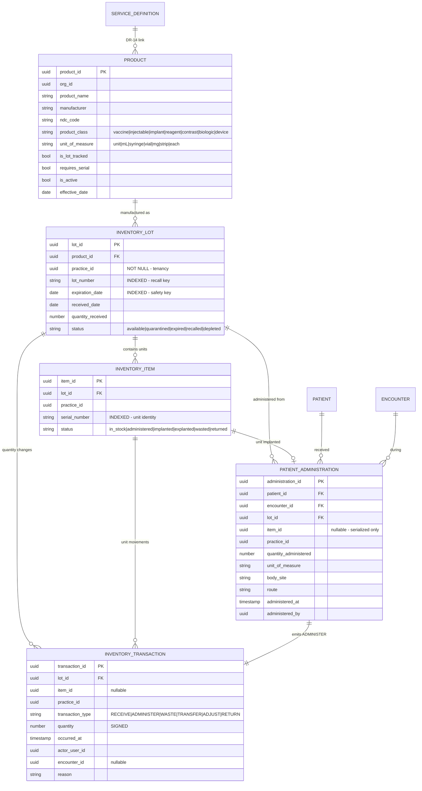

# Canonical Inventory Schema — DR-16

**Author:** AgentAesthetics (requirements) · **Builder:** AgentDB · **Event wiring:** AgentDLP
**Created:** 2026-07-29 · **Companion to:** `inventory-lot-requirements.md` (the measurement and the
seven existing implementations this converges)

Founder-specified entity set, 2026-07-29. It is richer than the two-entity model I first proposed and
better in two specific ways, noted in §5.

**One model for every specialty.** Vaccines, aesthetics, implants, oncology, point-of-care testing,
rheumatology, ophthalmology, wound care and cardiology all use these five entities. The differences
between specialties are **rows**, not tables.

---

## 1. The model



---

## 2. What each entity is for

| Entity | Answers | Scope |
|---|---|---|
| **Product** | *What can be administered?* The catalog item — a manufacturer's product, not a practice's stock | org |
| **Inventory Lot** | *Which batch, and when does it expire?* The recall and expiry unit | **practice** |
| **Inventory Item** | *Which physical unit?* Only when `requires_serial` — implants, devices | **practice** |
| **Inventory Transaction** | *Every quantity change, ever.* An append-only ledger | **practice** |
| **Patient Administration** | *Who received what, from which lot/unit, when, where on the body* | **practice** |

**Product is org-scoped; everything clinical is practice-scoped.** "Botox 100u, Allergan" is the same
product everywhere; the vial in the fridge belongs to one practice. Per DR-16, Product links to
`service_definitions` (DR-14) — one service, linked facets, never merged into `charge_master`.

---

## 3. The two invariants that make this trustworthy

### 3.1 Quantity is derived, never stored

```
quantity_remaining(lot) = Σ transaction.quantity WHERE lot_id = ?
```

`RECEIVE` is positive; `ADMINISTER`, `WASTE`, `TRANSFER` out are negative. **This resolves the open
question I left AgentDB** — I had asked stored vs derived and preferred derived. A ledger settles it: a
stored counter that fails to decrement is how inventory systems begin lying, and with a transaction
table the count cannot disagree with its own history. Cache it as a column if a stock screen needs
speed, but the ledger is the truth.

### 3.2 An administration is never recorded without its transaction

`PATIENT_ADMINISTRATION` and its `ADMINISTER` transaction are written **in one transaction**. Otherwise
a vial is administered and the stock count silently drifts — the exact class of failure the ledger
exists to prevent.

---

## 4. What this makes possible — one query per specialty, not four

| Question | Query |
|---|---|
| **"Which patients received lot ABC123?"** | `PATIENT_ADMINISTRATION` ⟕ `INVENTORY_LOT` on `lot_number` — **all specialties, one query.** Today: four queries against four tables, and oncology/POC cannot answer at all |
| "What expires in 30 days?" | `INVENTORY_LOT` on `expiration_date` |
| "Is this lot recalled?" | `INVENTORY_LOT.status = 'recalled'` — checkable *before* administration |
| "How much is left?" | Σ ledger |
| "Where is implant serial X now?" | `INVENTORY_ITEM.status` |
| "What did we waste this month?" | ledger `WASTE` |

That last one is new capability, not just convergence: **waste reporting falls out of the ledger for
free**, and it is a regulatory requirement for controlled substances and a cost line for every
injectable practice.

---

## 5. Two things the founder's model does better than mine

Stated explicitly because they changed my design, not just extended it.

1. **`INVENTORY_ITEM` as a first-class entity**, rather than a nullable `serial_number` on the lot. A
   serialized unit has its own **lifecycle** — in_stock → implanted → explanted — which a nullable
   column cannot express. Explant tracking is a real orthopedic and cardiology requirement and my
   version could not represent it.
2. **`INVENTORY_TRANSACTION` as a ledger.** I had `quantity_remaining` as a field and an open question
   about drift. The ledger removes the question: quantity becomes derived, waste and transfer become
   first-class instead of adjustments, and every movement is auditable by construction.

---

## 6. Specialty mapping — the universality proof

Every specialty below is **rows in the same five tables**. No specialty adds a table, a column or a
code path.

| Specialty | Product class | Lot? | Serial? | Notes |
|---|---|---|---|---|
| Vaccines | `vaccine` | yes | no | legally mandated; already implemented once |
| Aesthetics | `injectable` | yes | no | toxin/filler; `body_site` carries the injection area |
| Orthopedics / Cardiology | `implant`/`device` | yes | **yes** | explant lifecycle on the item |
| Oncology | `injectable` | yes | no | **gains expiry + recall it does not have today** |
| Point-of-care testing | `reagent` | yes | no | **gains expiry + recall it does not have today** |
| Radiology | `contrast` | yes | no | |
| Dermatology / Rheumatology | `biologic` | yes | no | |
| Wound care | `injectable`/`device` | yes | sometimes | grafts are often serialized |
| Ophthalmology | `injectable` | yes | no | intravitreal; `body_site` = eye laterality |

**Laterality note for @AgentDB:** `body_site` must carry laterality (OD/OS, left/right). Ophthalmology
and orthopedics both need it, and a wrong-site record is a never-event.

---

## 7. Events

| Event | When | Effect |
|---|---|---|
| `inventory.lot_recorded` | a lot is received or first recorded against an administration | completes `requireInventory` |
| `inventory.lot_recalled` | lot status → `recalled` | **re-opens** documentation previously satisfied by that lot |

Both must be tenant-scoped, encounter-scoped where an administration is involved, **idempotent**
(recording the same lot twice must not double-complete or double-decrement), auditable, and causally
connected to the recommendation they complete.

`inventory.lot_recalled` is the one worth building early: a recall is the inverse signal, and a
treatment documented against a later-recalled lot is precisely the record a clinic must find and act
on. It reuses the reopen semantics AgentDLP already built for event retraction.

---

## 8. Migration

| Existing store | Becomes |
|---|---|
| `immunization_administrations` | `PATIENT_ADMINISTRATION` + `INVENTORY_LOT` |
| `injection_administration_log` | `PATIENT_ADMINISTRATION` + `INVENTORY_LOT` |
| `patient_implants` | `PATIENT_ADMINISTRATION` + `INVENTORY_ITEM` |
| `aesthetic_treatments` | **retires — zero rows, no migration** (AES-15/16/17) |
| Oncology / POC / Rheumatology surfaces | gain lot + expiry they never had |

Aesthetics is the cheapest to migrate because it holds no data, which makes it the right **first**
converter — it proves the model against a demanding specialty at zero migration risk. I will take that
work as soon as the tables exist.
